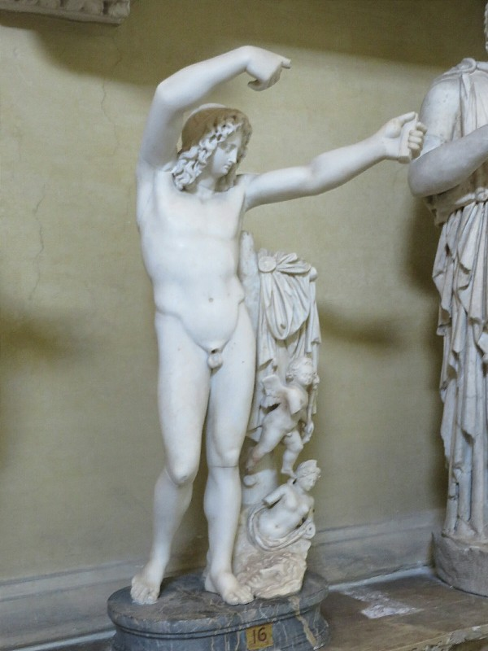
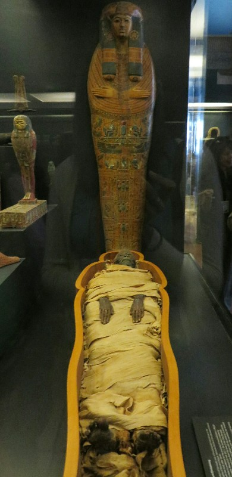
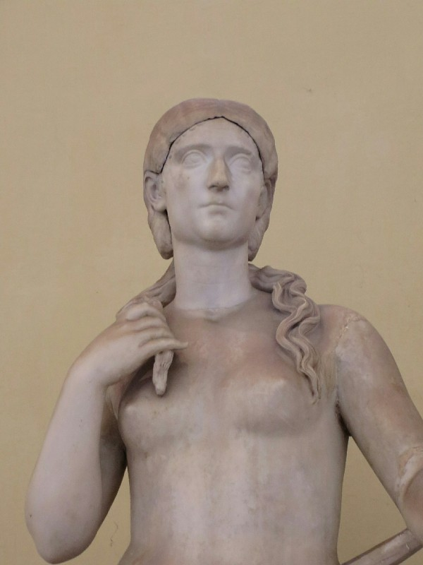
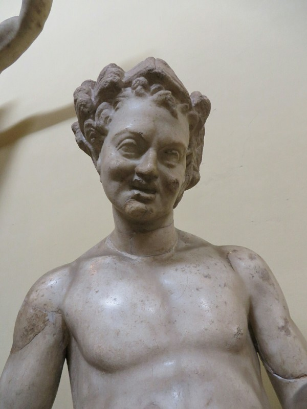
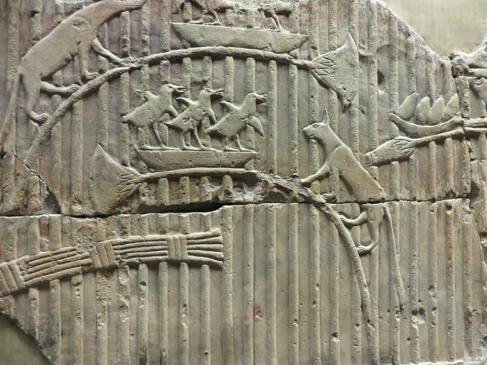

We are up early. Proper really early. We make our way to the Vatican Museum, a gift we have been trying to accept from Aunt Kathy, and arrive at 8.30. A half hour before opening. There is already a long long long line. We had a coffee and pastry in the line and waited. And waited. Eventually at about 9.30 we get in. Yay! Battle plan is to go straight to the Sistine Chapel, then loop back and go from the start. It's already unbelievably packed. Unbearable amount of tour groups, all slowly wandering through the halls, completely consuming any and all free space because other people apparently don't exist. It's really quite difficult, but we manage to squeeze between walls and people and through groups (to incredulous glares from their members) to the chapel.

*To The Left, To The Left... Passed This Chap On Our Way Through*

The audio guide was very comprehensive and really helped us understand what the frescos were all about. The chapel was painted by a lot of artists, most famously Michelangelo painted scenes from Genesis on the roof, and The Last Judgment on the large end wall. These we had both seen images of a million times before. And they were very impressive! What the audio guide also brought our attention to was paintings of Jesus and Moses' lives along the side walls of the chapel. A pair of paintings, one of Jesus and one of Moses, depicting scenes drawing parallels between their lives sit opposite each other on the walls. Each pair was painted by a different artist (including one pair by Botticelli). Explanations of how the scenes were chosen to emphasise the importance of the papacy were especially interesting. The other info we thought was of note was that the frescos had to be restored recently because of smoke damage from fires and incense burning in the room, but they still set fires and burn incense in the room every time they choose the new Popes! I understand tradition, but surely they could find a less priceless room to fill with burning chemicals?

By the time we left the Chapel it was lunchtime. We had a stupidly overpriced, average pasta, and a couple of decent slices of pizza. After we were powered up, we went back to the start and looked at all the displays we hurried through on our way to the Chapel earlier. There were lots of sculptures (mostly copies of Greek originals, apparently very popular in ancient Rome), some Egyptian artifacts (once hieroglyphics were translated with the Rosetta Stone everyone got super excited and the Pope ordered heaps of artifacts to be brought to the Vatican for study and translation), massive tapestries, large marble and granite baths, maps, paintings, and a whole manner of other items of historical significance. They also threw together a display for modern art to show the Vatican wasn't totally out of touch, just misunderstood. In most of the displays they intentionally displayed art of average or inferior quality next to masterpieces so the uninitiated *choughuscough* could appreciate the difference.

*Preserved Thousand Year Old Person*

On the second run through the Sistine Chapel it was even more stuffed with people, we would have had trouble seeing the walls if this was the first time we'd come. On the way out guards checked cameras and deleted and sneaky pics anyone had taken. They're serious about their monopoly on selling prints!

When we had finished the whole loop, we headed to Rome Termini central station to suss out luggage storage for tomorrow. What a nightmare! The Italians should be embarrassed. Signs pointing you in a direction, then no further signs letting you realise the first was a lie only when you reach a dead end. Signs leading you up some stairs, turn right four times, down other stairs and back to the first sign... Argh! Germany and Japan need to be put in charge of public transit world wide. We eventually found the left luggage room and were glad we did this without the heavy bags on our backs making the goose chase even worse than it was today!

After that trauma we decided to head back for another delicious pasta at the local family restaurant. Sadly it didn't open til 7.00. We had a beer at a local convenience style store and made friends with a slightly inebriated local, who couldn't speak any English but wanted to be best friends. At 7.15 the restaurant opened so we had a bite to eat and called it a day.

*The Hair Comes Off This Statue So It Can Be Changed With The Fashions*

*Perhaps Not One Of The Masterpieces....*

*Even On Full Days Indoors Kate Manages To Get A Cat Photo...*
