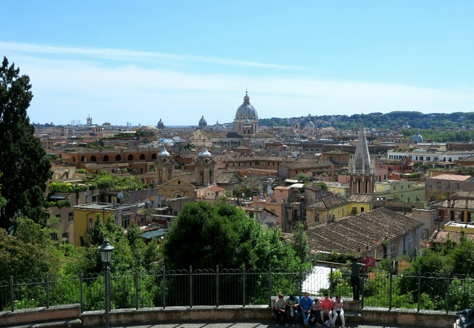
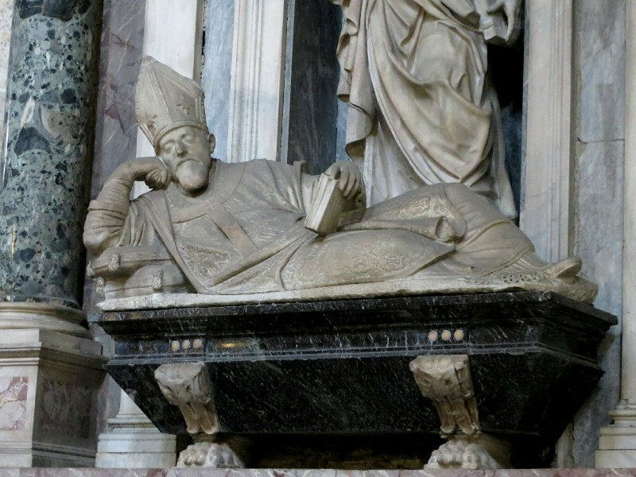
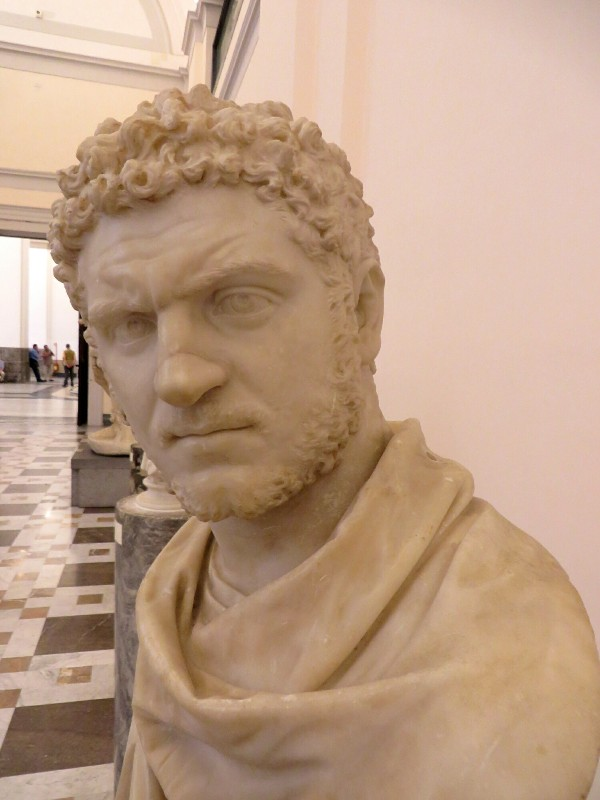
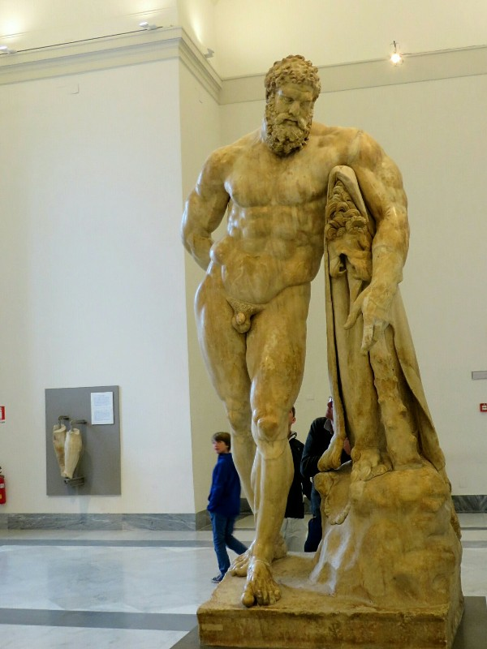
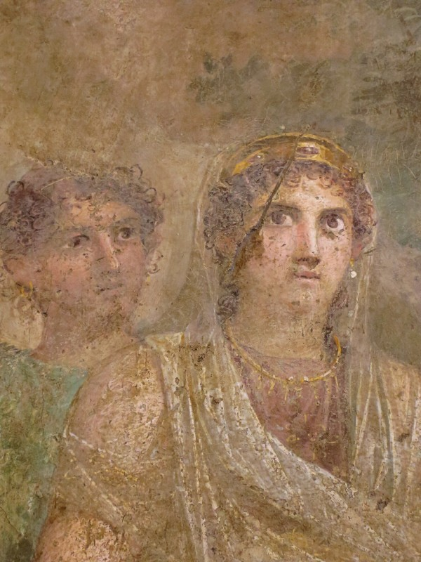
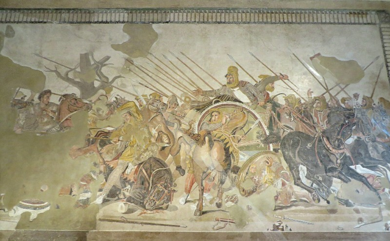
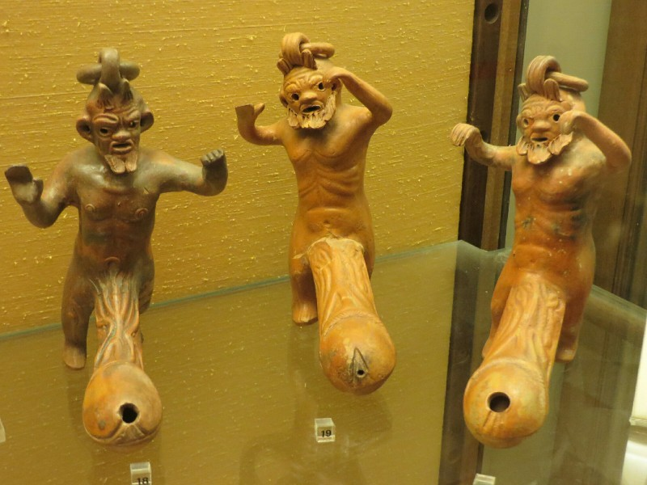

In the morning we had a nice farewell with Claudia, such a lovely lady. Then we grabbed the bus to train station, after a long wait dropped our bags off at hideous left luggage department (no self service lockers), and went for lunch. Kate's minestrone was truly awful, Pat's pasta was fairly nice. Rome has had really variable food quality- it's a little disappointing that anyone in the world can open a restaurant in central Rome and find success purely on the volume of tourists, even if they've never cooked before in their life. And it's a shame many don't seem to care about the quality of the food they produce. Where's the pride in their work? On the bill they try to charge a service charge we were warned is illegal, but is stuck on bills by many restaurants that cater primarily to tourists. We kick up a fuss and they remove it reluctantly. Win! Yay! We pay and leave.

Today is May 1, one of the biggest public holidays in Italy, so there's no one in the streets and all the shops and museums are closed. We decided to get a gelato from one of the few open cafes to calm Kate's nerves from the confrontation. Absolutely amazing. Nothing like Turkey, but so good. It's like a chocolate brownie, but in ice cream form. Sickeningly rich, but she finishes it anyway. This makes up for the minestrone times three.

We spend the rest of the day walking around the lovely, quiet, almost abandoned city. Eventually we make our way to the Spanish Steps. Apparently every other tourist had the same idea. We walk up them, decide the crowds are too much and leave. Close by we find a huge park with lots of locals and a man playing the trumpet, trombone, french horn, saxophone and a few other instruments creating a movie like atmosphere. We create dramatic stories for the people around us in the park to match the music until it comes time to leave for our train.

*Looking Down At Rome From Our Park*

At Termini station we look for an audio splitter for our headphones as the old one got lost somewhere. A very nice man tries to speak English and helps direct us to an electronics store. It's good to meet people who remind us humans aren't all bad. We jump on the train and spend the rest of the day on the way to Naples watching the farms and wineries pass us by. We saw a huge section of an ancient aqueduct on the way out. Amazing!! We'll have to visit that the next time we come to Italy.

We get up bright and early the next morning and head into Naples centre to spend the day exploring. Unfortunately town doesn't open til 10 so we can't do much... We end up some of the first people into the most famous church in town, Duomo do Napoli. Again, beautiful frescos and interior. We had a little poke in the crypt too- apparently they store extra chairs adjacent to the less important people's tombs.

*Taking a Page Out of Buddha's Book- Reclining Pope*

We continued our wander through the streets and stopped at an espresso bar. Excellent coffee and less than half the cost of a coffee in Rome! Naples feels more like real Italy than Rome, which felt more like any big European city. Naples is a bit gritty. It's not as clean or well presented, but it's nice to see the locals with washing hanging from their balconies, dirty kids playing on the streets and smell fresh cooking from the little apartments. However, like in Rome, there are no toilet seats in women's bathrooms! It's so weird! On this trip I am concluding Australia has the most comfortable and clean bathrooms in the world!

Next we head to the Naples Archeological Museum. This is where most of the art found in Pompeii is stored, along with the Farnese Collection of antiques (mainly sculptures). When the older sculptures were discovered or purchased and added to the collection, often parts were missing. Back in the day the preferred way to deal with missing sections was either to stick a few different broken statues together (so you'll occasionally see one with a far too big hand, or a woman's head on a man's body) or to remake the missing section as they imagined it might have looked and screw that on. Can also look quite funny when the artist restoring the sculpture isn't as talented as the original artist and you have a beautiful marble face and chest with a dodgy looking arm.

*Emperor Caracalla- Almost 2000 Years Later and He Still Looks Cranky Pants*

Perhaps our favourite room contained a number of sculptures from an ancient bath. They were enormous and fantastically detailed. The room they're stored in hasn't changed at all in over 120 years, they had a photo on display from 1880 with everything in the same place. Kate thought it was amazing her great great grandparents could have visited this museum and seen exactly what she is. Pat thought it was pretty obvious once they moved a lump of rock that far they'd never move it again. Fair point.

*Huge Sculpture of Hercules with Old Replacement Legs in the Background- They Were Removed When The Original Legs Were Found But Considered Too Beautiful to Destroy*

After a look around the sculptures we decided we'd better check out the Pompeii section as that's the planned destination for tomorrow. First the frescos. When Pompeii was discovered they went over and cut all the nice looking art out of the walls and brought it to the royal family. Most of the pictures seem to refer to Greek legends, which of course we don't know so it was hard to appreciate them. We did notice these artists seemed to have a pretty good grasp on perspective, apparently a concept completely lost between 2000 years ago and the Renaissance. Apparently there was a guy in charge of picking the best frescos to remove from Pompeii to bring to Naples. He picked too many, so they just destroyed the ones they didn't want to use so foreigners couldn't get to them! Such a waste. And ironically, many of the best examples of frescos from Pompeii are now in the New York Met.

*Watching the Lava? (A Pompeii Fresco)*

Next was the gallery of mosaics from Pompeii, these we were able to appreciate much more. Less loss of colour, still looking pretty speccy. Wouldn't mind having one of those at the entry to the house. We did wonder if there would be anything left to see at Pompeii now they've pulled it all up and brought it here?

*Mosaic of Alexander the Great Defeating Darius in 334BC (Old News Even 2000 Years Ago)*

Next we went downstairs and ended up in the porn section. This area of the museum has been sealed and unsealed over time depending on who is in charge and the influence of the church at the time. You've currently got to be over 14 to enter. Apparently the people in Pompeii either were quite perverted, or had quite a sense of humour. That's all we'll say about that.

*We Hope You Don't Have A 3D Monitor*

We finished off with a few last sculptures. Apparently they made statutes about conquering lands with marble they took from those areas. Quite creative.

We decided we needed a late lunch/early dinner pizza break, and we hear Naples is where to get the best in Italy. We went to find a recommended pizza place. Naturally, there was a big queue. We put Pat's name on the list and went on half hour walk to kill time. We came back and waited more. It started to rain. Yuck. Then pizza. It was seriously delicious, fantastic mozzarella especially. They were only a few euro each so we got two, thinking we didn't need to finish both!

Ha... Ha... Ha.........

After polishing off the pizzas we conclude they do put the ones in Rome to shame. Might be a few more to come in the next days in Naples...
