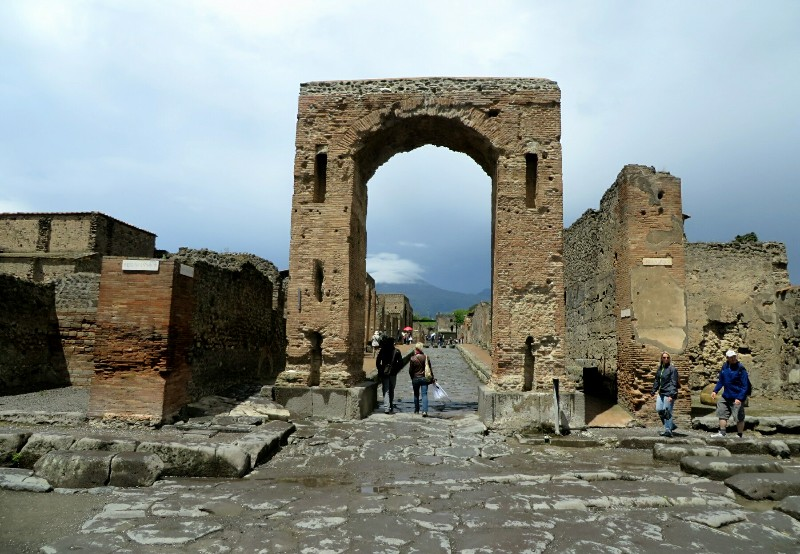
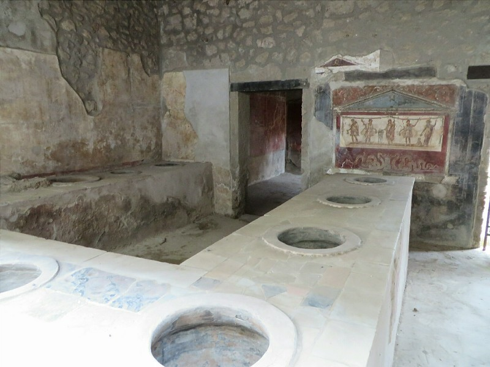
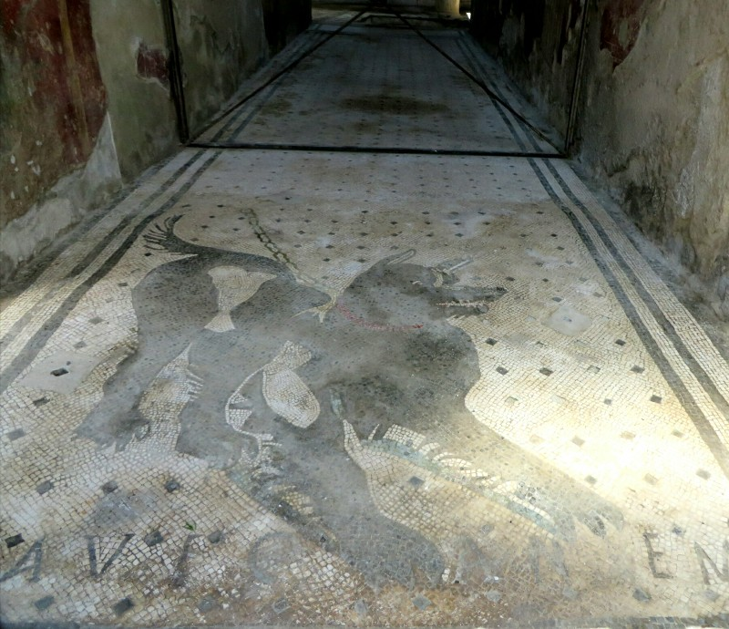
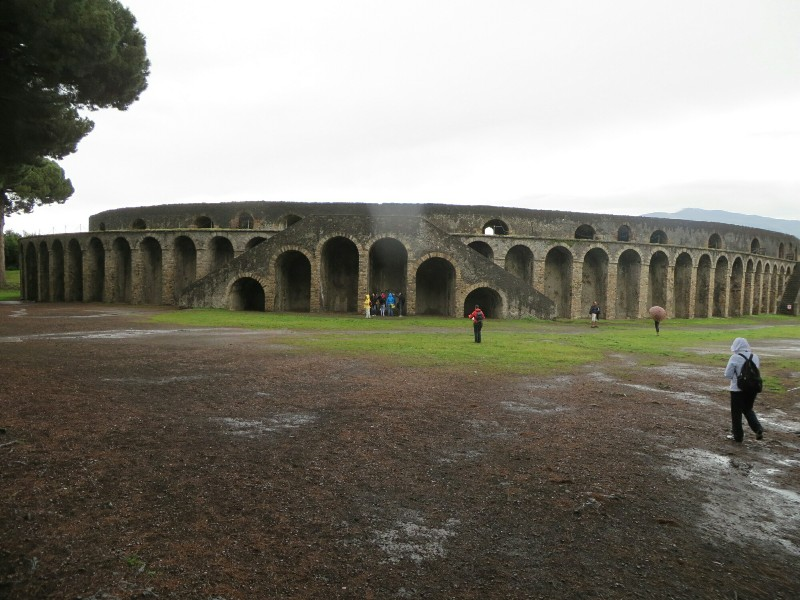
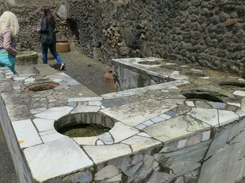
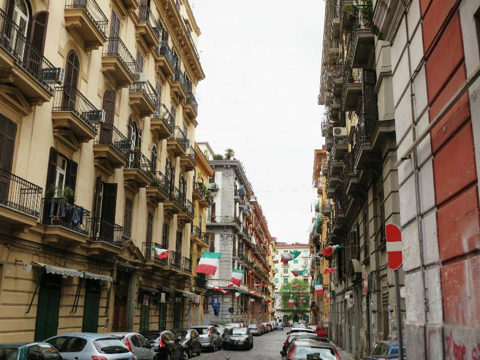
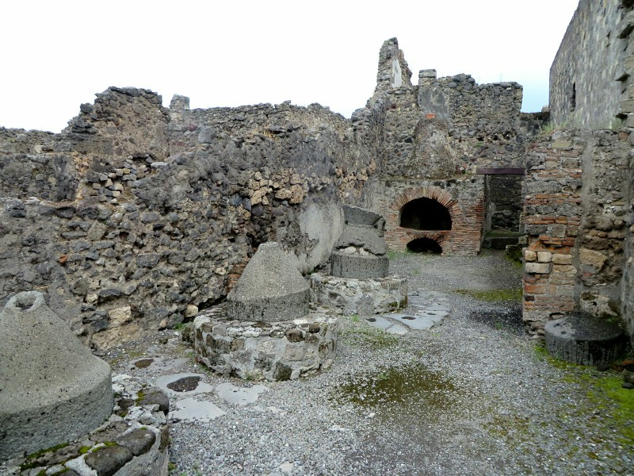
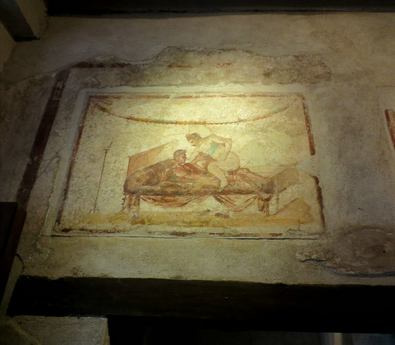

Today's itinerary takes us to the Roman town of Pompeii, a present thanks to Simone and Jeff. I'm sure most of you know the story of the city, but just in case I'll give you a quick run down. In 79 AD the town was buried under volcanic ash when the nearby Mt Vesuvius erupted somewhat unexpectedly. There were a few warning signs which allowed some 18,000 of the city's approximately 20,000 inhabitants to escape, but for the most part people didn't understand what was happening.

The city then laid buried until it was rediscovered in the late 16th century, almost perfectly preserving Roman life as it was midway through the first century. After having visited the Archeological Museum in Naples yesterday we had a bit of background on the artifacts that were recovered from the site, but seeing a bunch of water jugs and crockery out of context didn't have too much of an impact. We had heard lots of great things about the city, so we did some research ahead of time and came armed with a guided walking tour narrated by Rick Steves. This way if the site's audio guide wasn't up to scratch we would have a backup to take us to some of the more interesting sections of the city. As it turned out, the audio guide you could purchase from the site's office was quite good and packed with detailed commentary, a lot of which overlapped with the walking tour we downloaded so rather than scratching for information we were burdened with an overabundance - a rarity on this trip!

Unfortunately the day we picked to visit wasn't the best weather wise. It was cold and rainy for most of the day and we intelligently didn't bring our umbrella or rain coats. That didn't stop us from seeing as much as we could without getting soaked. Walking through the city was a very interesting experience to say the least. With everything so well preserved you got a real sense of what daily life would have been like 1,900 years ago and honestly, it didn't seem much different to today. The roads in town all had footpaths flanking them on either side and there were large raised stones in the middle of the road at most intersections to allow pedestrians to hop across the road without getting their sandals dirty. They also had small bits of reflective stones embedded in the road which would catch the moonlight and let you know where you were walking if you were out in the dark.

*Decorative Arch That Doubled As Water Storage and Helped Improve Water Pressure With It's Height*

The city's fresh water was supplied by a nearby aqueduct that was fed into the public baths, the taps and fountains located throughout the city, and into many of the houses. This meant that every house had fresh water plumbed to their kitchen. They also had waste water pipes that dealt with the sewage. While this ended up on the streets, they had proper gutters that were flushed constantly with water to keep everything moderately sanitary. A lot of the larger houses also had cisterns fed by strategic holes in the roof to catch and store rain water in case something happened to the town's water supply. Wouldn't want to have your neighbour see you walking to the tap down down the street with your bucket - the shame!

Aside from the impressive logistics of the city, they had many things that are commonplace today: bakeries (with brick ovens identical to those you see today), public spas, and even fast food restaurants. I think they had something like 90 or so "takeaway" shops that specialised in preparing hot, ready to eat meals. Since most kitchens in Pompeii were tiny (even in the large houses), these shops proved very popular.

*McPompeii! Food Was Kept Warm And Displayed In The Holes In The Benches*

In one of their public bath houses, they had installed an underground heating system in the "hot" room to make sure you didn't have to walk on cold ground. What's that? You're worried about drips of condensation falling on you from the curved ceiling? They've got that covered too! The ceiling had ribs installed to ensure any drips ran along the ceiling to the wall where it would be whisked away harmlessly, thus ensuring your spa isn't ruined by a cold drop of water. Clever chaps, those Romans.

Many of the houses had their original murals removed and bought to the Archeological Museum (or destroyed as the case may be), but they made replicas of some of the more impressive ones and installed them in the original locations so you could see them where they were meant to be seen.

*Beware Of The Dog! A Mosaic For Xena*

Our audio guide brought us to one of the more popular buildings in Pompeii (both then and today), a brothel. It was unique in that it was a purpose built building unlike many of the other brothels in town that were tucked away in the back of a pub or hotel. It was very modestly sized, only a few rooms with permanent stone beds branching off a main hallway that had frescoes painted on the walls with *ahem* suggestions for the clientele.

After lunch the rain started to pick up and Kate wasn't having any of it. Pat was determined to see the theatres and the amphitheatre so he braved the elements alone and made a brief stop in both before heading back to meet up with Kate. Despite having a map, he managed to get lost several times as various roads were closed or otherwise blocked forcing him to backtrack often. If only Google would map Pompeii!

*Amphitheatre With A Spot Of Rain On The Lens*

Feeling like there was so much more left to see, we agreed that we would have to come back and spend more time exploring, but it just wasn't going to happen today. The rain was steadily falling and the puddles in town were growing (no one left to maintain the roads apparently) so we made our way back to the train and left for Naples.

*Pompeii Hut- The Competition*

It was so loud that night. There were fireworks or explosions or something til past 1am along with people yelling, cheering, honking car horns and blowing air horns. Normal Saturday night in Naples? Won a soccer game? Riot? We don't know but we subsequently had a late start to the morning.

We got out close to lunch and decide to spend the last day in Naples sampling the local specialities. We start with an amazing calzone from a little local hole in the wall where no one speaks English. The man had a number of bowls in front of him- one of dough and the others with various cheeses, meats and veggies. We pointed at what looked good, he rolled a little dough into a little flat circle, put the ingredients on it, folded it over in half and squeezed the sides together to make a semicircle. Then he chucked it in a deep fryer for a couple of minutes. The calzone that came out was nothing like we've had in Australia or America before. The dough was light and fluffy, not dense, and the inside was hot hot hot with melted cheese, steamy chorizo and spicy tomato! It tasted amazing! And only €2! It was so quick and easy, I don't understand why they don't make them this way back home!

Next was the local pastry, a sfogliatelle. This was also delicious, a crispy multilayered pastry full of seasoned sweet ricotta with cinnamon and a hint of cloves. Mmm. From the same place we grabbed a baba. Not as keen on that- a somewhat dense cake soaked in rum! We ended up throwing half out- a bit early for rum. We had a bit more of a walk and next stopped for our last Napoli pizza. Or last pizzas... This time at least we didn't finish both, we packed up half of each of the four cheeses and margarita to take on the train.  We also hadn't tried a gelato- apparently Naples takes the prize for gelato in Italy too. It was pretty yummy, but not as good as the heavenly dark chocolate one from Rome.

*Naples- Super Italian*

At this point we were fairly stuffed. We headed for the train station and hated everyone for smoking inside. You forget how much the attitude towards smoking has changed in Australia over the last 10 years, it seems so rude for people to smoke indoors or near children to us but it's totally normal here! On the train we were sitting in a group of four seats, opposite us was a mother and daughter carrying their little dog. We recognized him from Pompeii yesterday. He was so well behaved, just napping on their laps the whole three hours. We miss Xena! She would not be that good!

In Florence we stayed at another Air B&B apartment. The host was a lovely man named Roberto who picked us up from the tram stop and drove us to his apartment where he had tomorrow's breakfast, coffee, milk and a bottle of wine waiting. Promising start to our 5 nights in Firenze!

*Brick Oven in the Bakery Along With Flour Mills (They Were Turned by Donkeys!)*

*Suggestive Suggestion*
