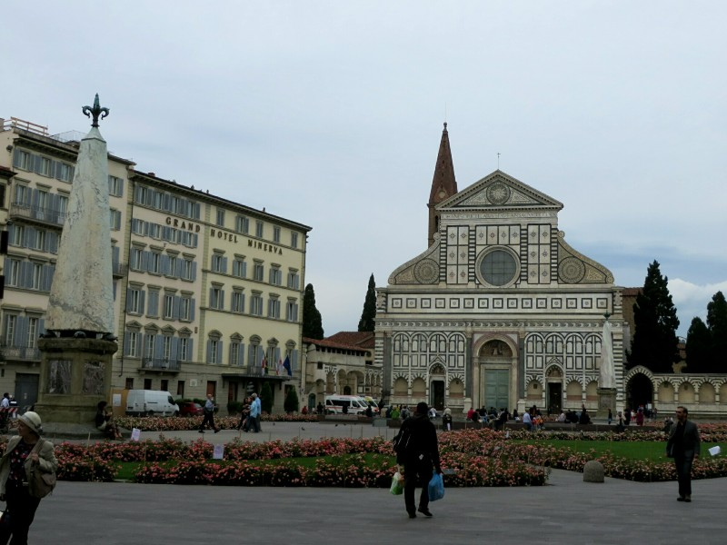
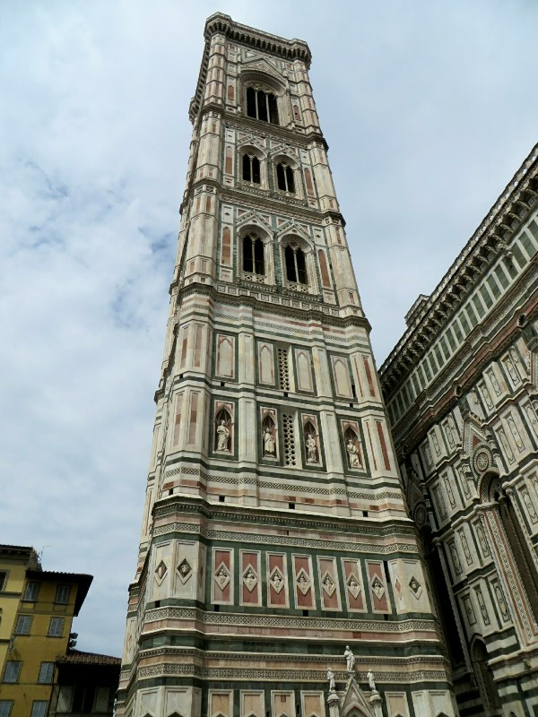
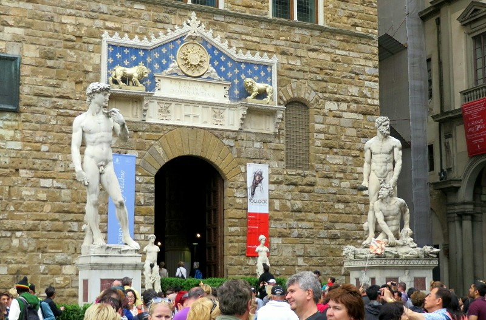
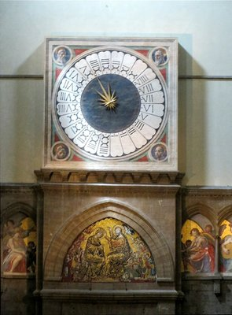
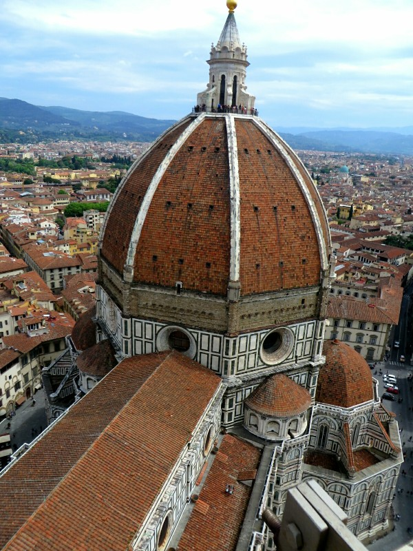
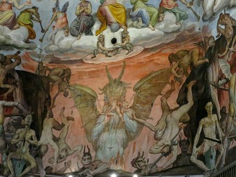
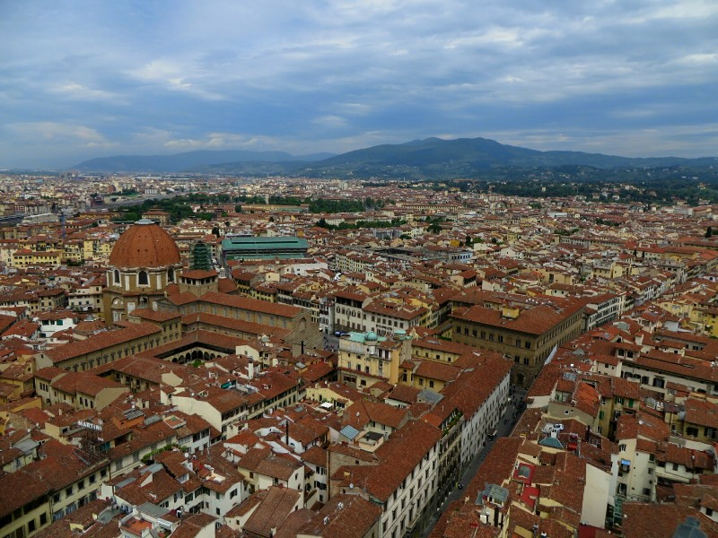
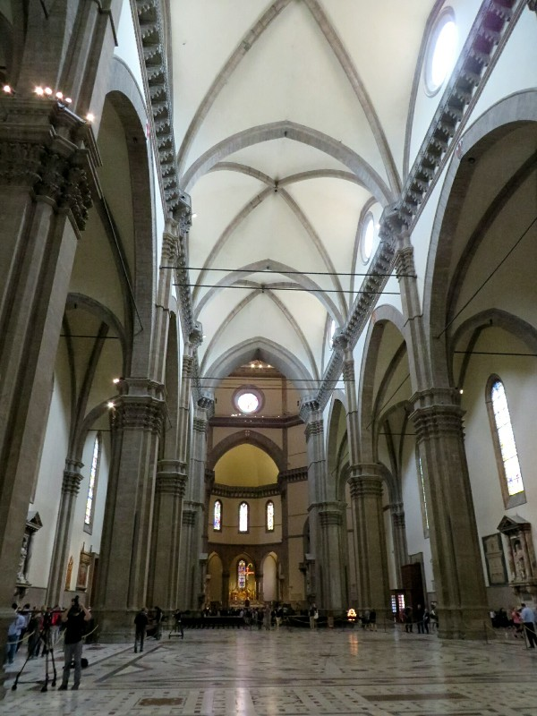
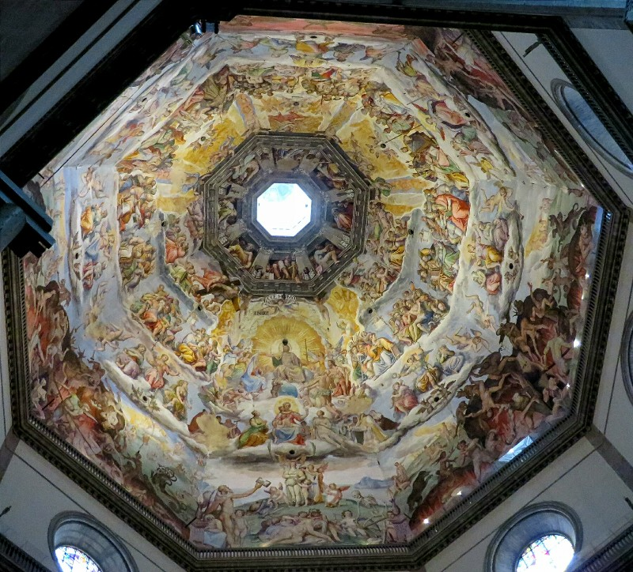
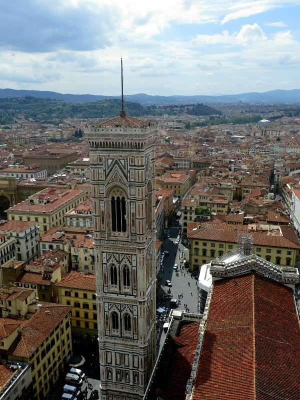

Because we had quite a while in Florence we had a bit more down time and a bit more time to do boring things like book hotels/flights etc for upcoming parts of the trip. We did get some fun stuff in though.

We did a wine tasting class which we covered care of Claire and Chris, and Oleg and Nes. Seemed like something they'd approve of. We arrived to the wine shop and walked into the large classroom- 5 long benches with room for about 6-8 people per bench. The lady who ran the classes saw us, welcomed us and took us through to a back room. Apparently we're the only ones taking the class tonight so we get a small private room nestled among the wines. Excellent!

*A City Of Picturesque Piazzas*

The class itself was a lot more informative than we expected! A lot of information on the history of wine in general, the history of wine in Italy, how wine is grown in Italy and the Italian classifications. They have four classes- the top two are highly regulated. To get the label they have to follow strict restrictions on the grape varietals used in each region, what percentage of each type is used in the wine, how much water they use to grow the grapes, how many grapes grow per vine, how much wine is produced total, the percentage of alcohol... On one hand it would lead to very consistent wine, but we thought it was a bit of a shame the creativity is completely sucked out. No 'I might try growing a Merlot here!' or 'Maybe let's try mixing with grenache this time!'. It's 95% one grape with 5% the other grape no exceptions!

That said- the wines we tried were all delicious. Apparently Italy doesn't make sweet wine. Our kind of country. And we got to try three cheeses, some olive oil and local bread. We left pretty satisfied!

Our next outing was not such a success. We went to the grocery store, dropped off the food then got on a bus to go into town. The tickets aren't sold on board, only in little corner stores, and they're valid for 90 minutes. We diligently bought two and used the one ticket each for the trips. Two stops short of where we were headed a ticket inspector got on the bus. We showed him our tickets, he said we had to pay a €100 fine because right now, it was 100 minutes since we first used the ticket. Apparently it doesn't matter if it was valid when you got on the bus, if 90 minutes ticks around you have to get off. That seems completely insane- what if there's bad traffic? What if your connecting bus runs late? Of course he doesn't speak English so we can't do an awful lot. The longer we try to argue the longer we're stuck on the bus going further and further past where we were meant to get off. Eventually he said if we paid now he'd only charge us €50. Only €50 for having paid for two tickets for our trip! What a joke. Of course he was also wearing a lanyard. We very unhappily paid then spent the time we were meant to be enjoying in town backtracking by foot. We do pass the Bell Tower and decide we'll have to climb it another day.

*Looks Like a Long Way To Climb*

Luckily our next attempt at a day trip was a win. This whole day was thanks to Kate's coworker Mary. We managed to get into town very early and we joined the queue for Galleria dell'Academia. This museum was purpose built to house Michelangelo's David. No photos allowed, of course. On entering we walked through a corridor full of incomplete sculptures, most by Michelangelo. Looking at these figures reaching out an arm or a torso or a face from a block of marble you could imagine these people were just stuck in the rock and the artist wasn't carving a sculpture, he was just letting them out. At the end of the corridor was David. Kate had seen him before, the last time she was in Florence, but she completely forgot how huge he is! Very impressive and imposing. Especially as we read in the news the other day a University study has shown he has micro fractures in his ankles from the stress of moving him into the museum hundreds of years ago, and then from the vibrations in the floor from all the people constantly thumping around the room, and he might just fall down at some point. You can imagine the Italian museum's response- immediate action! 'No no, no problem, he's fine. Bene bene'. We tried to keep a semi safe distance.

*David Replica in Piazza Della Signora*

As you might imagine for a purpose built museum like this, the rest of the displays weren't so impressive or exciting. We did wander through a few corridors to discover an exhibition on the Medici family's musical instrument collection. Lots of strange instruments on display like a piano-guitar (to save the ladies fingernails when playing). They displayed some of the first ever pianos, and there was even a violin from Füssen!

*Mystery Clock*

After the museum we headed to the Duomo, a large historic church in the center of Florence built between 1296 and 1436. The exterior decoration was actually only finished in 1887. It took so long because people involved in constructing the church kept dying. Most importantly, Pat climbed to the top of it in the game Assassin's Creed. The inside of the church was quite bare- apparently a reflection of the important of austerity in religion at the time. However, at the very front the inside of the dome is painted with a huge fresco of The Last Judgment. We heard a guide telling her group this was a very different interpretation to that of Michelangelo in the Sistine Chapel, much more uplifting and positive, less people being skinned alive. There was also a very interesting clock that we could not work out.

After a lap inside we crossed the piazza to climb the bell tower next-door. A tiring 180 meters of stairs going around and around in circles with people trying to squeeze up and down the narrow staircase simultaneously, but a very rewarding view from the top. Only thing blocking the full panoramic was the top of the Duomo next door. We'll have to conquer that next...

*Il Duomo From the Bell Tower*

But first- lunch. We crossed to the marginally less touristy South side of the river and go to a very kitsch cafe and get a delicious pasta and microbrew beer each. Then we each get a gelato from the gelateria next door. Definitely the winner so far for Kate, a yoghurt and lemon gelato- not so sweet so she didn't feel sick at the end but still extremely satisfying. Pat also picked a winner with a pistachio and passionfruit. Thumbs up Florence!

*Much More Positive Outlook Than Michelangelo!Only Demons Eating People While Flesh Melts Off Others!*

We headed back across the river via the ponte vecchio (an old bridge with shops built into it), through Piazza Della Signora (where David originally stood before he got a museum, now a copy lives there) to the Duomo. We stood in the rain until we got to the front of the queue and could climb up the inside of the dome. Being closer to fresco we started to question that guide's qualifications... From here we could see the details of the painting, the people with flesh melting off and the demons eating the sinful alive. Looks fairly dark to us. We could also see how limited the detail and rough the brushwork is compared to the roof of the Sistine Chapel. I suppose when you paint the ceiling of the highest building in town you don't think anyone will get close enough to see the detail! Does make you appreciate Michelangelo's commitment, craft and I suppose genius even more. After a lap around the inside we climb to the outside of the top of the dome and enjoy a real panorama. Lovely!

*Firenze- Just How Ezio Saw It*

The last two stops in this area are the Baptistery, which is unfortunately covered in scaffolding. We can still go inside though so we have a look at the thousand year old building where ever important Catholic in Tuscany was baptized for hundreds of years. Last, under the church to the catacombs. Here we can see the foundations of the ancient city wall and church that the Duomo replaced.

Feeling thoroughly educated on this area of town, and given it was closing time, we called the outing a win and went home to cook something delicious.

*Bare Church Interior*

*Lots of Heaven in the Dome*

*Doesn't Look So Tall From the Duomo!*
