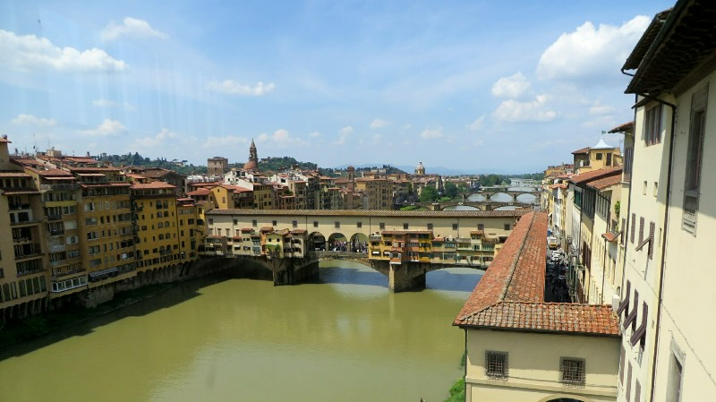
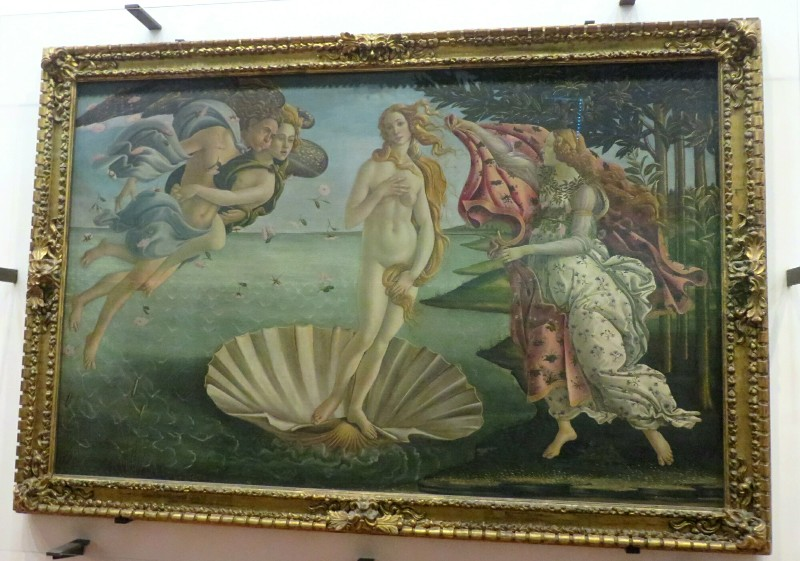
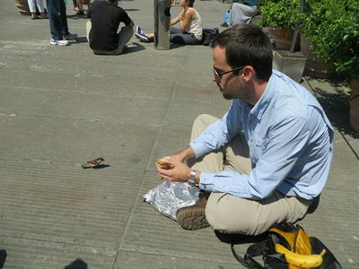
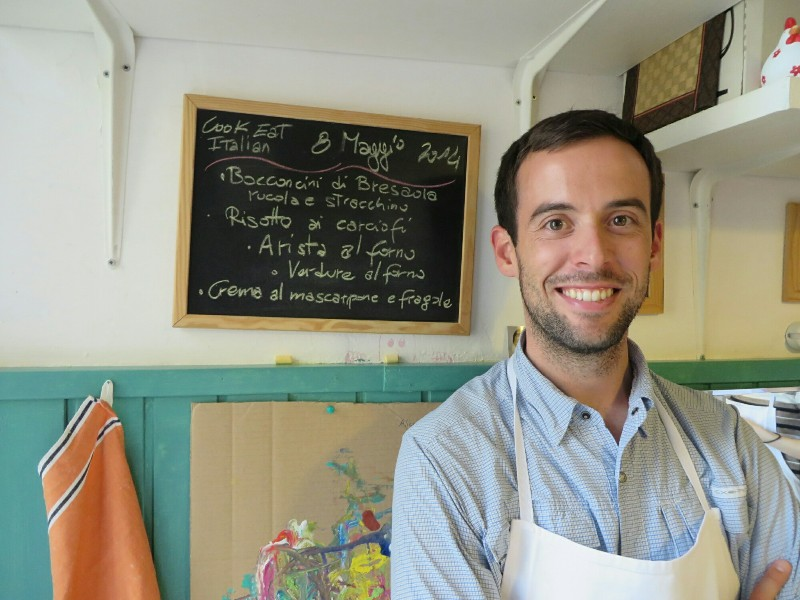
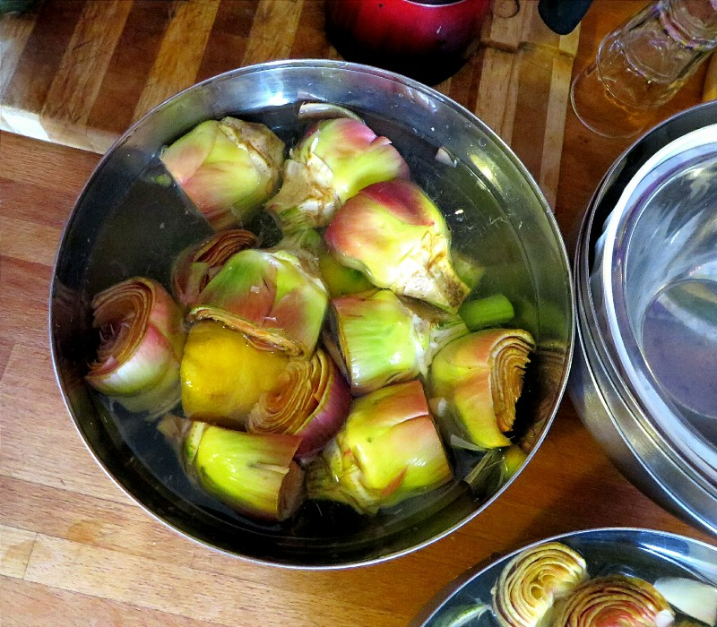
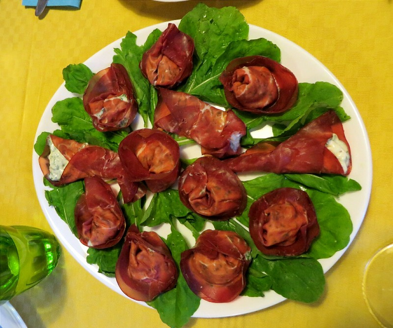
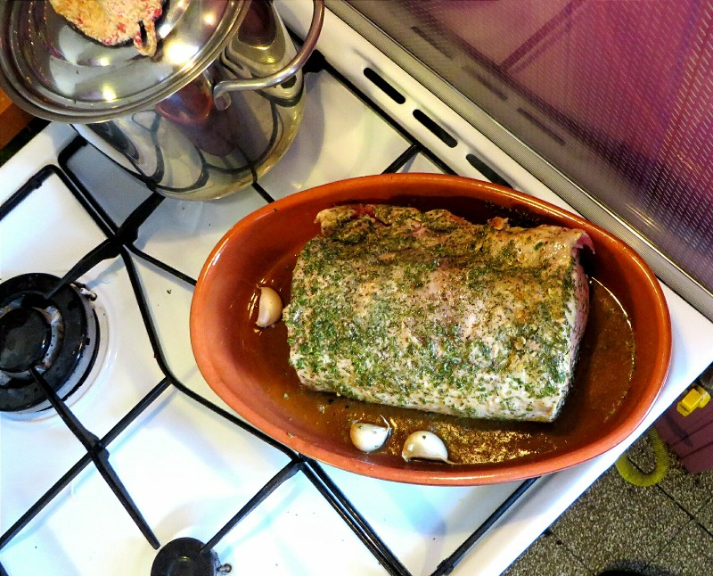
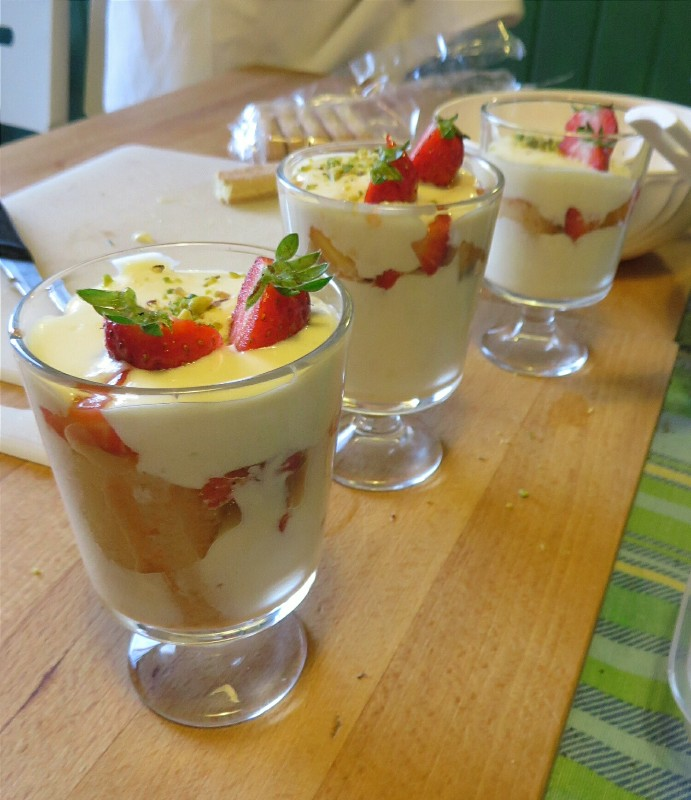

Our next success was visiting the Uffizi Gallery. Despite arriving 10 minutes after the 8:15 opening there was already a huge queue outside. We had the opportunity to pre purchase tickets for specific entry times yesterday, but at an extra €4 per ticket we decided it wasn't worth it. Over an hour and a half later still waiting in line we still hasn't changed our minds, but we now thought that the entry queue is kept intentionally long to "encourage" people to spend the extra money to bypass the line. Every 20-30 minutes a small selection of people from the queue were allowed entry. Finally, we get the the front and are let in after most of the morning had passed us by. But we got in!

*Ponte Vecchio and a Shade of Green That Puts Even The Torrens to Shame*

The first several galleries walked us through Italian art from the 13th to the 16th centuries highlighting the various movements and styles that influenced the local artists. The galleries are interspersed between long walkways lined with sculptures and busts in Greek and Roman styling. In the Louvre one room was dedicated to the time period (pre-Renaissance) that this museum used a half a floor to explore. It actually worked really well having been to the Louvre first, the amazing audio guide there did such a good job of introducing the themes and styles and this museum gave a lot more examples to help cement the points the Louvre was making.

*Botticelli's Birth Of Venus, Only Sneaky Photo I Got In Before They Yelled 'No Camera!!'*

After a quick break for a sandwich (we ate sitting on the ground because the museum helpfully provided a total of two benches for all the visitors to use) we went back to it for round two. We went through Italian Renaissance paintings and some sculpture on the top floor, then foreign paintings and a special exhibit on the lower floor.

*Pat's Lunchtime Companion*

Phew! Having had enough of the tourist circus in the center of town we wander back across river and end up in a lovely rose garden. We follow the winding paths to a 'Japanese garden'. Although compared to the gardens in Japan that might be a misnomer... I think to have a real Japanese garden you need to give it more attention than the Italians do. Still nice though. We enjoyed the ambience until it was invaded by a huge group of teenage school kids. Decided to make a move and walked up a hill ending in Michelangelo Square- a piazza with a great view over the whole of Florence. Nice find!

After a few photos we went towards our evening activity, a cooking class thanks to Jim and Debbie. On the walk we grabbed another gelato. Mmm. They definitely know how to do it here. The cooking class turned out to be held in an Italian family's apartment. The wife ran the class, her Italian Mama helped with cleaning and her English husband looked after their two adorable girls, although the three year old liked to help out a bit. There was only one other couple in the class, an American couple from Washington. Unfortunately the wife was gluten intolerant and didn't like tomatoes which limited the menu somewhat. But, turns out she lived in Canberra for a while too and after a few wines we got into a fun conversation bitching about politicians. They were a really nice couple!

*Chef Patrick*

The actual class wasn't as involved as the one we took in Thailand because we were in a real kitchen, not a purpose built cooking school. We helped in the preparation but it was a team effort, not each cooking our own food. We started with some soft cheese wrapped in delicious meat, then an artichoke risotto as pasta was a no go (turns out we have been cutting artichokes wrong since forever), a pork roast, and some amazing dessert thing. It was like a tiramisu, but not because that's not gluten free. Unfortunately we made that first so it could set in the fridge while we prepared the other courses and we both ate a slightly obscene amount of the cheese/sugar/egg/amazingly-unhealthy-but-tasty mix during the preparation process.

*Apparently The Appropriate Way To Prepare Artichoke*

Once we were sufficiently disgustingly full, had complained and expressed all our frustrations about politics and politicians (everyone on every side) and tried every type of wine on offer we headed home for a very satisfied snooze.

*Bet You Can't Tell Which Ones We Made...*

*Secondi Piatti- Pork Roast*

*Delicious Dessert*
