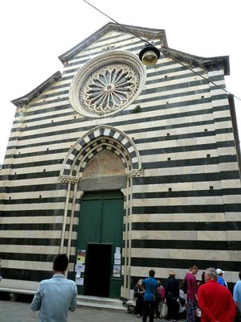
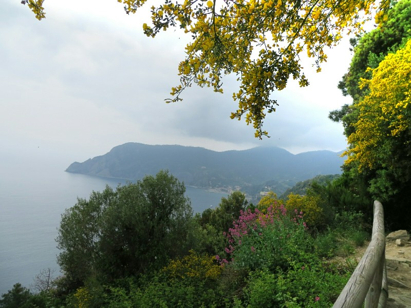
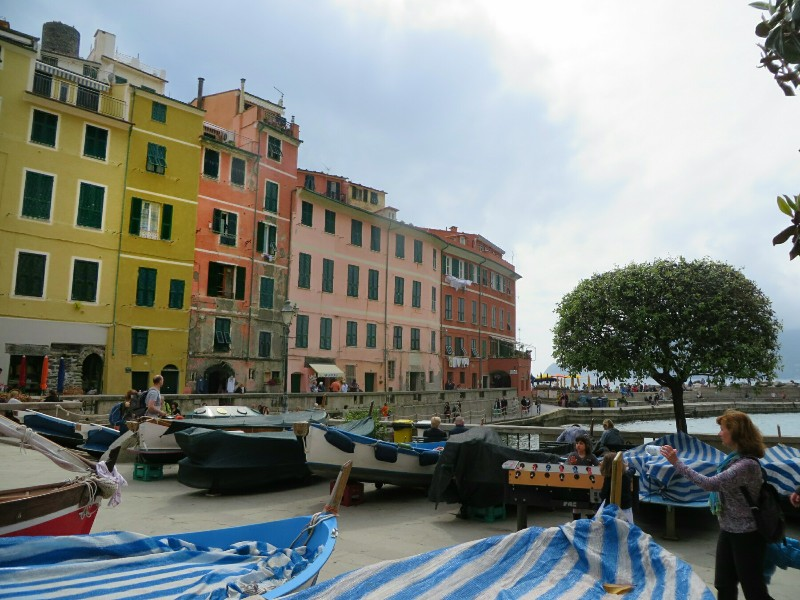
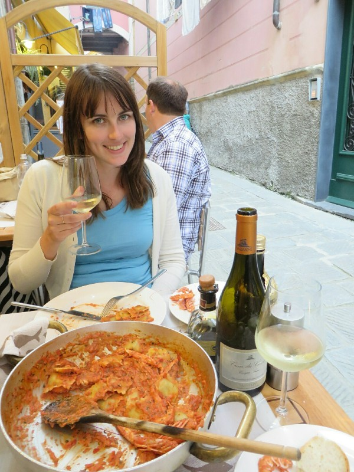
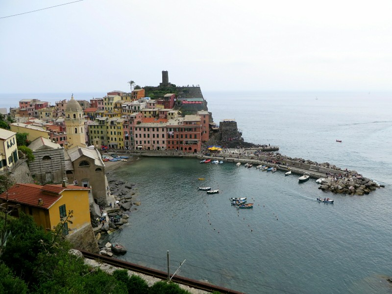
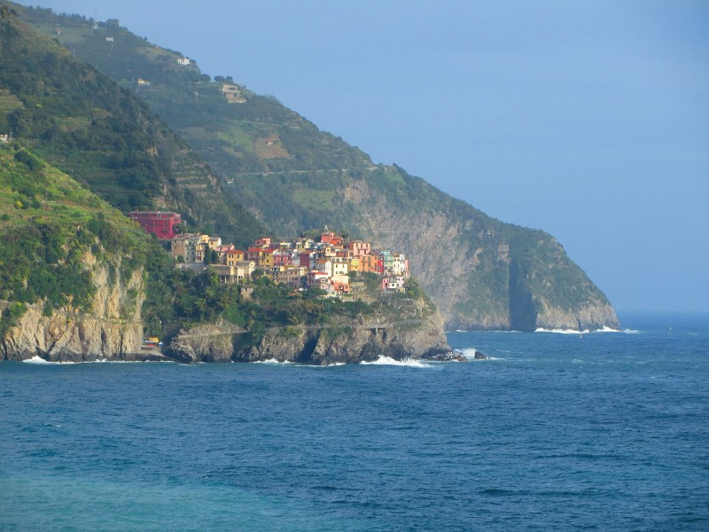
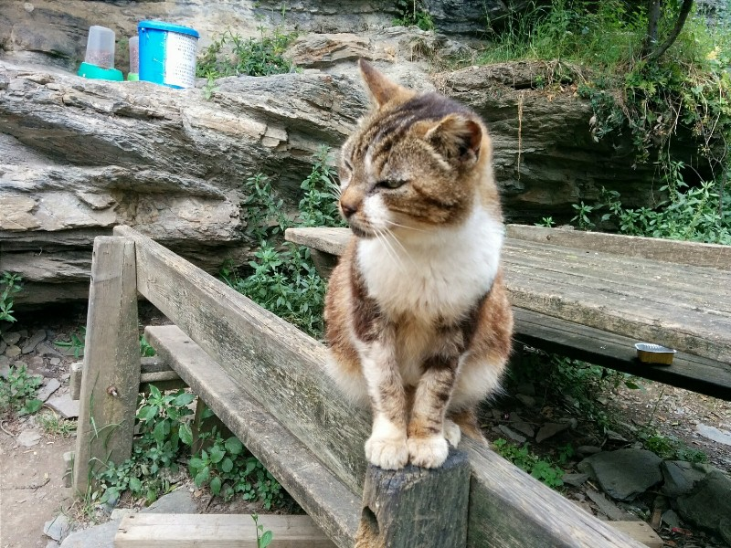

Despite an early start and prepacking the night before, thanks to the wonderfully reliable and timely public Italian transport system we arrive at the train station 5 minutes after our train for Pisa had departed. Our bus to the station showed up either very late or very early, were not sure which. Not a good start to the weekend.

*Cool Looking Church in Monterosso on the Cinque Terre*

Our first pair of tickets are valid for any train from Florence to Pisa for two months, but our other two connections are both reserved so worst case scenario means paying for a few more tickets once we eventually arrive in Pisa. Could be worse we suppose, better than missing a flight anyways. We scan the departures board and find out there is another train leaving at 8:07 (it was just after 8:00 at this point) from platform 5. Excellent, we might even be able to make our other two connections! We walk over to the platform just as a train is arriving and despite no information on the platform's departure sign we remain cautiously hopeful. This feeling doesn't last long as the sign soon tells us this train has the wrong number, the wrong departure time and the wrong destination. S.i.g.h.

As we wander about the platform looking for help feeling hurt and betrayed (how could the departure board lie to us, after all we'd been through together??) when we were approached by a sketchy young guy in T-shirt (no lanyard or anything). Having learned our lesson well about unsolicited advice we take his suggestion that the train for Pisa is actually leaving from platform 2 with a decent sized grain of salt. More to the point we assume he's trying to rob us somehow. However, we investigate anyways since we really have nothing to lose at this point - the train at platform 2 has the wrong destination and departure time on the sign as well. Luckily there is a conductor near by that can clear everything up for us.

"This train? With the wrong number at the wrong time to the wrong destination from the wrong platform? Yeah, this is the train you want for Pisa."

Italy - a shining example of organization.

We ended up making both of our connections, mostly because the first one was running late but who are we to complain, and after a couple hours of uneventful travel we arrived in Levanto. The apartment we are staying in doesn't allow us to check in until after 3:30 because they are closed from 11-3:30 for lunch, ostensibly because it's "too hot" to work in Italy during those hours. More likely it's because everyone wants a break in the afternoon to have a leisurely lunch and a glass of wine. It's a strech of the imagination to consider 25C (75F) too hot to work. We wandered to their office anyway  just in case we could catch them on their way out and we were in luck. Yay!

*Not The Ugliest Part of the World*

The Cinque Terre is a stretch of mountainous costal villages that were, until relatively recently, only connected by a rugged coastal path that wound it's way along the cliffs. They now have several tunnels that allow train access between the villages, but the coastal paths and several other mountain hiking trails are still a very big tourist draw for the area. Back at the station, we learn that 3 out of 4 of the coastal trails and several of the mountain hiking trails are "closed for maintenance" and have been since June 2013. Sigh. We decide to walk the only open coastal trail today (Vernazza to Monterosso) and save the mountain trails for tomorrow.

*Vernazza*

The walk was quite scenic, taking us past vineyards hanging on valiantly to the cliffs and houses perched precariously on the hillside. After a bit less than an hour and a half we arrive in Monterosso and order a couple earned beers from a oceanside restaurant.

After her visit to the region last summer, our friend Charlotte treated us to dinner at a restaurant where she had "the best gnocchi of her life." How could we resist?! We found the restaurant and eagerly flipped through the menu looking for the gnocchi dish only to find out that their menu is seasonal and the gnocchi dish has been replaced! Sad times! Making the best of a bad situation, we order a bottle of local white wine, bread with olive oil and balsamic vinegar, anchovies in white wine sauce (amazing), a fish ravioli scampi for two (best ravioli we've ever had), and some dessert- a tirimisu almost as good as the almost tirimisu dish we made ourselves in Florence. Definitely a good pick Charlotte!

*Fake Smile Because This Photo Is Interfering With Delicious Ravioli. Mmmm.*

That night we got no sleep. Argh. A pipe or something burst directly outside our door so from 9.30pm until past 4am there were floodlights, yelling tradies, hammers on concrete, man holes being exposed, trucks beeping... General nightmare hubbub.

We didn't get up til late so mountain treks were out. Instead, we went to Manarola with plans to do the same walk as yesterday, but the other way. The climb was definitely harder this way (lots of stairs all in a row rather than split up with flats in between), but still just as pretty once we got to the top. After enjoying the walk one way, we had a little walk around Vernazza then decided to go back the other way to Monterosso again for some exercise. Still pretty! Saw a few Asian people waking past dressed to the nines, and a whole lot of people in Converse. Inappropriate attire!

*Looking Down on the Beautiful Town*

When we got to Monterosso we jumped on a train down to Corniglia thinking we had well earned dinner. Sadly on arrival it became apparent there was more climbing to do before we would be fed! Up the 377 stairs to the town, felt like a breeze after the last trek! But we were definitely hungry. We held out long enough to check what was on offer, then picked a nice place on the cliff face overlooking the ocean for a delicious local vegetable pie (mmm), a bruchetta, a four cheese gnocchi and a pesto trofie (a local pasta made of chestnut flour) and a panacotta. All completely delicious. You just don't get pasta in Australia like you do here. We will miss this food dreadfully!

Pat grabbed a delicious dark chocolate gelato, as good as the one from Rome definitely. And then home to hope endlessly for a better night's rest!

*Mind Late Trains Less With This View From the Station at Corniglia*

*Apparently This Chap Lives on the Trail for Cuddles and Snacks. There Both Days*
