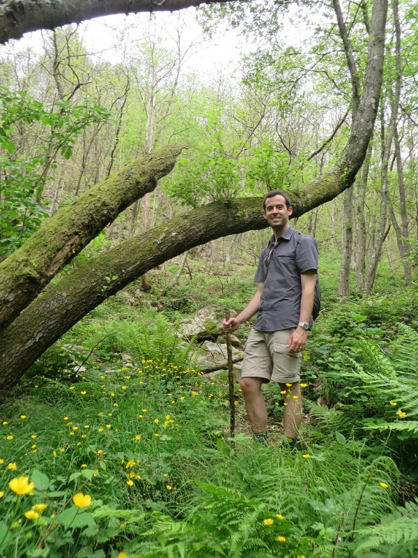
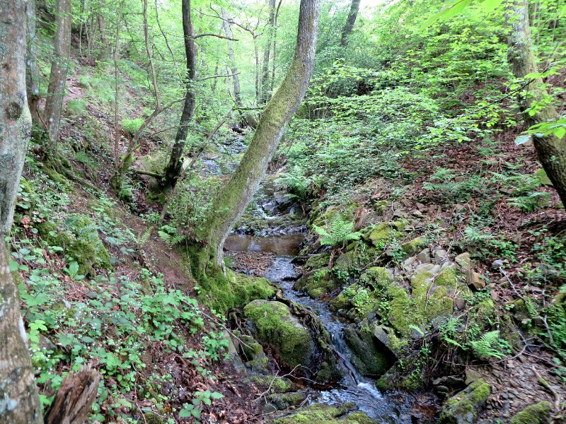
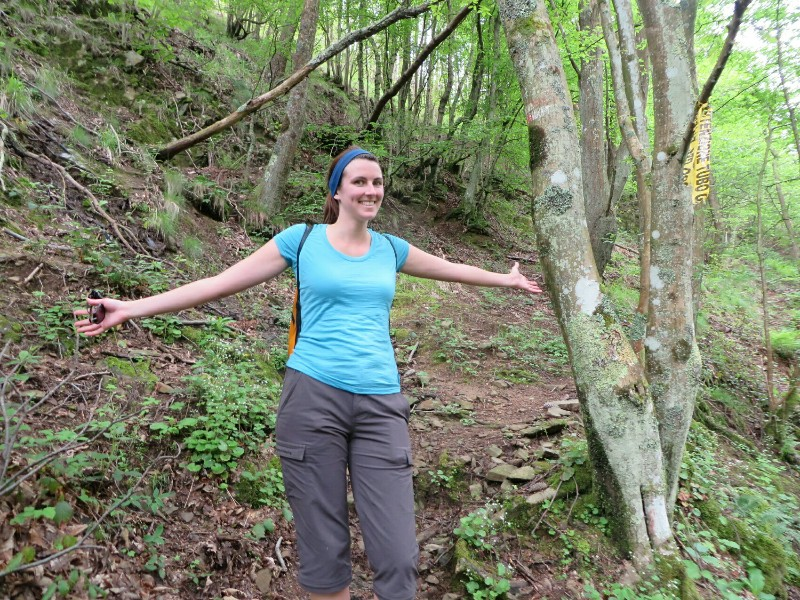
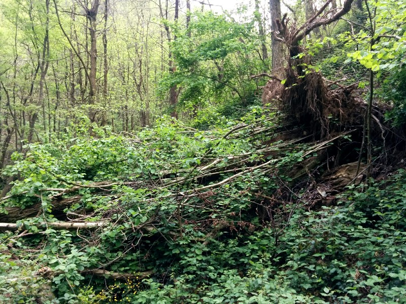
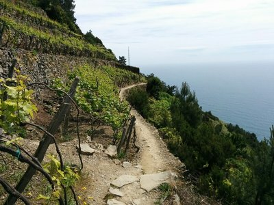
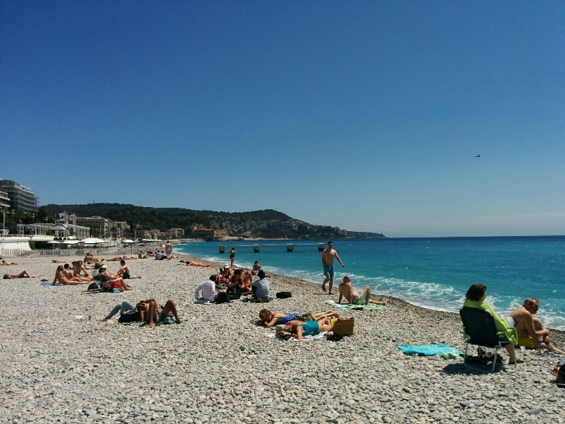
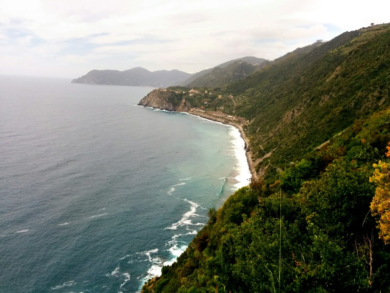
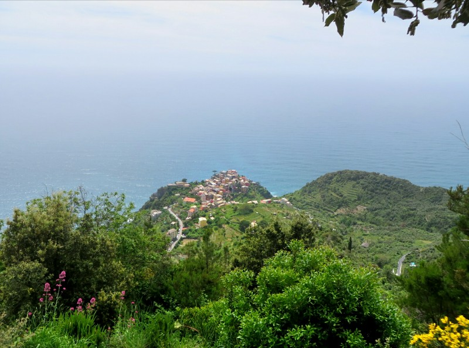

Not the most amazing sleep, to be sure, but better than the night before. The worst thing is the town clock tower that rings every quarter hour any number between one and fifteen times. But! We awoke marginally more refreshed and after checking out we headed back to Vernazza for a day hiking! The first half of our first trail was closed so we grabbed a local bus (compete with cute old Italian lady and her grumpy poodle) to San Bernadino. There was a nice church, a nice view and a poorly marked trail (number 7) which we found after ten minutes of aimless laps of the town.

*A Wild Patrick Appears!*

It started steep! Not stairs, just a steep dirt track up the mountain. We scrambled up, puffed and panted then after a good 40 minutes of hard cardio we hit the peak. At the top we were to go down track 7a back towards Corniglia. We reached a crossroad, the options were track 1 (heading in two directions) and track 7 (back the way we came, and going onwards). We trucked along following number 7, assuming 7a was just it's title on the map to differentiate the length and time required for different sections. It was not as well maintained as the previous path, narrow, bushes growing over it, winding, but absolutely beautiful. We followed along what started as a dry creek bed and gradually met with other streams to become a fairly moderate river. We kept a keen eye out for trail markers as it was so difficult to determine what was trail and what was just the bush at times, and trail markers could be few and worn. It was a little like a real life game of Where's Wally, searching for little red and white stripes or a number 7 on the trees. The trail required us to cross the river a few times, it got more difficult as it got wider and deeper but we managed to keep upright.

*At Least It Was Gorgeous*

After a pleasant hour and a bit of difficult terrain and unfriendly sharp bushes biting our legs we started to wonder where the next intersection would be. We really feel it should have turned up by now... We check the GPS on Strava to get an idea of how far we'd gone. Didn't look so good. It looked like we were heading the wrong way. We decided to carry on another 10 minutes and if nothing became apparent, turn back. After about 5 minutes we came to a viewpoint- beautiful mountains, a cute colorful town, definitely no water, no ocean. No question we were going the wrong way.

*Kate Felling Triumphant Before She Realises She's Spent an Hour Going The Wrong Way*

We turned around. And on the way back we realised there had been some hints- we were on the 7, not the 7a. We had reached the peak from the ocean and continued down the other side somehow thinking continuing away from the ocean would lead us to the next ocean front town. And the track being so terribly maintained made more sense. Wouldn't kill them to mark the 7 as continuing on the map rather than showing it ends!

*The State Of The Trail Might've Tipped Many Off That They'd Taken A Wrong Turn- Not Us!*

Ah well. We got back to our intersection of 1 and 7 after 40 minutes and followed 1 along the ridge. About 5 minutes later a sign to the 7a popped up, well maintained, pointing the right way and with about a million bright, new red and white trail markers. Good-o!

On the right track we followed the 7a until we were just above Corniglia. Rather than descending here we followed along the ridge towards the next town, Manarola. This was a very easy walk, we quite enjoyed it! Fairly flat with vineyards climbing and wrapping the hills on both sides. We passed small local villages with men and women gardening, planting tomatoes and pruning their vines. All terribly beautiful. We will need to return here someday.

*Trail Past the Vineyards*

After another hour and a bit we reached Manarola and made the decent down. Time was starting to run short... We went to the station to get the train. Naturally (being in Italy) the train was late. It pulled into Levanto 25 minutes late, 15 minutes before our train to Genoa left and our luggage was still at the apartment agency. Ah! We ran off the train and out of the station and with enormous luck there was a taxi out the front (one of the two in town). We told him we had to get our luggage and be back for 5pm. He raised his eyebrows, then got serious. What a crazy drive! Speeding around stopped cars and dodging pedestrians; parking illegally while we grabbed our bags then madly negotiating the narrow maze of town streets to get us back with time to spare. What a champion!

We got our train to Genoa and used our time changing at the station to go find a kebab. Clever move! We ran back to the station with our enormous heavy bags thumping into the front and back of us, tiring our already tired legs. Luckily this train was delayed so we made it. We will never learn! But the good news is we successfully got to Ventimiglia for (we really really hope) a good night's sleep at last!

We woke up with high hopes of exploring the town a bit before catching our train, but the morning slipped away from us and after breakfast and packing it was nearly 10 so we just checked out and wandered up to the station to buy our tickets to Nice. At least this way we will have more time there to enjoy the scenic French Riviera, if only for a few hours.

The train station was a bit chaotic. Being so close to the French border, about half the trains leaving from the station were bound for France yet their automatic ticket machines only dispensed tickets for Italy. This meant waiting in a very long queue that saw us actually move further from the ticket windows, not closer, as people kept pushing in. Sensing Kate was losing her grip on sanity as the queue stubbornly refused to move, Pat went to investigate a nearby travel agent. Easy! They had tickets preprinted for our train at cost and had me out the door in seconds. We boarded and bid a fond farewell to Italy.

The view from the train was just unreal. The tracks hugged the coastline all the way to Nice reminding us why train travel is so much better than flying. You would never get a few this amazing from a plane. We pulled into Nice and were slapped in the face with the reasons we can't stand France sometimes. Again the ticket machines won't accept our credit card, or any form of tangible currency for that matter thus forcing us into another mega queue. I swear the people who designed those bloody ticket machines were paid off by the union that represents the ticketing booth workers! What should have taken mere minutes took over 45. We then dumped our bags at the lockers staffed by an unusually helpful man. The instructions for how to operate the lockers are all English, but seeing we were foreign, non French speakers, he insisted on talking us through it in French. Bizzare. Very nice, but bizzare. By now over an hour was lost.

*I Know There's A Romance To The French Riviera, But I Prefer Aussie Beaches*

Unfortunately this wasn't the end of our woes. We had a few things that had to be posted urgently so we went to a nearby post office. Unlike most normal post offices that have a counter where you go to be served, French post offices appear to be an amalgamation of a number of different services all packed into one building each with their own counter and queue. We gambled and picked one and were served by a very helpful employee who spoke English. Despite the unexpectedly pleasant experience, we now only had about 45 minutes to enjoy Nice before our train departed instead of the 2+ hours we had hoped for.

We made a mad dash to the coast. Admired the scenery and took a few pictures. On the way back to the station we grabbed a few baguettes for the ride (love this part of being back in France).

Our train arrived in Marseille late leaving us 2 minutes to find our next train. We ran to the departures board (with our big backpacks bumping around), found our train was leaving from the other end of the station, ran there and got on with a couple minutes to spare (it was running 5 minutes late thankfully). We got the rental car and said our prayers and final I love you's - we were about to drive in France. There is a chance this blog post is coming from beyond the grave...

Actually, the drive was rather pleasant. We preloaded the directions into Google maps on Pat's phone so they worked offline and we made it to our hotel in Orange in just under an hour. After an "okay" dinner, we called it a night and went to rest up for our first day exploring the French wine country.

*Probably Worth The Hike*

*Corniglia Below (Once We Finally Found It!)*
