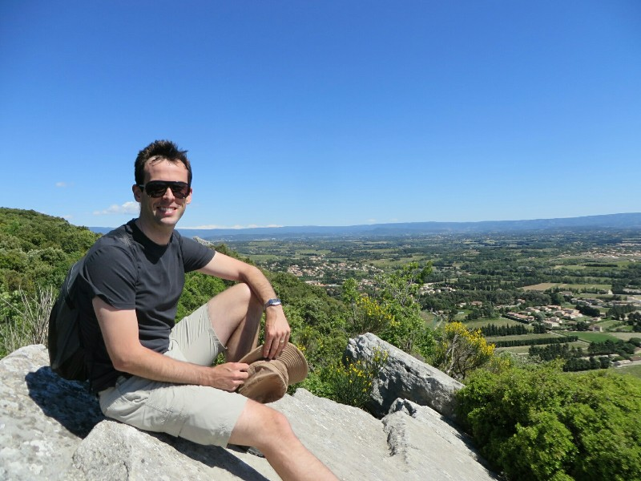
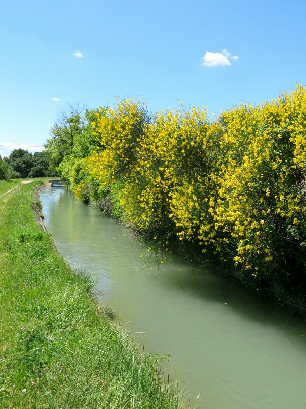
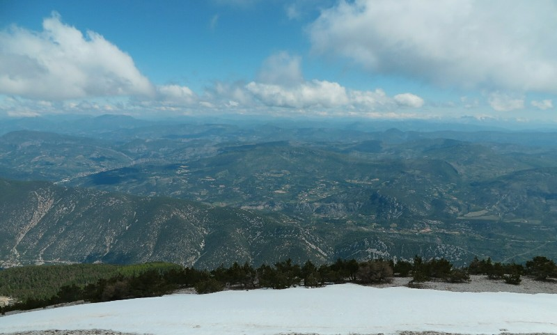
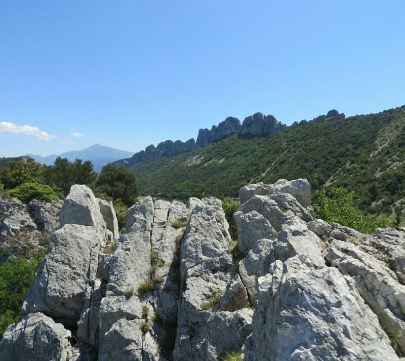
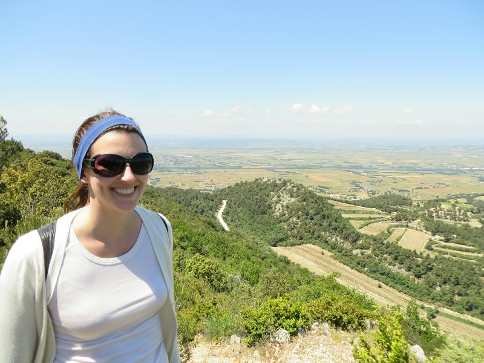
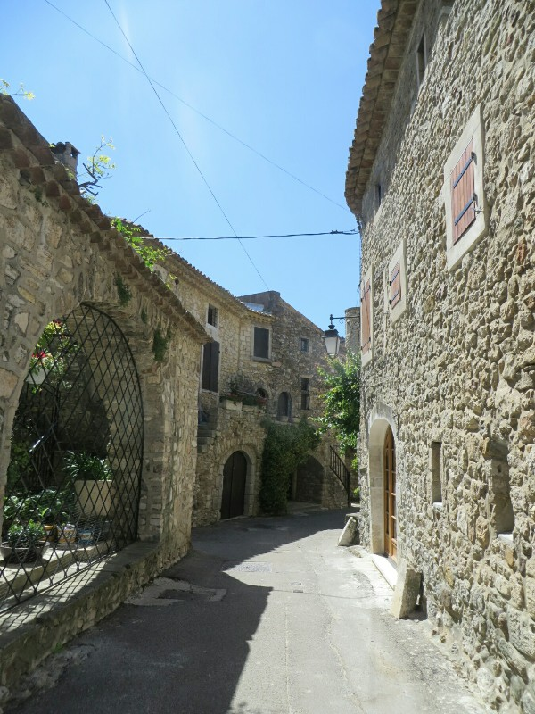
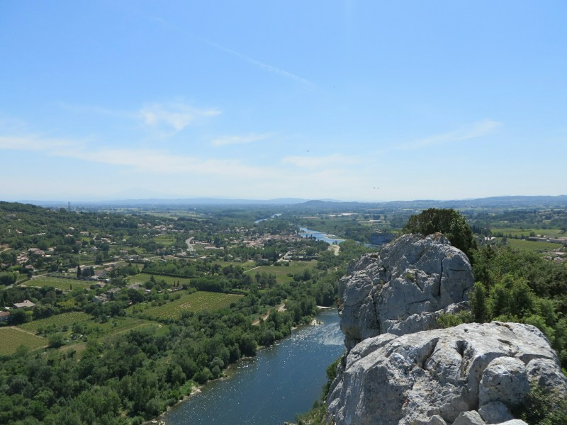
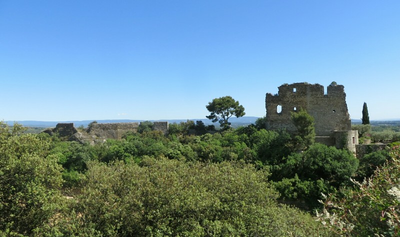
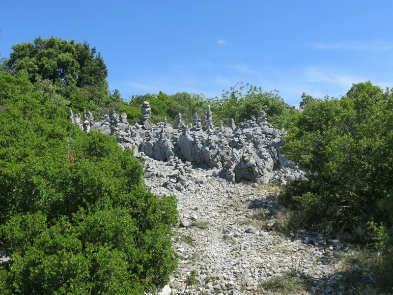

We started our first day in Orange with a sneaky illegal breakfast in our hotel. We're not supposed to eat in the rooms, it's "strictly forbidden" but we figure that surely that doesn't apply to cereal. Surely! After breakfast we wander into town to do some much needed laundry after the last washing machine we used in Levanto left our clothes to soak in dirty water and didn't really clean them. While they were sudsing away we went to the tourist info office to find out about local hiking trails. Hiking is the aim of the game for the next few weeks leading up to the Inca Trail. Armed with information and clean clothes we got the car and drove towards our first hike in Beaums de Venise. Of course everything is closed because it's 2:00. Of course! There is only one place serving food, so we make the best of the situation and have a pretty decent meal, although much more expensive than we had planned.

We set off on our hike and promptly got lost. You wouldn't think we could screw up the directions we were given but we defeated the odds and ended up in someone's front yard. Luckily the man who lived there was quite understanding and he helpfully pointed us in right direction (away from his private property) and we went on our merry way. The hike itself was quite scenic and gave us our first panoramic glimpse of the surrounding area. Not the longest hike ever, or the most difficult, and probably didn't do much to get us ready for the Inca Trail, but it was fun nonetheless!

*Well Earned Sit Down*

On the way home we stopped at Fontaine du Clos winery and did a tasting. The owner did his best to translate things into English for us and even gave us a tour of the winery to show off their dozens of massive vats (they were apparently a huge winery). In the end, we bought two bottles that we thought were pretty tasty (thanks Tim and Ann) and made our way home.

Or at least that was the intention. As we were heading into town we missed our turn to the hotel and because of all the one way streets we had to drive in a gigantic circle down narrow roads that were never intended for cars for about 10 minutes before we had another shot at the hotel. By the time we got back, we had a much better understanding of the city's layout and we would be certain to never miss that turn again! We went out for a mini dinner care again of Tim and Ann; a croque monsieur, a mixed cheese platter and a chocolate fondant to share. Mm, we have missed French food!

*Looks And Smells Like Spring! *Achoo*, Says Pat*

We had another big hike planned for day two up Mont Ventoux. On paper it sounded like the perfect climb - you start midway up a reasonably decent ascent and gradually hike your way to the summit. Cyclists ride it every day as it's one of the stages for the Tour de France so we figured it would be well signed and well mapped by the local tourism office since it is so popular.

Sadly we were wrong. The people at the tourism office were less than helpful and just pointed us to a camp site as the jumping off point for our hike. They said that when we arrived, all the info would be well signed. It wasn't. We arrived in a ghost town that would be bustling in 6 months time when the mountain was blanketed in snow again. There were no signs, no maps, nothing open, no people... Nothing. We were about to set off in hopes of finding some trail markers when a woman who lived in the town nearby spotted us and called us over. She spoke no English but managed to convey, "Hey idiots, its 0C at the top of the mountain and your wife is wearing a paper thin cardigan. Go home."

*View From The Hike Up Mont Ventoux That Never Was*

Point well taken, random helpful woman. We decided we would at least drive to the top to enjoy the view from the relative warmth of the car. The top was, as she explained, quite bloody cold. In fact, there was still snow on a large portion of it. It's a good thing random strangers have been looking out for us on this trip. Between the man in Füssen warning us about the psycho bike trail we tried to take and this woman protecting us from the bitter cold, we owe someone big time!

Unwilling to give up, we head to a town closer to home recommended by our local tourism office, Gigondas. Every little town has it's own tourism office; to get trail maps etc for hikes and walks you have to go to the most local tourism office. So our office can point us to other towns which are near hills or parks, but our fate depends on whether the next town is well organized. Thankfully, this one was and the lady working there sent us on our way with a few options of trails to follow. We ended up taking the shorter 2 hour route because it was insanely crazily windy and we were quite seriously almost blown over a few times. While a little painful under normal circumstances, it becomes possibly fatal from a 300 meter sheer cliff. Still-some exercise done we think we've earned a wine break.

*Consolation View From The Dentelles, Appropriately Named For Our Katie*

We pop in to a small tasting room at the edge of the town and give the three reds they have on offer a try, one dry, one spicy, and one "vanilla-y". They're all pretty tasty, but that wasn't enough for Kate. She spied the chocolates near the door as soon as we walked in and spent an inordinate amount of time oogling the options. Pat played it safe and stayed near the wine. Eventually she made a decision and we made our way back home for some baguette and dips before heading out to another Tim and Ann funded dinner at Les Amis.

*Kate Wanted To Climb A Mountain Where It Was 0c Wearing This Cardigan*

Another day, another optimisticly early start, another failed hike. This time we lost the roll of the tourism office dice and the offices we found (and didn't find) were of little help. We did however end up near an amazing little town called Aigueze which is built into and on top of the cliffs of a gorge. Complete with tiny little cobble stone alleyways and a castle and wall carved out of the cliffs, it was an impressive place to wander through.

*Aiguèze - Just Your Standard Historic French Town Built Into The Side Of A Cliff On The Bank Of A River*

On our way though we found markers for a hike that lead along the cliff so we followed them for about an hour before turning back towards town. Not knowing if the trail looped back or kept going, we thought it was the safer option.

Back in the car, we head north in search of wine. On the way we pass many zombie towns devoid of human activity and a few cool old castles, churches, and walls. Eventually we find a tourism office and stop for info, but again we come up empty as they don't speak English at this one. We paw through the brochures and find one for a winery nearby that includes driving directions so we soldier on deeper into the French countryside.

*Not A Bad View For An Unplanned Hike In A Random Town*

The winery was quite small and in the middle of nowhere and initially appeared to be abandoned. As we were about to get back in the car and give up a guy popped out from behind the building looking as if he'd been working in the vines all day. He spoke no English and of course we don't speak French so we had an amusing tasting with him speaking French and pointing at pictures of barrels, writing down numbers for vintages, etc to try to explain the wines while we tried to understand. The wines were all very tasty and if we had more time to drink them all we would have bought more, but as it stands we picked our favorite Shiraz and left feeling pretty good.

After a glass of red at the hotel we made our way to La Rom' Antique for dinner and had a very nice three course dinner, again thanks to Tim and Ann. "Eat delicious French food and drink delicious French wine" they said. What wonderful instructions!

*More Roman Ruins *Yawn**

*Markings Left By Members Of A Secret Hiking Cult*
