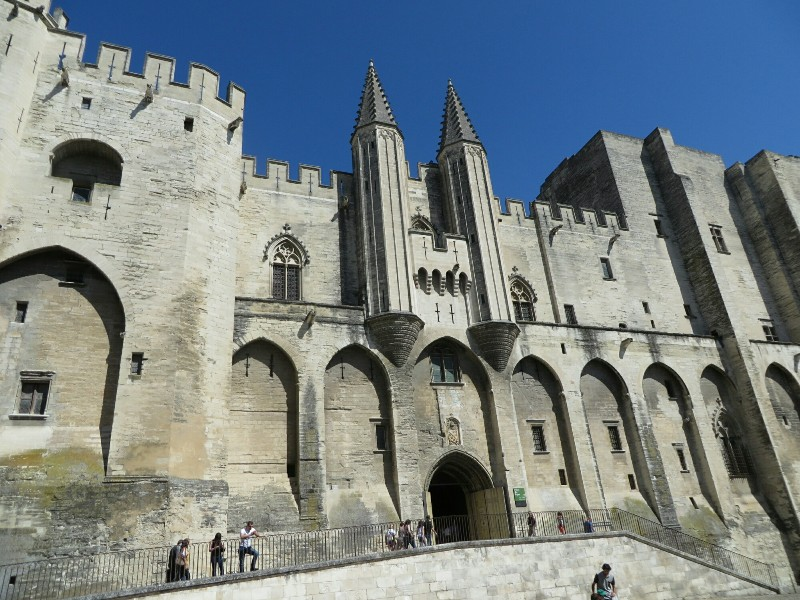
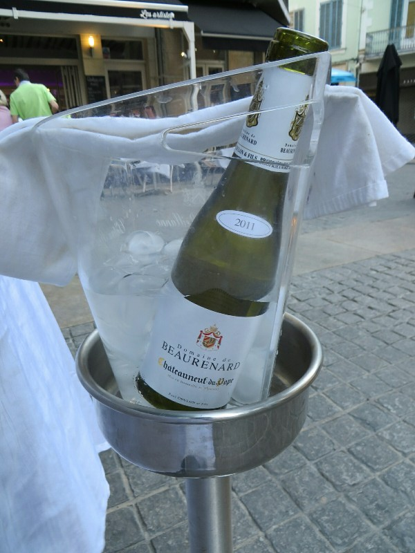
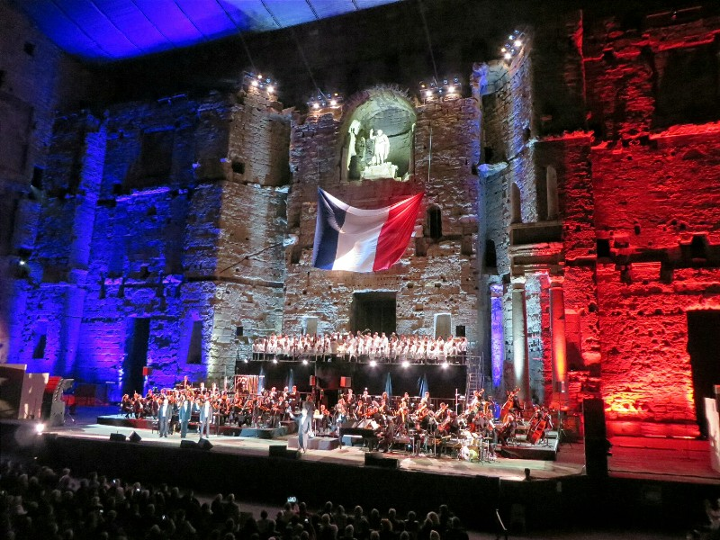
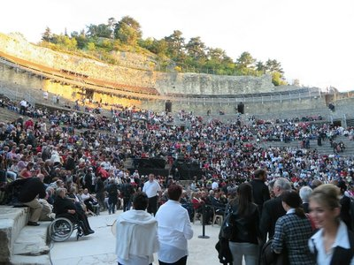
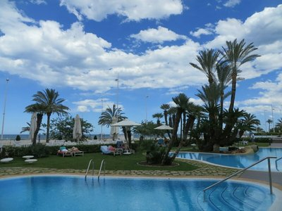
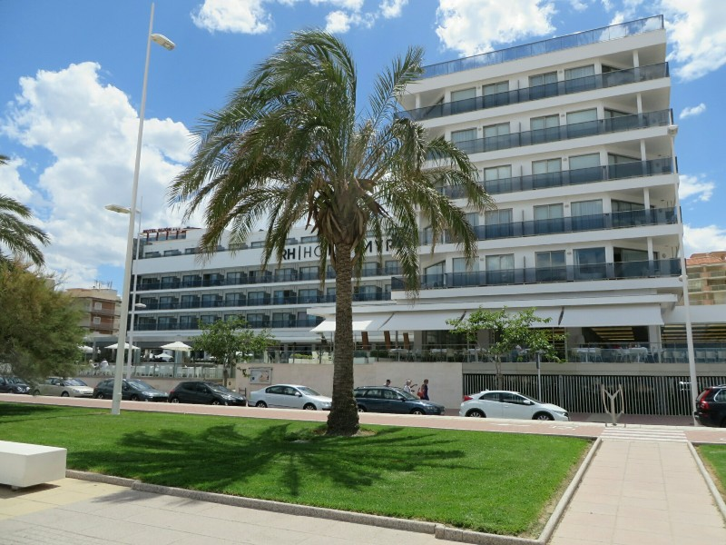
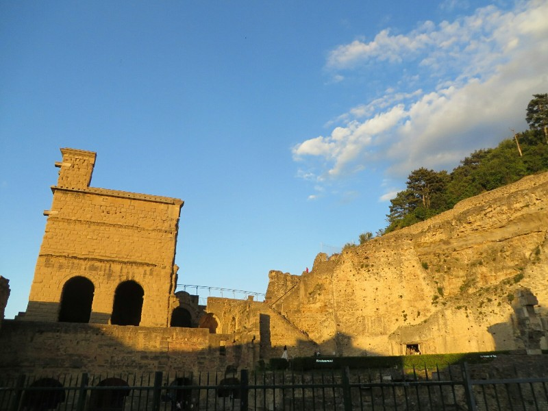

Our last morning we headed out on a looooooong drive to our next hiking spot and ended up in L'Isle-sur-la-Sorgue (an absolutely beautiful town surrounded by canals and mossy water wheels that looks like it belongs in Holland). After inadvertently driving down pedestrian paths and around the city aimlessly for a while, we found a suitable parking spot and wandered in search of the tourist office. We talked to moderately helpful (being generous) woman at tourism office and listened carefully as she explained how to find and follow the trail. 'There are markers in lots of colors! Red, yellow, white, orange, blue... Sometimes all together!' No map except of a town we weren't visiting. Maybe moderately helpful is a bit of a stretch.

Feeling brave, we drove to Saumane de Vaucluse, poked around for the markers for the trail and found some that matched her very broad description and set off. It was a beautiful day and not windy for once which made everything that much more enjoyable. We meandered along for a couple of hours before we realised the GPS had us in the wrong spot despite us following all of the correct signs. Good news is that we were still on a loop back to the car, it just added an extra 3km to the walk. Could be worse.

*Another Modest Abode For The Pope*

Thanks to our little detour we were now massively short on time so we had to cut our planned trip to Avignon back. We parked the car, emerged right next to the old papal palaces, looked in awe for a few minutes, ordered and devoured a crepe, then quickly went back to the car and left. The whole visit was only 30 minutes so I dare say we'll have to go back at some point!

At home, we booked some minor last minute things for Spain tomorrow (car, accommodation, nothing major really...), cleaned up, went for nice dinner at Les Artists accompanied by a superb wine from the Châteauneuf-du-Pap region (last meal care of Tim and Ann) and set off for a show at the local 2,000 year old Roman theater (Théâtre Antique d'Orange) with the remnants of our gift from Angela, Maarten and Dr Skopal, plus a top up from Liang. Pretty standard Saturday night.

*Delicious Wine*

There was something so surreal and amazing about seeing a performance in a theater that old. Knowing that people thousands of years ago sat on the same stone and watched people perform on stage just like we were made us feel a very close connection to the Romans. The show got off to a roaring start with a standing ovation before anything had happened. Apparently the conductor of the choir and the composer are both very well respected in France so people were quite keen to show them some love. This would be repeated at the end of the performance as well.

I wish I could tell you what the show was about, but as we aren't fluent in French and there aren't subtitles in real life, all we can say is that it was about Napoleon and France. We think. Towards the end during the dramatic climax of one of the songs they raised a gigantic French flag over the stage just under the statue of some Roman emperor. It was quite fun!

*So You're Telling Me Napoleon Was Nigerian?*

After what seemed like ages of applause we were finally able to sneak out and make our way home to get a few hours rest before our early start tomorrow.

*Imagine Everyone In Togas and You've Got A Pretty Accurate*
Picture of 20AD (And A Surefire Cure For Stage Fright!)

Next morning we were up early and out of the hotel without incident. We drove confidently towards the airport with plenty of time up our sleeves to return the rental car and make it through check in and security.

After a few signs indicated that we were a lot closer to Marseille than we wanted, Kate checked the GPS and confirmed we were way off course and had missed the airport exit. How did we get anywhere without GPS? After turning around and finding the correct exit, we discovered we missed it originally because the signs were just for the suburb that the airport is in. No mention of "Marseille Provincal Airport", no, that would be too easy. Oh well. Even with the detour we still had three hours - remarkable by our standards.

We dumped the rental car, suffered through the budget airline terminal that houses Ryanair, waited, waited, and waited until we finally boarded the flight and said goodbye to France for the last time on this trip. No need to get too sad about it, we will be back soon enough. There isn't a force in the world  powerful enough to keep us away from their pastries, cheese, and wine.

On arrival in Valencia we made our way to the hire car desk for Hertz and prepared to pick up our prepaid car. As she was preparing the paperwork, she asked if we wanted to take out insurnace on the car. Thinking it was the standard "reduce the excess / deductible to nil" sales pitch, Pat initially declined. After a few seconds he thought it best to clairfy which was a good thing because as it turns out, Hertz in Spain will rent you a car with no insurance whatsoever. You break it, you buy it. Car stolen? Too bad, here's the cost to buy us a new one. When we asked how much it was to have the insurance added (still with a €700 excess, mind you) the price went from €135 to €365 - over 2.5x the price they "sold" us when we booked the car online.

Trying to be helpful, she said she could try to cancel the reservation and give us their "best" daily rate which was still €235. Feeling the whole thing was a bit scammy, Pat walked over to the Europcar desk and got a quote for €160 - more than the initial online booking with Hertz, but this included insurance. The girl at the Hertz counter had to call their head office for approval to cancel and refund our booking, which to their credit they did and once that was finished we went on our merry way.

*Pool At Our Swanky Digs*

Unfortunately our "merry way" ended up getting us lost several times trying to get out of Valencia and into Gandia. Spanish roads are some of the most confusing we have come across. The names and numbers of highways and other roads didn't match the map we had, and the names on the map didn't match Google Maps. Road numbers were often only revealed once you passed the off ramp or exit, so we would be driving along looking for the CV31, see a sign with a city name on it, drive past it, then off in the distance once the road splits there is a little sign welcoming you to the CV31 and giving you a little pat on the back for guessing correctly. This happened so often it stopped being amusing and was just downright insane. How does anyone navigate here??

Somehow we made it to Gandia and were welcomed by a city full of one way streets despite everything being plenty wide enough for two way traffic. Of course the maps had no indication of which streets go which direction when, so we drove in circles until we found our hotel, and again until we found their parking lot. Very happy to be out of that bloody car and off those insane roads. At least the other drivers are courteous. How any of them keep their cool driving here all the time escapes me.

We checked in to our hotel (pretty swanky beach front digs, although our room is off in the back of the hotel facing away from the ocean) and immediately head out for some grub. Pat dusts off his high school Spanish (much to Kate's amusement) and manages to order up some food and beer. We finally start to relax and settle into what should be a very relaxing week.

*See All Those Rooms With Fantastic Beach Views? Ours Isn't One Of Those.*

*Sun Setting On The Amphitheatre- Way Too Big To Get A Pic Of All Of It*
