It turns out that our hotel booking includes free brekky, which is always a welcome surprise. We saunter down expecting a typical hotel brekky buffet and set our sights appropriately low. Wow. We were soooooooo wrong. Here's a rundown of some of the food the hotel was offering up for breakfast:

- Made to order omelet and crepe station with big bowls of home made jams and cream and nutella and honey

- Massive selection of breads and buns including mini baguettes with several toasters on standby

- Cereals and muesli selection with fruits and yogurt

- "American and English" section with fried eggs (sunny side up with runny yolk), bacon (literally still sizzling), sausages, mushrooms, tomatoes and churros, because Spain

- "European" section with an array of cured meats and salami (including prosciutto), a number of sliced hard cheeses and some soft cheeses, hard boiled eggs, SMOKED SALMON, fruits, and three different types of milk

- A pastry section with different types of muffins and no less than three varieties of croissants all still warm from the oven

- Hot chocolate machine with chocolate so thick it needs an agitator to keep it from solidifying

- Fresh squeezed juices (pineapple, peach, and orange), milk, filter coffee and an espresso machine

- Oh, and in case you want to have a special Monday brekky like we did they have bottles of FRENCH CHAMPAGNE on ice that they will open for you on request which are sitting next to fancy French bottled water in case tap water isn't your thing.

All this sitting less than 20m from the beach with a full beach front view through floor to ceiling windows in the restaurant. They are on the short list for "best included breakfast" ever! Kate overeats (obviously), enters food coma. Pat does the same. Can you really blame either of us? About lunch time she emerges from her caccoon of blankets and we head to the tourist information to ask about (what else) hikes in the area. The lady knows nothing, no suggestions. But she does give us a pamphlet about shopping, eating and sitting on the beach! Which I'll admit, all sounds very tempting.

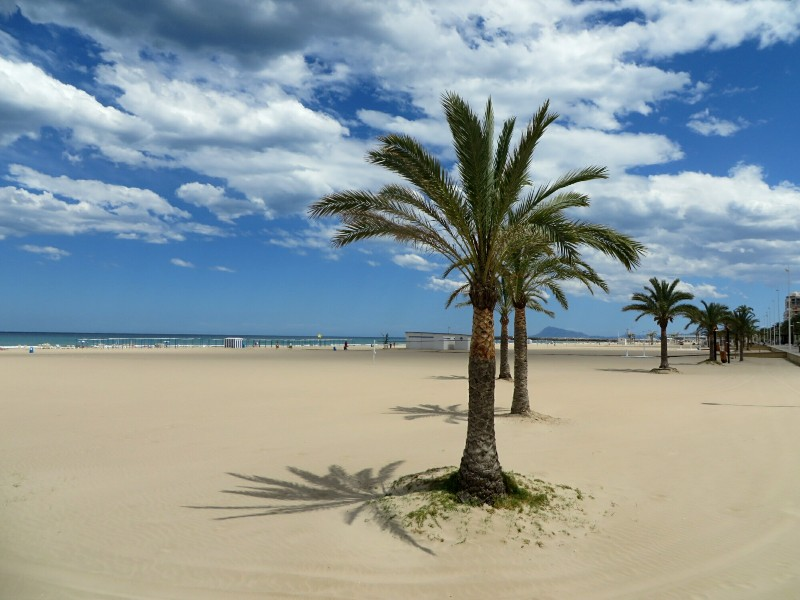

*Spain Knows How To Do Beaches Right*

Pat is not deterred. He asks the hotel desk and the lady is very helpful. She calls national park offices and works out the secret trick to translate their webpage into English (actually a real trick; the only language options are Spanish and Catalan until you click off the homepage, then back again via another link and voila! English appears as an option). We find a few walks that sound good, but by now it's 2.30 and too hot to be climbing mountains.

Instead we head to town to find Kate a hat which unfortunately entails driving on Spanish roads again. After getting lost and turned around several times, we arrive at the local mall only to find there are no shops that sell practical hats. They sell novelty oversized sombreros and cowboy hats, but no sun smart hats whatsoever. Guess they don't have skin cancer here?

We gave up and drove further into town towards a pedestrian mall which we are lead to believe is similar to Rundle Mall. Unfortunately everything is closed because it is Monday. Do people ever work in Europe?? Defeated, we found a grocery store to buy some fruit and water for the hike tomorrow. Words cannot describe how amazing this store was. They had a meat counter that put every butcher we've ever been to in Australia to shame. They had entire racks of WHOLE legs of cured ham, about 20-30 legs per rack, of which there were several. Behind the counter they had several different types of cured meat loaded up into wooden vises ready to carve to order. There was a seemingly endless selection of other meats and salami to choose from. If we had a kitchen on this part of the trip, we would literally go broke shopping here. There's also a good chance we would die from meat overdose so maybe it's for the best.

We are up and out early the next morning (after overeating at breakfast again) for our first Spanish hike. Our destination is a national park called Serra Mariola. We were armed with our GPS, a map of the hike, and a description of the sights to see along the way. Not to ruin the surprise, but for once we didn't get lost on a hike! We stuck to the well signposted trail and completed the loop as intended! We're as amazed as you are.

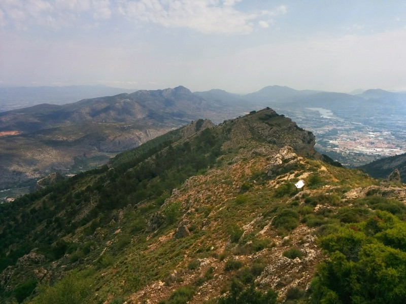

*Not As Green As France, But Not Bad!*

The first 3 km were quite steep and challenging, but after the ascent we were rewarded with some very nice lookouts over the surrounding national park. At several spots on the hike we came across "cavas" or snow wells, which are stone cellars or vaults used from the 16th to the 20th centuries for storing snow. Early settlers in the area would then transform the snow into ice by compacting it and then sell it in summer. They would transport the ice to nearby counties for use in preserving food, making ice creams or for therapeutic purposes. Of all those uses, ice cream is undoubtedly the most important.

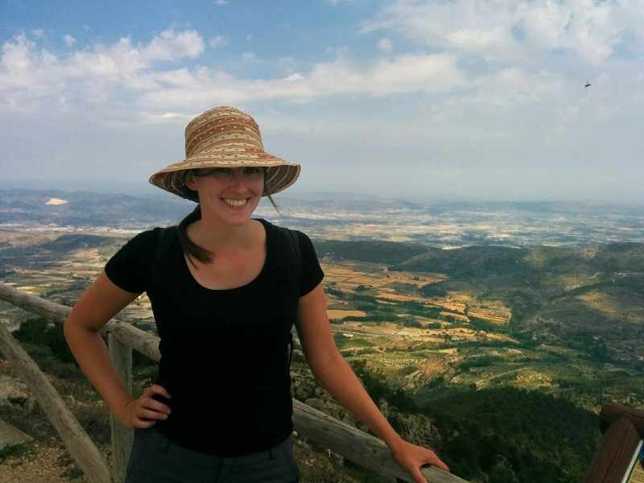

*The Dorky Hat Kate Found At A Tourist Shop Last Night!*

After enjoying the lookouts and cavas, we started our long boring descent by way of a fire access road. The scenery was still beautiful, although we both felt it looked a bit arid having just come from the French countryside. We saw many uncomfortably large bees and unfortunately they saw us too and flew at us several times to try and pollinate Pat's shirt. We also saw a few hummingbirds which was fun.

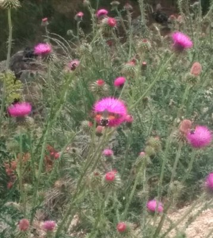

*A Fuzzy Hummingbird*

After we made it back to the car, we drove home (got lost again), did some laundry (super exciting), and had a couple drinks overlooking the ocean from the hotel. So won over by the hotels breakfast spread, we decided to give them a try for dinner. As it turned out, it was not too shabby! Pan fried salmon and chicken skewers (to order) and a large selection of other hot foods to choose from. We also ordered a good bottle of white wine as recommended by our waiter. At €12pp and €8 for the wine, everything was quite reasonably priced given the quality and the fact that we could eat until we burst! It's going to be sad to have to start eating properly again in Canada.

Day three we will take a hike along the ocean ranges! We drive down South. We know when we're close, we see the giant rock jutting out above the local town. Never seen a landscape like it in the world.

We park and head up. The first half is a moderately steep accent but on an easy, paved path. This section ends in a tunnel through the rock. We're told the second section is difficult. We're prepared for a steep walk up a narrow path. Nope, turns out to be rock climbing. Not high level rock climbing for a climber probably, but quite difficult for two people expecting a hike! We passed a lot of baby seagulls along the way with squawking, protective mothers glaring at us.

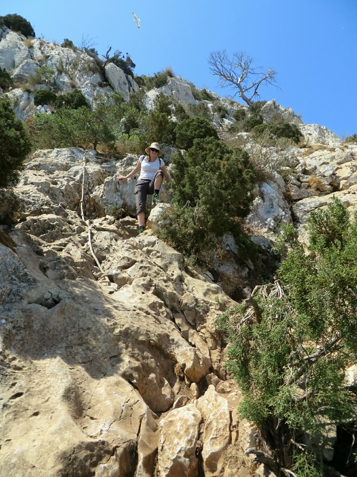

*I Think If It's Steep Enough To Warrent A Rope To Follow The Trail, Its A Climb, Not A Hike*

We persisted and we made it to the summit. Quite a view! The Spanish coast definitely smashes all the other Mediterranean coastlines we've visited for beauty. There are quite a lot of cats at the summit. Cute buggers, definitely malnourished, didn't pat them! When we ate our muesli bars we had a sad army of cats converge on us desperate for a bite. Pat picked the skinniest and gave him a bite. Doubt it's terribly nutritious, but he seemed to enjoy it.

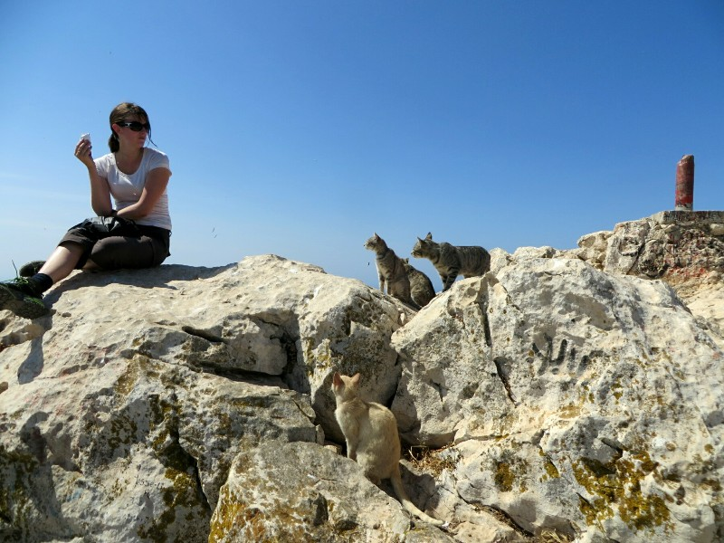

*Katie And Her Muesli Bar Making Friends*

The decent was a bit of a nightmare, Kate is retarded at the best of times but managed not to break an arm or her face on the slippery rocks. Pat did take a wrong turn and end up getting attacked by an angry gull when he got too close to its chick.

On the drive back we passed a lake full of flamingos! I didn't know they had flamingos in Spain! Naturally they kept their heads under water when I took photos instead of standing in a flock on one leg like they're supposed to.

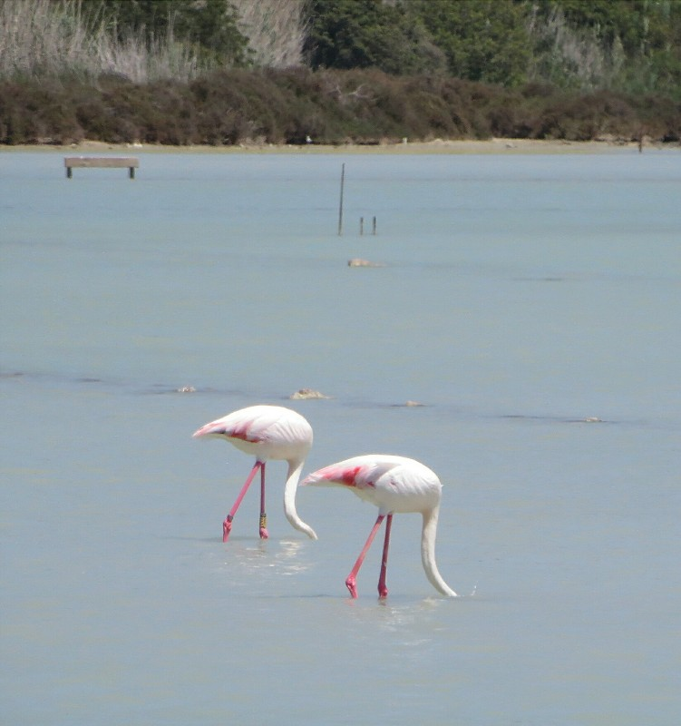

*Stupid Flamingos Hiding Their Heads!*

Back in town we had a delicious late afternoon paella. It was mostly veggies to our surprise, not the pile of 5 different meats you'd get in Australia. Then we finished off the afternoon with the standard relaxing on the beach. Ahhh!

For our last day we took it easy. We had a late breakfast, sat by the pool (and made our hotel enemies when they came and stole our umbrella), had lunch at the hotel and finished off the afternoon with a walk along the beach. We have decided every holiday needs a week at the beach, and if we ever go on extended holiday again we need this monthly.

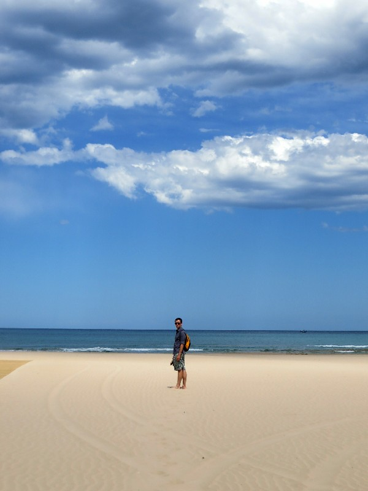

*Not Ngapali, But Pretty Fantastic*

Quite honestly traveling gets really exhausting- living out of a suitcase, always stressing about missing connections, trying to work out how to get to the next place and where to sleep to stay in budget but not get murdered or bitten by bed bugs overnight... A  few nights at a beach resort where they sort life out for you is pretty fantastic to destress.

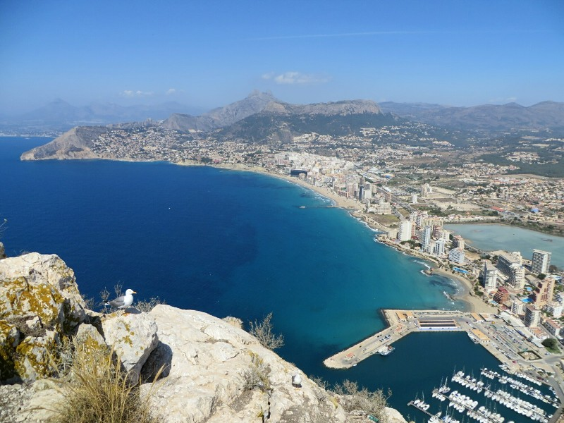

*Not The Seagull That Tried To Kill Pat*

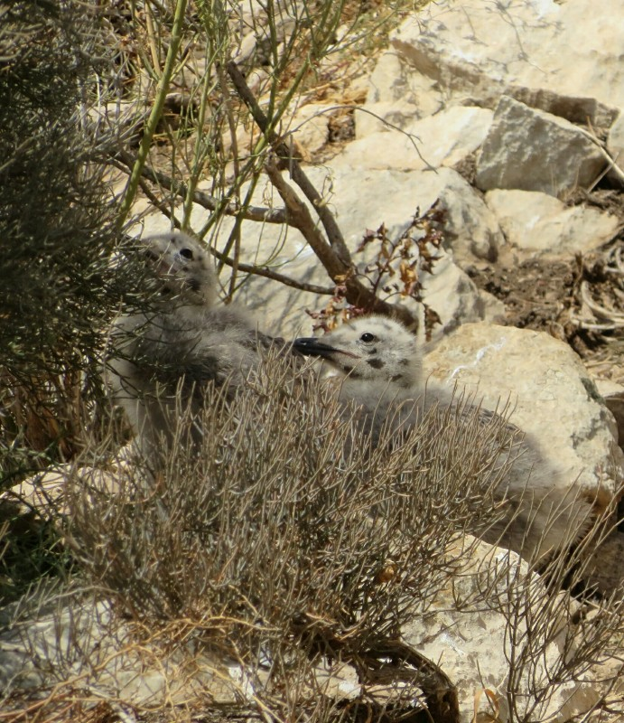

*Apparently Baby Seagulls Are Spotty And Adorable*

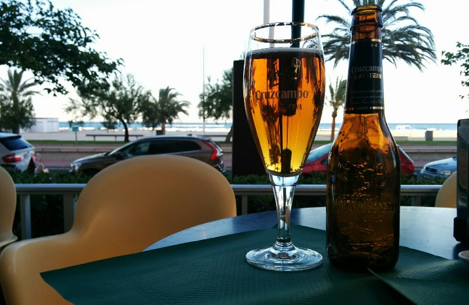

*Catch Ya Later Gandia*
