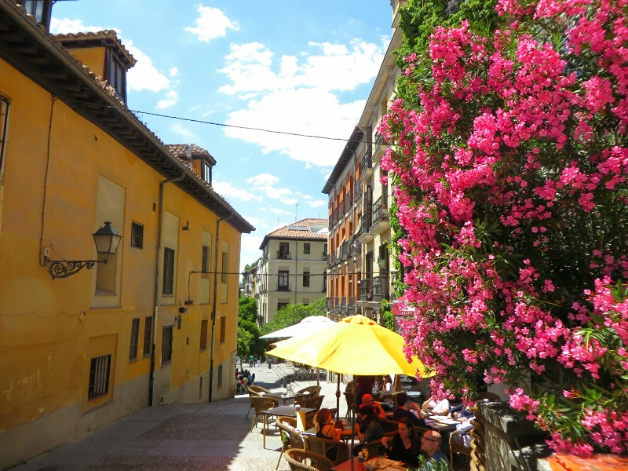
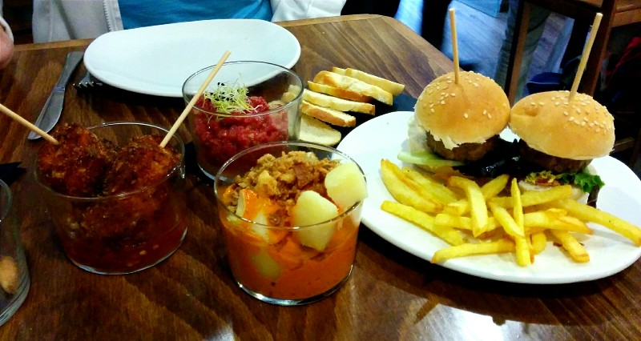
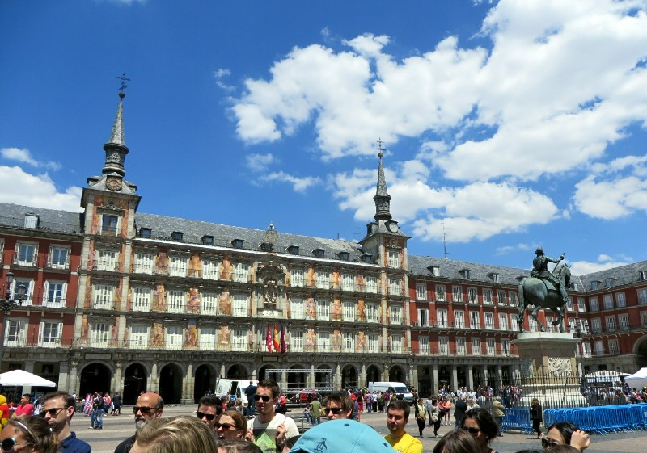
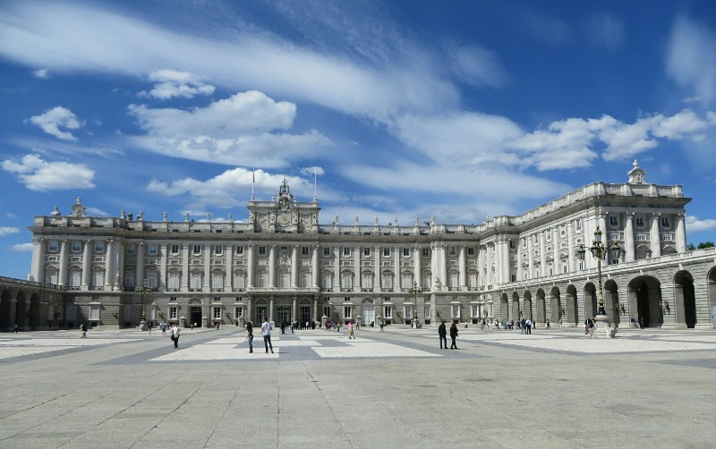
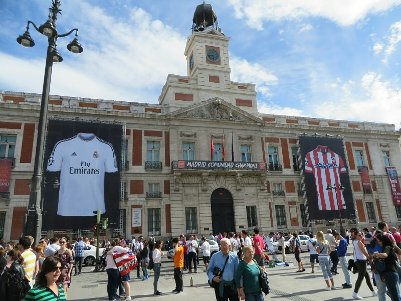
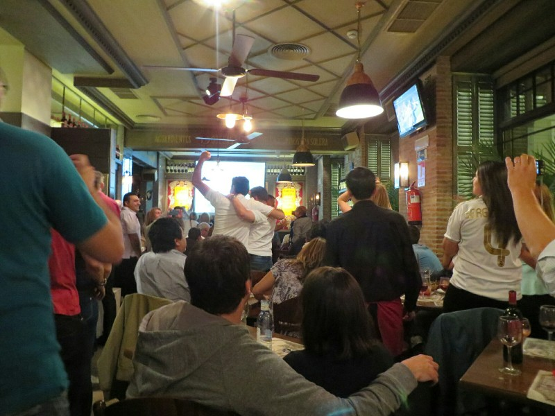

Up early and one final amazing buffet breakfast before we hit the road for Madrid. Just after the first toll both we pass on the highway we run into a federal police checkpoint. Pat starts sweating bullets and looking at the orange in the back seat he still has from France. How did they find me!? I can't go to prison! Officers with rifles slung over their shoulder hold the leads of German Shepherd sniffer dogs giving cars a thorough once over before letting them pass. Finally we get to the front and the two cars in front of us are waved through and then an officer steps in front of our car and sternly motions for us to pull over as he stands in front of our car. And then, before we stop or even roll down the window, he smiles and waves us on our way. Woah. That was close!

Surprisingly we only get lost once on the four hour drive which we both agree has to be some sort of national record. On arrival to the Madrid airport we drop off the rental car without incident and catch the express bus into town as Pat breathes a heavy sigh of relief at the thought of not having to drive in Spain again.

*Spanish Street In Spring*

We make our way to our hotel admiring all of the beautiful buildings in downtown Madrid. We both agree as far as cities go, this one is pretty speccy. A bit famished from the drive our first stop is for some grub. In true Spanish fashion we grab a hot dog from a small shop near the hotel. Neither bad nor great, but it filled the void.

We walk around town for a while soaking in the city center (there are huge hams hanging in shop windows everywhere!) before going to an internet cafe so Pat can get the ball rolling on the next portion of his Canadian visa application. With that behind us, we head back to the hotel room and look up somewhere to eat. We decide on a tapas restaurant just down the road which is supposed to be quite tasty. The place was empty when we arrived but we were told that we could either sit at the bar or one small table because all the others were booked out. Sure enough within 20 minutes the place was packed - probably a good sign! We had a very nice meal accompanied by some sangria and a bottle of local beer. With another day of hiking planned for tomorrow we decide to have an early night and head back to the hotel for some much needed rest.

*Mmmmmmm, Little Food*

Ahhh big city life! Nothing quite like the soothing sound of drunk people talking unnecessarily loud, drunk people playing trumpets for some reason, cars having horn battles on one way streets, and did I mention drunk people singing and chanting? No? Well that too. All of this through two glass sliding doors and a metal roller shutter until past 3am. Needless to say we didn't sleep well and we abandoned our plans for an early morning hike and slept in instead.

When we woke up we thought it would be fun to catch a free walking tour since we haven't been on any so far this trip and we've had great experiences with them in the past. However before embarking on a three hour jaunt through the historical centre of town, some lunch was in order. Being Madrid, tapas places are a dime a dozen so it didn't take long for us to find one that looked suitable. We ordered up a selection of cured ham, some cheese, and a plate of nachos. The ham and cheese was nice, the nachos not so much. Can't win em all!

*Old Bakery House In Plaza Mayor*

After hurriedly finishing our lunch we walked quickly to the nearby plaza just in time to catch the groups just as they were being organised with their guides. We ended up in a group with a guy who we thought was a native Spaniard and were hopeful that he would have some serious knowledge to share. As it turned out he was Argentinian, but he still put on a good tour. The information was a bit disjointed at times and the stories didn't really flow together, but it was interesting nonetheless.

We learned about-

-  The origin of tapas (King Alfonso X was sick, his doctor suggested eating lots of small meals with his drinks, king was healed, king decreed all pubs must serve small meals with all drinks from here on out)  
-  The origin of the name (a beach front bar served King Alfonso XIII his drink with his plate of food sitting on top to stop sand from getting in the drink, he was so impressed he ordered the next drink with the lid, tapa in Spanish)  
-  King Alfonso XIII's wedding (which he narrowly avoided having spoiled by a bomb being thrown at him from a balcony)  
-  The reason all the shops have huge ham legs hanging in them (it dates to the Spanish Inquisition when suspicion you were a Muslim or a Jew could quickly lead to gruesome death, so everyone hung dead pigs in their houses to prove they didn't belong to either of those pork free religions)  
-  And quite a bit about the lazy tendencies of the Spanish (things were always to be done "mañana", or tomorrow)  
-  However, the take home lesson for the day was: don't marry your cousin like the short lived royal family of Spain, The Hapsburgs did. Only big chins, bad decisions and impotence can come from it.

*Royal Palace Our Guide Claimed Was Bigger Than Versailles...??*

The other thing we learned was that the Champion's League Final was tonight and for the first time ever (or at least in ages) two teams from Madrid faced off against each other (Real Madrid and Athletico Madrid) so the crazy noise the previous night and all day today was all the soccer fans (i.e. everyone in the city) going mad with anticipation. Makes sense in retrospect.

*The Real Winners: The Country of Azerbaijan and Emirates Airlines*

It sounds like we won't be getting any sleep tonight, so we decided if you can't beat em, join em and after a change of clothes went to find a suitable base to eat tapas and watch the game. Even two hours before the game finding a place with a table free was a challenge. After a few laps of the neighborhood we settled on a bar/restaurant near our hotel that had a nice big projector and more importantly a table where we could sit and have dinner. Garlic soup is another Spanish favorite so we ordered up a couple bowls, some croquettes, a pitcher of sangria, and sat back to watch the action. It was clear that the restaurant (and probably the city as a whole), was mostly Real Madrid fans, but it was Athletico that drew first blood scoring towards the end of the first half. They held the lead until the third minute of stoppage time when Real Madrid scored a goal to tie the game which made everyone go bonkers. During the extra time, Real Madrid just embarrassed Athletico, scoring another 3 goals in 30 minutes to make the final score 4-1. Exciting times to be in Madrid!

*Guy Love In Celebration Of Real's Last Minute Equaliser*

After the match finished (and a couple bottles of wine into the night) we went out in search of a club that was meant to be very popular. With the help of Google maps we found it, paid our absurd cover charge and went to claim our "free" drinks. The club was huge and admittedly very well put together with massive video screens and lights all over the place. We hung out until some time after 2am when we decided to call it a night and made our way home.

After getting in so late (or early depending how you look at it) we didn't really do anything with the following day. We finished off Parks and Recreation and felt sorry for ourselves. We only ventured out at dinner for a disgusting (or delicious depending on who you ask) mixed dinner of burgers, tacos, burritos and yiros until we had made up for missing breakfast and lunch and couldn't see any other appealing greasy food on our street. What a use of time in the third biggest city in Europe! Oh well, we're pretty sure the rest of the Madrid population was with us judging by how quiet the streets were. Just experiencing the culture!
