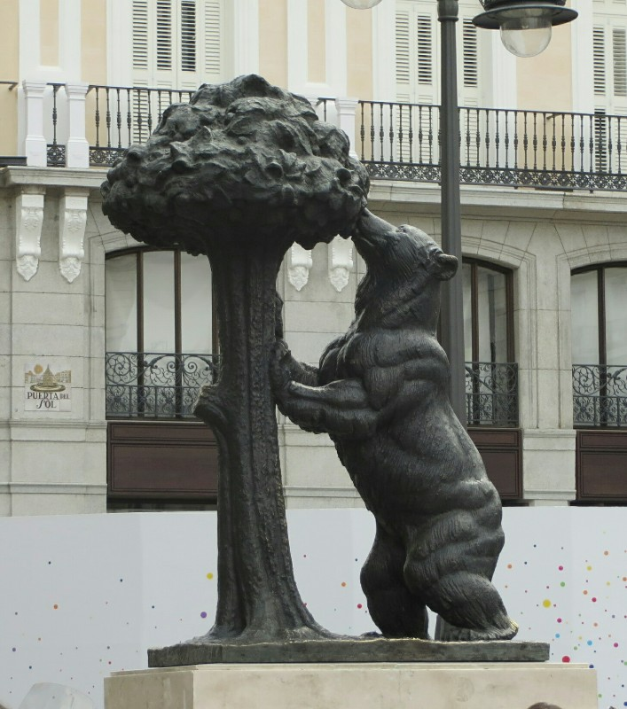
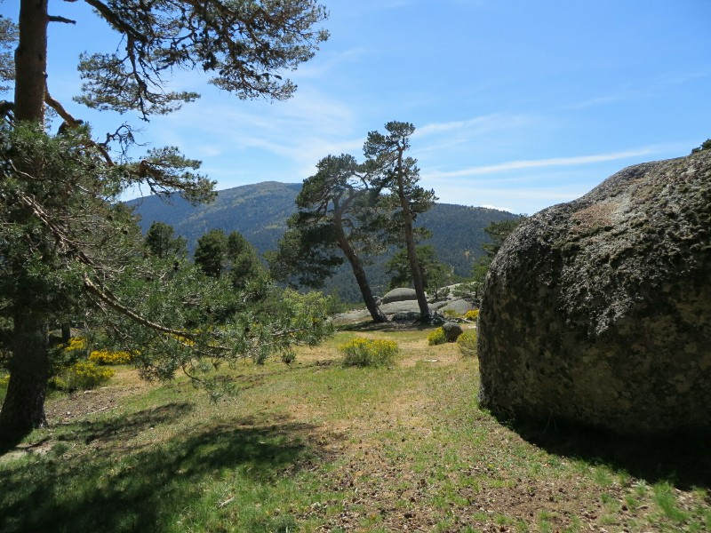
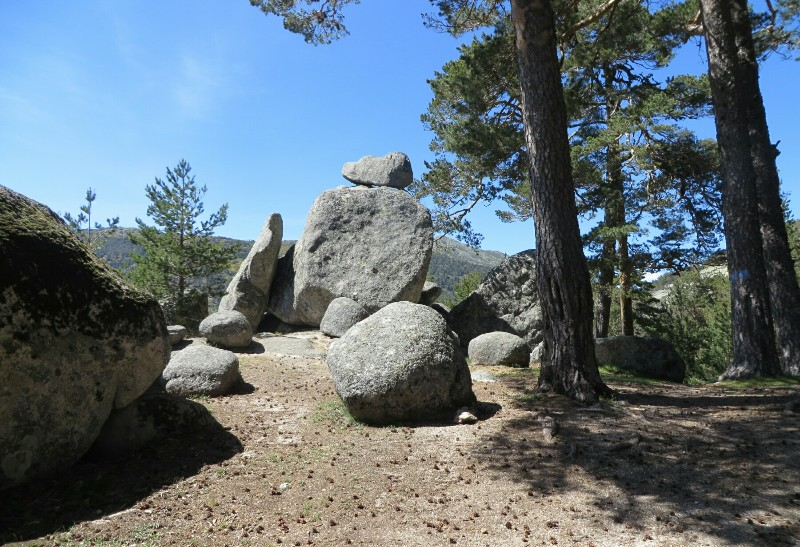
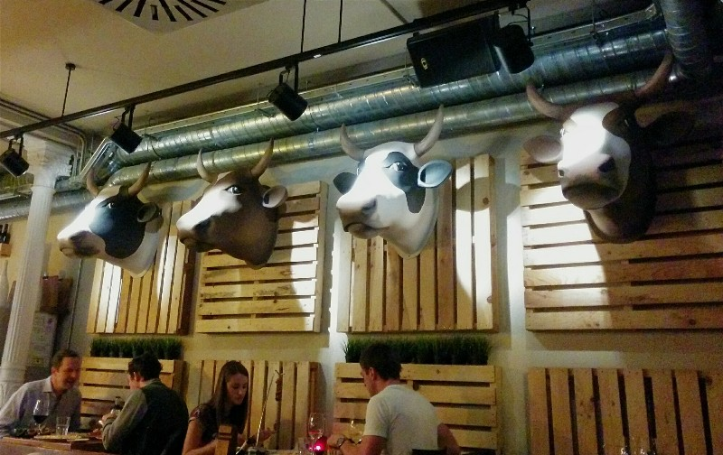
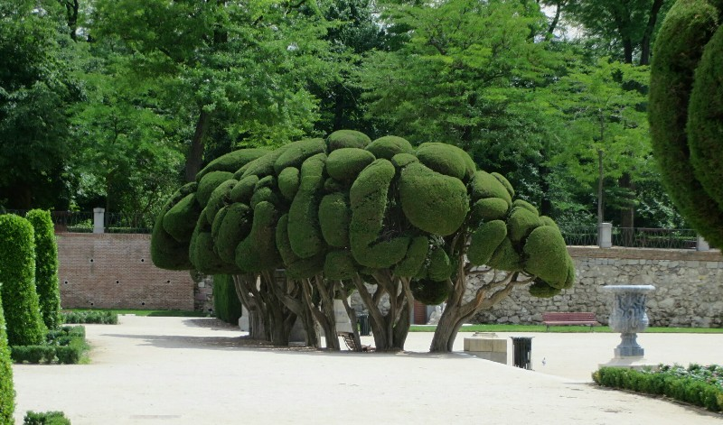
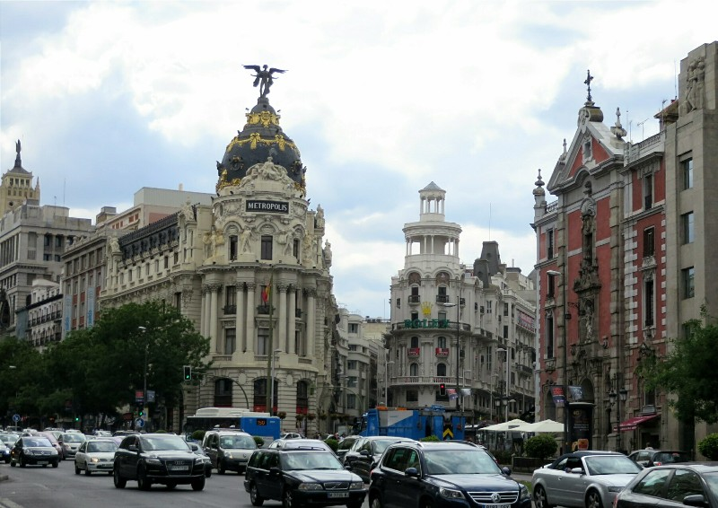

Feeling like we had wasted yesterday, which we had, we wanted to get out and do something with the day so we decided to head out to the nearby national park and go for a hike. The train to Cerceilla takes a bit over an hour from Madrid so by the time we had breakfast, packed our bags, walked to the train station and figured out where to go it was already late morning.

*Madrid's Coat of Arms- A Hungry Bear*

When we got to the town we found it was mostly closed. Everything is apparently always closed in the Mediterranean. It's too early for work, I need my sleep! Well now it's lunch- a man has to eat! I ate a lot at lunch, I need a siesta! How can I work now?? I need to spend time with my family in the evening! Far cry from Japan.

After a wander through the streets we found the info center which had just closed. Open 10am til 1pm- beats most businesses! We thought about giving up and just going back to Madrid, but rallied and instead went to a little cafe for sandwiches (so unhealthy and delicious, the ham here is amazing and they fry the sandwich bread in butter- mmm) and used their WiFi to look for information. We found there was another center inside the national park, so we headed that way.

The infocenter was quite a way out of town. After about 4km of walking from the center of Cerceilla we reached it. And found it closed at 3pm, mere minutes ago. Ugh. Luckily there were handy signs out the front marking all the trails, giving estimated times and changes in elevation. High five for your trail marking Spain! Destroying France!

*View From The Hill*

We headed off for quite a nice hike called Los Miradores through Valle de la Fuenfría. It didn't feel too difficult in terms of ascent compared to some others we've done lately, but apparently it was over 400 meters. Does this mean we're getting fitter? I sure hope so! This part of Spain was much greener and prettier than the costal region, and thanks to the sun staying up til 9-10pm when we finished up just after 6pm it was still bright out.

*Lots of Cool Rock Formations*

We caught the long train ride home, then went to get Pat a nice birthday dinner. We arrived at the restaurant about 8.30 and it was almost empty. Seems reasonable at this time on a weeknight. How wrong we were! By the time we left at 10.30 the place was full! I guess a late dinner is what comes from a long siesta after lunch!

Being a steak house we of course ordered a steak and couldn't pass up the lamb cutlets for the other main. First things first though - apparently this restaurant is also known for their awesome artichokes so we ordered a serving as an entree to accompany our tapas that came with the drinks. Delicious food all around. Eating the artichoke hearts felt like a bit of a cheat. Growing up, the artichoke heart was always the well earned reward for dutifully eating all of the leaves throughout the meal. Here, they just served up four beautiful hearts ready to be eaten. I got over my guilt quickly and devoured them. The steak was very well prepared, but the lamb left something to be desired. I guess we forget how spoiled we are in Australia for top quality lamb.

All in all, it was quite a nice birthday. After dinner we waddled home (didn't even have room for dessert) and turned in for the evening.

*Constant Reminder Our Steak Used To Be A Cute Cow :-(*

On our last day Madrid we had a few things to do. We wanted to look at cameras because ours has a scratch on the lens messing up the zoom or photos into the sun, got some stuff to mail, Kate still doesn't own shorts... Just bits and pieces to do around town. We wandered around the city center enjoying the amazing architecture and the enormous selection of shops! Strangely, the post office is open 7 days a week, 10 hours a day. Apparently this is the only business in Spain that does open and it does it's best to make up for the rest of them! After a few hits (and a miss on shorts for Kate) we need a food break.

We grabbed a sandwich for lunch and went to Parque Del Retiro to have a sit on the grass and enjoy the sunshine. The park is gorgeous and huge- a hedge section, a rose garden, a lake with paddle boats, a garden of statutes, a hotel, a waterfall, tennis courts. Definitely one of the best parks we've ever visited. After getting sufficiently lost we found our way out and headed towards the museums.

*Hedge? Tree? Don't Know, But I Like It*

Unhappily the one we wanted to visit was closed so instead we sat in one of the nice squares and had a lemon tea. We decided we really needed to eat more chorizo before leaving so we stopped by The Museum of Ham (it's like McDonald's here) and got a 'spicy chorizo'. Their idea of spicy and ours are widely different, but it was still delicious.

We still had a nice bottle of wine from France so we wandered back to the hotel and enjoyed our top quality cured meat and delicious French wine. Then, feeling way too European for a couple of bogans, we grabbed some Mexican takeaway and gorged on melted cheese and oily meat. So awful but so good... Pat's getting excited about being closer to Mexico soon!

*Madrid- Secretly Superman's Home Town*
