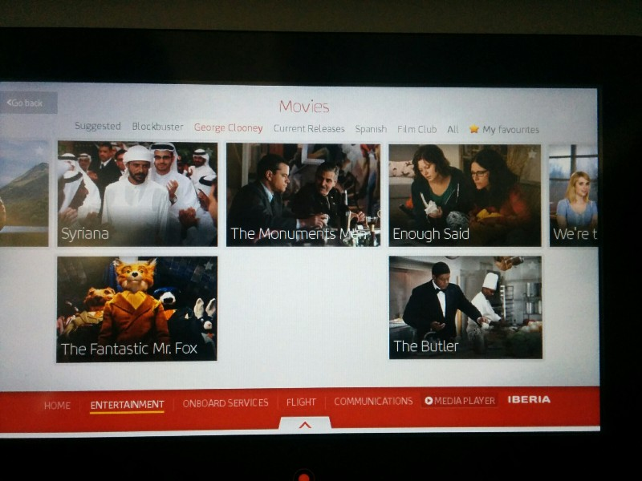
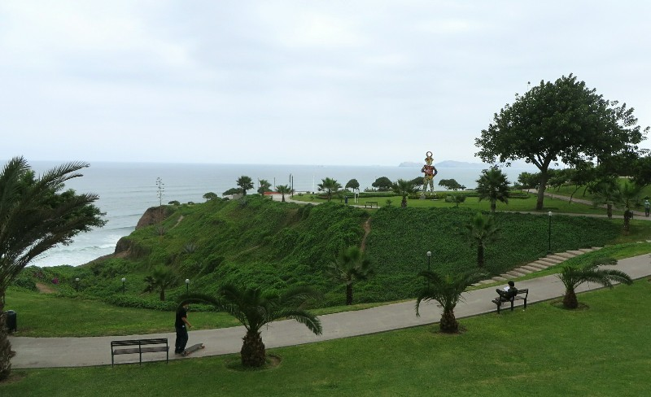
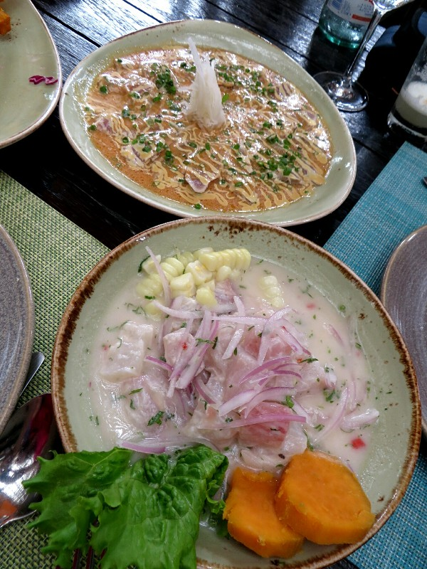
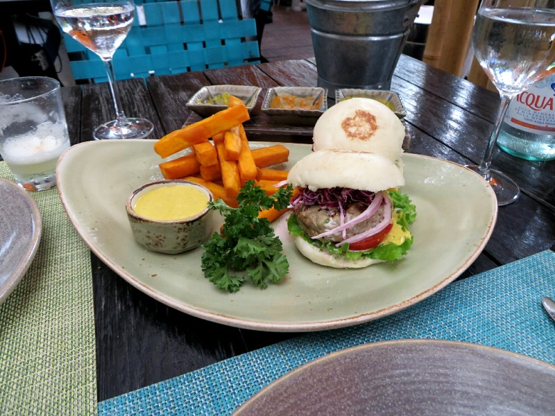

Transit day! We got the bus to the airport, tried to use self check in as advised by the expressionless creepy blinking hologram lady, failed and checked in at the desk. No nice exit row seats today but we sat together so better than the flight from Turkey!

We flew Iberian, meant to be a good airline so we had high hopes. Our first meal was pretty reasonable, a standard airline pasta thing with a little cake. Unfortunately, that's where the good news ended. The pilots turned on the seatbelt light about an hour into the flight, then it didn't go off for 3+ hours. We were getting a little thirsty, a little hungry and in need of the bathroom so we tried the call light. No response. Eventually Pat just stood up and went to use the bathroom. He asked the attendants if there was anything to eat. He got glared at, there'll be a snack in the next hour, sit down the seatbelt light is on. As he left he saw one of them pick up the phone to call the Capitan and within 30 seconds the seatbelt light was off.

About an hour later, so 6 hours into the flight we got a little half a ham sandwich. Not the most satisfying meal, but it's something. Then there was a little bump and the seatbelt light came back on. This time we didn't want to go back and get yelled at so we sat there parched for a few hours while they forgot to turn it off again and ignored call lights. Obviously other passengers just ignored the rules and used the bathroom or the flight would have been even more uncomfortable!

After 10 hours flying we were getting really hungry- half a sandwich and a little pasta isn't a lot of food. But lunch was coming soon! They finally turned off the seatbelt sign when they started up the aisle with the service. Pat and I were the last ones on the plane fed the amazing meal *drumroll* another ham sandwich! Not a big one, single layer of ham, single layer of cheese, the end. And a fun size Kit Kat. Seriously, the most underfed we've ever been on any flight ever. And a Qantas partner! Not Tiger or someone where you'd expect it! I guess now we know to just go the budget airline and save the money. Buy some food for the flight with it.

*Just Your Standard Movie Categories*

Anyway, desperate hunger and thirst, and terrible service aside, it wasn't that bad a flight. The entertainment system was pretty good and we were meant to stay awake so no dramas being unable to get comfortable while upright in a tiny seat.

We landed in Lima, went through immigration easily then waited over an hour for our bags. We distracted our rumbling tummies by watching the cute drug dog running around sniffing everything and getting treats. When the bags finally arrived a strap had been ripped off Pat's. Excellent work again Iberian! We picked the bags up and started off when the adorable dog came to be friends. What a cutie, sniffing us, sniffing the bags, really likes Pat's bag, biting on the handle and looking at his trainer... Schapelle Corby flashing through our minds we anxiously answer his questions. "No we don't have any fruit! I swear we dumped that dodgy French orange! We don't know what he's smelling!" We start to open the bag, then realise the guy's totally lost interest in us and is dismissing us while walking off. Apparently we look like a trustworthy pair and he'll take our word for it.

Out front of the airport we meet darkness and the driver organised by the hotel. Kate feels enormously paranoid the whole drive like someone's going to rip the door open at every traffic light and pull her out to sell to a crime syndicate like on Taken. I put all this down to my DA Karla's scary stories about South American kidnappings!

Thankfully we make it to the hotel safe and sound and crash for a good 12 hours' sleep.

We're up at a reasonable hour after a half decent night's sleep despite lots of tossing and turning from the massive time difference. At one point Kate wakes up and insists to Pat that we have to leave the room because we forgot to check into the hotel and boy won't they be pissed when they find us here! Confused, Pat reassures her that she's delusional and says to go back to sleep.

*Scenic Cliffs Near Miraflores In Lima*

Brekky at the hotel was nice - a dozen different jams and preserves, some scrambled eggs, toast, potatoes, juices, and coffee. Smiles all around. We spend a couple hours being very productive at the hotel's computer finalizing Pat's Canadian visa and ticking several other things off our (thankfully) ever shrinking to do list.

Boring stuff done and dusted for now, we venture out into town towards a restaurant for some eats. We've been told (by the internet mostly) that ceviche is he thing to eat here and they prepare it a million different ways. It's a trek to the restaurant and as we start to get closer to the apparent address we enter quite a dodgy looking neighborhood which seems to consist 100% of car parts and car repair shops. Feeling unsure we continue, trying to look as not-white-tourist as possible and to our delight/relief find a very nice looking restaurant randomly nestled amongst the car crime syndicate.

We had an amazing lunch care of Oleg and Nes. Started with some tuna mini burgers, then two different ceviche fish dishes- one raw with a lemon slightly spicy sauce, one seared with passionfruit and honey. This is the best fish we've had since Japan by far. We also grabbed a local cocktail, a pisco sour to wash it down. Peruvian food is seriously exceeding our expectations!

*Ceviche, How Could We Resist?*

On the down side we're taking diamox to help with the altitude sickness we'll be facing in Cusco, and as this is a diuretic we have to run to the bathroom every thirty seconds. It seems to make the pisco sours kick in pretty hard. The walk home is a bit nerve wracking because we don't really feel on the ball and feel a little like easy targets. We decide to go the long way home along the cliffs above the ocean. Good idea. This area is packed with 'tourist police' every block and has a lot of beautiful scenic parks. We spend the afternoon meandering along back to the hotel, enjoying the ambience that comes with the 'shhh!' signs all along the road insisting drivers don't honk and disturb the rich Peruvians and tourists who inhabit this area.

It's more than a bit elitist, having all these special rules and extra police because the wealthy live here. We wonder whether the police's wages are paid by tax money taken from the poor people who can't benefit or if the neighborhood has to pay themselves. Hopefully the latter... In any case, the jet lag is making an appearance and we head to bed without dinner after the massive late lunch for an early night.

*They're Mini And They're Tuna Burgers - Win Win!*
