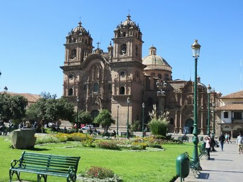
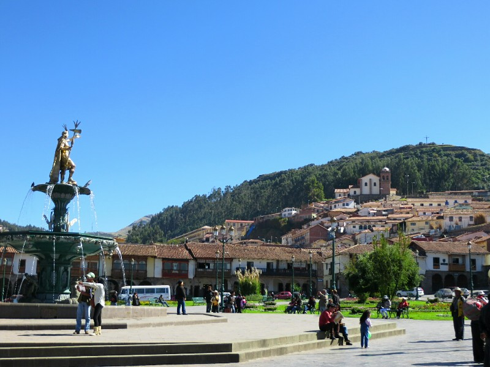

Up early and slam down a quick breakfast to catch our taxi to the airport. Google and the girl at the front desk both reckon it takes about 45 minutes to get to the airport from the hotel in heavy traffic so we plan accordingly to arrive at the airport two hours before departure (apparently necessary even for domestic flights here because of a lack of infrastructure).

The drives starts out innocuous enough with a few pockets of traffic but generally moves along until we exit the parkway onto the surface streets. We sit stopped at a traffic light for about 10 minutes barely moving and the natives start getting restless. Horns honk, cars creep forward toward the bumper of the car in front of them as if that will help. After another 10 minutes we get a glimpse of what is happening. Our road dead ends into a T intersection and the cross traffic is refusing to stop at the red light, they just cruise on through in both directions like it's their right. After another 10 or so minutes someone gets pissed enough and hops out of their car, stands in the middle of the road and starts directing traffic, physically blocking the cross traffic from entering the intersection. Well played random man. Well played indeed. Although at this point traffic is so heavy it's looking like we may very well miss our flight this morning.

*Cusco! Spoiler Alert- We Made It Eventually*

Unfortunately our luck is no better on the next street. As soon as we reach any intersection with any minor street we stop and they go indefinitely. A traffic cop shows up and stops the traffic joining our street long enough for us to pass. We then stop at the next intersection until the same policeman finishes at the last intersection, walks up to the next and stops traffic here for us. This goes on for another half hour or so. When we finally get moving we see the oncoming traffic have decided they're moving too slowly and have commandeered one of our two lanes. I doubt this is helping our cause to catch our flight. Over an hour after leaving and we're not even half way. We miss Adelaide.

We eventually pull up to the airport 45 minutes before our flight leaves. We pay the poor taxi driver who now has to endure the same traffic back to town for his next fare. Inside we are (partially) relieved to see no line at the bag drop queue for our flight - either a very good sign or very bad. The woman at the counter takes our  bags and says we have to go to the gate now. Now now (for you South African readers). Off we sprint, up stairs, down a long corridor, through security in about 10 minutes and finally arrive at our gate to find our plane is still there and they are just getting ready to start boarding. Bullet dodged!

When we land in Cusco we are greeted by the organizers of our Inca Trail trek, Roma and Freddy. They're quite interested in the fact that we're going to the World Cup and lament the fact that it's been nearly 30 years since Peru qualified. They drop us at our hotel, we successfully check in speaking nothing but Spanish, drop our bags and make our way into town. Kate's feeling a bit lethargic from the altitude and Pat isn't too hot either, so our plans are very specific and brief: get some bottled water, some bananas (the diamox apparently makes the blood more acidic to help acclimatize faster but it has the unfortunate side effect of making us pee every two seconds and apparently depleting our potassium), and have lunch.

*Plaza De Armas*

The town itself is absolutely stunning, an interesting mix of Spanish Colonial buildings (often built on Incan ruin foundations) and some more modern buildings all surrounded by very imposing hills and mountaintops. Kate is feeling quite wretched, short of breath, tingly skin, headache, irritable, generally very unusual. She has to stop and sit on the pavement every 500 meters or so to avoid fainting. Apparently altitude doesn't suit her- surprising given she lives her life a meter or so above most people! We eventually find our restaurant after declining approximately 52,000 massage offers and taxi rides and have a couple decent plates of pasta. Nothing like the plates of aldente heaven we ate in Italy, but certainly tasty.

Not wanting to push ourselves too much we decide we've had enough of an adventure for one day and we walk towards home, passing a number of baby lambs dressed in Incan hats and ponchos and one big grumpy alpaca snoozing on the footpath. Close to home we are harassed by a troupe of some very cranky dogs who were quite upset that we decided to walk on their street. Luckily they were all bark without the energy to actually follow us, so we made it back for another early night. Jet lag and altitude- not a winning combination!
