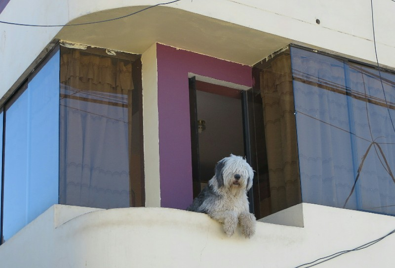
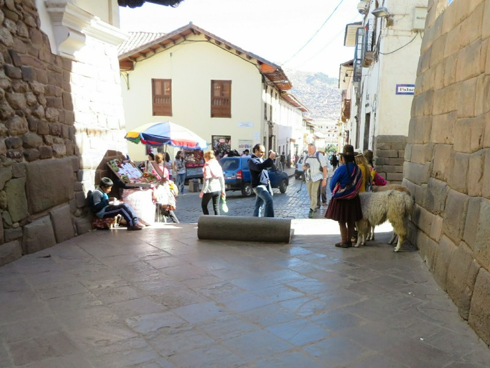
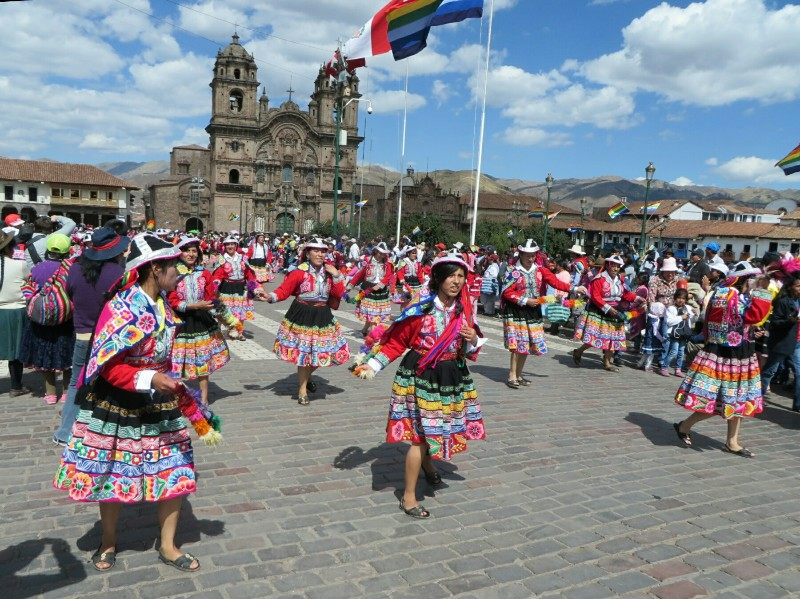
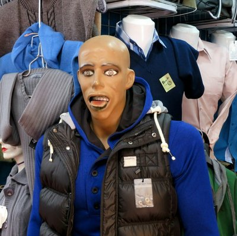
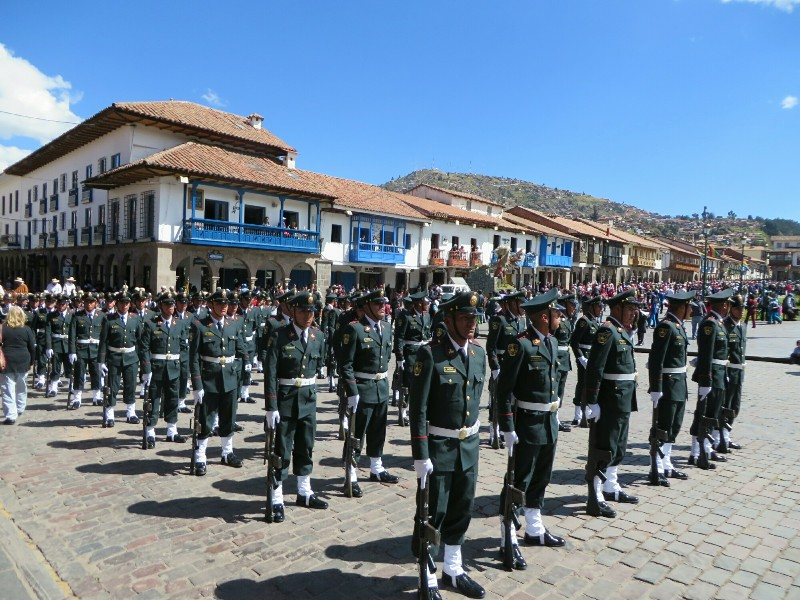
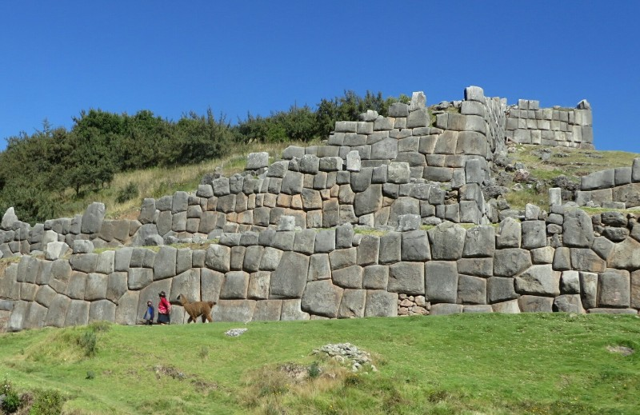
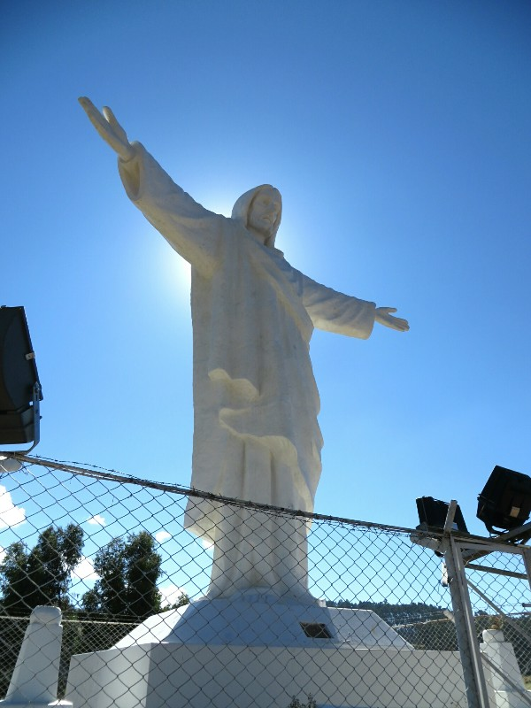
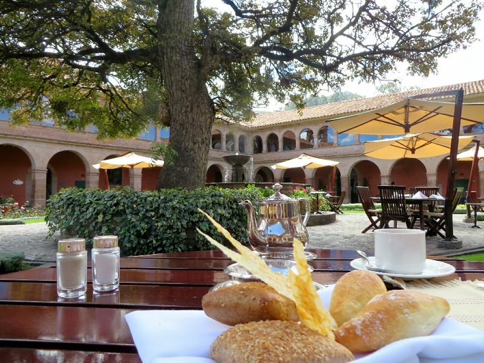
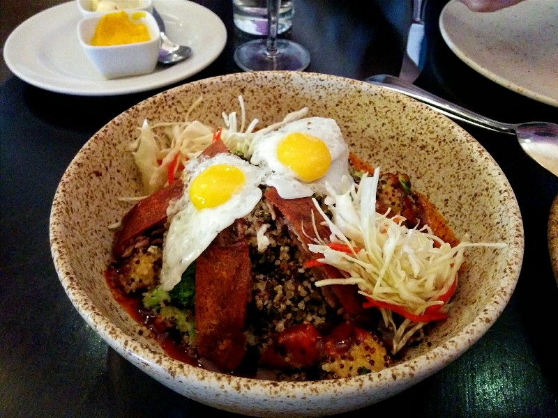

Not a lot planned today, just try to move around a bit and try to get used to this awful altitude (we're at about 3600 meters). The town is full of dogs. Dogs everywhere, just like South East Asia, but looking much better fed! They seem nice and fairly confident of their place in society. They walk on the footpaths rather than skulking on the streets, and they give way to the left when there's two way pedestrian traffic.

*This Guy Said Hello Every Morning*

The streets have a lot of design similarities with Pompeii- cobble stone, depressed areas in the middle to collect water run off, stone blocks to stop traffic driving onto pedestrian streets, raised footpaths... Although they're a heck of a lot steeper here! We wonder if these design similarities are due to Incan architecture or the Spanish. We could probably find out fairly easily, but energy is waning again and it's time for food.

*Block to Keep Traffic Off Pedestrian Streets, Plus Lama*

We head through the main square to look for a restaurant and find everyone in town is there! Lots of locals in different traditional costumes dancing to folk music along all the streets in a parade. Men and women are involved and the ages range from newborn babies to old hunchbacked women. It looks like heaps of fun! We wonder what they've celebrating. But again the need for food prevails and we move on.

*Twirling, Twirling, Twirling Towards Freedom*

We end up in a burger restaurant with a $12 lunch special- a burger, chips, a drink and a desert. Sounds good! Turns out the only drink is Sprite (not even water available) but the burgers are pretty good and the carrot cake and banana bread desert were delicious (carrot cake nowhere near as good as Terry's). Kate tried the alpaca burger- tastes like every other burger she's ever had. Apparently alpaca is a relatively humane meat to eat; they raise the alpacas for their wool and treat them well. They only use them for meat when they're getting old and a bit past it. So they get a good life before being my burger patty...

After lunch we have a wander through the shops looking for the bits and pieces we still need for the Inca Trail. No successes. We do find when people harass you on the street here trying to sell you things that if you say no, they just stop! Amazing!

*I Don't Feel Like Shopping Anymore...*

We decide they need a classification between 'developing/third world' and 'developed/first world'- it's not perfect here (definitely not a Western country) but at the same time it's miles from South East Asia. The people look healthier, their clothes are in better condition, the streets and shops are cleaner, everything seems to be running a little more efficiently. I'll give you, we're in the middle of a tourist town and things are usually cleaner in these areas, but even in central Siem Reap or Luang Prabang or Chiang Mai things were visibly worse than they are here. Perhaps that's why here they'll let you go if you say no and in Asia they'll chase you down the street.

Again we ended up in bed early without dinner. We really hope our energy levels improve before our 4 days straight of up and down mountains!

Another noisy night- this hotel is echoey and you can hear every noise anyone makes on any floor outside their room. Loud Spanish speakers were yelling until almost 12, then Americans started singing Usher at the top of their lungs at 5am. Our very sleepy selves decide we are staying with the biggest bunch of inconsiderate jerks who ever lived. We are grumpy. Luckily there was that golden 5 hours where we both slept well. We grabbed our breakfast of deep fried hot dog omelette and stale bread (this has been the standard every morning). Today especially it didn't really hit the spot.

We headed out with a plan- walk up to Christo Blanco sitting on a hill looking over Cusco. Given walking the two flights of stairs to our room is causing us to wheeze like pack a day smokers of 40 years we're a bit nervous how we'll cope on a 200 meter accent. We start from the main square- again it's full of people. This morning it's military personnel all dressed in uniform, standing in ranks, some holding tubas, others holding bayonets. Everything's going on in Cusco this weekend! They still seem to be setting up so we meander past and go to start the walk.

*Peruvian Military Helping With The Celebrations*

Ugh. We can tell this is objectively much easier than any of the hikes we've done lately, but it's significantly more difficult and exhausting. We have to take obscenely frequent breaks to remember how to breathe... Altitude sucks! Thank God after 45 minutes of torture we pass the Incan ruins of Sacsayhuaman,  make it to Christo Blanco and admire the view.

*Ancient Ruins, Plus Lama*

The decent is much easier going- we're not short of breath at all! We're about halfway down, passing all the cute dogs we saw laying in the sun on our way up when we see a new dog in the middle of the path, a gorgeous but obviously stray Golden Retriever. As we start to admire it to one another it bears its teeth and starts to growl and bark. Gave Kate a shock, there was no way to continue on the narrow path without a showdown so she did exactly what you're not meant to do, got very submissive and turned to run away. Then she remembered this would probably just encourage the dog to chase her, and instead pretended to pick up a rock. At the same time Pat had a cranky growl back at the dog and it retreated enough for us to squeeze past. He barked at us as we left but didn't follow.

Feeling a bit shaken, we reached the square. Pat promptly suggested we turn around and do the walk again. Ugh. Fine. We walk again, it seems a bit easier from a cardio perspective, but much harder for our muscles. They're getting tired fast too. Doesn't bode well for 4 days hiking!

*Christo Blanco Halo*

When we come back down again (Golden Retriever has resituated thank goodness) we find lots more military personnel in the square. There were people in dress uniform, people in camouflage, the army band were playing a cheerful tune... no idea what they were celebrating but everyone seemed to be enjoying themselves!

Our tummies were rumbling by now so we went to a small central square that houses a monastery which has been converted into a high end hotel- for a supplement they'll pump oxygen into your room to reduce the effects of altitude! They also have an absolutely picturesque courtyard with a restaurant attached, recommended to us by a friend of Pat's, Henry Botha. We each had a coco tea (tea from the same plant cocaine is produced from- very popular for reducing the effects of altitude sickness) and a platter of mixed local cheeses.

*For $50 We Could Have Had An Oxygen Supplement With Our Meal*

After a relaxing break here we go back to the shops to look for our Inca Trail needs. First and foremost we need walking poles and sleeping bags. Kate would also like a pair of shorts and Pat wants a beanie. Back in the main square the military parade is over but there's another parade of locals in traditional gear! These guys seem to party all the time!

Today we do better and tick all the items off the list without too much trouble. It's coming up on food time again so we go to another recommendation by Henry, a Peruvian restaurant where we decide we'll try another local specialty Karla encouraged us to try- guinea pig. Sorry to anyone horrified at the thought of eating cute little fluff balls! We also got a trout and quinoa dish. It was all delicious. They're so talented at cooking quinoa here, we think we'll have to get a cookbook. And the guinea pig was surprisingly good- tasted a lot like duck but also a little like pork. Probably not an every day food as it was very very fatty. Glad we did give it a go though!

*You Know How People Keep Guinea Pigs As Pets? Not In Peru.*

The day was getting late again so we trekked back to the hotel to make it before the sun went down (all the houses in the area top their fences with broken glass or barbed wire like South Africa- don't want to walk around in the dark) and called it a day.
