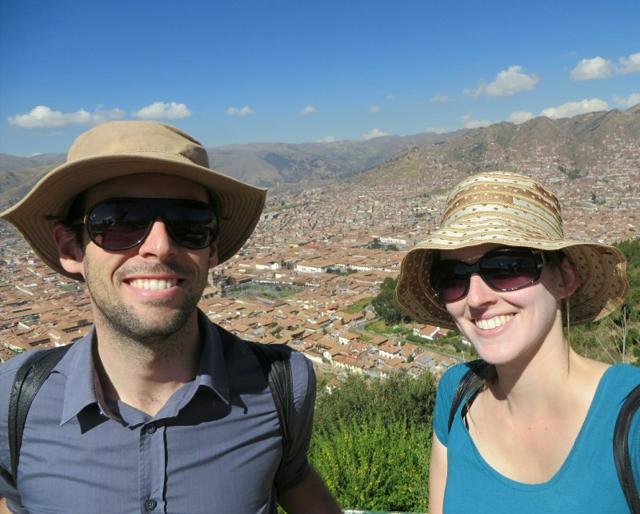
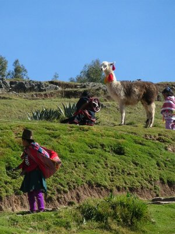
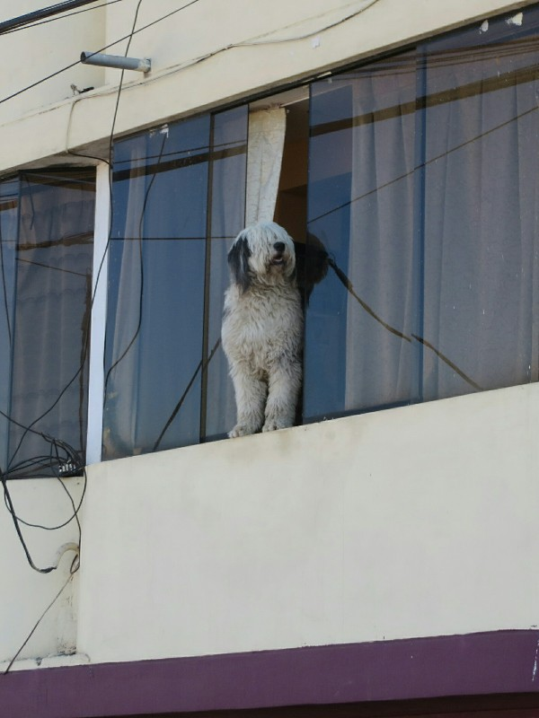

Our last day in Cusco before the Inca Trail did not start well- Kate woke up with a sore throat and a bit congested. Don't need any additional barriers to breathing at this altitude! But, nothing to be done, we ate our hotdog omelettes and headed out.

We started with some last minute shopping (waterproof ponchos for our bags, muesli bars, extra shoelaces) and picked up the rental sleeping bags and poles. We dropped the stash home, then headed out to climb to Christo Blanco again. U G H. Today was especially difficult for Kate who was generally feeling pretty terrible, and it was made worse by the 60 year old retiree's striding past at a brisk pace without a hint of labored breath. But we made it up again, and a little faster today than yesterday.

*Made It!*

After the exercise we went for lunch and ended up at a place owned by a portly Melbournian. He was very nice and assured us the Inca Trail was a piece of cake. Kate wondered whether he'd ever done it or if this opinion was being relayed from super fit marathon running, professional hiker customers he'd spoken to. Either way- we had a rather nice chicken pizza and veggie sandwich so we were happy.

*I Think Alpacas?*

Next- more boring chores! We dropped off pretty much all our clothes at the laundry ($25 to wash them! What a racket!) and went to Andean Adventures office for our pre-trip brief.

We were the first there by 10-15 minutes. Heather and Philip, the other couple coming on the tour arrived soon after. They were around our age, American (from the Bay Area like Pat) and seemed very nice. The guide was late and didn't know anyone's names, which we found very odd. Surely reading the names of the people you're meeting is the minimum preparation before coming into the room? The guide is named Leo. He spent most of the hour talking about the different languages in Peru and about the three names of the river we'd follow on the first day of the trail. Eventually he got onto the details of the trip just to say he'd tell us about each day the night before. And he'd tell us about tomorrow in the morning. He didn't know what time we'd be picked up in the morning, and he said we couldn't bring plastic bottles on the trek, which is the first we've heard of it and it's too late to buy a nalgene bottle now.

So what was the point of this brief? Well he gave us our itinerary. Completely different to the one we booked and have been working off with the travel agent for 6 months. Now we'll be staying at the same campsites as the 3N/4D trail for the first two nights, which means we'll be walking with the bulk of the people doing the trail, and having to deal with noise from everyone else every night when we try to sleep. This is exactly the reason we decided on the 4N/5D trail- so we'd be a half day ahead or behind everyone else and have a more peaceful hike. And of course it's too late to do anything about this sudden change now because we leave in 12 hours.

The whole thing left Kate very stressed- she's definitely a planner, especially when she's got something she's worried about coming up. She'd worked out details down to what socks she'd wear on which day based on the hours walking, altitude we'd climb and likely temperature at the campsite. Yes- she is a bit batty. And a cold on top of the rest of it. Unfortunately, nothing to be done but try to get a good night's sleep and hope the rest worked itself out in the morning!

*Popped Out To Say Goodbye!*
