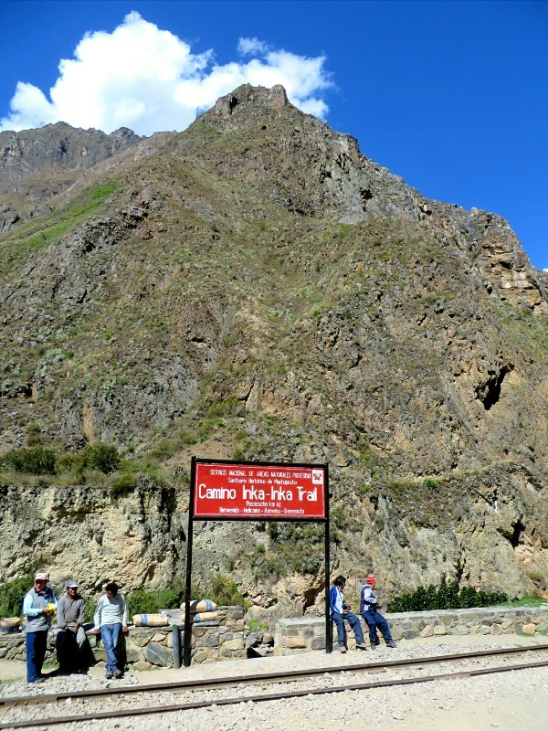
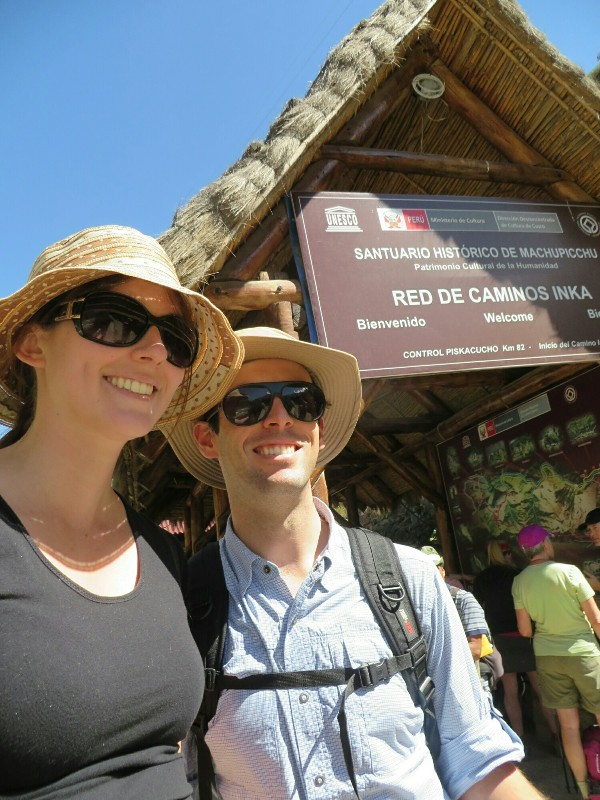
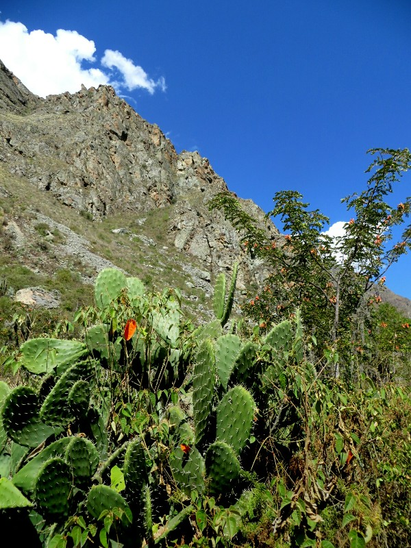
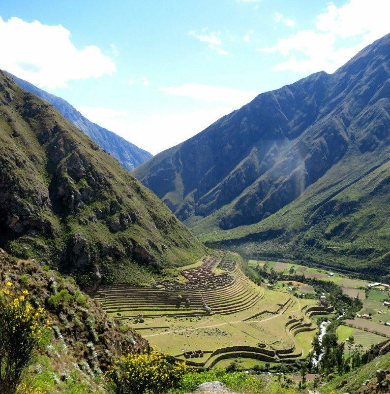
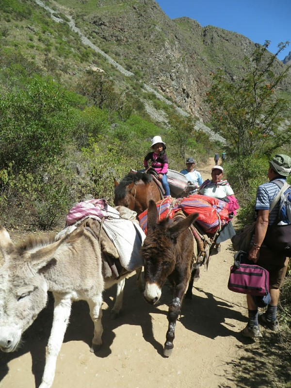
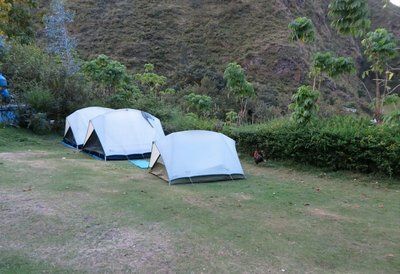
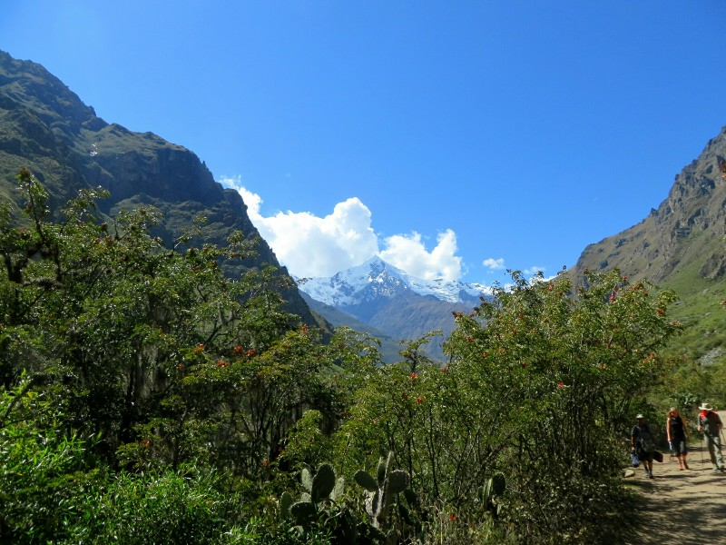

Day one! We're up at 5.45, had our last fried hotdog omelette for a while (relief) and headed to the Andean Adventures office, arriving just after the meeting time of 6.30. The door was open, but no one was home. We pottered around confused until Leo arrived and promptly greeted Kate as Heather. Still not quite there. We waited on the street for Heather and Philip, and while we waited asked about the fireworks that go off every morning about 5-6am above town. Leo said there are about 1000 Incan holidays, so every day they celebrate at least two. Guess that explains all the dancing in the streets too!

When the others arrived we hopped on our transport to the start of the trail-a full sized bus for 5 of us. Seems fairly excessive! We drove out of the tourist area, through suburbia, into the 'slums', which looked poorer with even more stray dogs, but even here the houses were solid with brick or plaster and certainly looked more sound than those we saw in South East Asia. We considered the similarities between these areas in terms of history- traditional people overthrown as European colonies, rich local histories/ancient cities/religions, eventually regained independence. But since then Asia has been involved in war after war, genocide, bombings and bombings by the US while South America has been relatively uninvolved in World politics. Definitely working out much better for these guys, even if there's still a way to go!

After leaving Cusco we spent a few hours driving through farmland passing dogs, cats, ducks, hens, donkeys, horses, cows, sheep, pigs... Kate was in heaven! At about 8.45 we arrived in Ollantaytambo, a very touristy town with some large and well preserved Inca ruins. On the original itinerary we were here til midday to explore the ruins. On the new itinerary we had 40 minutes, then Leo said a 20 minute drive to the start of the trail. As each ticket to the ruins was over $30 we decided it really wasn't worth it for less than an hour. Heather and Phillip made the same decision. Instead, we went to the local market to buy coco leaves. The market had everything, tons of fresh produce and herbs , clothes, and a whole skinned cow head. Ugh. Leo took us straight to the coco leaf corner. These leaves, from the plant cocaine comes from, apparently help with altitude sickness. And as both our mothers encouraged us to 'use those leaves they give you', we figured we had to give cocaine a chance. Don't want to disappoint our parents! Leo also bought a little ball of ash that apparently acts as a catalyst increasing the onset of action.

*The Start!*

Back to the bus, grabbing an empanada and a cookie on the way. Leo announces "as I said- 40 minutes to the start of the trail!" Not quite how we remember it... 90 minutes later we pull into the carpark. Sigh! After that was another half hour waiting for everyone in the team (chef/porters) to get organised. We wonder whether they weren't expecting us til past midday, or if they're just running late themselves. We were also given our snack for the day: a bag full of chocolate and an overripe, leaking, sticky banana. Sweets and inedible fruit- long lasting energy ahead! In any case, by 11 we went through the passport check point guarded by employees armed with revolvers (only 500 people allowed on the trail each day, they are apparently deadly serious about that), across the river with three names and we are off!

*Passport Checkpoint- As Serious As Any Immigration We've Been Through*

The trail started at 2600 metres and was mostly almost flat with a couple of steeper climbs and a lot of donkey poo. Not the best smell. We have to keep stopping and slowing our pace because we're catching up with other groups and we're not allowed to encroach on their space. Exactly why we wanted a half day between us and them! Sigh. Luckily the view is gorgeous and aside from the smell it's a very pleasant hike. After making a big deal last night about no plastic bottles on the trail, Leo pulls out his coke bottle at one of these stops and takes a hearty swig. Good thing we ignored him- we gulp some water from our own plastic bottles.

*Not Much Shade!*

We pass the ruins of a farm and a small village (we think Willkaraqay). They're built to follow the turns of the river and curve of the mountain- the Incas took being in harmony with nature very seriously. Pat asks how old the ruins are and receives a quarter hour dissertation about the strange shape of the windows- mainly Leo asking if pyramid is the correct name for the shape (trapezoidal is what he wanted) and wondering why they were built this shape. We carry on, but are finding in general Leo is stopping a lot to talk about seemingly nothing. He spends a lot of time miming or describing words he doesn't know or has forgotten in English like 'water run off' and 'theory'. We wonder if it's because his English isn't the best or if he's buying time for the porters. If the latter, he's bought them at least an hour, maybe more. We arrive at lunch about 2pm a bit frustrated by the slow pace and lack of meaningful information. Enjoying the walk, but wishing we could do it self guided.

*First Ruin Sighting!*

At the lunch site a tent was set up with a table and chairs inside for all of us. A cute cat joined us sitting under the table begging for scraps. Lunch was amazing. Garlic bread followed by guacamole (with little cheese squares, yum) on potato, a soup, trout with rice and veggies and a poached pear. Also some coco tea. We'll get fat eating like this! We finish it all- haven't had any real food since our hotdog omelette at 6am and we're famished. Unfortunately no water. When we asked last night Leo said there would be a chance to get more water at breakfasts, morning tea, lunch, afternoon teas and dinner. He now looks puzzled that we'd need a drink after hours walking in the sun. They rustle up 500 ml of hot water for each couple- apparently that's all we get for the afternoon. Given we're meant to be drinking 3-4 litres per day hiking at altitude we decide we'll kick up a fuss if we don't get more before we leave tomorrow morning.

*Locals Popping Down the Shops*

We have 5km to go according to info Kate found on the Internet about distances between camps, Leo says two to three hours. We figure this means steep. We decide we will do better at our own pace, so when Leo stops for a bathroom break we ask if he minds us going on. He says no worries, he'll catch up. There's a slight incline now, but nothing too bad and we find this portion really nice just trotting along ourselves. We're breathing OK (this altitude is lower than Cusco) and the vegetation is a little denser so we're shaded. We find we're going about the same pace as Heather and Phillip, so that's a relief. After an hour and half we reach our campsite at Huallyabamba Village- it's very nice with fresh mown grass, flat sites for the tents, a bit of space between us and the next group and a toilet nearby. Also chickens and donkeys hanging out- can't knock that.

*Very Nice Campsite With Bonus Donkey!*

After a bit of time settling in, unpacking sleeping bags, stretching etc we get called for an afternoon tea. Very English with tea, bikkies, jam and butter. And some popcorn to keep Patrick happy. This chef is doing well so far! After our snack we have downtime til dinner at 7pm. We imagined we'd be walking dawn til dusk so we don't have anything much to do. We wish we brought books or cards- next time! We have a look at the stars- the sky is so clear and we can see trillions of stars. We spot the Southern Cross, in a bit of a weird position, but reminds us of home.

Dinner was another multi course deal with bread, soup and a main. At dinner Leo told us about his family and being a guide. He lived 8 years as a child with his grandparents and learnt the native language. As an adult he became a guide touring all around Peru. He went to an English school for a couple of years to increase his employability as there are 4000 guides or so in Cusco and not enough work for all of them. Even with some English he wasn't working enough so he spent 4 years learning French. He used to do some month long, cross country tours but now mostly one or two day mini Inca trails with the French (who don't like to walk for 4 whole days). He might do the whole trail once or twice a year. Which explains the English- sounds like he rarely practices. He has three kids but the pressure from constant long travel caused his marriage to fail. He said it was worth it- guiding is his passion. He also got back onto the windows! Apparently he's been curious about their shape for years but has been unable to find any information in books on why they are the shape they are. His Grandfather told him it was because the Incas were so developed and built so well they were perfect, but no one can be perfect except the Gods. So to demonstrate their subservience and deficiencies they built tapering strange windows. At least the long window shape discussion earlier went somewhere.

*Mountain View From The Campsite*

Later Patrick said he thought the shape of the windows would have something to do with giving the structure extra stability in the case of an earthquake. Trapezoidal windows / walls might provide more support than ones at 90 degrees, maybe? After the trek we looked it up online and Wikipedia agreed- most Incan ruins are built near fault lines so it's a intentional design characteristic of Inca architecture.

After dinner was the best surprise of the day- we all got to refill our water! Then an early night- up at 6 tomorrow for Day 2, climbing from 2900 metres to 4200 metres, then back down to 3600 metres. Leo estimates 2 hours up to the pass, the Internet says 5.5. We're guessing somewhere in between- gonna be a long one!
