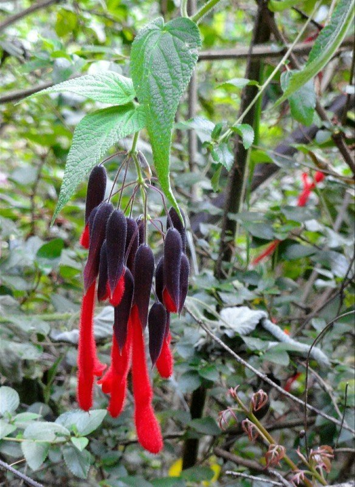
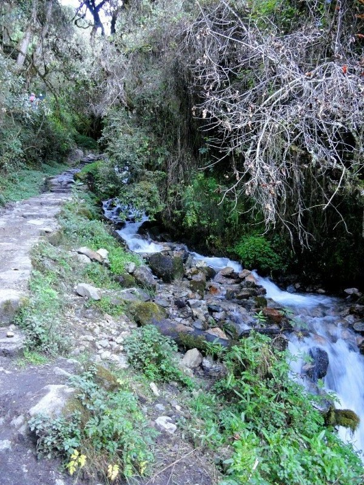
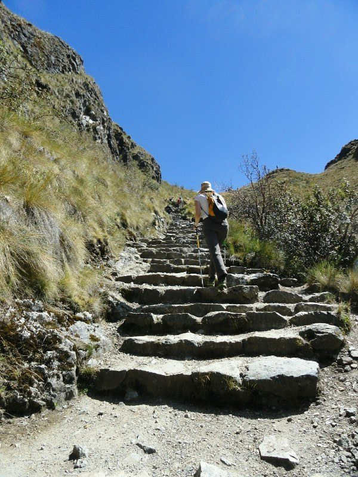
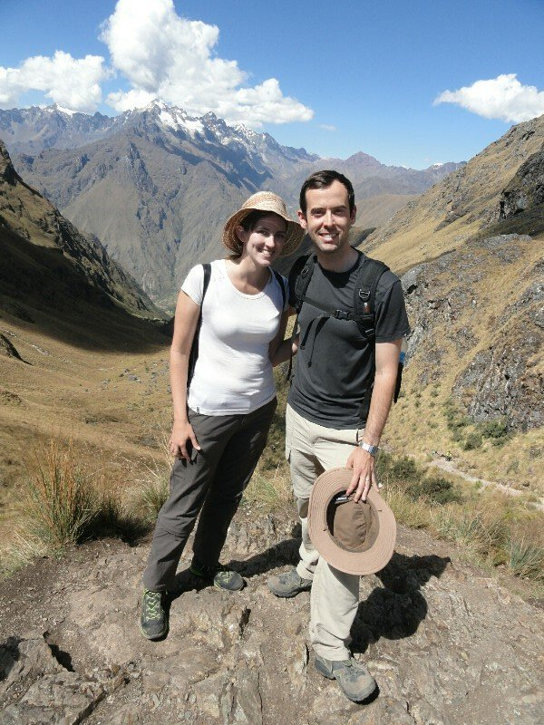
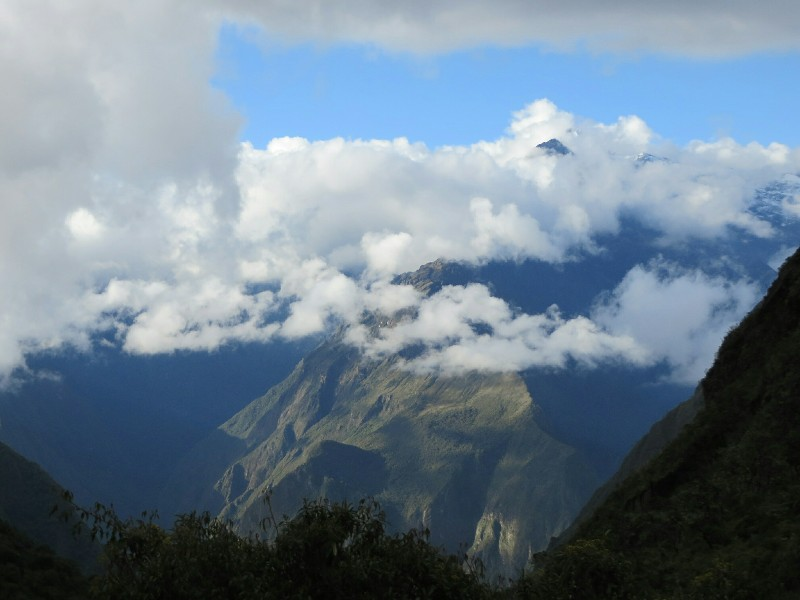
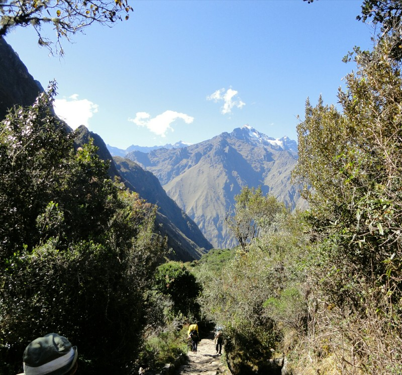
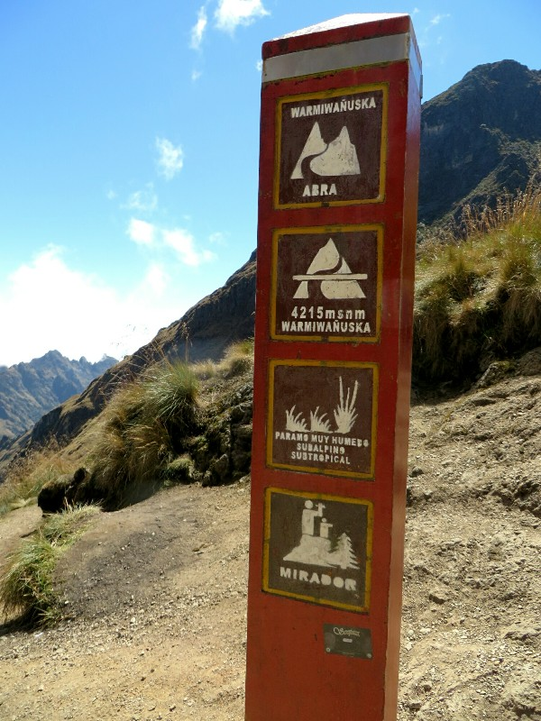
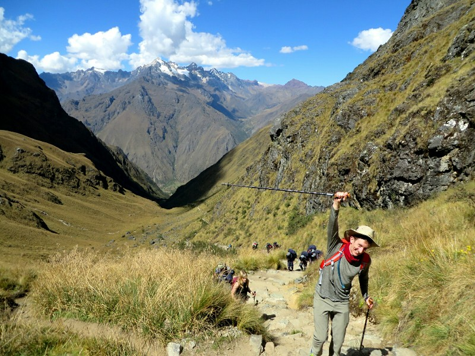
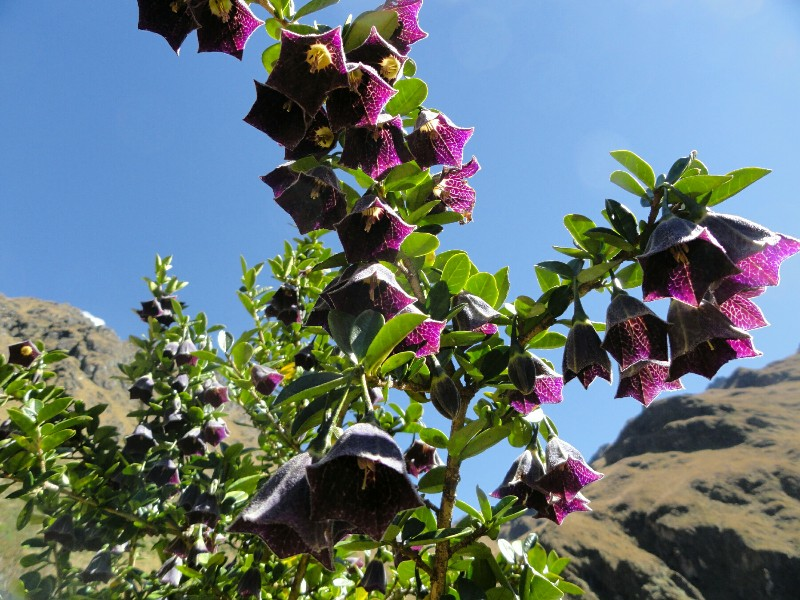
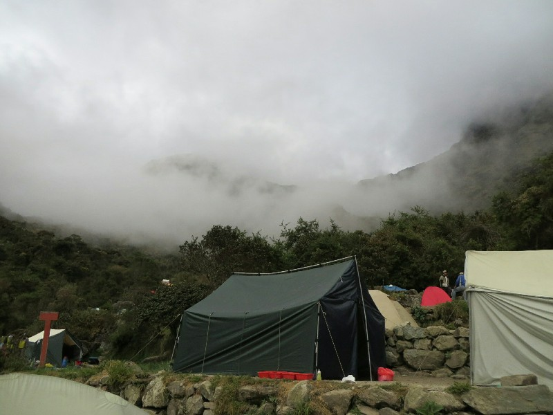

Day two! And with the new itinerary this is meant to be the most difficult day on the trail, climbing 1200 metres to the highest point on the trail, Warmiwañusca Pass (known as Dead Woman's Pass in English). We both slept fitfully; short naps interspersed by half hour blocks wide awake. Kate was cold in thermals, thermal socks, a jacket, sleeping sheets, a down sleeping bag and a beanie. Pat comfortably slept in underwear with the sleeping bag unzipped. Weirdo... One of the roosters decided 4am was basically sunrise and started crowing intermittently from then on, but with 9 hours laying down we didn't feel too hideous getting up at 5.45, especially given the porters brought tea to the tents as we got up to warm us up. Although I don't know you could say it was a great start when our first sight on opening the tent was that of the noisy roster doing his best to mount a less than interested chicken...

In any case. Breakfast was a very sweet cereal with yoghurt or sweet bread and jam. We're not keen on sugary breakfast but knew it was a big day, so we made an effort to eat it. Then came an unexpected second course- a delicious oat and apple porridge. This is more our style, so even though we'd eaten already, we finished the porridge too. Then came the egg course! Compete with hotdog, onion and cheese. Huge meal! Poor Heather was feeling quite nauseous from the altitude so she didn't manage much at all. Snack were chocolates and lollies again. We were glad we brought muesli bars- still sweet but slightly more substantial.

*Reminds Me of the Sturt Desert Pea*

At 7.15 we were on the road, past the checkpoint (in case anyone parachuted in overnight?) heading uphill. Initially the landscape was mostly forested, short trees and only a mild incline. At the 3300 metre mark it got steeper with more uneven steps, and the flora transitioned into a rainforest with mossy trees and a big waterfall cascading next to the trail. We kept a steady pace a little ahead of the others and took the uneven stairs at a zigzag where necessary to stick to a few shallow rises instead of one big step up. There were quite a lot of people on the trail, we got used to moving left to let porters pass but didn't get used to people from other groups insisting on walking on our heels and refusing to overtake when we stopped for them. That was really the only negative, the scenery was stunning, walking on an ancient trail was an amazing feeling, and so far it wasn't anywhere near as bad as we were expecting!

*In The Jungle Now Following A Waterfall*

The last camp before the pass, Llulluchapampa camp, was at 3750 metres. At this point the jungle cleared and the landscape became rockier and the path steeper. With no trees for cover it got hot fast, but there were flowers of every colour to stop and admire, the view back into the alpaca filled valley and over the snow capped mountains was worthy of stopping for photos when shady areas did show up. As it got steeper and the altitude higher Kate started to get terribly nauseas, her stomach flipping and gurgling with every step. Even though coco leaves are meant to help with altitude sickness she had to spit them out; the taste was making it worse. As the pass approached it got harder and harder to breathe. The path itself, while steep, was no harder than a lot of the hikes we've done lately, really probably easier. We were expecting steps so high we'd have to take the biggest steps up we could- nowhere near that bad. But the thin air and disagreeable belly made it a lot harder for Kate than the same walk would be at 1200 metres. Pat wasn't as badly effected, but he's a nice sort so he kept pace with her and munched away on his leaves. We read a lot of blogs that talked about all the people turning back; we didn't see anyone give up. We passed one lady in her 50s who told us she was miles behind her group, but she was just taking things at her own pace, stopping for photos, and still looked like she'd get there.

*Katie Working On The Inca Stairs*

Just over four hours after leaving camp we hit the summit! Not too shabby, fairly stunning view to reward our effort. We took photos, Pat ate corn nuts, we had a sit then waited for the other three to catch up. Might have been 20 minutes later they hit the top as well. We had a brief celebration, then Kate needed to descend to get away from her horrible stomach. We left them enjoying the success and taking photos and headed downhill. This was steep, more like we expected uphill to be. We took it slow and blessed the walking sticks we hired for keeping our knees safe. The descent was almost harder than the ascent because Kate needed a bathroom desperately and we were both getting very hungry. We were level with the clouds watching small wisps break free and waft downwards just to disappear into nothing. Again, gorgeous flowers everywhere.

*Hooray! To The Top!*

We reached camp, Pacaymayo, at maybe 1.30 pm. Absolutely the best camp by far- we were on the side of the mountain with nothing but a drop off in front of us with hills bursting up on the left and right, and snowy mountains directly ahead. Beautiful. Only down side was the long walk to the bathroom, crossing 4 bridges. Not looking forward to that in the dark.

By the time we unpacked it was lunch time. Thank God! Vegetable soup, beef, cheesy mashed potato and quinoa with tomato and onion. Pretty good for hungry bellies. It came out with a very weird bubblegum cordial that Kate did not approve of. After lunch we had nothing planned, that was all the hiking for the day. Again we regretted not bringing books, but also thongs and a change of clean clothes for evening. There was a shower but it was in the same block as the squat toilet (with poo on the floors) and neither of us were game to go in there without footwear. Pat washed his top half in a stream nearby and felt much better. Kate did her best while remaining clothed (double standards ruining my life).

*Most Scenic View We've Ever Had From A Tent*

We had a nice afternoon tea again, this time with fried cheese. Mm. We're really enjoying Heather and Philip's company- very nice people. As we finished the clouds rolled in and enveloped the camp- it got very dark very quickly! Kate had a chat with a girl from another camp and found one of the men in their group had to go on oxygen when they arrived because he'd taken the climb too quickly. We did have a couple young guys almost run past, glad we kept our pace even when it felt too easy. After another delicious dinner (beef stir fry with rice and hot chips) we crashed, turned out we were pretty tired!

*Making Progress! Starting To Look Down On Things*

*Proof That We Made It 4,215m!*

*Conquering the Pass!*

*Pretty Purple Flowers*

*Clouds Enveloping The Campsite*
