Kate's cold has progressed overnight; she's very very congested, coughing constantly and couldn't sleep. As a result, neither could Pat. Luckily we started a bit later so we had a bit longer to try to sleep. Coco tea arrived at the tent at 6.40 this morning. Breakfast this morning was yummy, but less insanely comprehensive- pancakes with caramel sauce. Sadly no amazing oats. We did get some hot chocolate though, can't complain about that!

We got moving on our hike, which was much steeper uphill than yesterday, but much shorter. We were starting with a climb from 3600 metres to just over 3900 metres. Fairly early on we hit some ruins, Runkuraqay, a fairly well preserved building historians think was used as a watchtower. Leo did a ceremony to ask the spirits permission to enter and walk the trail which basically involved blowing three times on three coco leaves towards three mountains, then chewing them. Kate was feeling nauseous again having ascended again and had trouble listening when Leo started a long talk about priests burying 'what do you call the stuff from pigs? No not skin, under? Fat? Yes' for religious ceremonies. In the end we went ahead up the pass figuring the sooner we get up, sooner we come down again. It's steep! But with fresh legs, not too hard. At the top Pat took photos while Kate focused on not throwing up and we waited for Phillip and Heather- it was not a long wait! They're gunning it today, I think they might have acclimatised overnight.

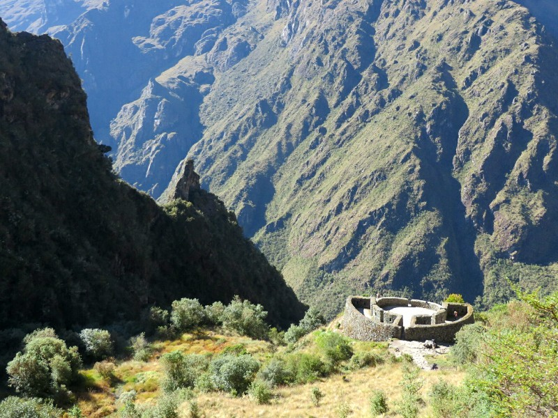

*Looking Down On Runkuraqay*

While they admired the view we started downhill. On this side there are more of grass plants, interesting angular rocks, pretty singing birds who refuse to sit still long enough for us to get a photo, colourful flowers and nasty biting flies. When we got down a couple of hundred metres and Kate felt better we stopped in a shady spot and waited for the other three to catch up.

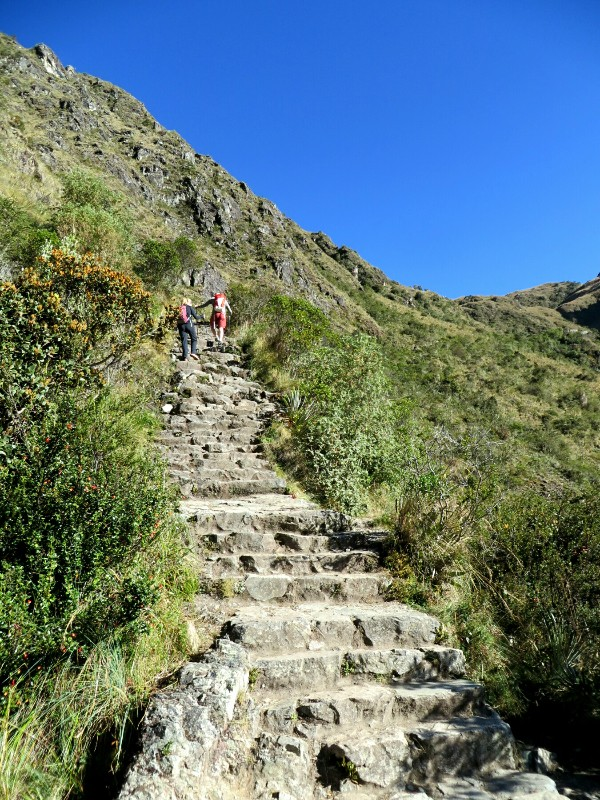

*Phillip And Heather Kick It Into High Gear*

Soon after they did we came up to a large complex of ruins, Sayaqmarka. The complex was built with cliff faces in three sides and only one entry way on the remaining side. It looked fairly large from a distance, but as we explored we realised how much bigger still it was from inside. At the highest point of the complex we could see a steam of water being fed into a trough running along the top of the wall of the ruin. The gutter runs to several basins to provide running water throughout the complex then down to water the crops. Very clever! Apparently according to Incan religion water was the sacred semen of the Gods sent to fertilise the lands. There were great views from the complex, Leo said it was thought to be a village as well as a checkpoint/look out to keep track of who came along the trail, and maybe a rest stop.

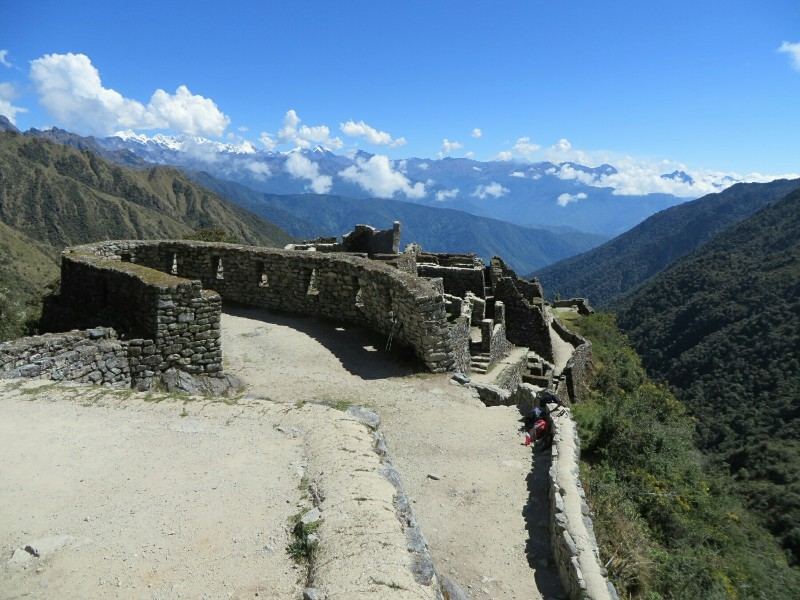

*Sayaqmarka Ruins*

After our little investigate we carried on downhill towards our lunch stop. The descent brought us back into the rainforest, surrounded by mossy trees and damp air. It was a nice break after the morning in the sun with the biting flies. After a short walk we reached lunch. Today we got quinoa soup, potatoes, chicken and pasta. The variety of food they're serving is amazing considering they've had to carry it all since day one. And the quality of the soups is top notch, we kind of want the chef's cookbook. While we were eating lunch we were passed by a man and his daughter who couldn't have been older than 10, maybe younger. She must be a tough cookie, she looked very determined as she treked past.

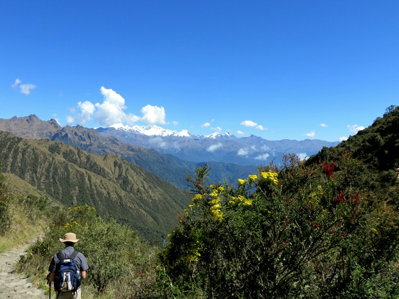

*Scenic View With Snow Capped Mountains In The Background*

After lunch we started up towards the third and final pass, also our campsite for tonight. There was a lot of up and down in this section, in and out of the rainforest and Pat started to get a headache. We loaded him up with painkillers, but it's hard to know if it's the altitude or lack of sleep or dehydration or what causing it. The walk was (again) beautiful and at one point we passed through a 20 metre natural cave the Incas had carved stairs into. As we got closer to camp the clouds and fog started to roll in. On one hand this obscured our mountain view, but it gave the feeling of walking through clouds, of which Pat approved.

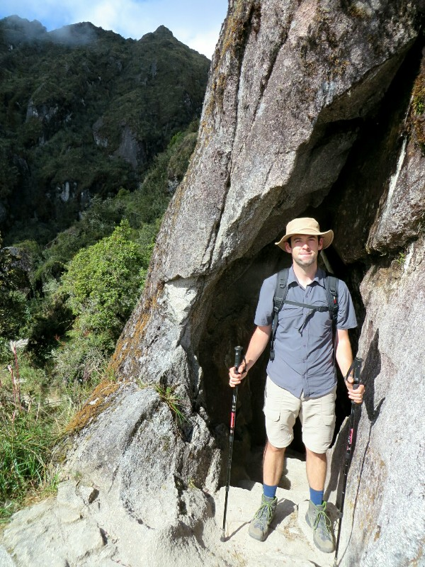

*Pat With A Lipful Of The Natural Inca Wonder Drug, Coco, Heading Into The Cave*

We reached a campsite fairly quickly and Leo pointed out Aguiles Calientes , our final destination tomorrow in the valley below. The campsite is called Phuyupatamarka which Kate was pretty sure was the name of the third pass, but Leo said this wasn't our campsite yet. We wandered up to a viewpoint and spotted some llamas and alpacas. Photo time followed. After that intermission we reached the highest spot in the camp and had a look around. We have a view of the Phuyupatamarka ruins the campsite is named after- it's name translates to 'City Above the Clouds' which seems very appropriate. From here, Pat spotted a camp being set up that looks an awful lot like ours... And as soon as they're set up Leo decides we will stay here and leads us to our campsite. It must be considered bad or embarassing for us to reach the sites before the porters have finished setting up, but you'd think after three days Leo would accept we have a fast walking pace and it may be unavoidable. The camp is pretty cool and they even have a latrine tent with a toilet (not a squat toilet) set up. All feels very fancy after the last couple of days.

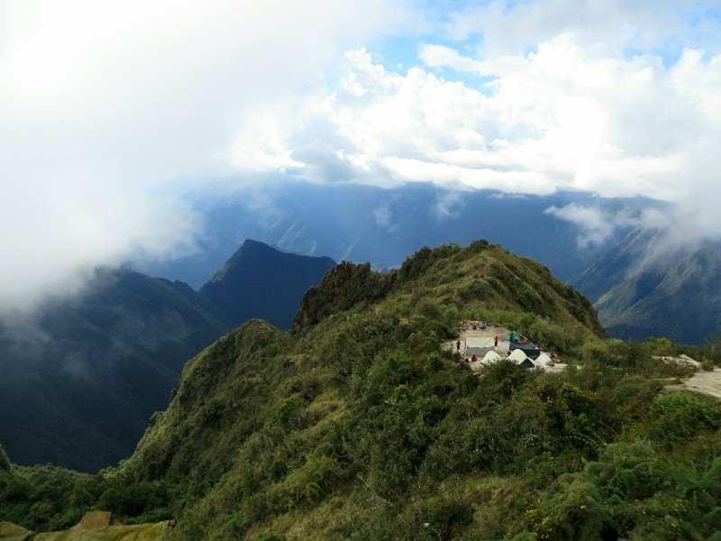

*Campsite For Night Three*

When we settled in the porters brought us all basins of warm water and we had a nice wash off in the tents. Not as good as a shower, but amazing after three days without a proper rinse off. After cleaning up, afternoon tea time. At tea Leo asks us what hotel we're staying at so the porters can drop our stuff there tomorrow. We assumed he'd know as the travel agent booked it. We suggest he calls her to ask, but he doesn't want to. He says the chef does the trail a lot, he knows the hotels in town and so he might know. This makes no sense to us, but not much we can do!

Between afternoon tea and dinner the porters went to play a game of soccer to celebrate almost being done. Leo went to watch, Heather and Phillip went down to investigate the ruins, we lay around feeling sick. Kate's almost finished all the tissues we brought, really hope she can get through tomorrow on the remainder because we won't be buying any here!

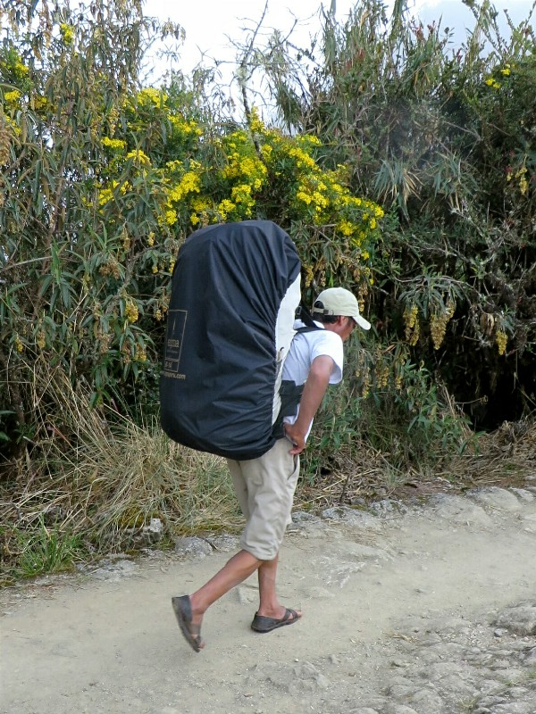

*Porter Passing Us With 25kg On His Back In Sandals. We Feel Pathetic*

Dinner was a pasta bake with veggies and another poached pear. At the end the chef brought in a jug of what we thought was the bubblegum cordial so Kate steered clear while Pat had a glass, then almost spat it out. Tasted very off for cordial! Then he realised it was because it wasn't cordial at all, it was red wine! A last night surprise from the chef! We didn't end up having much with our respective sicknesses, but it was a very nice thought.

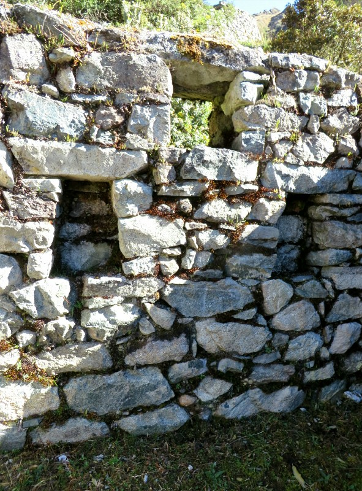

*Trapezoid Windows That Leo Kept Talking About*

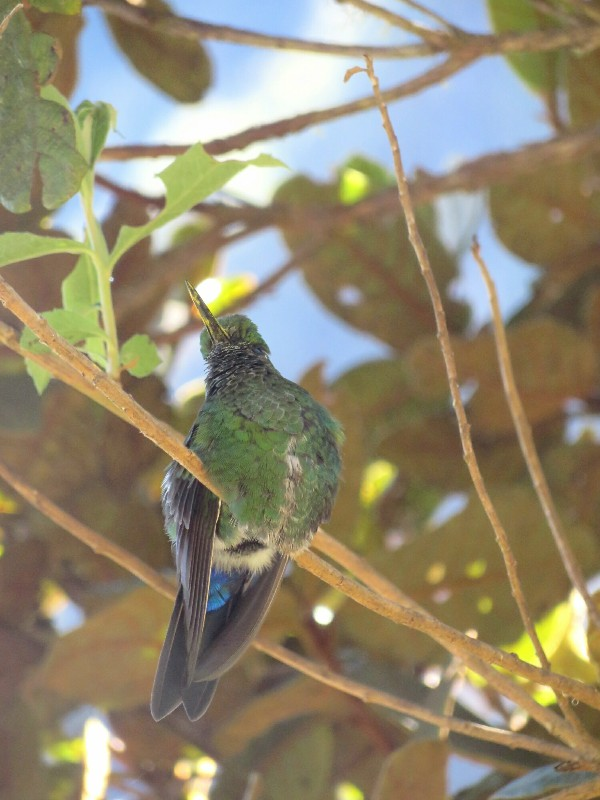

*Finally Got A Picture Of A Hummingbird!*

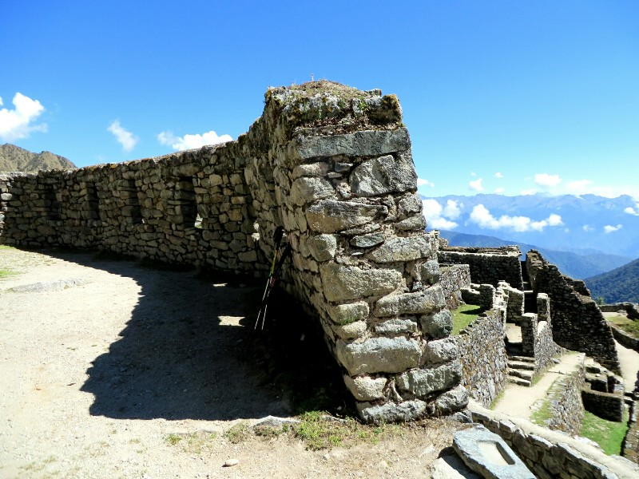

*All The Ruin Walls Are Built On An Angle To Follow The Mountain*

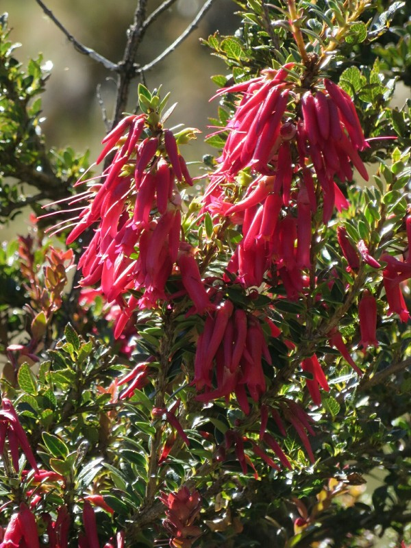

*More Pretty Flowers On The Trail*
