Sadly, especially with Kate's hacking cough limiting sleep, we woke up at 5.30 am to watch the sunrise. Scrambling up 50 meter or so of ascent we arrived on top of the peak, surrounded by snow capped mountains and glaciers on one side, and looking back over our camp and the mountains from above the clouds the other way. The fabulous kitchen and porter team were prepared for our grumpy early morning exhaustion and followed us up with a picnic rug and mugs to have tea, coffee or hot chocolate. We could get used to this treatment!

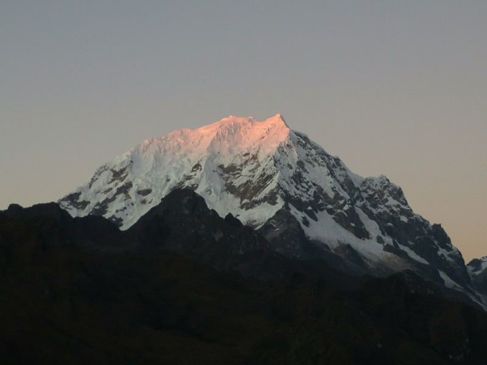

*Sun Rising Over Camp Three*

As the sun started to peek high enough to touch the tip of the snowy peak of the distant mountain another tour group of about 15 people arrived and somewhat ruined the serenity. We waited until the whole peak had gone from dark to dim white to golden orange to bright white, then headed down for the ritual packing of bags, getting dressed, setting up waking poles and breakfast (a delicious hot quinoa drink and pizza).

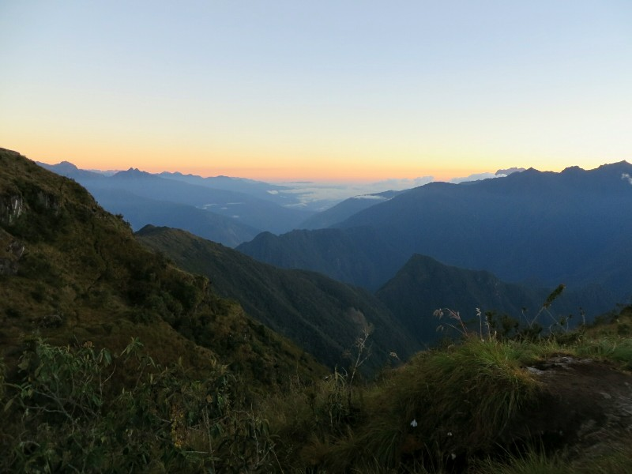

*No Snow Capped Mountains, But Still Pretty*

Today we need to go from our camp at 3600 meters to our final stop in Machu Picchu at 2400 meters. Leo said it would take 4 hours to reach our lunch spot, so we assumed it'd take 3. Lots of downhill. We definitely started right- steep, shallow Incan stairs to the first ruin of today, Phuyupata Marca. We didn't have time to explore the interior of the complex, but the exterior had enough going on to keep us intrigued. Unlike the others we'd been to that had places where water once flowed, this complex still had a steady stream of water coming from the side of the mountain. It ran through grooves carved in the stones through several pools (which are now home to tadpoles) and finally off the edge of the complex. Each pool was surrounded by chest high stone walls, perhaps for privacy when they were in use?

On we trundled down ever steeper stairs. Poor Heather seemed to be suffering in the knee department, even the two of us with normally fairly healthy knees were feeling it. How the porters kept running past with 25kg on their backs is beyond me. On the plus side we continued to pass through beautiful vegetation, amazing flowers, stunning views of the river running through the valley below and every now and then a glimpse of the next ruins, Intipata, an amazing terraced farming complex carved into the mountain to perfectly follow it's shape. Kate's favourite so far.

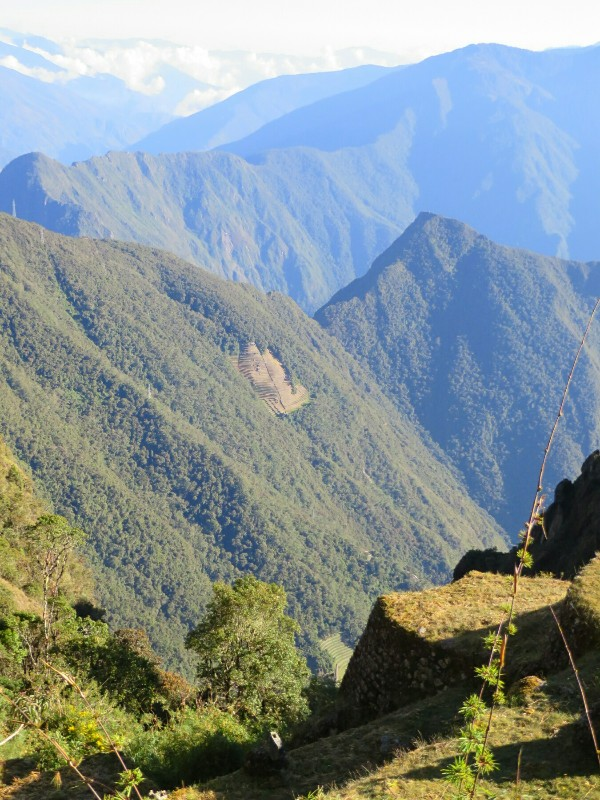

*Intipata Cut Into The Mountain- Kate Loves It!*

After an hour and a half we reached a junction in the road at 2700 meters- down to the camp where lunch was being prepared (but wouldn't be ready for another couple of hours) or along to Intipata. Leo encouraged us to look at the ruins- they really don't like us arriving before they're ready!

When we got to the ruins we passed a group of English tourists who pointed out a very cool butterfly fluttering around that changed colour from white to pink to purple to blue in the sun. Unfortunately at this point Kate really needed a bathroom, and there were none until camp. There were also no female appropriate spots to duck off into the bush- either you're visible from the path or you're standing on a ruin. Neither option is great. We end up asking Leo how long to camp from here- he says 40 min. It's currently just before 10am, lunch is at 12, assuming 40 minutes is a big overestimate as normal we should have time to get down, then back up to explore in plenty of time. We decide to go for it and head off on the trail.

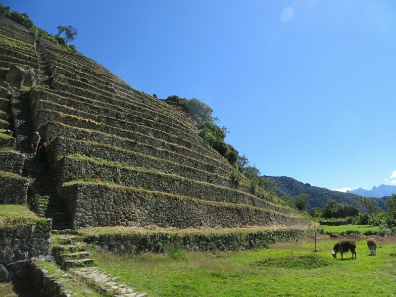

*Maintenance Workers at Intipata*

After about 20 minutes we arrived at camp and wandered around aimlessly until we found the toilet block. Relived and re-energised (and still over an hour and a half before lunch) we start the trek back towards the ruins, which being uphill in the hot sun proves significantly harder than the easy decent. Despite this we arrive back at the ruins with over an hour to explore, most of which is spent fawning over a group of llamas that were dutifully performing their roles as living lawnmowers.

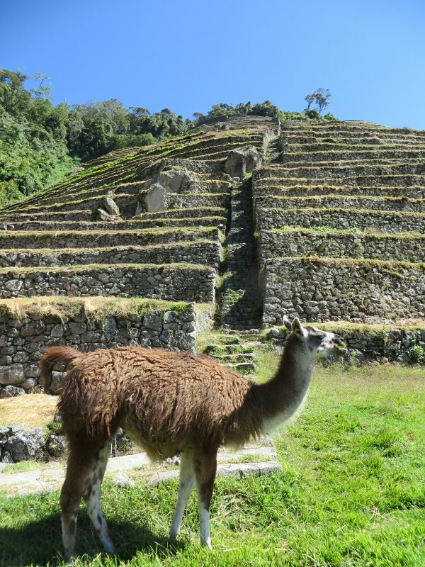

*Llama Stealing Centre Frame At Intipata*

Once we'd annoyed them to the point we felt at risk of being kicked off the mountain, or at least spat on, we exited back towards camp. Even with all the fiddling around we got there a half hour before lunch, so we all had a well earned and much needed sit down to rest our calves and knees. Our last lunch was enjoyable as always- a noodle soup, beetroot and cheese with fried rice and a chicken patty and a stewed apple. After fattening our bellies sufficiently we bid farewell to the porters and the chef and carried on for our last 300 meters of decent.

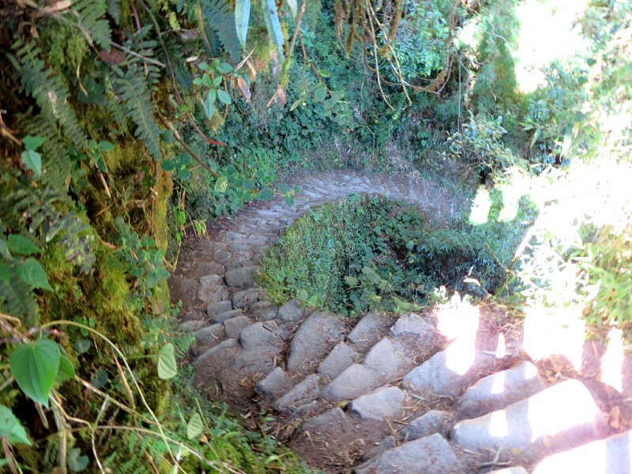

*Cool Staircase Spiraling Down*

Oh the lies! Downhill, uphill, downhill, uphill, uphill, uphill... Where's my descent!! This section was largely in the sun so it was even more difficult to cope. Leo seemed to be struggling especially. After an hour and a half of surprisingly tiring up and down for what was meant to be an easy day, we followed a long run of Incan stairs up and up and emerged at the Sun Gate (Intipunku Pass)! We hid behind an Incan wall to catch our breath, then once feeling as human as possible when you haven't showered in four days we emerged to look down on Machupicchu pueblo.

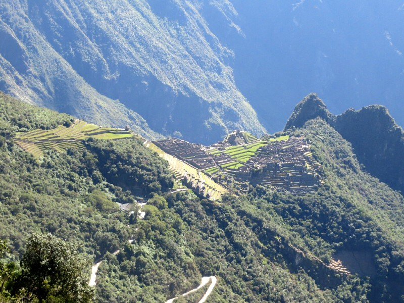

*Machu Picchu!!*

What a sight! After working our way through the Andes for the past four days and seeing several smaller complexes, Machupicchu was sprawling by comparison. The iconic Incan terraces, all meticulously maintained, trickled down the mountain and surrounded the pueblo on all sides. The Incans must have been the most fit empire on the planet - just walking around town would have been a hell of a workout. I can imagine that the pueblo would look even more stunning at sunrise, but the thought of standing at the Sun Gate with dozens of other people (none of whom would have showered in four days) all jockeying for the best camera angle isn't terribly appealing. Standing there with a handful of other trekkers and having all the time in the world to soak in the view is definitely the way to go.

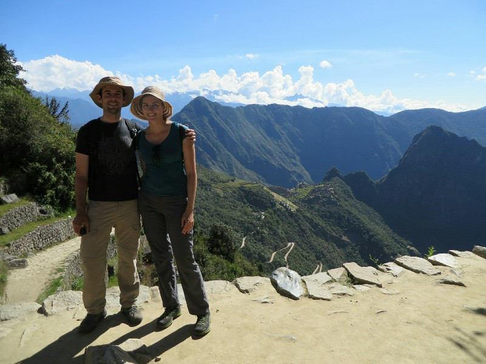

*Sick and Tired But Successful!*

Eventually, we continued our descent (passing some more dangerous creatures along the way) and got tantalisingly close to the pueblo before we veered off towards the bus stop. We did manage to stop for a few minutes to take a few mandatory selfies and admire the buildings from up close before we left, but the bulk of the exploration would have to wait until tomorrow.

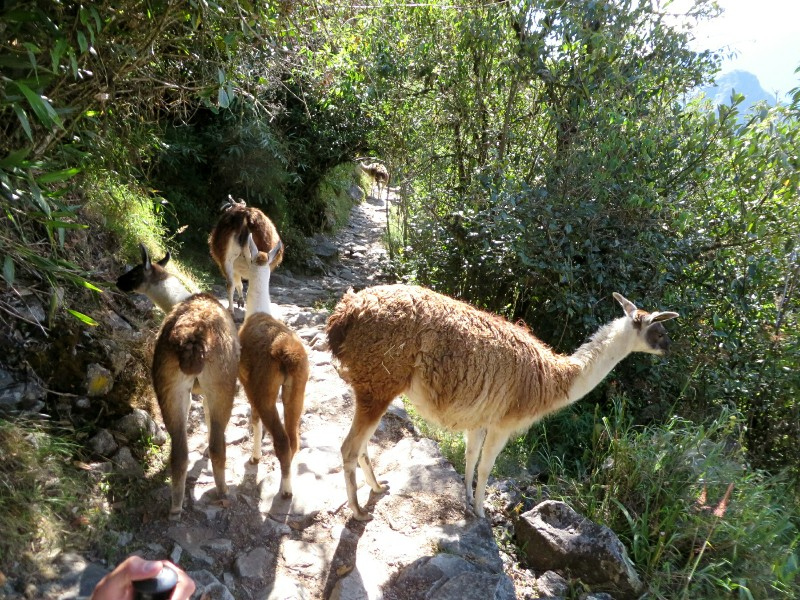

*Our Path Is Blocked! We Don't Mind...*

We grabbed the bus into Aguas Calientes town. The bus was full of clean day tourists to Machu Picchu- we felt like we were back on the bus in China but the shoe was on the other foot and we were the ones offending everyone else's noses. Kate was destroyed with the change in altitude and her inability to equalise with her cold. In town we found Leo didn't have the hotel address. Desperate for a shower and to check whether there was a new baby Morris in the world we said goodbye to Heather and Phillip for the day and wandered off to find it ourselves. Luckily the town is small and it wasn't too hard.

First order of business- welcome to Flint Morris and congratulations to Bini and Todd! Second- a long long shower to rinse off the coating layers of dirt, sweat and grossness. Ahhh! We finished off the day with some surprisingly decent Italian and an early early night.

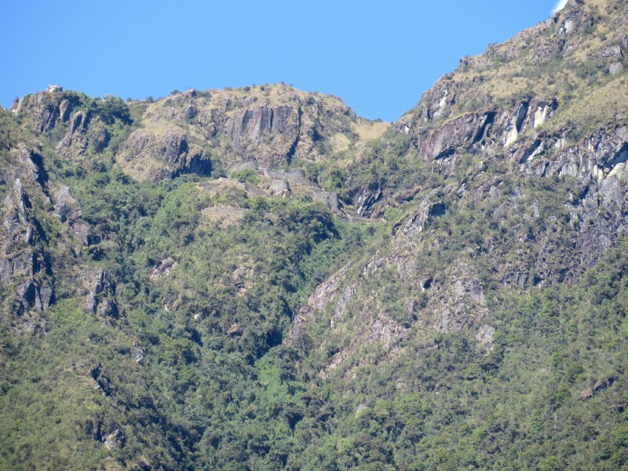

*The Ruins We Passed Earlier This Morning From Near The Lunch Spot (Top Third Towards The Middle)*

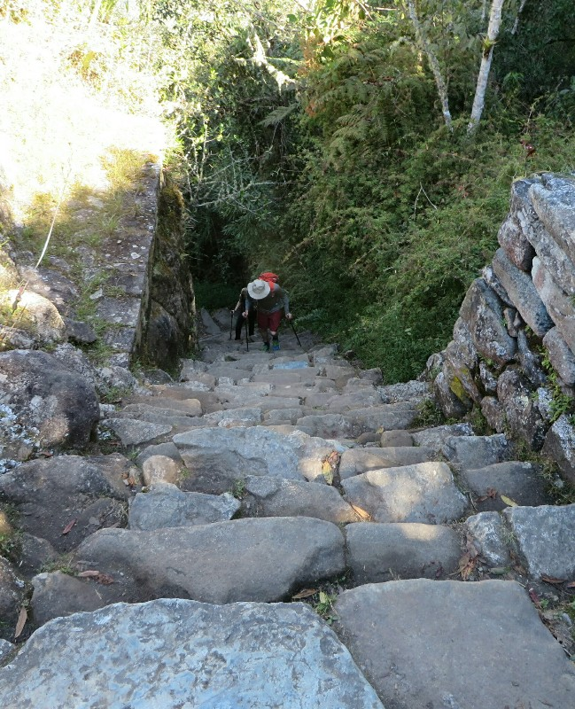

*Gradual Downhill Gradient Indeed.... (They're Climbing Up!)*

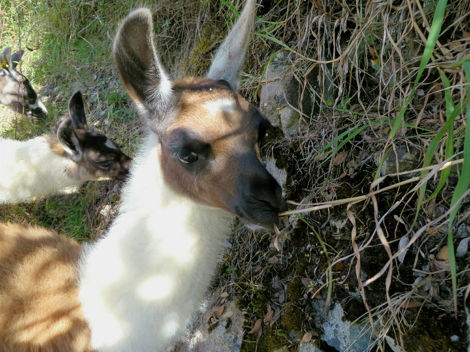

*A New Best Friend For Xena? Surely Customs Would Let Him Through!*
