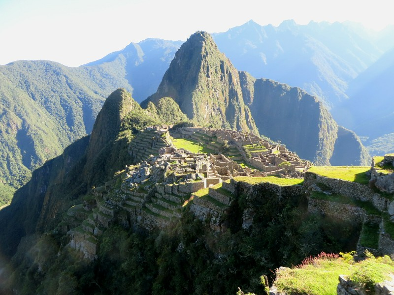
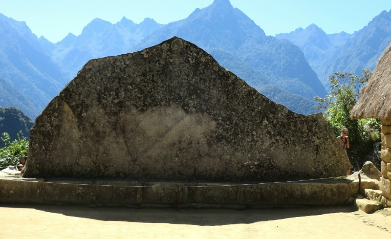
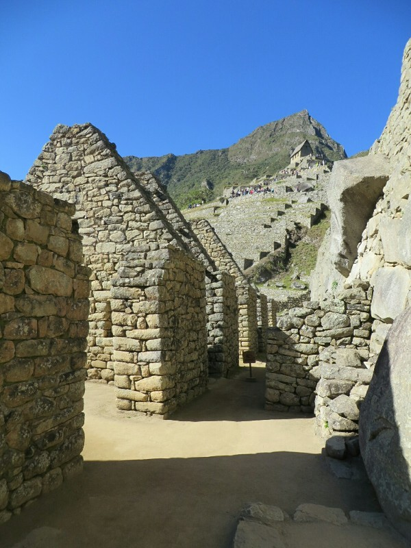
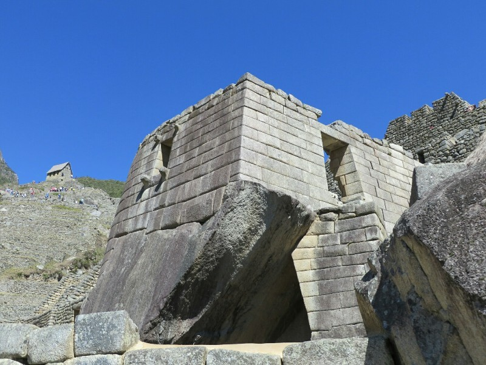
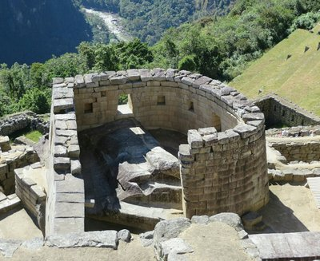
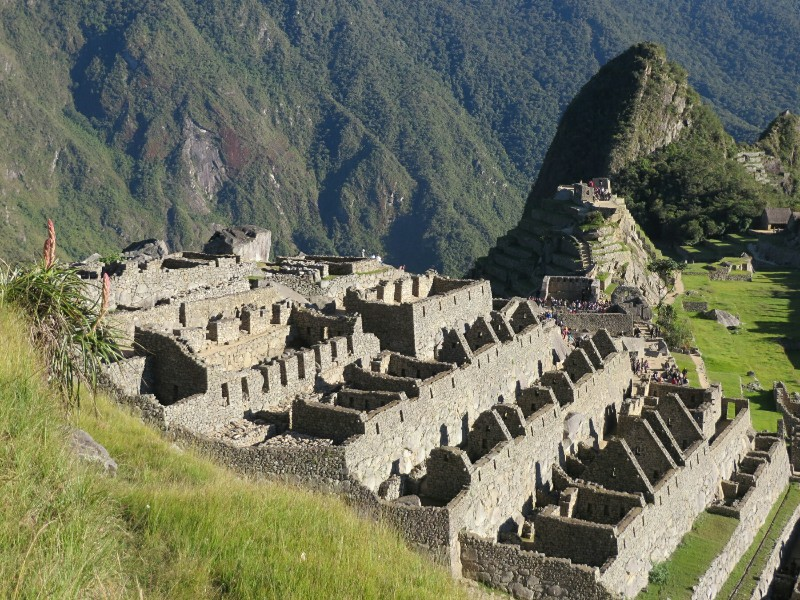
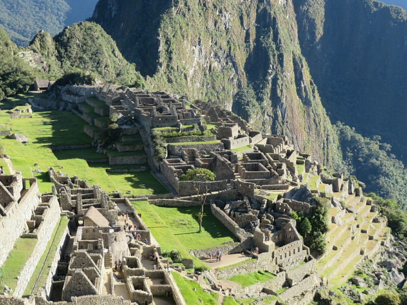

The good night's sleep we had planned after a few days of camping was foiled! Our hotel was conveniently located next door to a loud karaoke club which stayed open until quite late, one of our neighbours had their TV on full blast until past 2am, and our room overlooked the train station. The holy trinity of crap that keeps you up at night.

Despite a restless night, we were up at 6am to have brekky at the hotel (eggs and hotdogs again - always hotdogs!) and went to meet the others at their hotel to catch the bus for our journey back to Machpicchu. The bus up the hill took about 40 minutes of nerve racking back and forth before we arrived at the bottom of the pueblo (what they call the city here). Kate's head is still stuffed from congestion and the change in altitude (up 400m from Agues Calientes) was not agreeing with her. She was a very sad panda.

*Well Earned Reward For Four Days Of Solid Hiking*

Once we entered we hiked up to where we left off the previous day to soak up one of the more iconic panoramic views of Machupicchu. Just us and about 200 other trekkers who woke up before dawn to hike to the Sun Gate and watch the sun rise over the ruins. Needless to say it was a bit busy. Leo reckoned that despite the number of people there it was still quiet compared to previous years. This is where things started to get a bit sleepy. Despite his best efforts, English wasn't Leo's strong suit so he struggled quite a bit with what he wanted to say. This often resulted in us listening to him explain something in 5 minutes that should have taken about 20 seconds. Standing out in the hot sun surrounded by people made this a reasonably painful exercise.

*Guinea Pig Rock, The High Lord Of Machu Picchu*

A lot of his info came from Hiram Bingham, an American who rediscovered Machu Picchu for foreigners back in 1911. We got the impression that he brought a lot of Western influence with him when he originally hypothesised what the city would have been used for. Lots of stuff about virgins, concubines, monarchy and deity worship. We suspected that in the years since his original writings, archeological evidence might have contradicted some of his hypothesis (which our Wikipedia research later suggested was the case). Still, it was interesting to hear the perspective of people from the early 20th century witnessing the region for the first time.

*Typical Inca Stonework And Tie Downs For The Thatch Roofs*

The buildings in the pueblo were all built in a similar style to the ruins that we came across during the trek, except there was a lot more of them. There were a few stand out buildings, the Sun Temple in particular, where the construction was noticeably more refined. Stones were cut with more precision and had a uniform appearance when compared to some of the other buildings with rough stones of all different shapes and sizes. Still, each building had the trademark angled walls (which is one of the reasons the buildings have survived so well throughout the centuries) and trapezoidal windows and niches. Once we got down into the city, we started to appreciate it's size. Still nowhere as expansive as Pompeii, but it was divided into two separate and rather large urban areas all surrounded with the typical Incan farming terraces that seemed to go on endlessly down the sides of the mountain. Strangely, only one toilet in the whole city- they assume the house it was in belonged to the King. He can't be walking out of town at night to have a wee like a commoner!

*Fine Stone Work On The Sun Temple*

We both agreed that after Pompeii, ancient cities have a hard time blowing us away. This was built 1500 years after Pompeii but was nowhere near as polished. They didn't have any form of writing, which is part of the reason the Incan culture remains such a mystery. Pat especially noticed the lack of artwork here- while Roman cities were decorated by beautiful frescos and amusing entry mosaics warning visitors to 'beware of the dog' there was no sign of decoration here at all. Not to say this wasn't very impressive (we haven't seen anything that compares to the Inca Trail in particular- fantastic experience), but seeing these ruins certainly emphasised how developed and ahead of their time the Romans were. Leo kept commenting he thought it was a real mystery how the Spaniards could have defeated the Incas when they were so outnumbered, but coming straight from Spain to Peru and seeing the difference in architecture from the same period it seems fairly clear that while far ahead of the rest of the Americas and much of the world, the Incas were leagues behind Europe.

*Sun Temple From Above*

Around 1:00 we were all pretty beat and exhausted from the sun and Leo's methodical explanations so when we reached the end of the tour and had an opportunity to either explore more on our own or head back to Aguas Calientes we chose the latter and made our way to the bus stop. As we were getting off the bus and preparing to say our goodbyes, Leo casually mentioned that he had a friend in town who just opened a restaurant and he had invited us all for lunch, so off we trundled. The food was a bit overpriced (but then again so is everything in Aguas Calientes) but the owner of the restaurant gave us all a free Pisco Sour so there were smiles all around. Pat ordered a burrito which was pretty good, but at $15 you'd better hope so! We also ordered some "nachos" for the table to share which consisted of approximately 20 corn chips, a light sprinkle of cheese (not melted), and a small pot of guacamole. Something you might get for free at most restaurants when you sit at the table was $10 here. Kate, wanting something light with veggies ordered a mushroom pizza which came out with 2 kilos of cheese and maybe three mushrooms. Swing and a miss. We had a good chat with Phillip and Heather about rock climbing, how they met, sports, music, and a whole manner of other light conversation topics. With an hour to go before our train, we left the restaurant, said our thanks and goodbyes to Leo and went to collect our bags from the hotel.

On the train back to Cusco we rolled along at a snail's pace. The tracks were uneven and bumpy so we never got above 30kph for the whole ride. We only had to cover 90kms but it took us nearly 3 and a half hours to get there. Since this train is the only real option to get to and from Aguas Calientes they have a bit of a strangle hold on the market and they charge accordingly. Kate read that this train is one of the most expensive trains per kilometre in the world. We did get a free muffin and a tiny glass of water, so we got that going for us, which is nice.

Eventually we got back to Cusco and were greeted by Freddy, the cheery driver from our tour company who drove us the remaining 40 minutes from the train station into the historic centre of the town and to our hotels. Once back in the hotel, it didn't take long for us to crash after a long and exciting five days!

*Now Renting: Studio Apartments With A Valley View*

*Urban Centre Of Machu Picchu*
