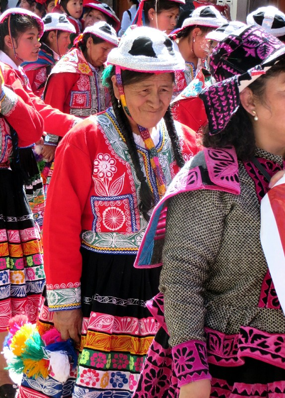
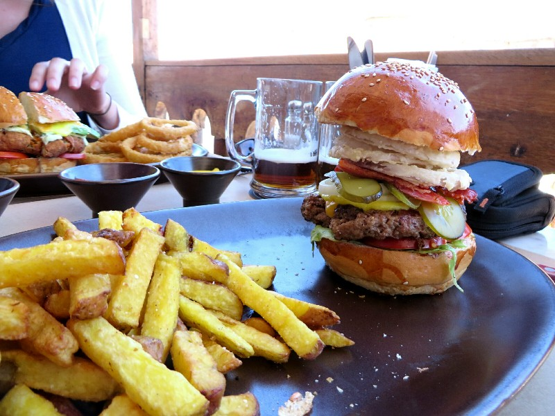
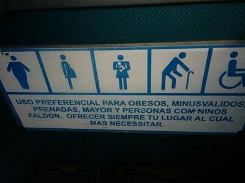
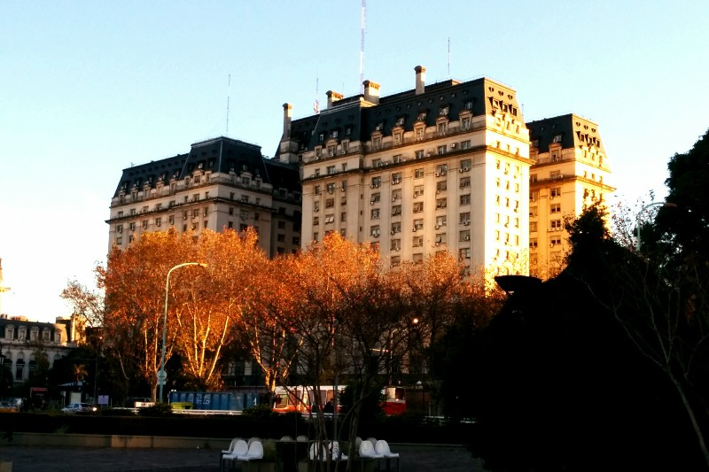
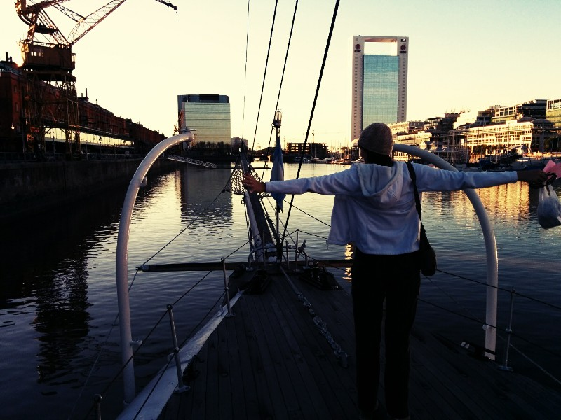
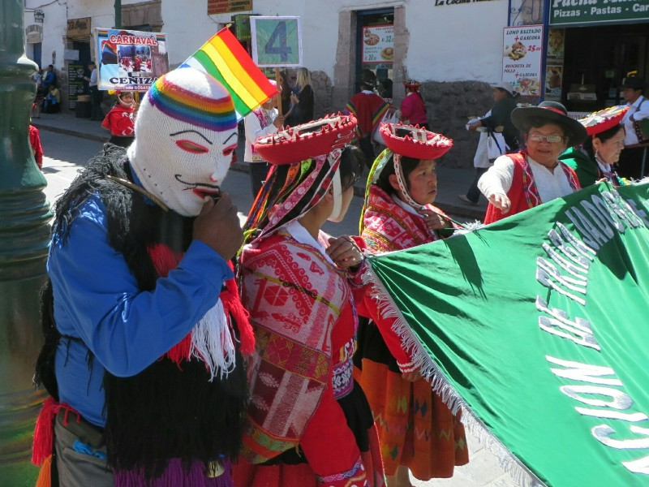
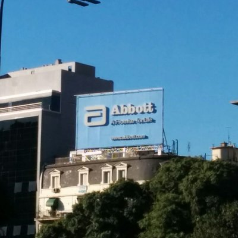
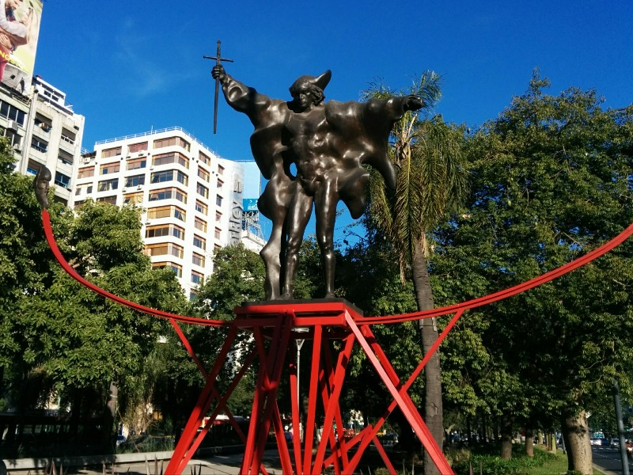

After a noisy start to the evening, the hotel eventually shut up and we were able to get some much needed sleep after our adventures in the Andes. We woke up feeling moderately refreshed and were once again treated to the standard hot dog omelette and coca tea breakfast put on by the hotel. The tea I'm going to miss, the hot dog omelette not so much.

We have a few things on the agenda for today, none of which are very exciting: laundry, returning sleeping bags and walking poles, and packing. Woo hoo! Despite the laundry services here being a massive rip off, after 5 days trekking we are both desperate for clean clothes. We set off walking only to find everything is closed either because its Sunday or it's too early. Hoping it's the latter, we trundle on to the equipment rental store. Success! Well, half a success anyways. Our shop was the only one open on the street but for some reason they didn't have the drivers licence that we used as a deposit so they asked us to come back in an hour. Some underage Peruvian kid using it to hit the pubs perhaps? Not much we could do so we walked back to the laundry shop and happily found them open. After some skilful negotiating on both our parts (12 soles per kilo? How about 10 soles. 5 kilos? Looks more like 4.5 kilos to me) we walked back to the hotel, cleaned up, packed, and set out for some lunch.

*Grandma Still Out Partying!*

Of course being any day of the year there is another massive celebration in the square today. Thousands of people in traditional dress dancing, playing music, and parading down the street. We spend a while watching the celebrations pass by and settle on a decent burger restaurant for our final meal in Peru. What the meal lacked in authenticity it certainly made up for in deliciousness. We started with some seriously good chicken wings before our burgers arrived. Kate sensibly ordered a vego burger but Pat went all out and got a beef burger with the lot. For some reason, the dessert menu appeared and we accidentally ordered something called a "chocoshock". I'm sure you can guess how that turned out.

*Think America Has Obscene Burgers?*

Bellies full, we picked up the drivers licence and the clean laundry and made our way back to the hotel. Our driver, Freddy, came right on time and we made our way to the airport (a short 15 minute drive). Feeling like this was all too easy we waited in the check in line for our turn. When we were called up the man asked if we had checked in already. Confused, we said no and that's why we had waited in the check in line (I would have thought that was self explanatory) and he typed furiously at the computer and then disappeared to the back room for a few minutes. He returned briefly only to disappear again. Starting to get a bit concerned we asked if there was anything wrong and we got an interesting series of replies. First, he said they had no seats together - no big deal we thought. Next he said that there was lots of wind in Cusco and that our flight might be delayed, but the flight  30 minutes after our flight would certainly be on time so he asked if we would mind moving to that flight instead. We had plenty of time at the Lima airport before our connecting flight to Buenos Aires so we agreed. It sure sounded like the flight was overbooked and they had to bump us but for whatever reason they didn't want to own up to it. Shrug. We got some exit row seats for both flights out of the deal so we weren't too bothered.

*Seems Obesity Gets The Same Consideration as Pregnancy or Old Age Here*

After a night in transit (unfortunately short 2 and 4 hour flights taking us from 6pm to 6am with layover and time difference) we arrived in Argentina. We caught a few Z's on the shuttle bus into town because even though it's closing in on 8am the sun is barely up so there isn't much to see yet. At the hotel we figure it's early enough to sleep for a few hours before heading out for the day. This would have been a great idea except for the fact that the cleaning crew had a supply closet right next to our room so there were gossipy ladies right outside our door all morning. Still, we managed a bit of sleep and around lunchtime we figure we should venture out in search of food.

We settle on a restaurant that has a good sounding lunch special, order up a couple steaks with mushroom sauce and dig in. Despite their reputation for having awesome quality meats, the Argentineans make a point of cooking their steaks all the way through. If you want something close to an American or Australian medium rare you need to ask for it "blue" and even then it might still come out medium or medium well. Seems to me like they're missing out on some tasty meat by cooking them so thoroughly. Even still, because the raw meat is so nice, even when cooked through they are quite yummy - definitely nothing to complain about!

*New York Or Buenos Aires? Hard To Tell!*

With our bellies sufficiently full of meat (a condition that's sure to be repeated during our time in Argentina) we figure it's best we go for a walk to kick our metabolism into gear. We wander vaguely in the direction of the port area which was recently refurbished similar to Melbourne's docklands. Turns out we spent most of that time walking the wrong direction. We did get to enjoy a lot of the city's architecture while we walked though. Apparently Buenos Aires is known for its architecture and we could see why. Lots of beautiful old buildings, some in European style, some American, not so many modern though.

Eventually we found the port and had a walk around. This area more than any others feels American, or maybe even like Australia? Lots of large redbrick historical warehouses have been converted into restaurants like TGIF, and a few huge historic ships (including one that made voyages to Antarctica in addition to pretty much the rest of the world) are docked and have been converted into museums. Cheap too- 50c entry for both of us!

*I'm Flying Pat!*

South America in general has been more together than we expected, but Buenos Aires in particular is more developed than plenty of European cities! We're very impressed so far! With the sun setting and not wanting to press or luck after dark we wander back towards the hotel.

*Creepy Masks For Dancing*

*Randomly Topical Sign in Buenos Aires! (Abbott- A Promise For Life)*

*Melty Public Art*
