Up and at em reasonably early and downstairs for the hotel brekky. Not bad: eggs, sausages (hot dogs really, always hot dogs in South America), breads and jams, and much to Kate's delight little prepacked tubs of caramel. With many of our clothes still in a sad, smelly state from the Inca Trail we're forced to use the hotel laundry. At less than $8 for a wash and dry we are certainly happy to be out of Cusco and their absurd laundry prices.

Well feed and with clean clothes we're now free to venture out and explore the city. Kate has picked out a free walking tour put on by BA Free Tour that's meant to give a nice overview of the more popular areas of the city, and they certainly didn't disappoint. Or tour guide (Victoria) was born and raised in Buenos Aires and she was definitely passionate about her job and her city, which always makes for a good tour.

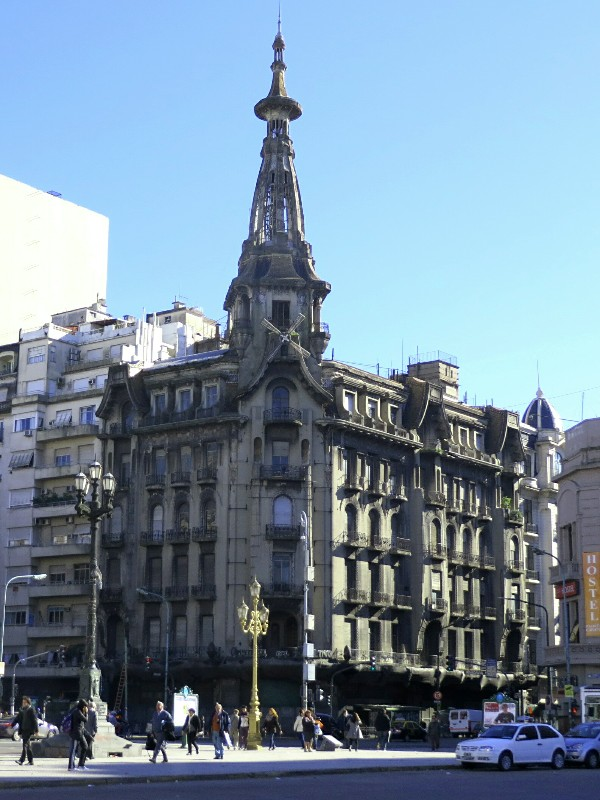

*Beautiful Old Building Apparently Abandoned and Full of Homeless People!*

We start off at the congress building nestled at the end of a very nice looking square. In addition to a huge monument and fountain, the square is home to one of three copies of Rodin's Thinking Man, the other two being in the Rodin Museum and some museum in the States. Of the three, this the only one freely accessible and publicly viewable all year long. Kinda cool. Like Cusco, Buenos Aires belongs to the dogs. Just about every person here seems to have at least one dog on a lead and we saw several dog walkers with over 10 dogs trotting along beside them.

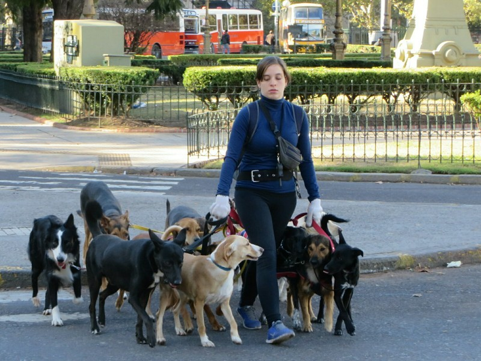

*Best. Job. Ever.*

During the tour Vikki explains that on any given day there are at least two or three protests (and often many more) that march down the avenue connecting the Pink House (their White House equivalent) and the Congress building. They happen so frequently that the police have set up permanent barricades in front of the Pink House to protect the president in case things get violent. From what we gather the protests mostly center around working conditions and pay rates and they mostly involve labour unions. She finished off the tour by showing us how to talk with our hands, something many residents have inherited from their Italian heritage. Good fun!

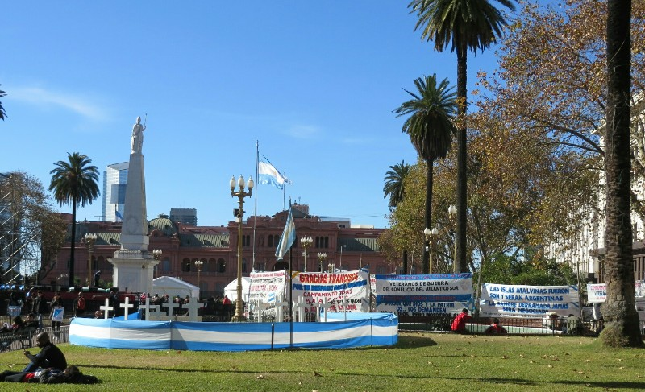

*Protest Number One!*

Left to our own devices following the tour we walk back towards Florida St in search if a pair of athletic shorts for Kate. One there we are harassed by a constant stream of people shouting, "Cambio cambio cambio cambio?", which translates to "change" or "exchange". Apparently in a move to try and curb inflation the government made it illegal for banks or ATMs to dispense US dollars so the only way for locals and tourists to get or exchange money is to use the so called black market money changers on this street. The whole process is tolerated by the police and everything happens in the open with no pretense of having to hide what's going on. A bit disappointing to not have to go to a dodgy, dark alleyway and meet a shady character in a black trenchcoat selling organs and rocket launchers to change money. Such is life.

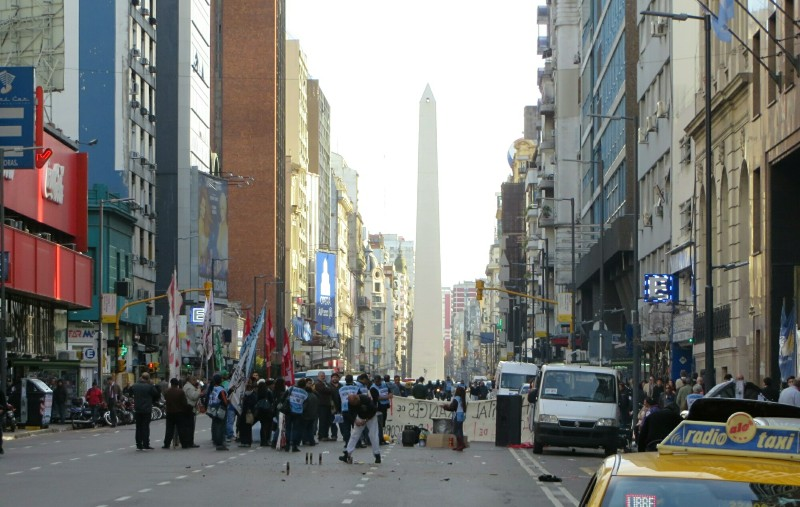

*Protest Number Two! These Guys Had Fireworks!*

After turning down approximately 10,000 offers to change money we made it to the end of the street and double back via a different, less cambio-centric street and stop in to a bakery to try a local specialty: two shortbread biscuits with caramel between them covered in chocolate with crushed nuts on the top. Long story short: yum!

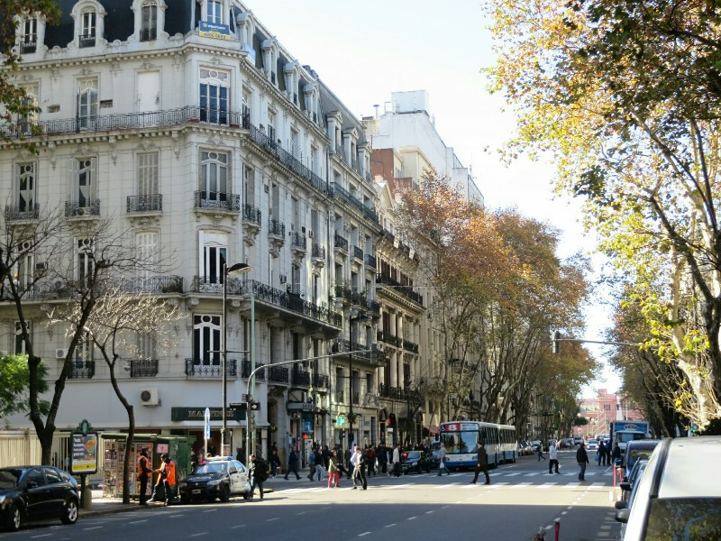

*Tell Me This Isn't Paris!*

Next stop is Buenos Aires Metropolitan Cathedral, built in the 16th century. Famous for once housing the current Pope when he was the bishop of Buenos Aires in the nearby residential complex and also for housing the remains of Jose de San Martin, responsible for helping to secure the independence of Argentina, Chile, and Peru. Needless to say he's a very popular man in South America.

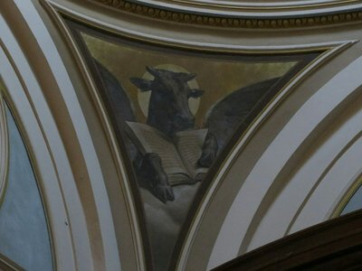

*Can Someone Remind Me of the Bible Story This Is Referencing??*

On our way back to the hotel we call into Cafe Tortoni, "the most famous coffee shop in the world", according to the residents of the city. It's in a cool old building with wood paneling, dim lighting, and art by local artists plastering the walls. Fun atmosphere, decent coffee, and churros with chocolate dipping sauce - kinda ticks all the boxes.

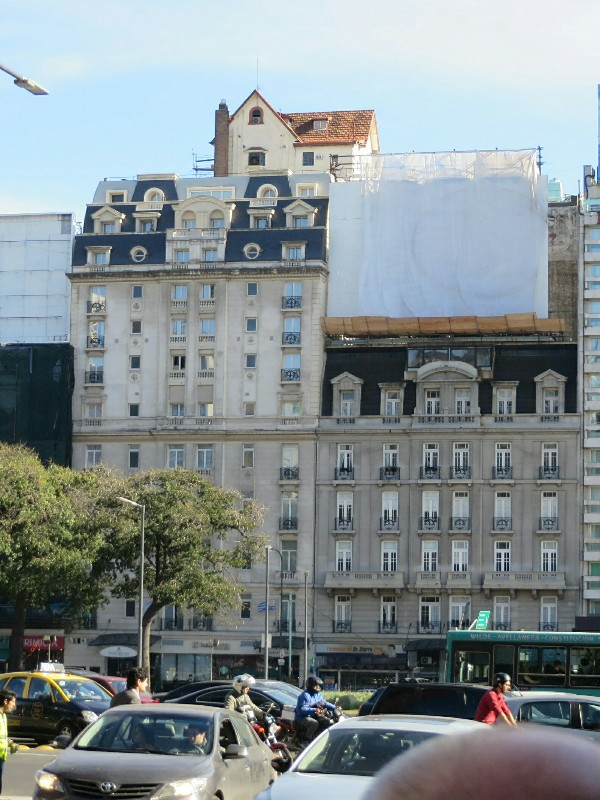

*The Factory Owner Wanted To Eat Lunch At His House Everyday But Traffic Was Too Bad. This Was The Natural Result*

Back at the hotel, wet meet up with Craig and Vonnie who just happened to be in Buenos Aires the same time as, a fact we found out only hours earlier (because bloody Turtle never replies to emails!). We had a couple glasses of wine, swapped travel stories, and then shared a cab to our respective evening activities, all in the same suburb. We were out for a traditional Argentinian 5 course BBQ dinner, curteosy of Lap and Em. We're only here 2 days so we figured one big fancy meal would be our best bet to try a selection of Argentinian cuisine quickly. When we arrived at our restaurant, Steak by Luis, it became apparent we were going to be the only ones there tonight, either a very awkward situation or very awesome. Time will tell.

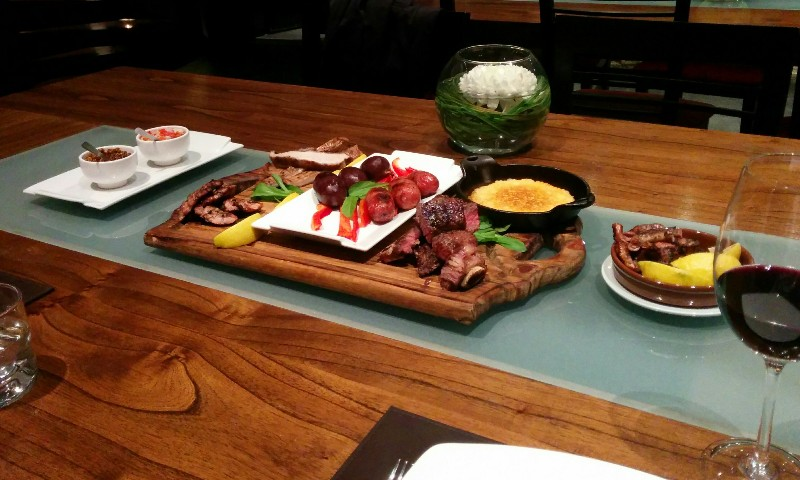

*Third Course of Five- This Was The Starter!*

Turns out very awesome. We had a really nice host and Luis walked us through the Argentine tradition of asada, the Sunday BBQ. The food was all amazing and appropriately meat-centric. They even cooked the steaks, course 4, a genuine medium rare! An absolutely insane amount of food for two people, Kate ate herself sick trying to keep up! The wine was also top notch (Steaks by Luis sublet the building in the evenings from a local wine company). After the main course we started talking to the server about the different wines they have and she did an impromptu wine tasting for us. Being the suckers that we are, we ended up buying a case of wine and having it shipped to the US. It was free shipping, how could we resist! We are soft targets.

In the end, extremely full, exteremly satisfied, and again EXTREMELY full, we ditched our plans to walk home in favour of a cab and collapsed in a food coma.

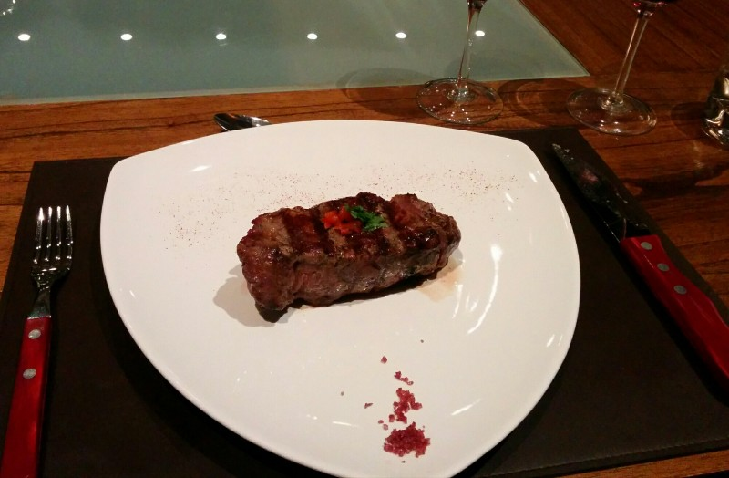

*Kate Couldn't Finish The Main (She Really Tried!)*

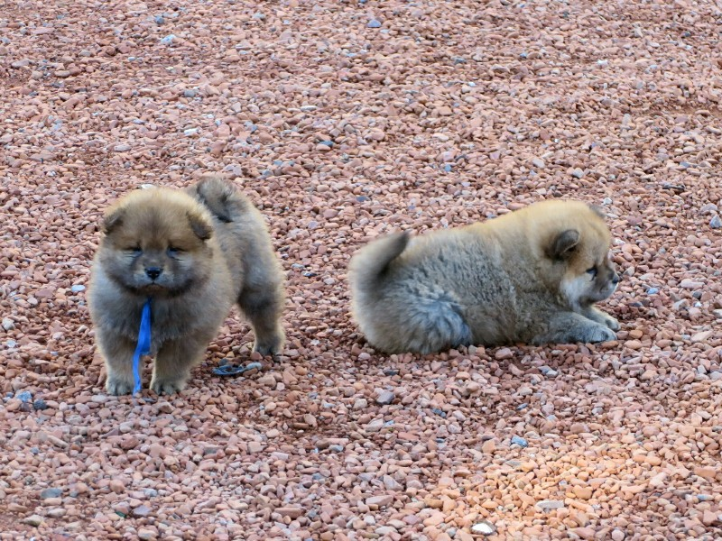

*How Can These Be Real??? This Much Cute Can't Exist!*

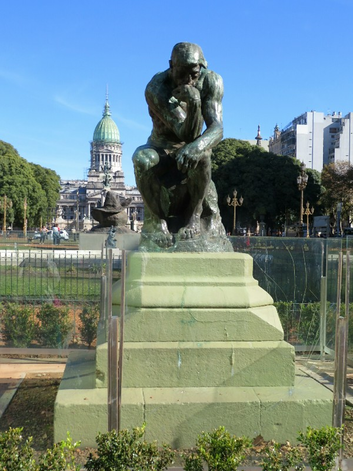

*Why Pay To See Rodin's "The Thinker" When You Can See It For Free?*

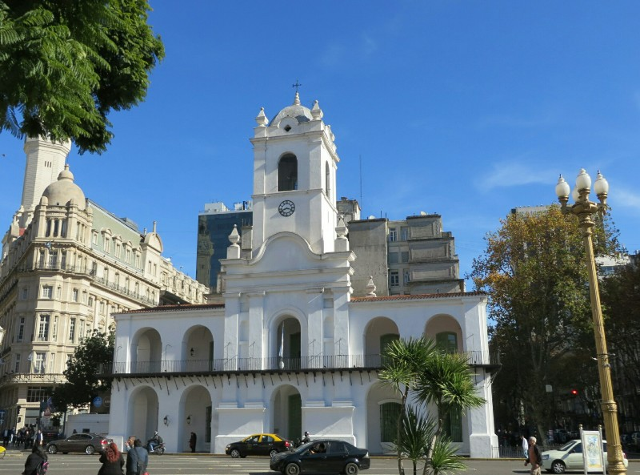

*This Building Gets Graffitied So Much It's Painted Weekly*

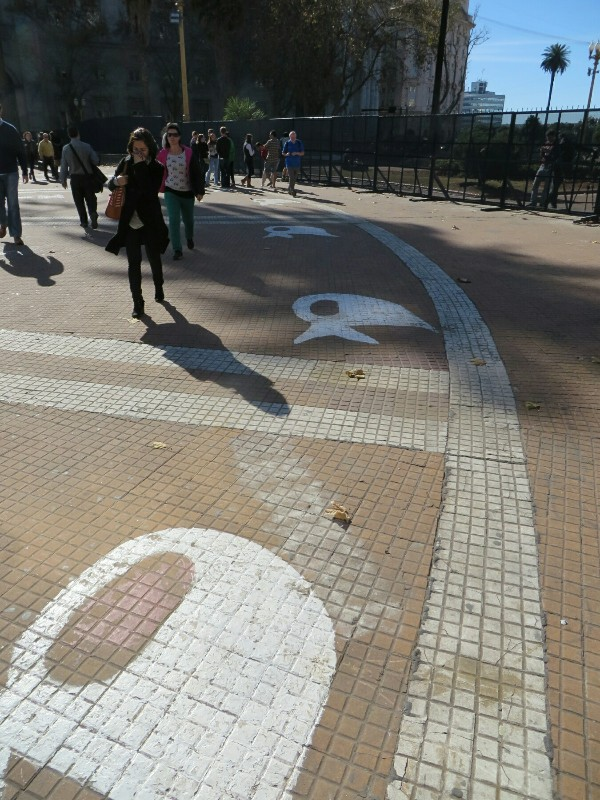

*Street Art For The Mothers of Plaza De Mayo- Women Whose Children Were Stolen During The Dictatorship In The 70s. They Started A Movement Then And Still Gather In The Square One A Week*

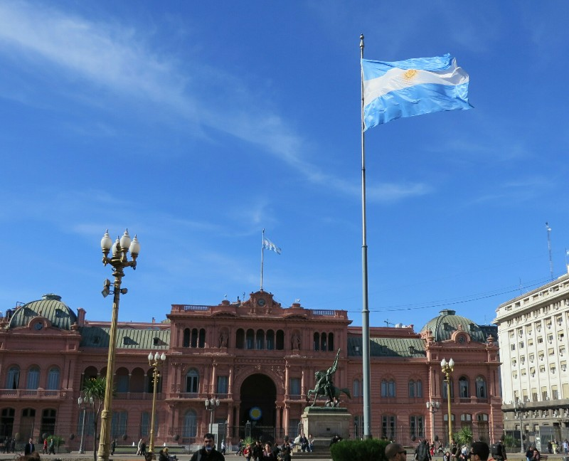

*The Pink House. Like The White House, Only Painted With The Blood Of Bulls (So The Rumour Goes...)*
