Kate is broken again and stayed up all night being sick. Really- get it together Kate! Enough illness! Morning flight today so we had to pull ourselves out of bed and check out reasonably early, which wasn't easy with Kate feeling sick. We made it to the airport and met Craig and co before we boarded (we are also on the same flight to Iguazu, coincidentally). After an uneventful flight we arrived to the humidity of Iguazu. Lovely.

We had organised to be picked up at the airport by a taxi through our hotel. After we got our bags there was a man waiting with a sign that said "Atrick". We figured that has to be us, either that it we stole Atrick's cab. Oops! The driver, Roberto, was very nice and came prepared with maps of the town and the waterfalls for us. The helpfulness continued at the guest house as we were given a very warm welcome and made to feel at home. Probably one of the nicest hosts we've had the whole trip. As if that wasn't enough, the guest house had an adorable dog that looks like Xena (American Staffordshire bull terrier) named Lauren. She made us a bit homesick but it was nice to have a cuddly dog to keep us company.

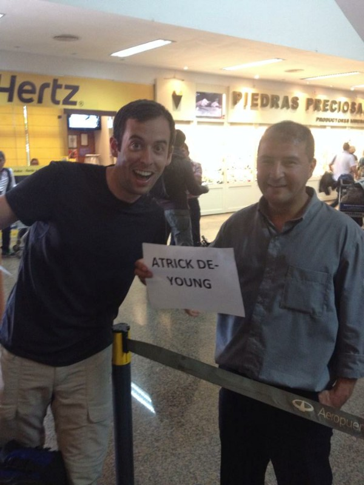

*Roberto and Atrick*

We laid around the room till dinner because Kate's stomach doesn't like her. Eventually we went out and had Italian with Craig, Vonnie and their friend Pete (very nice guy). The food wasn't the best. It was ok, but overcooked. However restaurant was owned by the same guy who ran the guest house so he gave us some free entrées and 10% of our bill- can't complain there. They sure know how to wine and dine their guests!

At brekky the next day Lauren sat with us wagging her tail furiously. She just looks so much like Xena! We caved and gave her some hotdog (because that's breakfast again), a treat Xena would never get. We're getting soft!

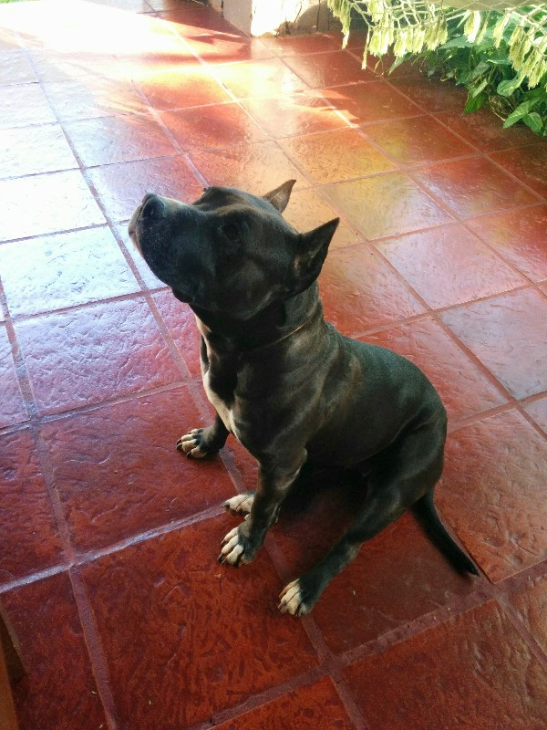

*Cutie Pie Lauren*

We caught the morning bus to the Brazilian side of the Iguazu Falls, a gift from Karla and Eddie. This involved crossing the Argentina/Brazil border. Argentina was very efficient, orderly queue, quickly stamping passports. Next, Brazil. They don't even bother looking at us- the bus driver takes our stack of passports down for us while we chill out on the bus.

After an easy hour we arrive at the falls. They are amazing! We take a scenic walk to the river at the base of the last falls and work our way up to the biggest falls at the top. The path is covered by adorable tapirs and beautiful colourful butterflies. Signs everywhere say not to feed the tapirs, but a lot of people are. When they fail to charm tourists, they venture into the bins to try their luck. The river is crazy, the falls are enormous! Apparently this is the most water ever recorded on the falls. There have been floods in Brazil (killing 9 and destroying hundreds of houses) forcing them to open all the dams. The amount of water flow has increased 30 fold (1,500 cubic liters of water per some amount of time to 45,000). There's an unbelievable force of water pounding down seemingly endlessly. It's just amazing. Photos do more justice than words, but nothing compares to being that close to that kind of natural phenomenon. A number of the paths have been washed away and thus closed, but we don't mind- not many people get to experience what we are!

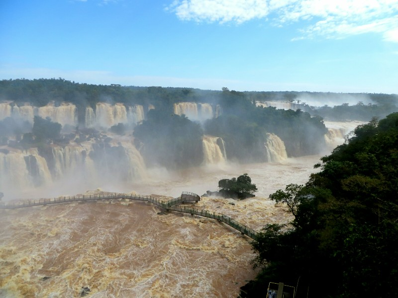

*Massive Amounts Of Water!*

After a few hours getting covered in spray and taking thousands of photos of tapirs we got the second to last bus back to town and set up at a bar with TVs to watch the World Cup opening match. The match started off with a bit of a flub - Brazil scored an own goal in the opening minutes unexpectedly handing the lead to Croatia. Brazil came back and tied it when they were gifted a penalty from a terrible dive that made us both cranky (they're clearly superior players, they don't need to cheat to win). With all the technology available these days we both think they need to be harsher with cards for dives- maybe video review and hand out retroactive cards after the game to discourage it? Either way, it seems to be just another part of the game these days. Brazil ended up scoring two more goals to sell the win, but Croatia made it a hell of a game.

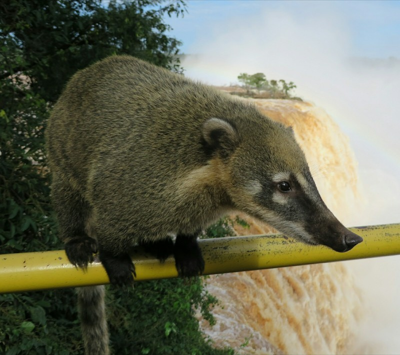

*"Hey, Buddy... Got Any Food?"*

At the half they showed footage of mental riots in a number of host cities which made us a bit nervous for our upcoming travels, but not much we can do now but try and stick with the crowds. Hopefully the copious amount of military police will help keep the tourists safe...  We fell asleep in Argentina to the sound of partying Brazilians and fireworks across the river.

On our last day Kate was still sick but determined to see the Argentinian side of the waterfalls, apparently requiring a whole day trip compared to Brazil's couple of hours. Entry to this side of the falls was a gift from Pat Stott. Thanks Pat! After a quick breakfast we got the bus to the waterfalls. No border crossing so a faster journey. When we got there we are sad to hear that, of the three trails, only one and a half are open because of the flooding. We start with the half open trail, the upper trail. This takes us along the tops of the waterfalls so we can stand above them and watch them pour down below. The extent of the damage from the flooding is obvious- raised paths built above the rivers have been washed away and broken, trees and reeds are bent and broken where the force of the water battered them aside, the raised paths we're following would have been underwater just a few days ago!

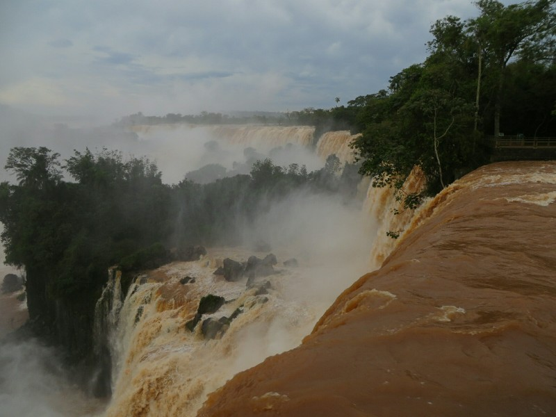

*Enormous Falls On The Argentinian Side*

After the upper trail we follow the lower which takes us in a long loop around the bottom of the falls to watch the torrents of brown water pound into the river below. This path involves getting quite wet- the spray is massive and viewing platforms where you could normally get close to the falls to feel some water are completely consumed within the waterfalls and closed. We notice there are a lot less tapirs approaching tourists on this side of the falls and the reason is fairly simple- they put lids on their bins. Brazil could think about following suit?

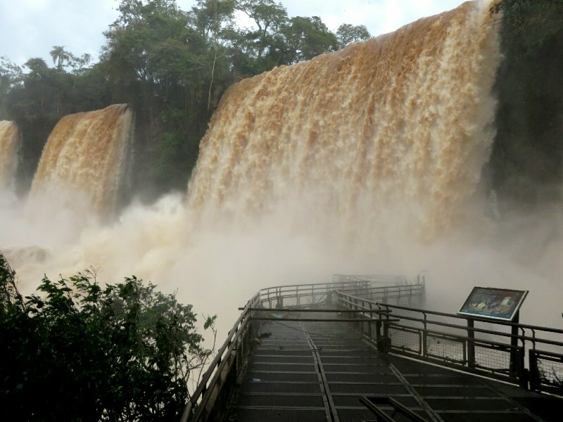

*More Falls!*

We still had some time left after doing the two loops so we decided to try another less popular walk through the jungle to a lonely waterfall upstream of Iguazu falls. When we got to the start there was a sign forbidding entry after 3pm- it was 2.45 so we figured we were alright. As we walked along the muddy track a canopy of trees enveloped us and it got quite dark quite quickly. We realised the track might close early to prevent people getting stuck there in the dark. Then with our normal good judgment, putting safety first, we kept going til we reached the fall. It was quite pretty, but the number of bugs waiting there to eat us was astronomical so we didn't hang around long. It was starting to get dark when we turned around so we kept a good pace. As dusk approached cute furry animals appeared ahead of us on the path foraging for dinner. They ran away before we could get close, but they were cute whatever they were. As we reached the entry to the path it started to rain. We climbed over the now locked gate and headed back along the road to the bus stop getting well and truly soaked on the way.

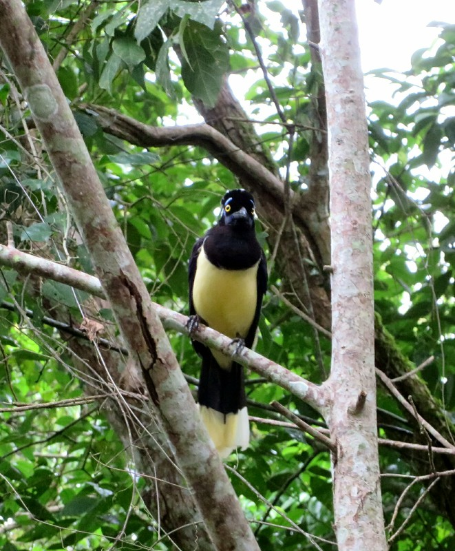

*Very Surprised Bird!*

We got back to town during a break in the rain and walk through the door to our room just in time for torrential pouring rain, thunder and lightning to start in earnest. The weather has decided us against going out again tonight so we watch Australia's first game in the room. We catch the warm up and as the national anthem starts ("Auuustralians all le...") the power cuts. We freak out, but thankfully it comes back just before kickoff. The storm is so loud we have to watch with volume full blast. Not a good start for the Aussies- 2 goals to Chile in the first 20 mins. The Australians are playing very average, frustrating us both. "Pass to the players in yellow! Ah!". Apparently they heard us as they pick up towards the end of the first half and Tim Cahill manages to get a goal! In the second half they look like the better side, which surprises us both. Unfortunately we end up with some bad luck on a few calls from the ref and fail to equalise. Then Chile got another point in stoppage time well and truly sticking the victory. Oh well- we got a goal! Yay!!

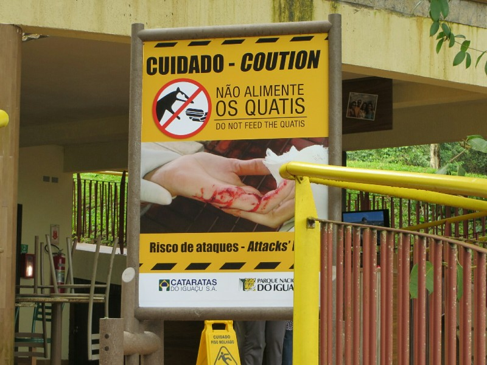

*Vicious Creature Apparently....*

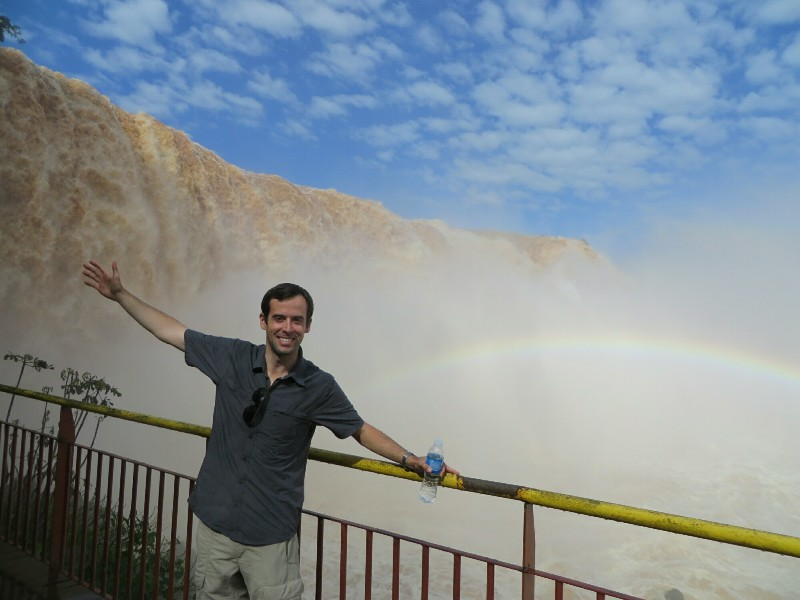

*Pat Getting Wet From The Mist*

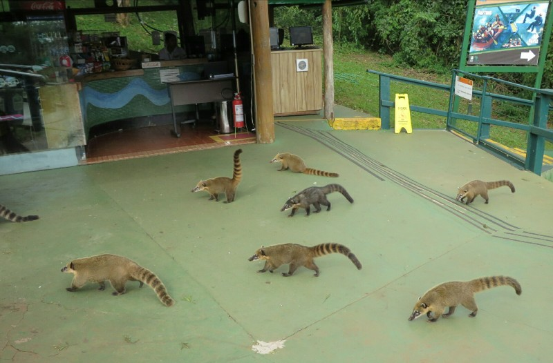

*An Army Of Cute!*

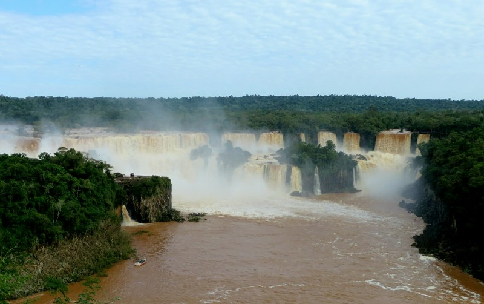

*Overview From The Brazilian Side*

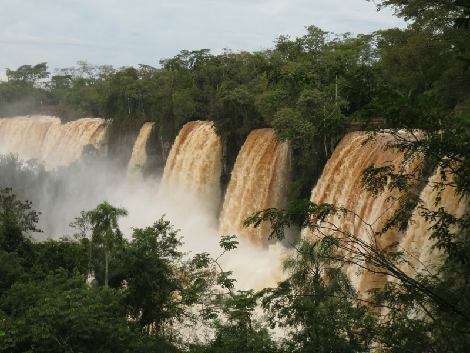

*Water Bursting Through The Forest On The Argentinian Side*

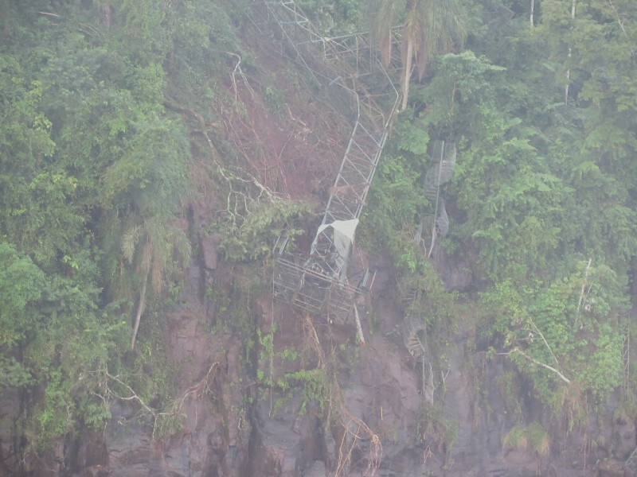

*Probably Best They Closed This Walkway*

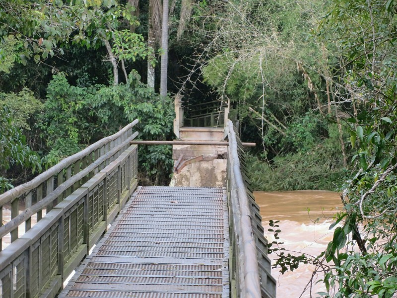

*Another Closed Walkway*

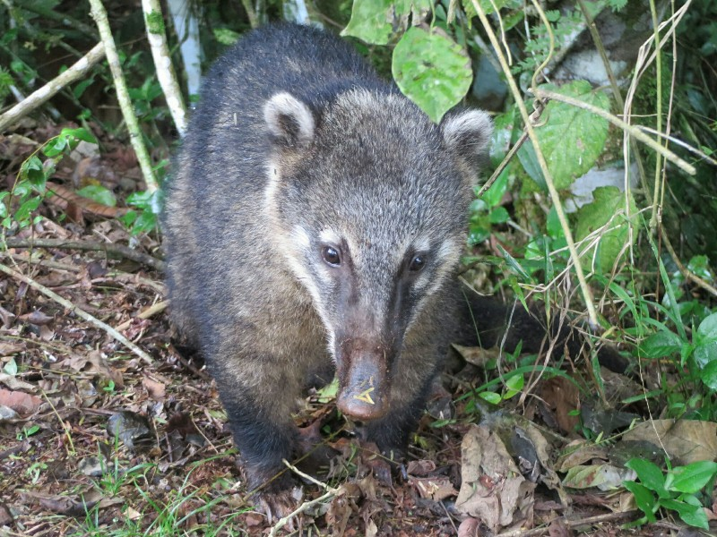

*Been Snuffling*
