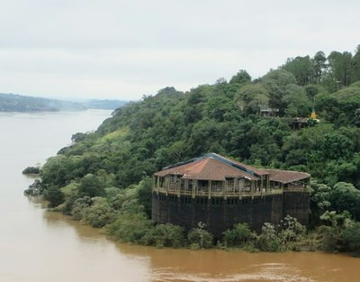
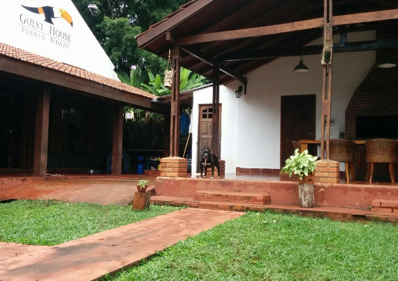
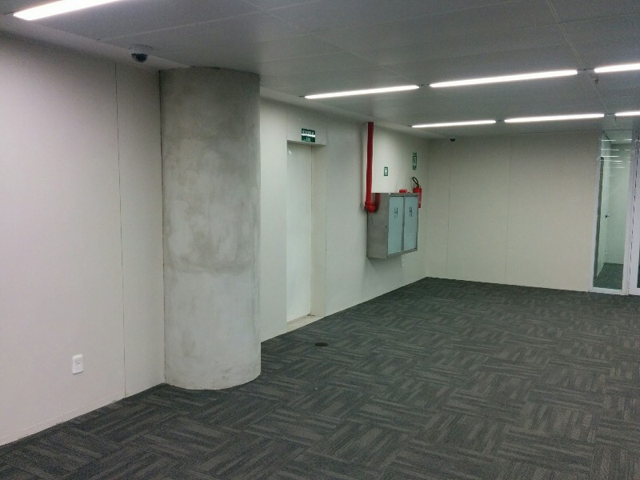
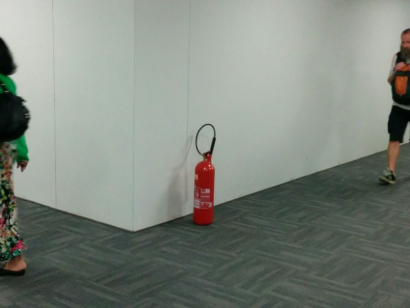

Last day in Argentina! The only other sight we wanted to see in the area was Tres Fronteras, a point from which you can see the Brazilian, Paraguayan and Argentinian borders all at once. After out last breakfast with Lauren we wandered off. After about an hour we hit the border, had a look, took a few photos.

*Brazil & Paraguay!*

On the way back we stopped for a speedy lunch. They said they would make stuff quick because we were in a rush, then took a half hour to make a sandwich. Ahhh South America! Also random side note, they always pour your drink for you here, but only fill the glass maybe one third of the way then stop. Water, soft drink, beer... Always just a sip worth in the cup. Weird. On our late arrival back at the hotel we found Roberto waiting, said a quick goodbye to our new friend and headed across the border to the airport.

Immigration in Argentina was easy and straightforward like last time, we could do it from the back seat of the car! Brazil however- mental. All the windows were closed. We waited with Roberto in a long queue for maybe 40 minutes getting more and more worried about missing the flight. Eventually they open the door, Roberto squeezes past everyone and gets in early, gets us some stamps and we race to airport, Roberto driving scary fast in the rain. We got there about an hour before the flight left and joined a long queue for security. Got through that, then joined the next long line for check in. When it was about to close and we were still behind a lot of people Pat spotted a self check-in machine with no queue and used that. Dropped the bags, another queue for security again and made it to the gate just as boarding was closing. Clearly this airport and border crossing have not prepared for the increase in tourists with the World Cup!

*Sorry We're Leaving You Lauren :-(*

First flight was to Rio, uneventful but for a landing/football song the Argentinians burst into while waiting on the tarmac for the seatbelt light to go off. No idea what it was about but it was certainly cheerful! During our brief stop in the Rio airport we looked for a Portuguese/English dictionary in the bookshop- not a one. The flight to Natal had their final call one hour prior to departure which seemed excessive- we thought maybe they want to be able to say all flights during the Cup ran on time by having them depart early? The flight is more than half Americans- guess they're going to see Ghana vs USA too!

The inflight magazine had an interesting article on FIFA explaining they're based in Switzerland because they can claim non-for-profit status and pay no tax. Dodgiest organisation ever!

Arriving at Natal we were reminded that people are selfish. Pushing and shoving to be at the front of the baggage claim carousel, carts in tow only to stand there and block everyone else from seeing their bags. Some woman and her two friends shove directly in front of Kate, completely obscuring her view of the bags. On finding Kate just copes by hopping on tip toes intermittently to peek over their heads, the lady decides she needs to try harder and collects a second cart to wedge between Kate and the carousel, parking it lengthwise along the carousel to take up maximum space and guarantee no one will be able to reach their bags when they arrive. Interestingly we find the Americans from the flight all stand a polite distance back to let everyone see; it's the locals encouraging chaos.

*Almost Finished The Base Coat!*

We also note the airport is incomplete. There are 3 ATM's, one only accept a few cards (including Citibank-phew). The others are broken. Too bad if you need money for your taxi to leave! The toilets are sitting uninstalled in front of the bathrooms, which are blocked off with yellow cones and guarded by people in uniform. Half the walls are unpainted and only one shop is open. There's a taxi booking service running out of a sparse office with one person standing behind a folding table with a lone computer sitting on it. No other furniture and over 100 people queuing. Apparently this airport and the new stadium are where all Natal's World Cup money went. The airport in this small 2 million person city is going to be the largest in Latin America when it's finished! Seems a little excessive...

*No Cases For Fire Extinguishers, Just Chilling On The Floor*

We skip the queue for a cheap pre-book taxi and find one out the front instead. It's 12.30am and we've had enough of airports! The taxi driver is great. There are massive floods, it's raining hard and the roads are riddled with potholes. After a half hour of bumping, puddles and closed roads we reach an area of road so badly flooded (maybe 20 metres in distance and 1 metre in depth?) every car in front of us did a U-turn to find an alternative route. The driver asked if we wanted to turn back. Kate thought maybe... Pat said 'No way! Let's do it'! The driver liked this answer! He went for it! The water was above tire level and coming up the door... Other drivers behind us stopped and watched to see how we fared before they made up their minds. And after a nerve wracking 30 seconds... we made it! Dry and almost there! We arrived at the hotel just past 1am, had a bunch of problems with the booking (they couldn't find us, found a James and sent us off, called 10 minutes later explaining this was the wrong James' room, we had to change room, would have to change again in the morning, argh) but managed to get to bed just before 2am.
