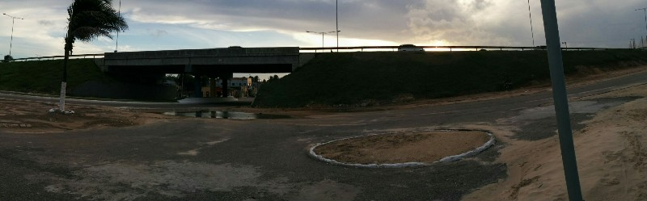

After our adventures last night, we both enjoyed a well earned sleep in. The good feelings didn't last long as we were asked to move rooms twice more before we went up to have breakfast. It seems like the people in this hotel are really struggling with the concept of keeping track of who should be in each room.

Breakfast was included and while it was lacking in eggs, it involved three different cakes! And you can't complain too much about free food. At least that's how we felt until we walked by the front desk on our way out and they tried to charge us around $40 for breakfast. I tried to explain that we had pre-paid everything ahead of time and that breakfast was included with our booking, but between me not speaking Portuguese and him not speaking English we didn't get very far. In the end, he called the woman we made the reservation with and cleared everything up.

Unfortunately this turned out to be a common theme in Brazil. We knew that not many people would speak English but we thought that with the World Cup coming to all these towns, at the very least the tourist hotels and services would have made an effort to have some English speaking staff around. We were thwarted at just about every possible opportunity which made things that should have been very simple frustratingly difficult. Case in point: we managed to track down a little tourist information booth near the hotel and we asked the woman working there how to get to the Fan Fest on the other side of town. She helpfully explained that there was a bus that ran every 15 minutes that would pick us up from a nearby stop. Excellent! 40 minutes and zero buses later we opted to take a taxi instead lest we miss the game.

*Roads Flooded With Sand And Water*

For some reason, Natal decided to build their Fan Fest on the opposite side of the CBD to the main tourist center of Ponta Negra, 40 minutes drive by car. Odd planning but not the end of the world, just means more taxi rides. What really sucked is when we showed up and the bloody Fan Fest was closed because of the heavy rains a couple days prior! No notices on FIFA's website, no advice from the tourist booth when we asked about getting there, just a $25 taxi ride which dropped us in this (seemingly) dodgy part of town.

Not willing to give up on Natal completely at this point, we started walking towards what was supposed to be the large tourist information center in the middle of the CBD. After 15 minutes of walking, the neighborhoods got a bit too sketchy for our liking so we hopped in a cab and had them take us the rest of the way. When we arrived, there was no information anywhere! The "tourist information center" turned out to be a huge building full of local craft shops and one desk for information with no one behind it and the (potentially useful) brochures in boxes behind it.

Having experienced too many fails for one day, we gave up when it started to get dark and went home to eat and watch the last game (Argentina vs Bosnia, who played really really well, amazing defence) from a nearby restaurant. More bad overpriced food, and a $10 cover charge each(!) to enter the restaurant and buy our meals. What wonderful logic.
