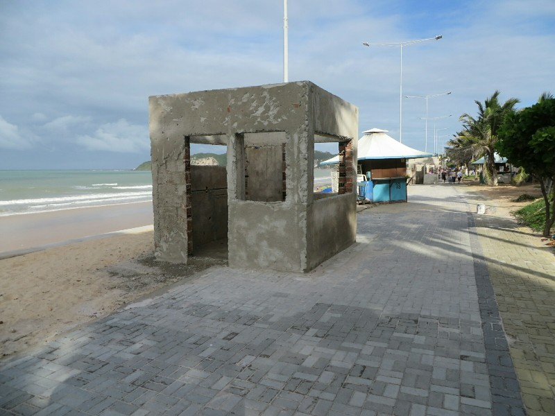
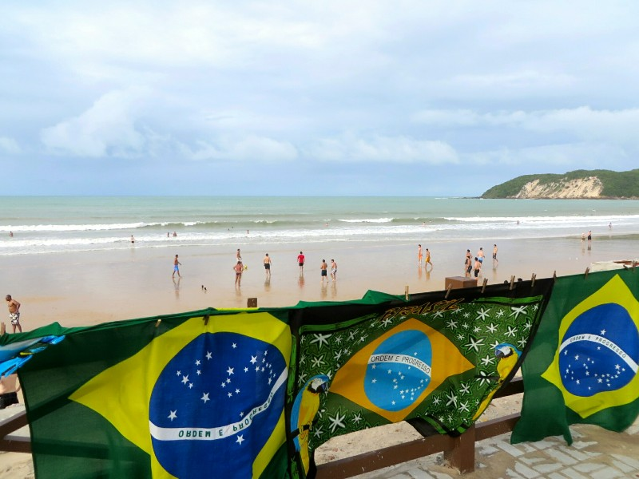
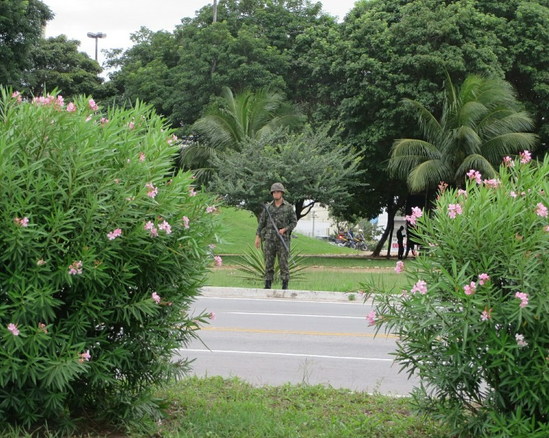
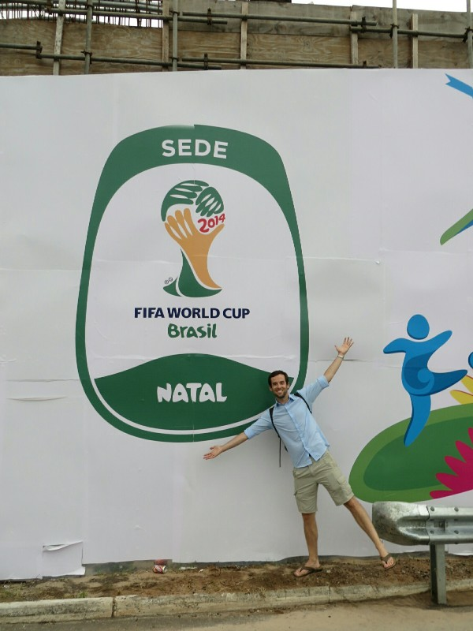
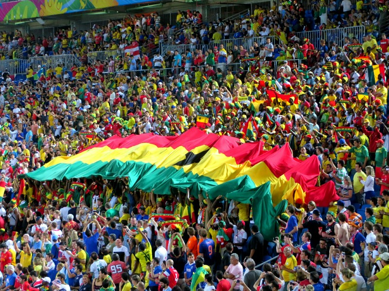
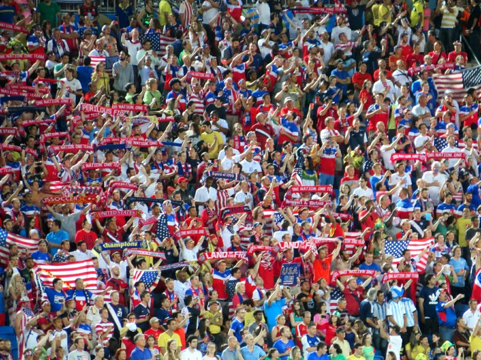
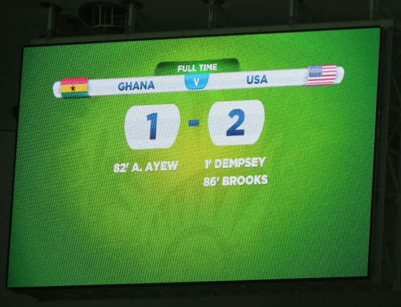
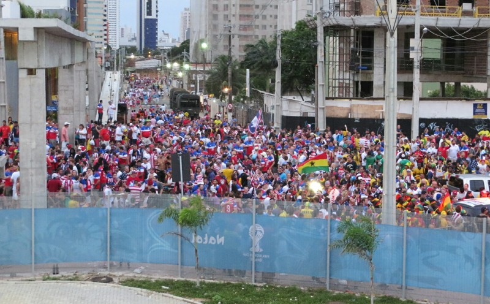
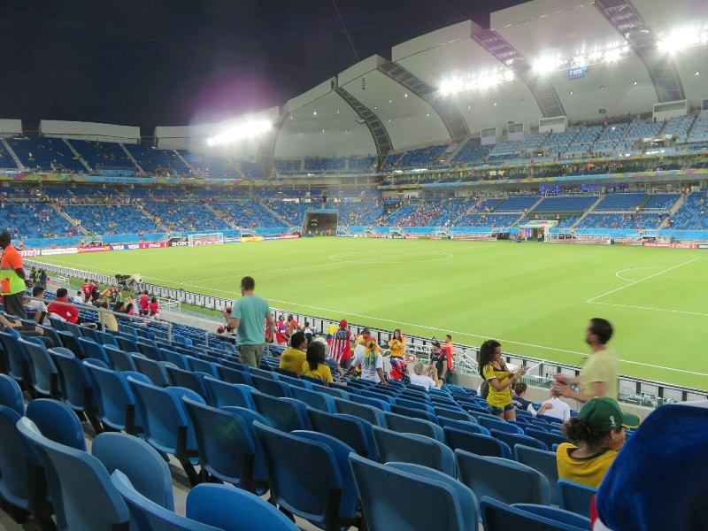
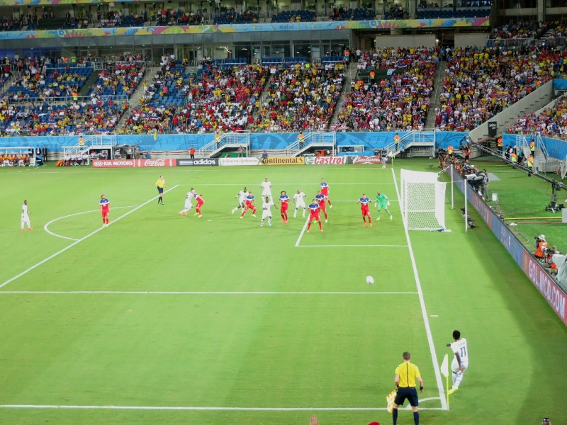

Today will be better! We get up and have another decent hotel breakfast. At breakfast a couple walk in wearing yellow and green. Kate tries to decide if they're Aussie supporters, Brazilians, or American fans in local get up. She tries to listen in to hear what language they're speaking but they're so quiet! Which almost guarantees they're not American or Brazilian. Eventually we strike up conversation with them and a Scottish journalist at the next table- turns out they're Canadian. Explains the soft morning voices. And they're lovely! We had a nice chat.

After this positive start we shower and head to the beach. Much busier and more full with tourists and shops than anywhere else we've tried. Similar to the dodgy beach near the Fan Fest, there are half built concrete and brick stalls which look as if they were destined to be food or drink shops but they gave up halfway. There are sections of the footpath that are being uncovered after being buried in dirt from unkempt empty blocks during the floods. But, all that said, at least there are people here, there's atmosphere and the beach itself is fairly nice. Lots of people playing soccer and one group even playing cricket!

*Incomplete Beach Front Store Converted Into Public Toilet By Drunk People*

Wandering along we look for team scarves or headbands or jerseys at little stalls like we found in South Africa and Kate saw in Germany- they are only outfitting Brazil supporters. Apparently if you come to Natal you're a fan of Brazil. Doesn't matter if they're not playing! Brazil and only Brazil. Seems like they're losing a lot of revenue with this tactic... Despite their attempts there are tons of American fans decked out top to toe in flags, boardies, earrings, socks, shoes, dresses, singlets...  Everything you can imagine. Must have planned ahead.

*Brazil Supporters Only!*

After we reached the end of the beach we headed back to the hotel and on to the mall containing the FIFA ticketing center to pick up tix for Manaus. We arrived just as the Germany vs Portugal game started (go Deutschland!) so we found a bar/restaurant to watch from first. The service was appalling- waited 45 minutes for two beers after asking 4 different waiters and got nothing anyway, the food took over an hour to come out, and Kate's "fish" was unidentifiable, squishy and mostly inedible. Pat had an OK steak but left the potato au gratin untouched for the same reason Kate left her fish. So far Brazil is proving the worst food in the world, beating Cambodia out for the title! In spite of the awful service and the questionable food they still found it within themselves to charge us AUD $50.

Oh well. After Germany thrashed an ever more frustrated Portugal 4-0, we grabbed our Manaus tickets (painless) noting that all the staff are volunteers. I guess FIFA is a non-profit, how could they afford to pay staff, right? From there we walked to the stadium. The whole road was lined with armed guards, individuals and literal truckloads. They were fully decked out in body armor with huge rifles slung across them. Apparently the extra security is in place for team USA and their supporters as they're not the most popular globally and there is an increased threat of an 'incident'. Looking at what's required to try to keep them safe we're a little glad we failed on the team colours exercise.

*Sneaky Photo- These Guys Were Posted Every Few Metres*

Our tickets for this match were a gift from Beeks and Annie, and Wally and Tania- awesome gift, thanks guys! At the stadium we get in without any problems despite the friend-of-a-friend's tickets we're sporting. Apparently Kate didn't need to memorise the other person's name on the ticket, call Pat 'Ryan', insist on being called 'Priya', come up with a back story for the unusual name.... Overkill is her middle name. Out front of the stadium we meet our first nice Brazilian while buying some beer. We lingered around the outside of the stadium for long enough to take a few pictures and to see what's on offer entertainment wise: not much as it turns out. A few girls (employed by Budweiser) dancing awkwardly on a stage and a DJ playing some music. Figuring the real fun is going to be inside anyways we make our way to the gate and as we're heading up the stairs we hear the chanting from the USA supporters crescendo and we realise the team bus is driving up accompanied by an extensive motorcade. Not only the standard police motorbike escort to clear traffic, but two full military transport trucks full of soldiers armed with rifles. Oh, and there were 3 helicopters following the action as well. Soccer is just a game, right?

*World Cup! Yay!!!*

One inside we find our seats, close to the field and in line with one of the goals, not to shabby! The Ghana fans showed up early and they brought their rhythm section with them. The drums and bells stated well before kickoff and didn't stop until the game was over. Their constant singing and chanting made for a great atmosphere. The USA fans need to take a page out of their book. The only chants we heard during the game were monotonous "U-S-A, U-S-A" and "I believe that we will win". With all the talent in the US, surely we can get someone to compose a few catchier, creative songs and chants for us to compete with the other fans?

We bought our tickets for this game from a friend of a friend. When you put in your ticket application online through Fifa they asks you which team you support. This person mustn't have selected the USA because we ended up in a section with a bunch of international supporters (Irish, British, German, Japanese) which was kinda fun. The food in the stadium was quite terrible: a questionable sandwich and plain hotdog with no sauces to choose from, but what it lacked in quality it made up for in price. At least everything was cheap.

*Ghana Supporters*

During the game Kate saw a fight almost break out over sitting down. Some red head guy in the front row was the last person in his section standing up and was refusing to sit so others could see. Eventually he capitulated but not before turning around and hurling obscenities at the people behind him and trying to provoke a fight. Such lovely people in the world. Contrast that to the people in front of us: a man and his young son who were overly considerate. The kid was wearing a large Uncle Sam style American hat which wasn't a problem most of the time cause he was quite short anyways, but when he had to stand on the seat to see the dad reminded him to take it off so as to not block our view. After being told maybe twice the kid was doing it on his own for the rest if the match. Excellent parenting.

The game itself was pretty fun. The USA scored in first minute which got everyone on their feet. After that the USA seemed to have trouble keeping possession and it looked to us like Ghana dominated, but luckily our defense and keeper were all in good form so no goals came of it.

*USA Supporters*

At half time Kate was surprised to find there was a queue only for men's bathroom, not the women's. First time ever in history I suspect. However despite being a brand new stadium a number of doors in women's bathroom were broken already. There was an awfully organised queue for food- hard to describe but it resulted in one counter with no customers and a long line at the other. People trying to go to the empty counter from halfway through the queue were tuned back by staff until a persistent Brazilian sweet talked them into letting him through. Others waiting longer were not impressed and this almost resulted in another fight. After all this drama, on being served it turns out they had run out of everything by halftime except chocolate, so people were waiting in the horrible queue for nothing. Ugh, Brazil!

In the second half the USA was still having troubles, passing almost exclusively to Ghana or out of bounds. Ghana had a million shots, and eventually one went in. Despite letting that one through, the USA's goalie was excellent the entire match. The USA was quick to respond with a goal from a corner kick a few minutes later and managed to hold the lead till the final whistle. Woo hoo!

*Estados Unidos!*

Leaving the stadium there was no signage for buses, just masses of people walking in every direction. We followed the blob in the direction of our hotel until the people started getting thinner and thinner, and then we started to get nervous.  Still no buses, but there are private shuttles offering rides to Ponta Negra for 20 Reals ($10) per person.

As we started walking over a very large and unfriendly looking overpass we ran into two Americans going the same way as us and we wandered together until we eventually found a taxi.  Back near the hotel we spotted a gelato shop and couldn't resist so we grabbed two- both very yummy!

*Everyone Arriving In A Bottleneck Corridor*

*Our Pretty Rocking Seats*

*Failed Corner*
