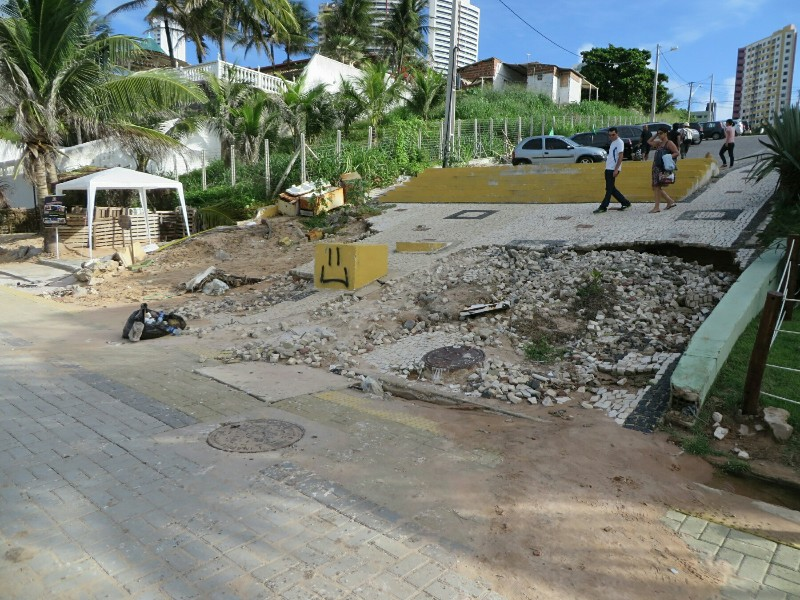
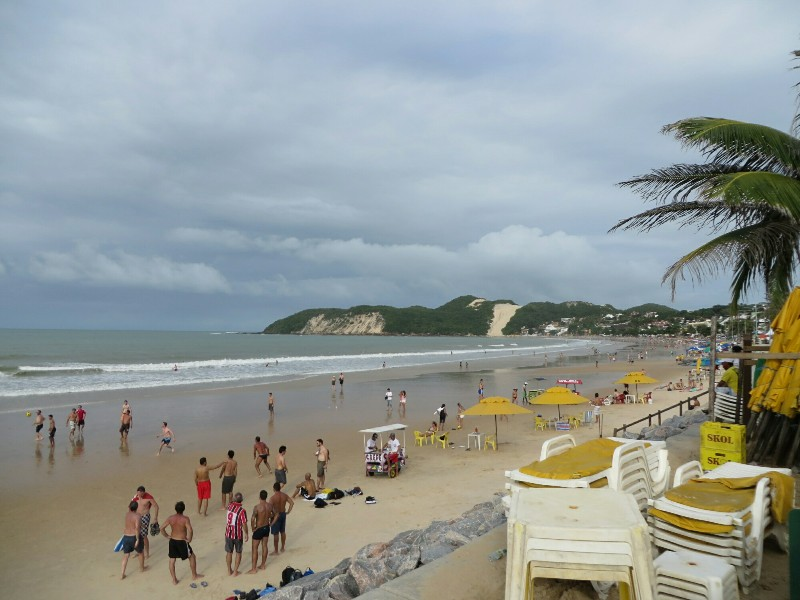
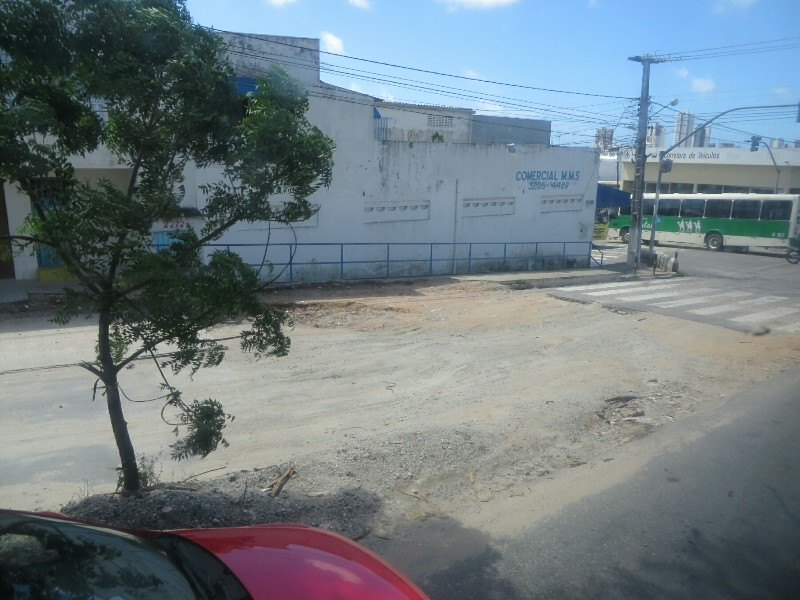
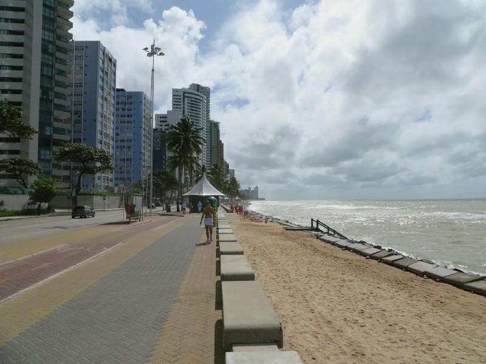

Breakfast with the nice Canadians again and the Scot's American travel companion. Apparently we're the late breakfast crew. We shared our stories of the previous night: the Canadians ended up getting a lift home from some random local who was picking up stragglers walking alone in the rain because he was concerned about their safety. How nice! We all agreed Ghana probably outplayed America, but we're glad the US won anyway. Hopefully they pick up their game and beat Portugal!

*Didn't Quite Finish The Path To The Beach...*

Next we ventured out for lunch and a place to watch the Brazil v Mexico game. We walked along the beach until we found a place that had TVs that looked suitable and we grabbed a table. Service here is horrible! The waitress will take one person's order then wander off aimlessly, forcing us to yell after her to finish the order. And they don't sell half the things on the menu. As it turned out, this place ended up being leagues better than any restaurant we've been to yet. The waitress, despite the initial troubles, was super attentive. She brought out food quickly, came back frequently to bring more drinks, brought the bill when we asked - all the things that have been lacking everywhere else. And the food was actually edible! In actual fact- quite good! And it came with veggies, we've hardly been able to get them in South America. Such a nice change.

During the meal, the red head dude from the game last night (the jerk who wouldn't sit down and almost got into a fight over it) was at lunch with a group of people and needed a seat. Kate was initially going to offer him a seat at our table until she realised who he was and promptly changed her mind. So he had to stand- oh the irony. Suck it red! (Yes we're petty...)

After the game (a surprisingly exciting 0-0 draw) we kept walking along the beach for a while, bought a delicious Iranian churros which is apparently a regular churros with hot chocolate sauce pumped into the center (amazing), and eventually made our way towards home for the day.

*But It's Nice Once You're There*

Up early for our last day in Natal to meet Fernanda (the lady we booked the room through) so she can give us the bus tickets she bought for us. A few minutes before we were supposed to meet her at reception she knocks on our door and apologises for all the confusion during check in and gives us the tickets. She mentioned that they were both booked in her name so we would have to go to the desk at the station and have them changed before we left.

That sorted, we had our last brekky at the hotel, checked out and had them book us a taxi to the bus station. What should have been a simple matter of waiting a few minutes for a taxi to arrive (this being the most dense tourist area in town) turned into us waiting nearly 25 minutes and having to run up and hail one from the street in the end. Can't emphasize enough how unimpressed we are with Brazil's organisation so far.

We arrive at the station 15 minutes before the scheduled departure and run to the desk only to find a nice long queue waiting for us. We give it 13 minutes then say screw the names, we're going to miss the bus either way if we don't run now! The man checking tickets to the departure area helpfully tells us that our slips of paper that say "ticket" on them aren't actually tickets, we need to go back and wait at the desk. We cry, 'We don't have time! The bus leaves now! We paid!" All in our best Portuguese. Either he understood and took sympathy or just didn't want to deal with us anymore but he eventually opened the gate and told us to run. The driver of the bus was checking IDs against the names on the tickets as people boarded so we nervously approached and again tried to explain our friend bought the tickets and we didn't have time to change the names and we're so sorry and please please let us on the bus! He looked at us blankly, ripped the ticket stub off without reply and motioned for us to get on the bus. Huzzah!

*A Lot Of The Suburban Streets Were Incompletely Paved- Could've Been A Better Use Of Funds Than A Giant Airport??*

The ride was uneventful except for a half hour lunch break. Kate ducked to the bathroom while Pat bought some cashews (one of the local specialities). As he stood at the counter he saw the bus pull away through the window. He ran out but it was already gone and he couldn't chase it down the street without Kate. When she returned a minute later her tired saunter turned into a panicked run with Pat down the highway until two Brazilian boys shouted after us and pointed out our bus (which was still there) and explained it was another of the same company that left. Palpable relief!

We arrived to Recife late, but it has this new fangled thing called a 'public transport system' so despite it being 4.30pm we could get to the accommodation without forking out $50 for a cab. Amazing! Here we're staying at another Air B&B deal, for the first time staying in a room in someone's home rather than renting a whole studio. We're a bit nervous at the prospect, but it seems we didn't have to be. Our host, Elisabeth, is lovely- serving us fresh juice and a local chilled sweet soup when we arrive, then suggesting all kinds of activities for our time in Recife and a local restaurant for dinner.

*Recife With Complete Beach Front Stand In The Background!*

After all our hellos and snacks we head out to check out the local area. The beach is only a few blocks away, and while the beach itself probably isn't as nice as Natal (quite a narrow sand bar and apparently sharks) it's presented so well it's a much nicer place to be. In place of incomplete circular brick structures there are mini bars selling coconuts dotted along the well paved path. We are passed by many joggers following the signed 5km long path, there's a bike lane, there's a large, well lit park with play equipment, a skate park, exercise equipment and an art gallery. While there are still derelict areas, it looks like they have made an effort and the holes in the pavement are because of things being used, not because they couldn't be stuffed to finish things in the first place.  We grab dinner at the restaurant Elisabete recommended, a pay-by-weight buffet with a great selection and excellent value. We both fill up with food and drinks for under $25 for both of us. Recife is doing a good job of winning us over for Brazil
