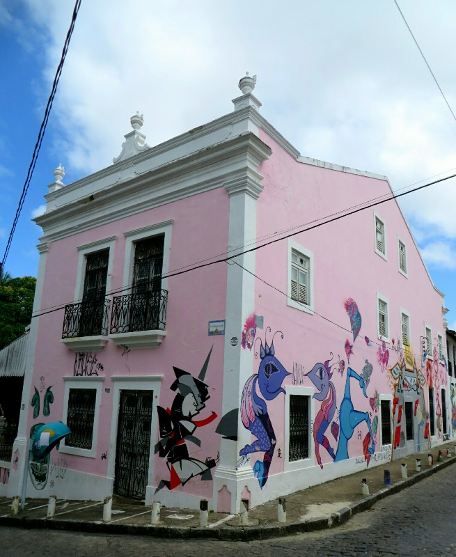
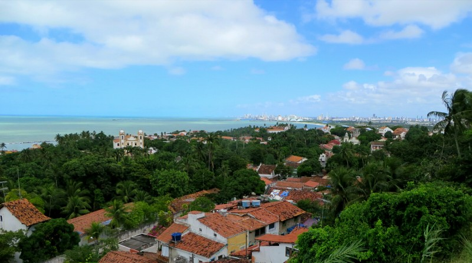
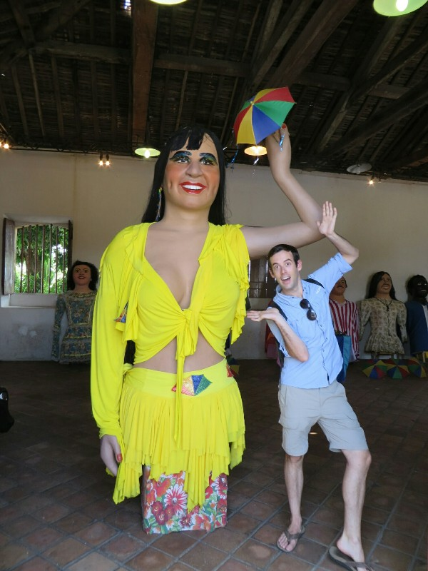
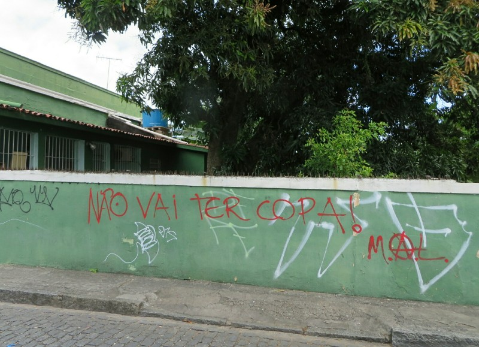
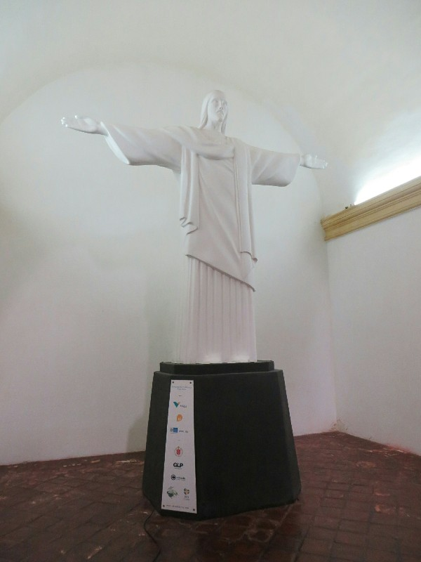
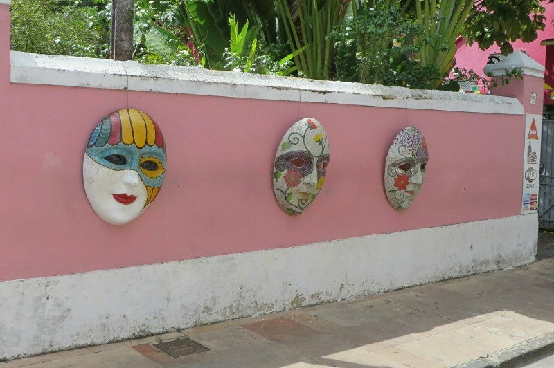
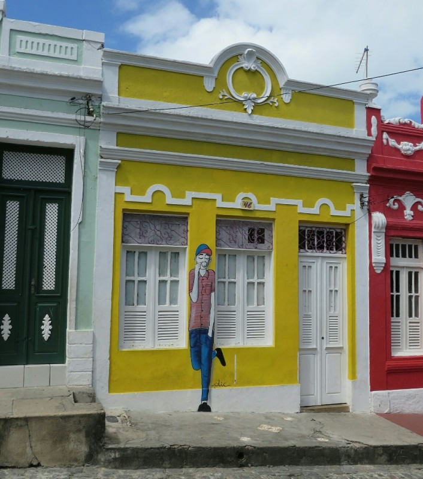
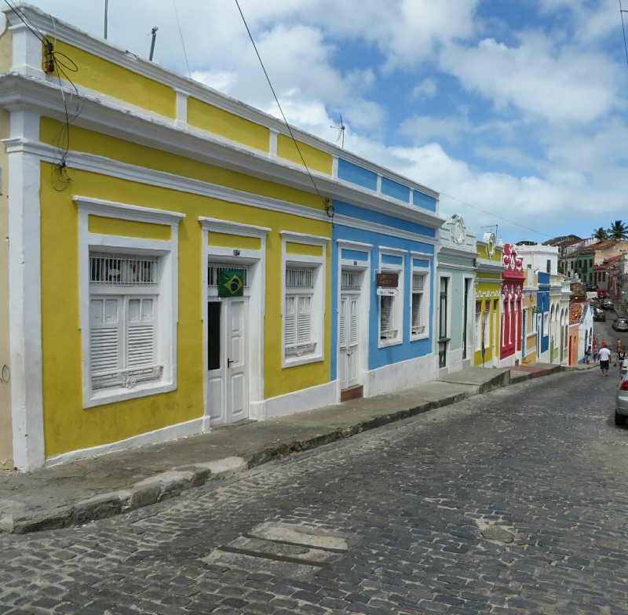

Around 7am we're both stirred from our sleep by something vaguely familiar: the sound of eggs cooking in a pan and the smell of garlic sautéing away. Yum! Elisabete was nice enough to put on a brekky spread for us this morning consisting of veggi omelettes, a local root vegetable similar to potatoes, fresh juice, a delicious sweet avocado purée, coffee, and bread! What an awesome way to start the day. Before she leaves she draws up a nice itinerary for us to follow today to hit the big sites and make the most of our short visit.

First up, we get a bus to Olinda, a historical town North of Recife. Bus drivers here are crazy. Is a good thing the brakes on the bus seem to be in good working order because the driver speeds like mad down the road only to slam on the breaks to avoid whatever obstacle comes his way - another bus, a car, pedestrian, scheduled bus stop, all really unpredictable things totally warranting basically skidding to a stop. Then, as if to make up for the fact that he lost precious time making such a unnecessary stop they slam their foot on the accelerator and dump the clutch after every gear change sending everyone lunging back and forth in their seats. Nauseating!

*There Was Fun Graffiti/Street Art All Over Olinda*

After an hour of this we finally arrive at Olinda in one piece and walk up a hill towards our first sight, Cathedral De Se. Perched on a hill it has quite a scenic view of Olinda all the way down the the beach. We can see lots of colourful houses, more churches than we can count and lots of people milling about. The church is not nearly as refined as the ones we've visited in Europe. Instead it is more understated and modest with bare white walls and a few decorations around the altar. After a few pictures it becomes clear that a service is about to start as a procession of people walking down the street makes their way towards the church. We take our leave and wander down the street, admiring the markets and a few more churches along the way.

*One Of Many Churches In Olinda*

For lunch we call into a creperie and hope for the best. Kate's is okay but Pat's comes out with several ingredients he didn't order and a very suspect tasting sausage filling. We miss Paris. With not much else to do in Olinda we catch a bus into town for the fan fest so we can watch the afternoon game there. This bus driver is a bit less psycho than the first, but still not great. We will count ourselves lucky to survive Brazilian public transport.

*Carnival: Not Creepy At All*

The fan fest is tucked on a wide street in the center of town bordering the water. Unfortunately there is no shade to be found which makes the hot sun even less bareable than normal. One very positive point is the beers are cheap so at least we can have a few cold drinks without going broke. The fan fest was filled with Colombian supporters and they made themselves heard. We were more focused on the unbearable heat and humidity than the game and when it ended we decided we didn't want to hang around for the next game and opted to head home instead which unfortunately necessitated another bus ride with another wannabe rally driver. After hopping off near Elisabete's house we stopped into a local shop to grab some beers to watch the game tonight and walked the last few blocks home.

That evening, we met our American housemates Eric and Angelina, both currently living in New York but originally from Texas and another southern state respectively (can't remember where Angelina was from). They were both soccer fanatics and were good fun to talk to, giving us all the gossip about team USA and some of the other squads. They had both lived in Madrid for a while and were quite jealous to heat that we were accidentally there for the Champions League final.  Once the game on TV had finished we all headed out for dinner - we went back to the buffet place because we are boring and can't resist good, cheap food and they went to another restaurant nearby. Another hearty meal sent us off to bed feeling contented.

*Basically 'Won't Have The World Cup', The First Sign Of Protest We Saw*

*Electric Jesus: Brought To You By These Sponsors...*

*Because Carnival Is Always Watching*

*More Colourful Houses And Awesome Street Art*

*Certainly Helps You Find Your Home When You've Had A Few To Drink (Unless You End Up In The Wrong Yellow House...)*
