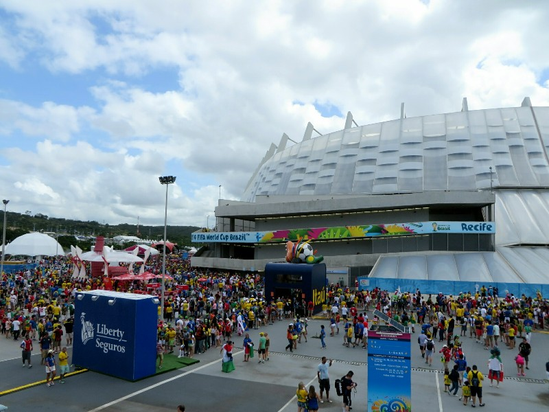
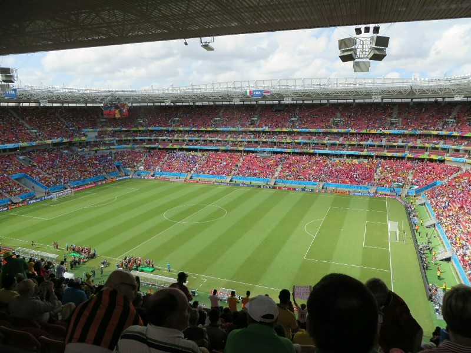
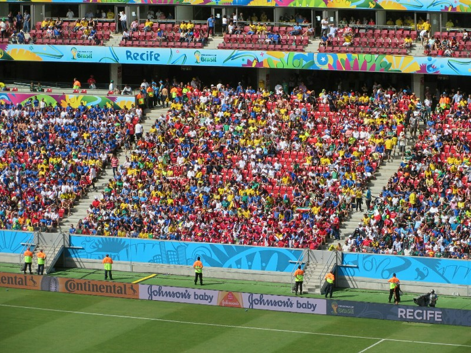
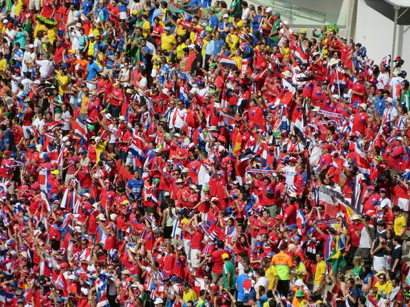
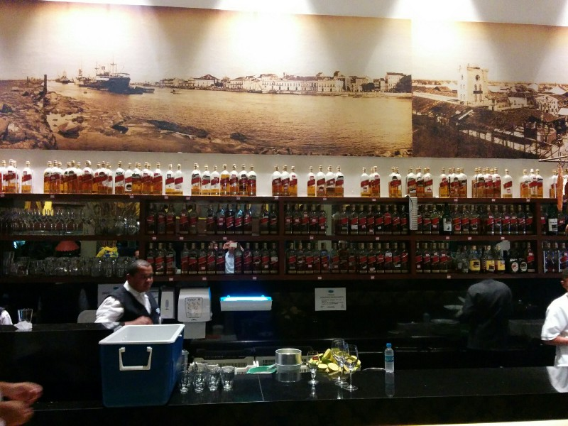
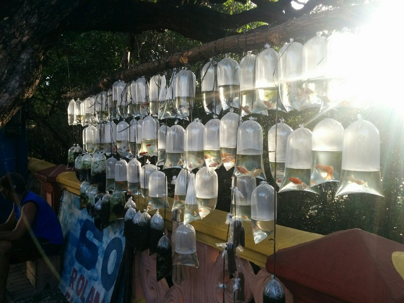
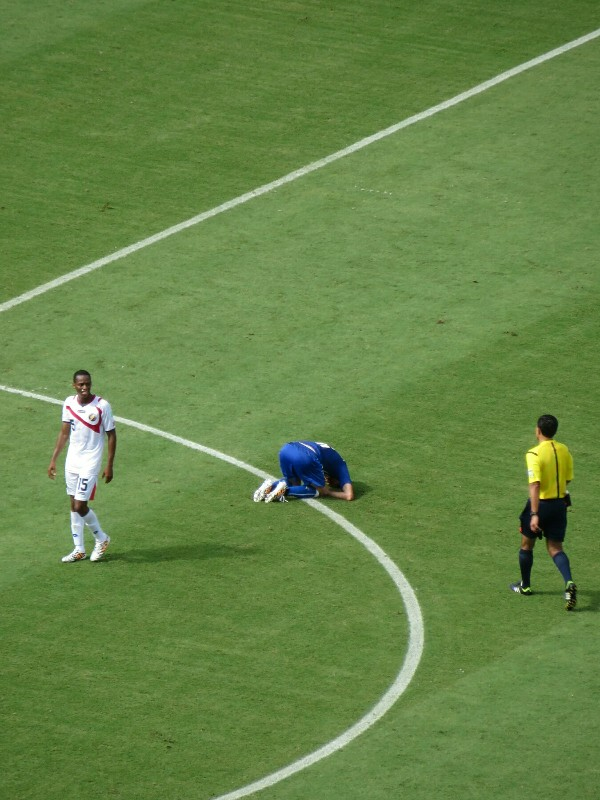
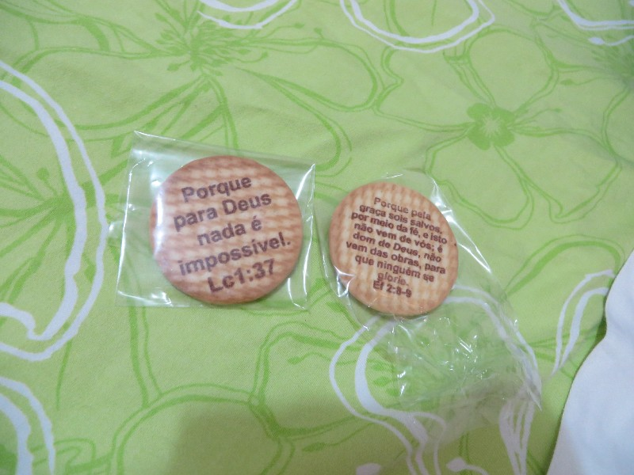

Up earlyish and get ready to head out with Eric and Angelina. They reckon it took them nearly 2 hours to get to the stadium for the last game so for our 1:00pm game today we're leaving the house at 9:00am to be on the safe side. Perhaps a bit overkill? Maybe, but there is no way we're missing this game after coming all this way.

These tickets were care of Tom and Mai, and Liang, and way the standings are at the moment this game has turned into a very important one - they're not only playing for first place in the group (and a spot in the next round), but the game essentially decides the fate of England as well. With England losing to Uruguay last night they need Italy and Costa Rica to tie today, or they're out. If one wins this game, they win the group and get through. We both kind of want England through, but will support Italy as cheering for a draw isn't too exciting.

Turns out we left at 10am (general lateness). We walked to the metro station, which was packed, but they had English speaking staff standing at every desk explaining the system- pay 7.50 and you get a wristband for the metro to a pickup point, then a bus to the stadium. We were amazed enough to hear there WAS a system to get to the stadium (other than feet), let alone INFORMATION on the system. In English! Amazing! Metro was crowded as expected, we changed lines half way and the train was packed with fans for both Italy and Costa Rica decked out in national attire. At the end of the line there were tons of buses waiting as promised... It all ran like clockwork, like someone had actually put some thought into it at some point in the last 12 years. Just fantastic!

*Crowd Arriving A Few Hours Per Game*

We got to the stadium just over an hour before kickoff. We spilt with Eric and Angelina, then spotted a delicious looking tapioca crepe thing and tried our hardest to procure one. We found out later that this stand didn't exist for the last game so this was their first time serving people, and it showed! The stand had four sides with a sign over one side saying "pay here" in Portuguese. Of course being one of two food stands outside the stadium the queue was massive. While Kate was waiting in the queue Pat had time to wait in the equally massive beer queue buy two beers and walk back to meet her. Once at the front you had 6 food options appropriately numbered 1 to 6. After ordering you received a laminated ticket for your order and then had to move to the adjacent side of the stand, wait in another queue, present the ticket to a different staff member and wait for them to make your order. In a brilliant organizational blunder someone decided it would be best to split the food stations: options 1-3 would be prepared and served on the right and 4-6 would be done on the left. This meant if you wanted a serve of option 1 and a serve of option 5 (which wasn't an outlandish request) you had to queue to pay, queue on one side for the first part of your meal then queue again on the other side for the other half of your meal. Simply. Absurd. To top it all off, the lines were so long that they had to stop allowing people to order and pay because they ran out of laminated tickets as so many people were waiting in line for their food!

*Another Set Of Awesome Seats On The Goal Line*

The organization inside the stadium was marginally better. An hour before the game even started they were out of food. All they had left were packets of chips which was okay because we figured we would just get something now to nibble on during the second half. By the time we got to the front they were now out of chips but had cooked some double cheeseburgers. It seems to us that they drastically underestimated the number of people who would want to buy food at a game being played at lunchtime. But I guess it's not like FIFA would have had prior experience organizing a tournament like this. The first time is always a challenge.

*Disappointing Number Of Empty Seats*

Whinging aside, the game was really exciting. The Costa Ricans came out in force, all decked out in red and blue and belted out some intimidating sounding songs to encourage their team. The Italians were scattered throughout the stadium and for some reason didn't have a core fan section which we both found odd. The referee made some truly terrible calls and didn't make a number of obvious calls, one of which should have resulted in a penalty kick for Costa Rica and given them a 1-0 lead. In the end, Italy just looked unsure of themselves and played a bit sloppily, which in combination with the poor refereeing resulted in a score of 1-0, Costa Rica. Unlike Italy to play so poorly, which was disappointing, but very impressed with the underdog Costa Rica!

*Costa Rica Section*

After the match we one again enjoyed the wonderfully organised and well signed public transit (and met Eric and Angelina randomly at the metro station) and made our way into town to the Fan Fest where we watched France utterly destroy Switzerland 5-2. After that thrashing we decided to head to a bar Elisabete recommended just around the corner. Sounds easy, was near impossible. We went to the address on Google Maps (as copied from their website) and found ourselves on a dodgy, dimly lit street in front of an abandoned building with a man peeing on it. We were ready to give up, but Eric and Angelina were having none of it! Their enthusiasm was catching so we walked back to a petrol station we had passed and asked for directions- the man confidently pointed up the street. We followed his directions and found precisely nothing. The next few people we asked didn't know what we were talking about. Elisabete told us a landmark it was near so we went there and wandered aimlessly finding nothing (although the area was much nicer)! Finally, when we were ready to give up for real, we decided to go behind a large market to the ocean front, and low and behold, there it was! Finding the door was a trial in and of itself, but once we got in we enjoyed cheap caipirnhas, some fairly nice food and watched Ecuador beat Honduras.

*Excuse Me Barkeep, An Entire Bottle Of Whiskey Please! I'll Come Back To Finish It Next Week. Maybe.*

At what felt like midnight, but turned out to be 8pm, we got a cab home with a super fun cabbie who wanted to talk about his favorite music (Kraftwerk, Depeche Mode, Chris Isaac, Madonna) and was in disbelief that Americans and Australians could understand each other without lessons. We finished off the night with a couple of beers and a chat in the living room, getting some suggestions of things to do in New York. People you meet traveling are so nice!

*Street Vendors Selling Goldfish... That's New*

*If You Don't Stand Up By The Time I Count To Three...*

*Evangelists Were Handing Out Free Bible Cookies Out The Front Of The Game*
