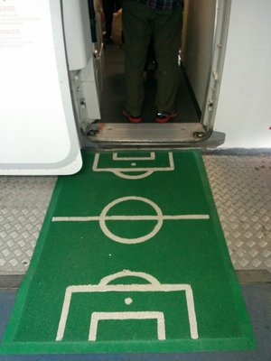
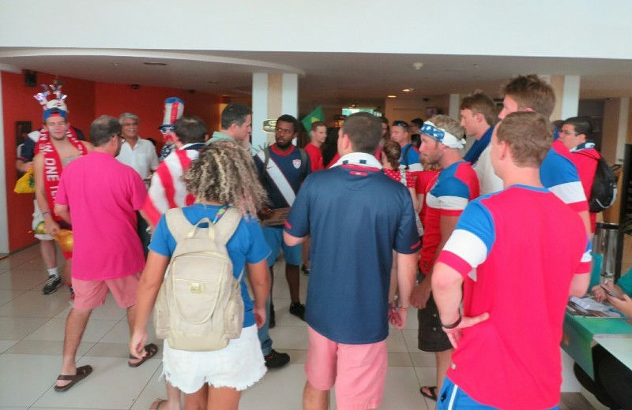
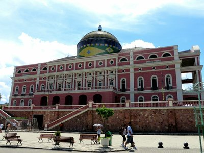

Up and out of the house in record time to catch our taxi at 6:30 for our early flight to Manaus. The taxi is seriously speedy taking 4 minutes from door to door. That has to be some kind of record!

*Doormat Into The Aeroplanes Getting Into The Spirit*

Before we left for the trip, our time in transit through Brazil was always what worried Pat the most. Having read lots online about how overcrowded and inefficient Brazilian airports were he was prepared for the worst, but so far it looks as if the airport in Iguazu might end up being the exception. The airport in Recife is huge, centrally located, well staffed, and just generally pleasant! Shops existed (and were open!), staff knew what they were doing, flight information was well signed - the whole experience was just downright pleasant. We had a quick brekky in the terminal before heading through security and into the plane.

The flight to Manaus was actually three separate flights where we landed and stayed in the same plane, each about 2 plus hours in duration which meant the whole journey lasted from 7:30am to nearly 3pm. Long day for "one" domestic flight. Another benefit of the flights being broken up like that was the airline wasn't obligated to feed us a proper meal despite us not being able to leave the plane for around 8 hours. Some people had been on the plane even longer than us (Recife was stop two of the five city extravaganza) and we felt really bad for them. The flight crew did take pity on us and brought around extra packets of chips to try and hold us over for our late lunch.

When we eventually landed and took a cab to our hotel (which was apparently ground zero for all the visiting USA supporters) the first order of business was finding a place to eat and watch the Germany v Ghana match. We wrongly assumed this would be an easy task and left the hotel in what we thought was the direction of downtown. After 20 minutes of passing shop after shop with no sign of a restaurant or anywhere with a TV for us to watch the game we started to grow a bit desperate and began frantically checking Google and TripAdvisor for something, anything nearby. Eventually we came across a Middle Eastern cafe that had the game on TV and a handful of people out on the patio watching the game which had started 10 minutes ago by this point - eureka! The quality of the food was questionable at best but at least they seemed to prepare everything fresh so we crossed our fingers that we didn't get sick from anything. Surprisingly the hummus was one of the tastiest we've had in quite some time- better than Turkey! Go figure!

*Definitely Picked The Right Hotel!*

Most everyone had assumed that Germany would dispatch Ghana with the same coolness and precision that saw them demolish Portugal last week, but that wasn't the case. The Ghana players played tremendously well and were so unbelievably quick that each time it looked like the Germans might have a bit of space to mount an attack they were quickly surrounded by three Ghanaian defenders. Germany did manage to get the first goal, but Ghana pressed on and their continued fast breaks eventually broke through the German defense and they quickly made it 1-1. They scored again to make it 2-1 and really put the pressure on Germany to respond.

*Manaus Opera House- Pretty Cool For The Middle Of The Amazon!*

The game ended in an unlikely 2-2 draw which, with Germany being her favorite team behind Australia, greatly upset Kate. Pat was quietly pleased with the result as it gave team USA a bit of wiggle room in the group standings.

As we left the restaurant and walked towards the hotel (via a different street) we found the area where all the restaurants and even a giant outdoor fan fest style TV were hiding - right in plain sight a block from our hotel. Sigh! Good to know for the next few days at least. We also found a man with some unofficial team jerseys on the side of the road and much to our disbelief he was selling shirts for teams other than Brazil! Unlike Natal, Manaus doesn't seem to be crawling with armed military personnel (which ironically made us feel a bit safer) so we excitedly bought two team USA jerseys for tomorrow's game.

Feeling rather accomplished for the day we went home to do some laundry (really not going to miss having to wash clothes in a hotel sink when this trip is over), watch the final match of the day and head to bed.
