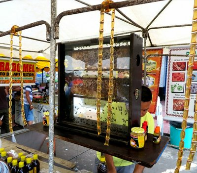
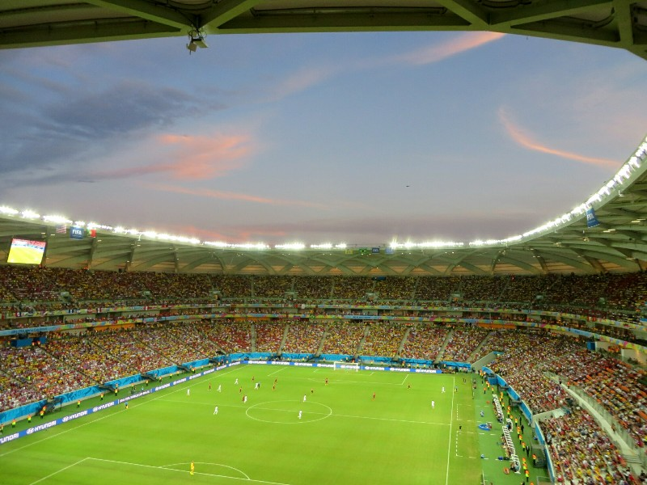
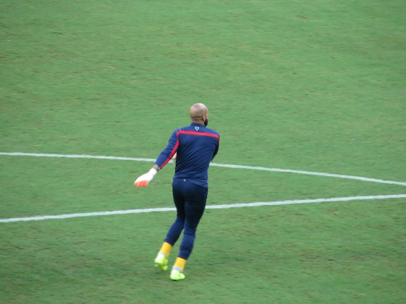
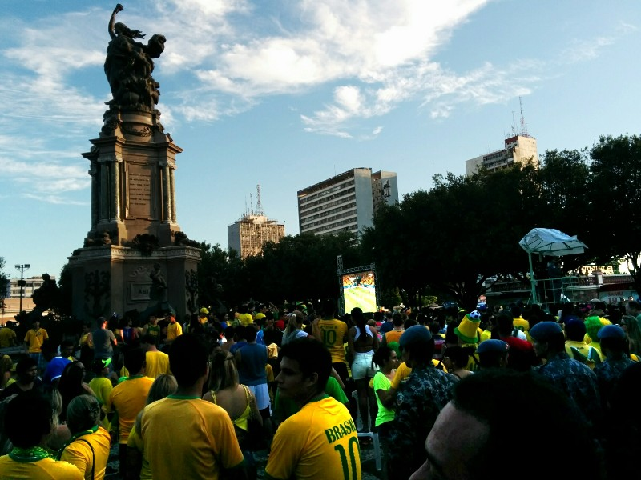
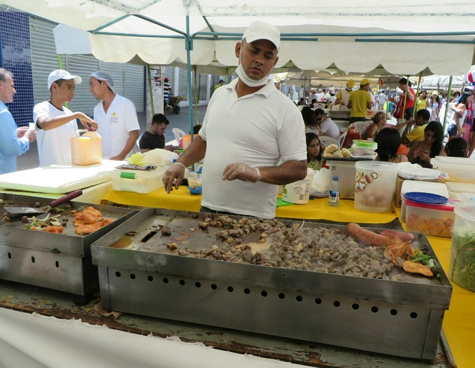
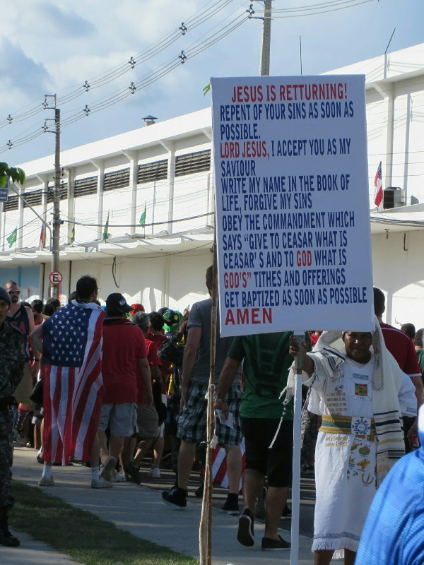
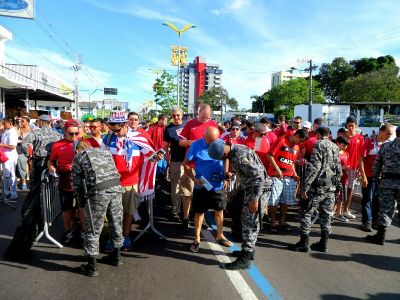

Our first order of business for the day was to confirm our trip to the Amazon. After an unsuccessful phone conversation where they quickly said our trip was confirmed without taking our names, asking when we were leaving or how long we would be staying and then hung up, we thought it would be best to speak to them in person. We faired mildly better at their office. Emphasis on 'mildly'. The woman had absolutely no idea who we were or what was going on. We assured her that she ran a tour company and that we had several email exchanges in which we organised for them to take us to the Amazon and had even agreed on a price! Kate eventually had to search the woman's computer for her and find our email which didn't help as much as we'd hoped it would.

In spite of the contradictory evidence in front of her, she still tried to sell us on a different tour for more money. We stuck to our guns and insisted on the dates and price we agreed to, mostly because we had nowhere else to stay for those four days. Eventually she gave in and had their driver take us to an ATM so we could give them a deposit. She even went so far as to give us an official receipt!

*Bees, Michael?*

Feeling accomplished, we decided to have a bit of a walk through town and found that there was a street fair going on with tons of food and lots of stalls selling everything from furniture to honey (with little mini bee hives set up to demonstrate the authenticity of their product). It was way too hot and humid for any human to be outside for very long so we settled on a place for lunch that looked like it was the most popular and therefore would have the highest turnover of food, hopefully reducing our chances of food poisoning.

Bellies full of food we walked back to the hotel to get ready for the game this afternoon. These tickets were a gift from Wally & Tania, and Nathan & Lisa. Like Recife, Manaus has organised public transit to the stadium for the game and all we had to do was wander over to the bus stop and pay a couple bucks to be dropped off right out front of the stadium. Again the bus was full of enthusiastic fans, including a few men dressed in heavy traditional Portuguese garb. They must have been melting! We arrived heaps early and did a few laps around the inside and sampled some of the local food available (fish and chips made with fish from the Amazon). After a while we went in search of our seats and found them way up in the nosebleeds. Certainly a big difference between these category 3 seats and the category 1 seats we had for the other two games. We were in the top corner with a partially obstructed view of the near goal, but all things considered it was nothing to complain about. We still got to see the whole game and didn't miss anything.

*Sunset Over The Stadium*

The stadium in Manaus was purpose built for the World Cup and its fate after the tournament was uncertain. Some said it was destined to be converted into a prison, others were convinced it was going to be bulldozed. We never found out the true answer, but given the amount of money that came in to town from the game that were hosted here, either way the city was surely better off.

The game itself was very exciting with the USA playing much better than they did against Ghana and looking to be the better side. Unfortunately, with the USA holding a 2-1 lead, they gave up the tying goal in the fifth minute of stoppage time. This was made even worse by the fact that there wasn't much wasted time during the second half so five minutes already felt quite excessive. All we could do was watch as the USA players and fans looked on in disbelief as the final whistle blew almost immediately after Portugal scored.

After the game we decided to walk home since the lines for the buses looked insane. There were tons of people in the streets dancing and singing after the game and several locals shouted condolences to us one they saw our Estados Unidos shirts. In town there was some kind of local dance competition going on, so we watched some teenagers doing the samba for an hour or so before we decided we were too hot and went to the hotel. All in all, Manaus was probably the best experience we had at a stadium out of the three games we went to. Now, if only they could so something about the sweltering heat and humidity!

*Tim Howard Being Fabulous*

After a very poor night's sleep with Kate getting a terrible migraine that kept her up til past 3am and Pat suffering a sore throat we didn't get moving for some time. Eventually at midday we were motivated on discovering the Australia vs Spain game wasn't being screened on any of the five sports channels- three were showing Chile vs Netherlands and the remaining two were showing the tennis. We were a bit peeved, as I'm sure were all the tourists who came supporting those teams. Reception couldn't suggest any sports bars or Irish pubs that might play it, and our aimless searching was fruitless. We had to make do with the live written play by play on the ABC website.

After Australia were sadly but unsurprisingly unsuccessfully we went in search of lunch. We walked to a Bob's Burgers, the Brazilian McDonald's we've been meaning to try out but they were closed. In fact, almost all the shops were closed. We eventually found a by-weight buffet which was wonderfully cheap, but we discussed how insane it is that nothing opens Saturdays, Sundays or Mondays. When do people in the rest of the world go to work?? Never it seems!

After lunch we walked to the square- it was packed with people even though there wasn't another game for an hour. Everyone was in green and gold. Then we realised Brazil play today, everything's closed because they're preparing to watch soccer. Ooohhhh.

*Riot Police Set Up To Watch The Screen Too*

We watched the first half of the Brazil game in our hotel room. Brazil would score, then after a two second delay we'd hear cheers, horns, whistles, fireworks! Sounds like everyone in town is on board. At half time we resituated to the square and confirmed everyone in town is out. There are police everywhere and lots of roads blocked. They're prepared for the riot if this doesn't go their way... The hundreds of people in the square is a lot for a small space and with the super humidity here it's hot hot hot. We're both dripping with sweat just standing and watching from the back of the crowd! Brazil won- no surprise there given they were facing Cameroon!

More fireworks, dancing, cheering, music, horns, etc followed. Unable to cope with more heat on limited sleep we decided we'd involved ourselves enough, grabbed some pizza and headed back to the air con to pack for the jungle tour tomorrow.

*Potential Food Poisoning or Delicious Local Cuisine? Only Time Will Tell*

*More Game Front Evangelistics*

*Security On The Way Into The Stadium*
