The car to take us to the port for the start of our jungle tour (a big gift with bits from Craig, Seb, Cam and Thom & Lynda) was supposed to be at the hotel at 8am. By 8:20 when it hadn't arrived we asked reception to call the company and find out what was going on. They called twice with no answer until a woman standing next to me overheard our names and she said that she was our driver. Excellent! Bad news was that we weren't leaving for a while, maybe 15 minutes she said. No big deal. 30 minutes later at 9am she must have given up on whatever she was waiting for and she shoved us in a taxi and off we went to the port. At the port we were told to admire the fish market which was three stalls, each with a handful of fish in them. Once they had been sufficiently admired and our guide told us the name of one of the three fish we went to the dock to wait for our boat.

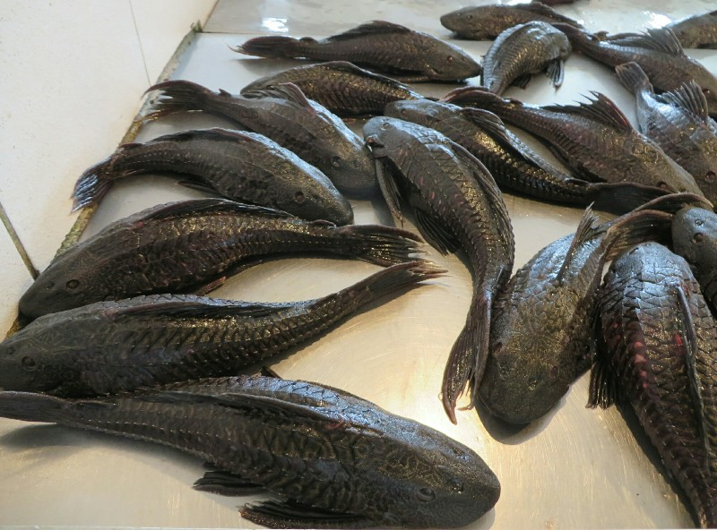

*Some Fishes*

Our guide then tried to explain the itinerary for today and how we would be back at our hotel this evening. When we said we were supposed to be on a four day tour he looked at us blankly and said that he would be right back and went off to talk with the tour organiser, Paula. Sigh. This company is certainly not going to win any awards for their orginisational skills. The other 5 people who came down with us hopped on a boat for their one day tour. We waited... At 10am Paula came back from a long phone call and told us to hop on this boat. On we hopped. Then she said actually, it's too small, get off and hop on that boat. Off and on again. This one stuck. Eight other passengers joined us- four younger people and an Indian family, and we moved out across the Amazon.

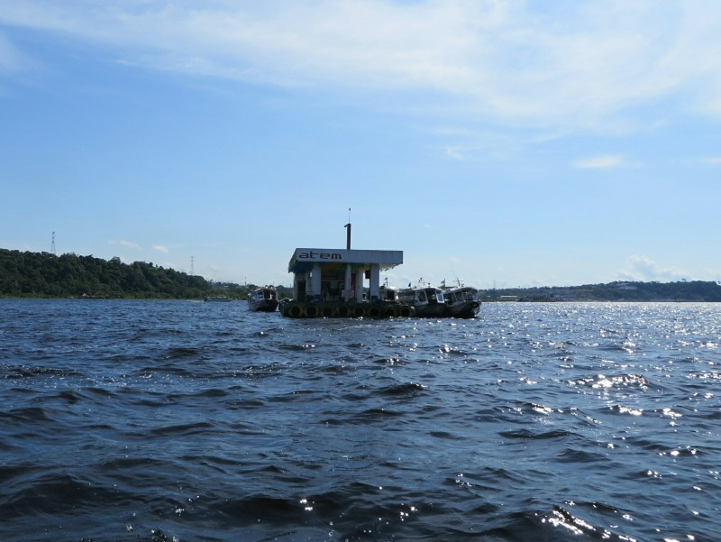

*Floating Petrol Station!*

After a short while we reached the meeting of the waters, the point where the brown water of the Rio Negro and blue water of the Amazon River join. Amazing from aerial photos, cool on our boat too but we were too close to get a good picture. We carried on, passing houses built on the river, horses in fields with water up to their middles, chickens cowering on verandahs and lots of trees. On the other side of the river we moved from the boat to a couple of old combi vans and carried on down the road. Sharing our van was the Indian family, although the kids' accent leads us to believe they live in the States. After about 40 minutes in the van, another boat! The trip took about 50 minutes then finally we reached our destination. The two of us and the four young people get out and head up the stairs to the river lodge. Not what we expected. We booked a private room with fan and shower, we arrived to a huge open room with about 30 hammocks slung from the roof, one fan and two shared toilets. Ummm... No. We're at a stage in our lives now where sharing a huge humid room with that many other people is not appealing. The four we arrived with are shown to one of 4 private rooms off the main room. But there is none for us. When they realise we're not cool with a hammock they say they'll sort it out after lunch when Paula gets back. Hmm...

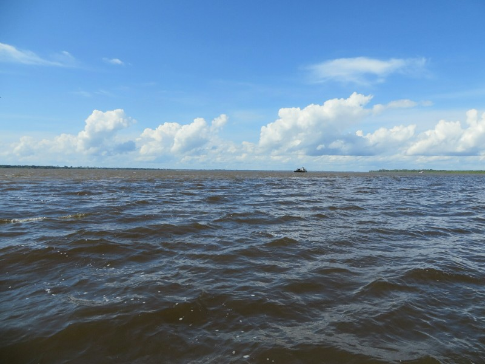

*Meeting Of The Waters In The Distance*

We head to the common room, all the hammock folk are sitting around watching the soccer. We join them and have a nice chat with a couple of Americans from Vegas. Lunch is a buffet deal and also very nice; salad, a few different types of meat, a vegetarian dish, rice and pasta. Despite enjoying the food and the company, we're not at all warming to the hammock hostel idea so when Paula arrives we go to speak to her. She says lucky for us, just because we're married, they found a private room at the other lodge down the river. Booking 8 months in advance be damned it's the rings that save us. Short boat trip later and we get there. This is much more our style- four three person rooms with ensuites coming off a shared common room. Not flashy, but more than sufficient. Downside is no TV to watch soccer, but we'll trade that for the privacy. And a dodgy looking air con that electrocutes you when you try and adjust the settings blows out moderately warm air over the bed, a thin mattress wrapped in plastic like an old lady wraps her couch so no one gets dirt on it that sinks in when you lay on it. But it's not a hammock! We'll take it!

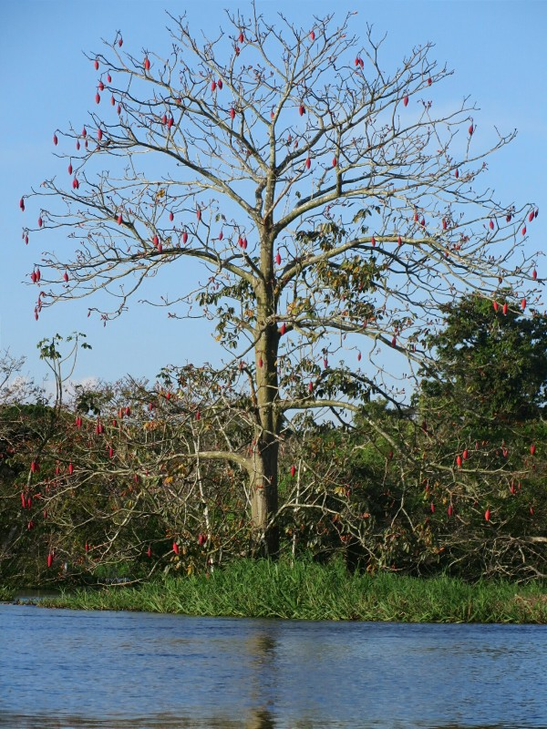

*Very Symmetrical Trees*

Now we have a place to sleep we set off on our afternoon activity- a motorized canoe ride through the flooded forest to spot some birds, and if we're lucky, animals. We're the first on the boat, then the family of four, then over to the other lodge to get the four young people, and then two more young American guys! Seems like a lot of people for 'a maximum of 8 per guide' and the boat is definitely reaching it's capacity. The motor struggles as we move down the Amazon making enough noise to scare away anything able to move well before we get close to it. First on the boat means we're at the back too so our view of birds flying off isn't so that good either. After maybe three quarters of an hour we turn off the main waterway and move into the flooded forest. Apparently in a few months the water level will drop more than 8 meters and what we're floating on now will suddenly be the tops of trees! For now it's a mosquito/biting fly/ant breeding ground. Kate has never been so munched on in her life- they're biting through her dress and leaving her with little bleeding wounds all over. Even Pat, who is usually dinner for bugs is finding this excessive. In addition, while the motor has now been turned off and the canoe is paddling quietly the kids and two new Americans are talking and scaring off any potential sightings despite being told to be quiet. Frustration reaches a peak when we hit a particularly dense area of mosquitoes and the boat gets wedged between two trees, trapping us like some delicious delivery of fast food for hungry blood sucking bugs.

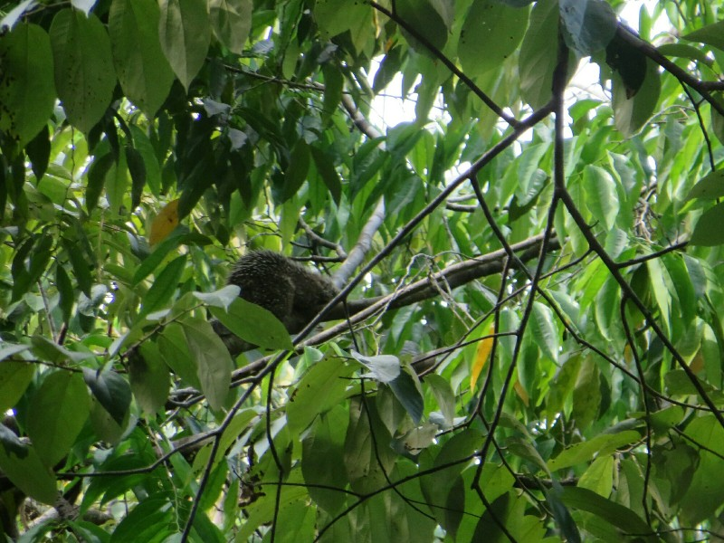

*Porcupine!*

We eventually get free and moving but we're feeling like this was all a terrible mistake and we should cut our losses and head back to Manaus when we see the guide point at something. From the back we can't hear him but the boat driver seems to know enough English to point out animals- porcupine! With a baby! We snap away, feeling like this hasn't been a total waste. Then- monkey! Moving fast! Too fast for a photo and too fast for Pat to spot, but Kate was excited. Eyes sharp now we pass a few massive termite mounds built on the side of trees and steer clear of a wasps nest.

Then the guide goes bananas- 'The King of the Jungle!! The King of the Jungle!!!!' We can't see anything from back here, but the driver is pointing up to the treetop excitedly. Pat spots a claw, then a few more, then a leg. Then we stop, apparently this is a great view from the front of the boat of what we determine is a sloth! Kate is freaking out because she can't see it and this is the whole reason she wanted to come to the Amazon- apparently sightings are quite rare so she's worried if she misses this there might not be another. Never fear, our driver tightrope walks to the front of the boat along the edge, jumps into the tree and starts climbing. He grabs the sloth and brings it down by the scruff of the neck. The sloth doesn't love it and keeps reaching out it's massive claws to try to grab onto something. He gets passed down the boat for admiration (the kids named him Kevin), then gently plonked back on a tree. Tell you what, sloths have a reputation for slow, but after that he climbed up and away pretty bloody fast!

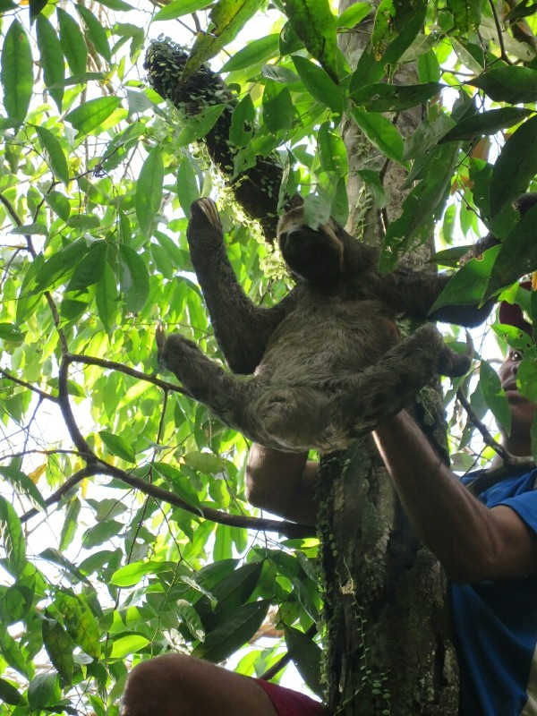

*Kevin Parachuting Down*

On a sloth high we left the forest and headed back to the main river. After a quarter of an hour we stop in a large calm section of the river where another boat is drifting along with its motors shut off. We follow suit and quickly notice what they stopped for: pink Amazon dolphins! We hang around for a while and our guide suggests that we can go swimming with them if we like. Thinking he's just joking (why would anyone want to swim with piranhas and snakes?) everyone chuckles except one of the American kids who takes off his shirt and lunges himself into the water, first soaking everyone with a massive splash and second soaking everyone even more when the boat half capsizes following his jump and water comes gushing over one side of the boat. 20 minutes of scooping water out of boat later we're back on our way home with only a brief and awkward pitstop at a floating petrol station - not to buy fuel, but to "stretch our legs". Weird.

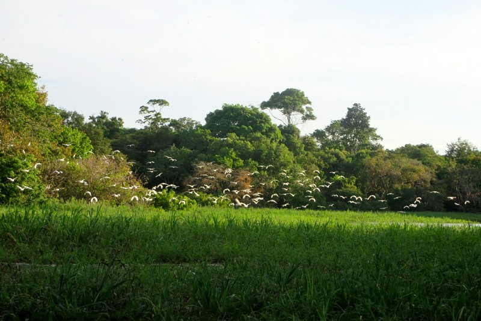

*Bird Bums*

The sunset on the ride home is absolutely stunning and is almost worth the mosquitoes, heat, and humidity. Back at the lodge we check tonight's schedule with the guide: no cayman spotting or piranha fishing as originally planned, he says we'll do that tomorrow. He tells us the rest of tomorrow's schedule too- the itinerary is totally different to the one we booked, but we'll play it by ear and see how it goes. Dinner was calmer than lunch, just 5 of us staying in this lodge. We had a good chat with the three New Yorkers about things to do when we visit, then spent the evening reading (lesson leant from the Inca Trail!)

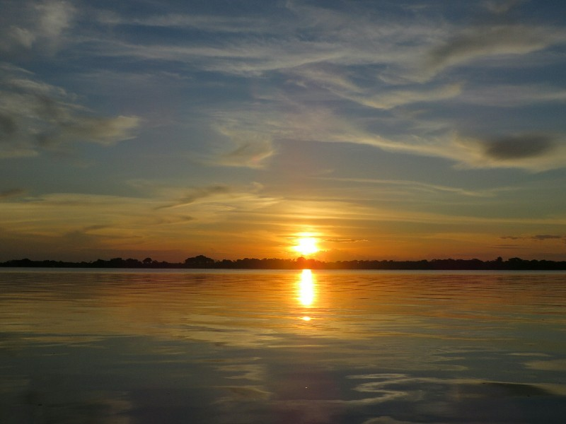

*Most Amazing Sunset I've Ever Seen*

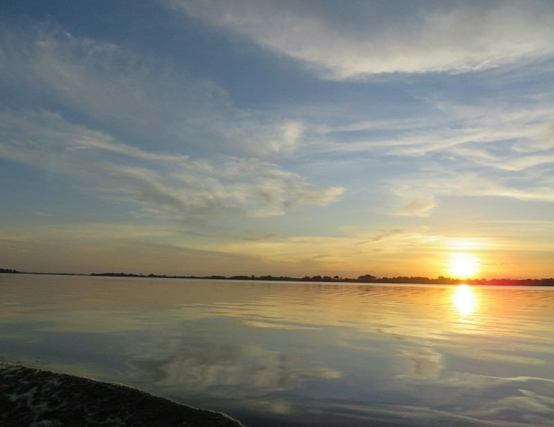

*Second Sunset Photo Because It's So Pretty*

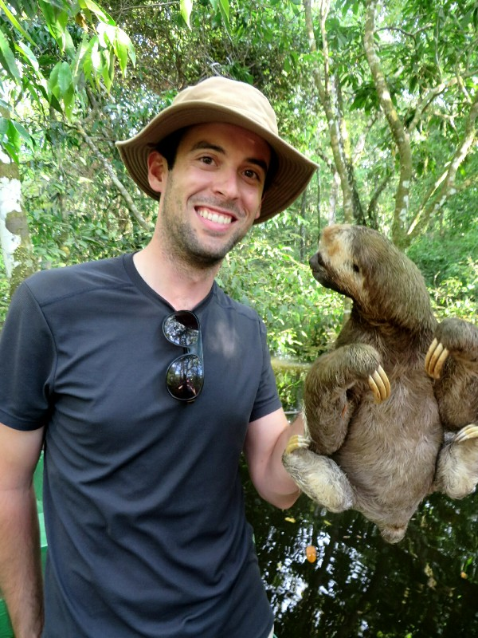

*Kevin Is Quite Taken With Pat*

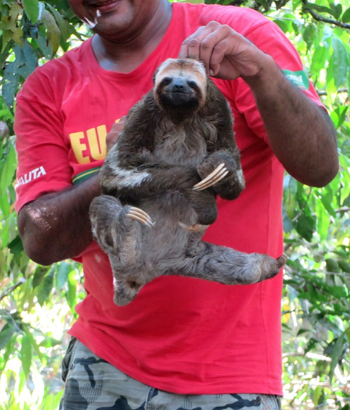

*Always Looks So Cheerful!*

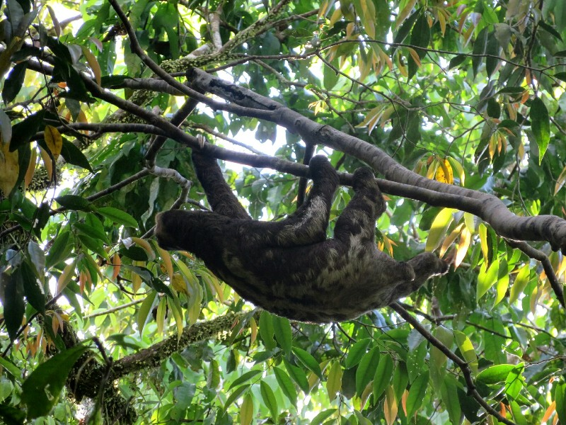

*The Great Escape!*

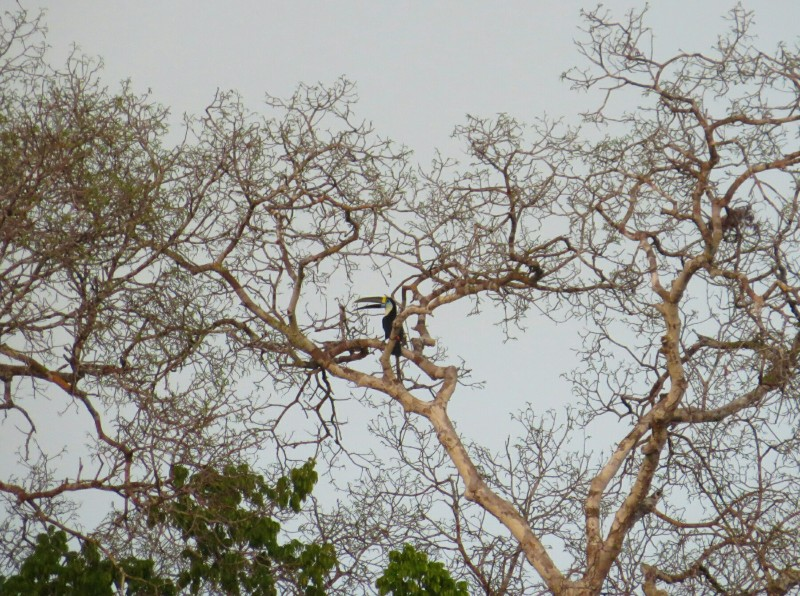

*Toucan!!*
