After a fitful night's sleep (it's hot here!) we got up a bit before 7 and waited for breakfast. It wasn't bad- scrambled eggs, oranges, watermelon, little mini fried pikelets, bread, butter and of course cake. Always cake at a Brazilian breakfast. We found out our three roomies are all optometrists! And all leaving after lunch. We wonder who our new companions will be...

We have a little chat with the company owner, Elso, about the Brazil nut trees growing out front and he nearly gets bitten by a millipede. In the end he prevails and squashes it. At 8.30 our guide David arrives with the boat, the family already onboard. We pick up the other 6, again a huge squeeze with the boat very low in the water, then head out to visit a local village. The river is very still, almost like glass with a clear reflection of the sky. Looking closer at the surface we can see the cursed mosquitoes who have been leaving us iron deficient. Every now and then a fish will pop up and a few mossies will disappear back under the surface with him. Maybe we will cut fish out of our diet, clearly need more in the river doing God's work! A little further down the circle of life continues with a flock of birds diving into the water and snatching up the fish. They have about 90% accuracy- we're impressed! And distressed; leave the fishies alone! Let them eat the horrible bugs!

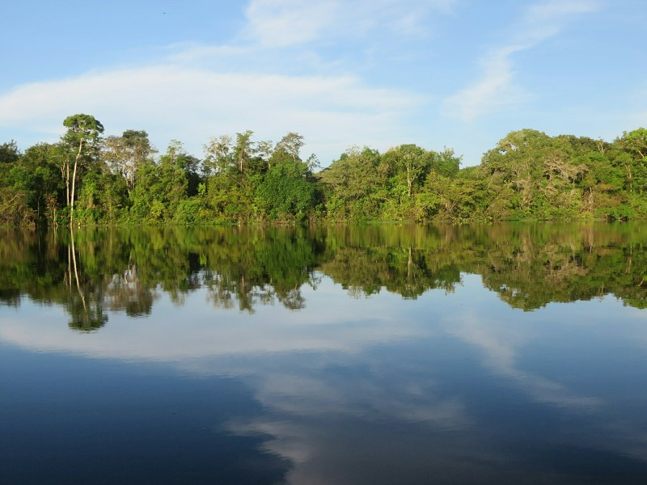

*Absolutely Still Mirror Of Water*

We soon turn off the main river and come to a house 50% under water. Through the open door we can see the half drowned furniture still floating inside. David explains the family who live there will move back in when the water recedes in a few months. As soon as we hop off the boat we are greeted by a hoard of animals - ducks, chickens, quails, and pigs. Kate loses her mind and goes on a picture taking spree. Our guide shows us the little factory they have set up to make tapioca and explains that there are two different but very similar primary ingredients. One, in its raw form, is very sweet and can be eaten without any preparation. The other, which helpfully looks identical to the first, is nearly pure poison and has to be carefully processed to make it edible. Good to know!

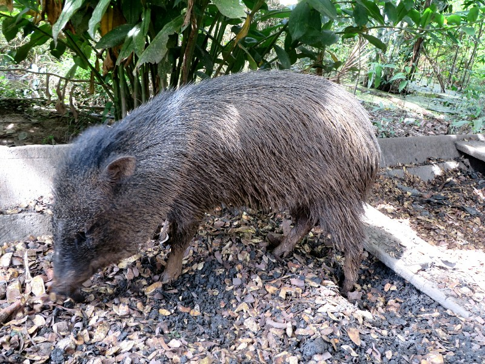

*Kate's Pig Friend*

The village is really just two houses, one more for sleeping with a few beds and hammocks, and the other for living and cooking. Both are made of wood but look a bit more advanced than the standard village dwelling in South East Asia. They even had a fridge and electric stove! The guide cheeirly shows us some leopard and anaconda skins that the family had killed recently. The latter was nearly 4m long. Quite glad we haven't met one of them in the wild! They also had a caimen skull from one that they recently had to kill because it was hanging around the part of the river where the kids would swim and bathe. Guess he was kinda asking for it...

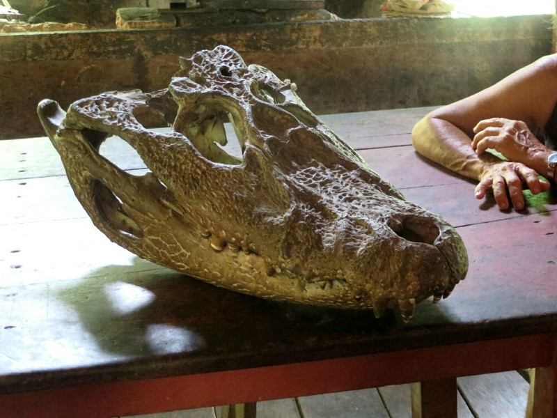

*David Said "Oh, Just A Small Caiman, Only 5 Foot"...*

The kids in the village were kicking around a soccer ball when we arrived so everyone took turns having a kick with them, including Pat. He tried to play a game of keep away and the 5 year old promptly stole the ball straight away from Pat before he could even try to defend. I was never very good at soccer (says Pat). After a while the guide reached in a basket near one of the doors and produced a boa constrictor that the family keeps as a pet. Everyone took turns with it around their necks all hoping that it had been fed recently and wasn't harbouring any ill will towards humanity. Outside the house Kate made friends with a wild pig when it came up and started rubbing its head against her leg. She appreciated the good scratch; temporary relief from the millions of mosquito and fly bites.

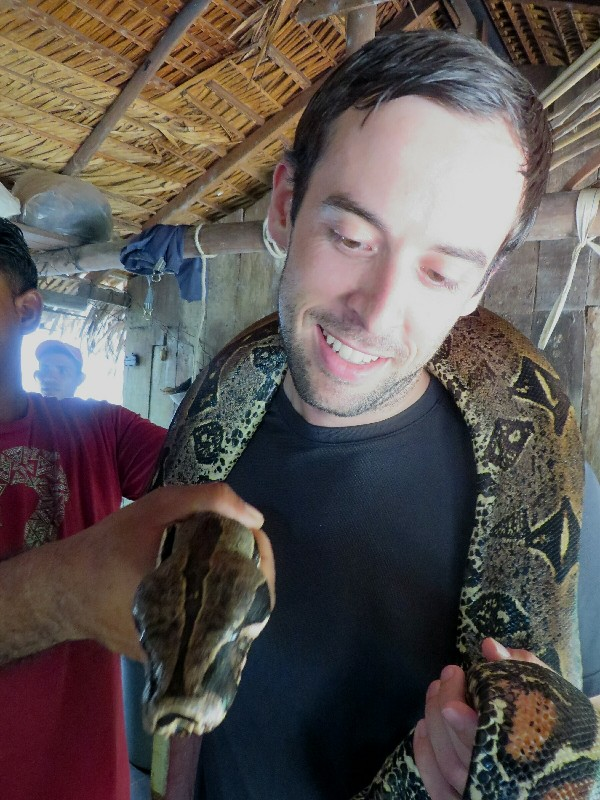

*Snake Necklaces Are So In Right Now*

On our way out they had one last surprise for us - the family apparently had a monkey that they were trying to tame. It was tied up inside the house and didn't seem too happy about that fact, nor about being paraded in front of a bunch of gawking tourists with cameras aimed at him. We both felt bad for the poor little guy after we left. Hopefully they treat him well.

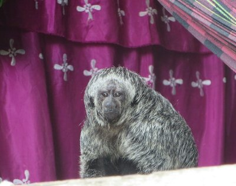

*Sad Monkey*

On the boat rode back for lunch Pat decides that these "native village visits" are his least favourite part of these kinds of tours. I know the people are probably (or hopefully, anyway) being paid for their inconvenience, but it just seems so inauthentic and more than that, invasive. Even if I were being paid I would still probably resent the large tour groups full of people that came constantly trouncing through my house taking pictures of my personal life. That said, I'm sure (I hope) this isn't happening against their will.

After a quick detour to do some iguana spotting from the boat (success!) we arrived home for lunch, shower and a couple hour's downtime.

Next on the agenda- piranha fishing! David picks us up about 3pm, we get the rest of the crew and off we float. Spot one seems to be a winner- within 15 minutes of handing out the makeshift fishing rods (branches with fishing line attached), David has a piranha on line. We all gawk and ooh and aaah then get down to the business of catching our own...

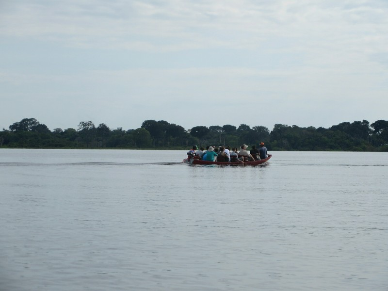

*This Is What Our Overloaded Boat Looked Like*

The hopeless business it seems- after another half hour there have been many nibbles but no bites. All of a sudden the Mum, who has spent most her time trying to get her kids to behave and her husband to sit down and stop rocking the boat, shouts out she's got one! She starts to reel it in, but lets go as soon as she sees the sharp toothed fish on the end. Kate ends up bringing it in for her (good excuse to check it's teeth out) then helpful driver de-hooks it. He demonstrates its powerful jaw by holding a leaf near his mouth- CHOMP and a fish bite sized piece of leaf is gone. He's like a mini hole punch.

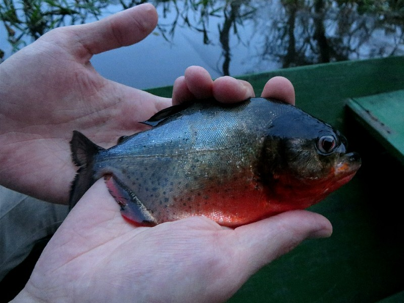

*Patrick And The Sad Piranha*

Unfortunately that was the last catch for the day. Despite another two hours and 4 or 5 different fishing spots, they just aren't biting. Not surprising given the number of people on the river tourist fishing the last fortnight, the stupid ones have probably been caught and the clever ones are probably all full! It's not as enjoyable as it could be with all the people in our boat either- instead of relaxing we're watching for rusty hooks flying around as people try to cast their lines, hit a branch and it swings back wildly at full speed, trying to balance as people stand up in the boat at random intervals almost overturning it (standing is not ideal with 12 people in the boat), and instead of listening to nature we're listening to the kids argue and everyone else talk loudly. The noise could also have something to do with the lack of fish... Eventually we call it a day and float back onto the river. As the sun sets David and the driver start making bizarre sounds out over the river.

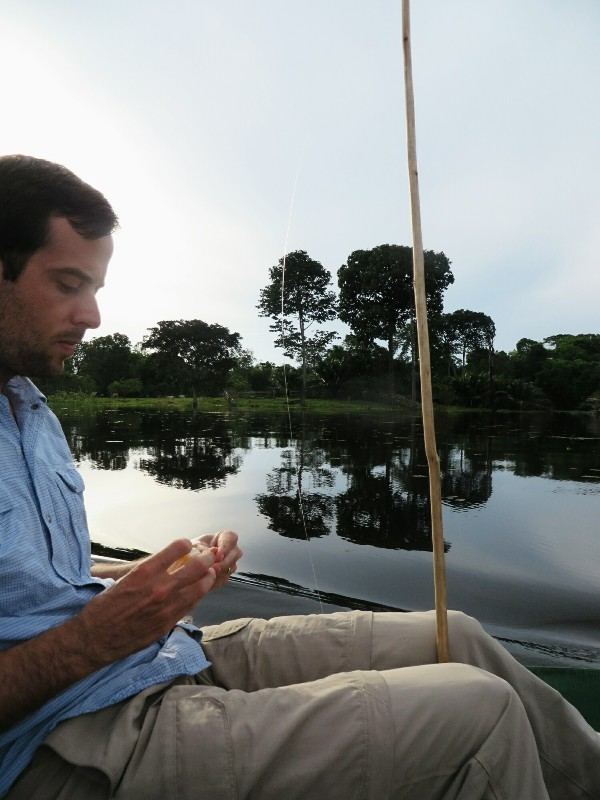

*Patrick Fishin'*

Apparently they are shouting at the caiman. What they're shouting is anyone's guess. Not sure if they're insulting their mothers to try and lure them closer or if they're advertising a boat load of tasty tourists for them to snack on, delivery style. Either way we hear faint return calls that sound markedly similar to the ones the guides were making. Guess they know how to speak caimen! After a few minutes of them making silly sounds we eventually start making our way across the river again to look for more caimens. David is reasonably confident that we will spot one, and for good reason. Within 2 minutes of arriving he has spotted a baby (around 1 year old he reckons), has jumped out of the boat on to the shore to catch it, and brought it back for us to hold.

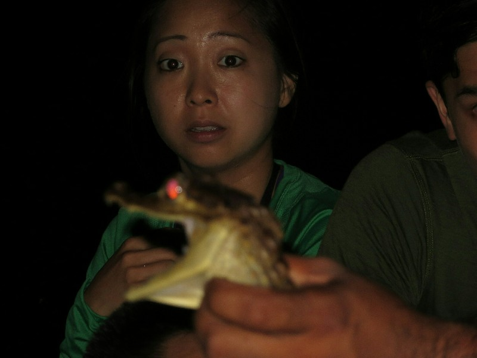

*The Appropriate Face To Make When Faced With A Caimen*

After he was passed back for everyone to pose with, us last at the very back, and after a half hearted attempt to eat Kate's face (tired of photos I guess) he was gingerly tossed back into the river to go about his reptilian life. During this whole ordeal, there were large creatures grazing just past the water's edge, but the light wasn't good enough to make them out. Kate shined the torch on them and lo and behold! It was the undead cow army come to murder us all! Or you know, eat some grass. Whichever is easier.

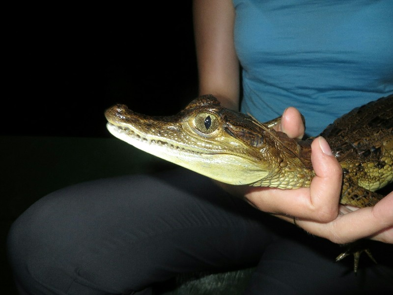

*Katie And A Cranky Caiman*

Back at the lodge we find out we are the only ones here for dinner. Our American friends had departed after lunch and apparently no one had come to replace them. Kate and I had a nice quiet dinner before comparing battle scars. Pat's back looks like he's suffering chicken pox, initially Kate looks like she fared better! Then we see the only area she didn't slather in deet- her backside is not a pretty sight. Both of us have itchy chomped on feet. We're extremely glad for our antimalarial medication! Although it makes us think of an article we read before we left- they were worried malaria free Rio might lose that status. Rio has the right kind of mossies to spread malaria and with so many tourists traveling between there and the Amazon it would be easy for someone to get a bite here, then infect a mosquito there. Seeing our bite per minute rate is in the mid hundreds we can now see that really might be an issue. Guess time will tell.

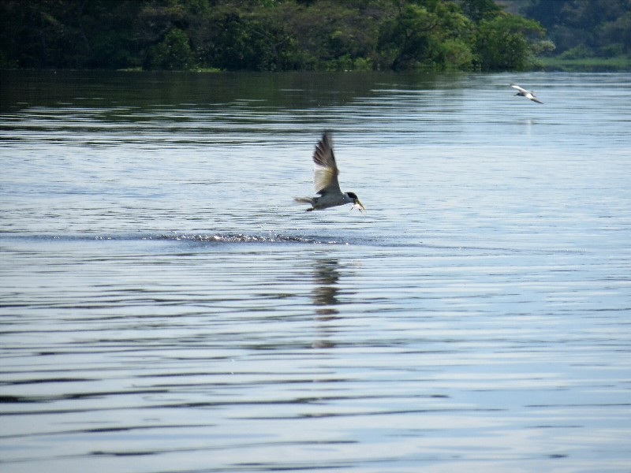

*More Successful In Fishing Than Us!*
