Sleep was interrupted last night. First the standard heat/humidity. Second the itches, ooohh the itches!  Third, when Kate went to the bathroom in the middle of the night a huge black creature jumped from the top of the toilet down at her giving her a heart attack! Turns out it was just a frog. Gives you a good idea of how mosquito proof the room is! Lastly at 4.30 a loud phone alarm of some country song started blaring from somewhere in the lodge (paper thin walls). After it went off every 10 minutes for a half hour without anyone stopping it Pat went investigating and ended up in the staff bedroom to turn it off for them.

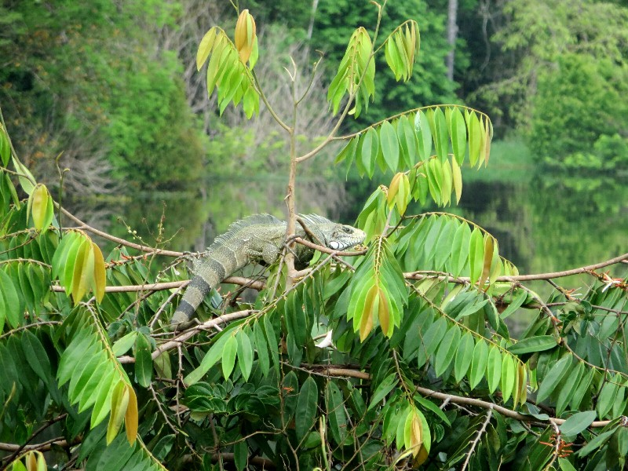

*Found Him Oversleeping In The Tree Out Front Of Our Cabin. Maybe Frogs Attacked Him Too?*

The morning activity was a jungle walk. We grabbed the other 8 and headed off into the great unknown. Initially the track was fairly well worn and easy to follow. With 12 people we were making quite a ruckus so the animal or bird sighting chances were slim to nil. We did still have a good time though, we tried to position ourselves close to the guide so we wouldn't have the same issue we did in the boat of not knowing what was going on. Not always possible, but even hearing half made the walk much more enjoyable. David and the driver (Francisco) showed us lots of jungle plants and demonstrated their uses. They showed us some little nuts from decayed coconuts which when opened contained little edible grubs. Half the group tried them, unfortunately (or fortunately?) we were at the back so Pat missed out.

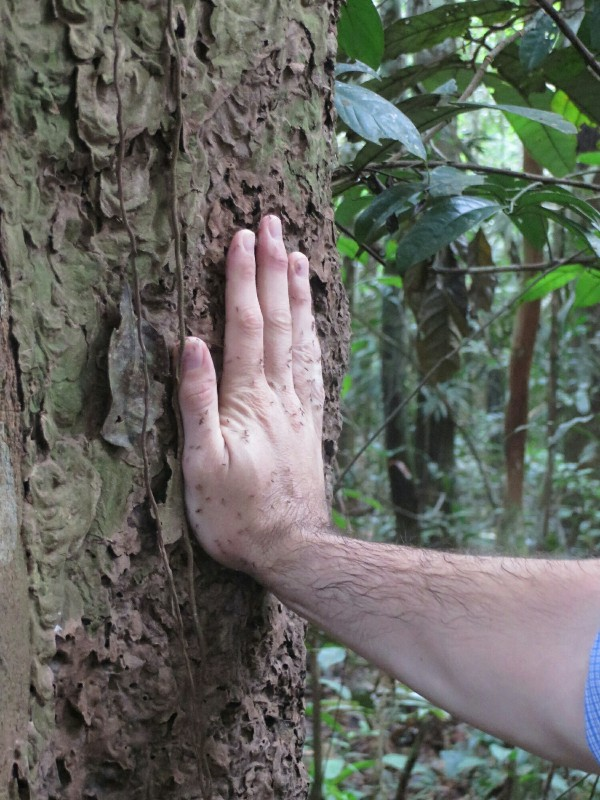

*Rub Ants Into Your Skin For A Natural Mosquito Repellent! Miss Any And Get Ant Bites!*

A bit further along we came across a large tree. Francisco gave it a little poke with his machete and a milky white liquid came streaming out. It didn't taste like much, and we couldn't hear what it was used for, but when he tried to bandage the tree with a pile of mud it kept "bleeding" through the pile. It took two or three good handfuls of mud to finally stop the flow. As we walked David was knocking on every hollow log we passed to try to scare giant rodents out to no avail, but they successfully found a hole in the ground to poke at until an angry tarantula emerged! The kids called this one Quentin (Quentin Tarantulantino).

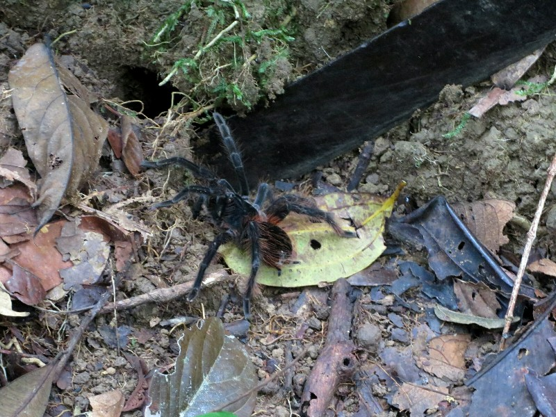

*Cranky Tarantula- We Kept Our Distance*

We had a break when after about 2.5 hours we reached a campsite for the overnight jungle stay. By now we were sweating up a storm (shirts completely drenched, Pat's forehead dripping profusely) and every time we stopped a swarm of bugs would strike. Despite that, it was a nice morning! David had us guess which direction the lodges were in. Turns out we were about 200 meters from the boat- the campsites aren't as 'in the middle of the jungle' as we expected from the description!

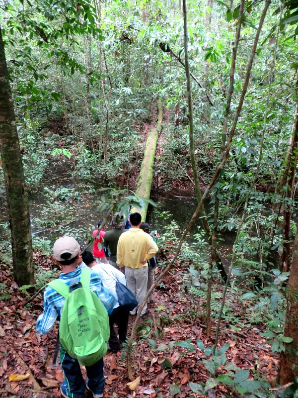

*Slippery Log Bridge Across The River To The Campsite- No One Fell In, Not Even Kate*

We were dropped off at another lodge for lunch, the one the family are staying at, as they have a TV and we wanted to watch the US/Germany game. This lodge is awesome! They have working air conditioning in every room and one in the common area, biscuits and tea all day, a pool (!)... We're dreadfully jealous. The lodge is full with a group of 16 (three families) and a few smaller groups. We made friends with the people around us then got down to watching the match- ended up a win to Germany by one (go Deutschland!), but as Portugal beat Ghana the US got through anyway. Hooray! It was a good atmosphere to watch the game, everyone was American bar four Swiss men (identifiable by the crosses shaved into their hair, or by the crosses of hair remaining) so when we saw the US was through the room erupted in cheers.

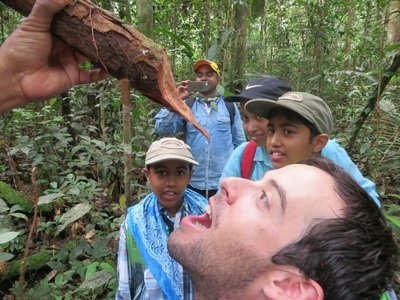

*Francisco Cut A Branch Off A Tree That Was Full Of Water!*
Locals Use This Trick In Droughts.

After lunch the lodge cleared, everyone but four Swiss guys left. We hung out enjoying the air conditioned comfort, first find we've felt clean or dry in days.  It was raining on and off through the game and was sprinkling when David and Francisco arrived. We were feeling a bit dubious about sleeping in a hammock in the rain but had previously been told if we hated it we had the chance to come back to the lodge after dinner to sleep. As we headed off in the boat the rain got heavier. When we stopped at a local store for supplies we decided to check we'd be able to bail if it was too miserable. Apparently not! With this rain, the wind makes it too dangerous to come back after dark in the boat. But David is quick to suggest an alternative, staying overnight at a local village. Pat's not keen on these village visits, but as she gets wetter Kate decides there's no way she's sleeping outside in this wet. Decision made, we head off. And the rain gets heavier. It's raining so hard we can't open our eyes because it's coming down at an angle straight into them. We are saturated, our clothes are saturated, our bags are saturated which means everything we have to wear tomorrow is saturated. It's freezing cold (huge change in temperature) and we're shivering, dripping and miserable. After another 20 minutes or so on the boat we decide we can't do it- we'll be freezing trying to sleep in these wet clothes, we've got nothing to wear tomorrow either, we'd like to have an adventure but there's just no way we'll enjoy ourselves in these conditions. Feeling very "first world problems" and spoilt we ask David if we can just go back to the lodge. He laughs and says we can, but we should at least go to a local house for dinner so the night's not a total waste. We think that sounds good- still do something but dry clothing for bed.

We carry on, spotting another sloth in a treetop on the way. David tells us a bit about his family and background. Apparently his English is so good because he emigrated from a British colonial country when he was 8, he has four kids and he's raising them bilingual. Jealous. Eventually the house appears, the floor is only just above the water level. About eight people are poking their heads out the two windows to see who it is. David explains he hasn't visited this family in six years and they're not expecting guests, so they're all curious who it is.

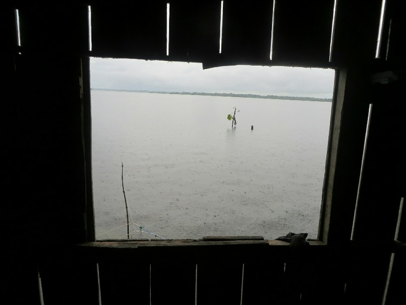

*Not What You Want To See Out Your Kitchen Window*

We pull the boat up to the front door and one of the family members helps us climb into the entry way. The rest of the family poke their heads in to see what's happening, a lot of the younger ones are shy and hide away. An older man (grandpa?) sees how drenched we are and brings us all a hot coffee. One of the women sweeps the water out of the kitchen which is full of puddles. Once we're all out of dripping raincoats, shoes and socks we come into the kitchen, the main room in the house. David greets them and brings out a big bag of chicken and rice, our planned dinner for the jungle tonight. The older lady (grandma?) says she'll cook because we brought the ingredients. In the meanwhile a couple of the men head to the shed out back (via a makeshift bridge) to make some farofa and tapioca. We follow to check it out.

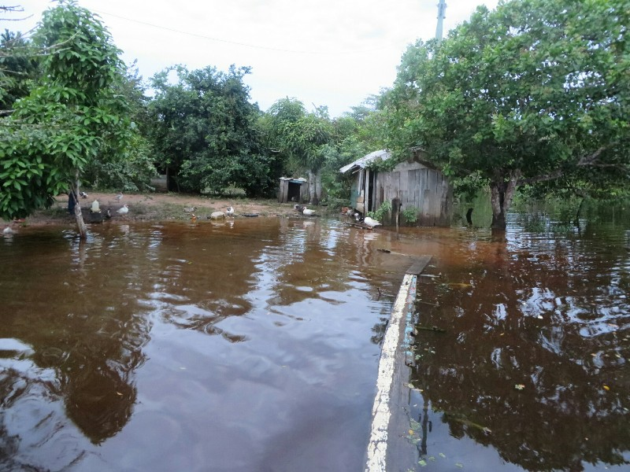

*Gangplank To The Unflooded Section Of The Yard*

At this point we experienced the absolute highlight of the trip- better than any country we've been to (even Japan), better than the Inca Trail, better than the sloth... A chicken bit a duck on the tail and refused to let go. They ran around the yard wildly causing all the other birds to flap away, clucking in a panic like some slightly sped up black and white TV show with the 'crazy antics' saxophone music playing. Eventually the duck escaped. We wish we hadn't been laughing so hard and we could have filmed it!

In the shed they have the same equipment as the other household, they use what looks like a lawnmower motor balanced on a boat to turn a cutting blade to grate the plant. The set up doesn't work the best so there's a lot of thumping the engine and poking at the belt dangerously with plants until it gets moving. We think about offering to help but it looks like you could easily lose a finger if you weren't pretty confident so we opt to just watch. A lot of the animals are hiding out here for shelter too, Pat finds a kitten without a Mum being nursed by a dog and thinks it's the best thing ever. I think it's kind of gross, but each to their own.

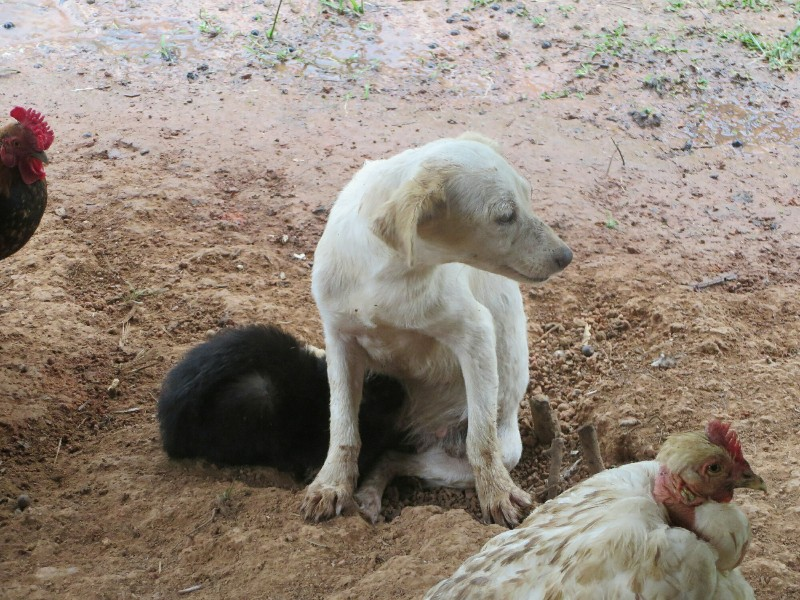

*Dog Nursing A Kitten- Cute, Or Gross?*

Back inside we sit in the kitchen and share a some biscuits, then a pack of chips Pat remembers he has. David does some translating and the cooking lady tells some funny stories about weird tourists who've visited in the past- one buried his Dad's skull in the back yard and returns once a year to play him music. Every time a boat passes while we're chatting waves of water pour up through the floorboards from its wake. After a while we leave the lady to her cooking and head to another room to watch the soccer. The previous president apparently introduced a program saying all Brazilians would have electricity. This means on the boat we pass a lot of drowned power poles with power lines hanging dangerously close to the water. It also means we were able to watch the World Cup in a floating house in the middle of the Amazon. Watching the TV reminded Kate of her grandparent's old TV with a knob and a dial you turned to find channels. We could make out the game through a layer of white dots which varied in thickness from 'can see pretty clearly what's going on' to 'is there actually a snowstorm on the field'. Not the best way to watch soccer, hard to keep track of the ball among the white dot army, but fun none the less. When dinner was ready we got a yell from the kitchen- the chicken was absolutely delicious! Whatever spices she used I want some to take home! We both agreed that was one of our favourite experiences on this tour- we didn't feel invasive, we felt more like guests of their old friend. Very pleasant evening.

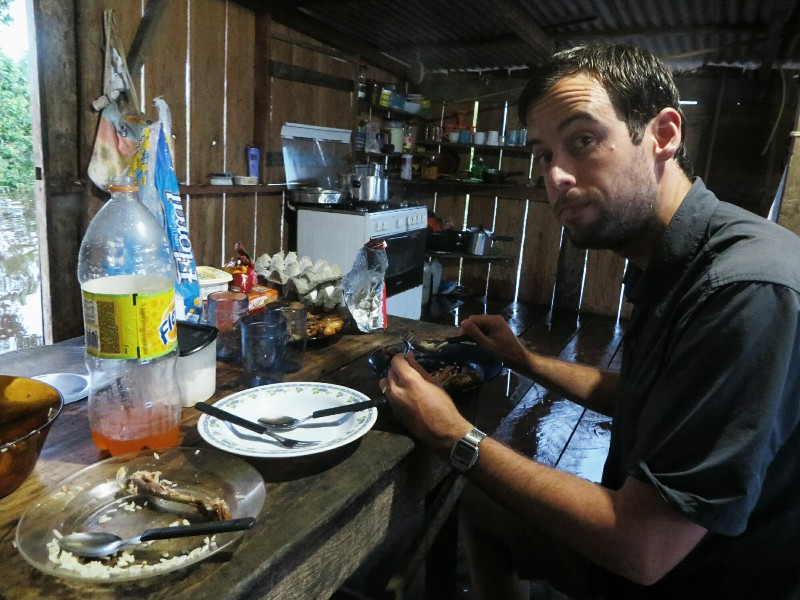

*Last One Finishing Dinner!*

When the sun started to set we headed back. By this point the rain had stopped overhead but we watched the lightning storm over the jungle further away. When we got to the lodge we found it locked! We waited for Francisco to find the guy with the key while being eaten alive. So many bugs after rain! The guy with the key had gone home, we stayed in a room at the other lodge. Sadly no dry clothes, but with just us in the room an no unsuspecting local family we could at least sleep in underwear. It's chilly, but we're definitely happier inside dry and cold than outside wet, freezing and being eaten alive!

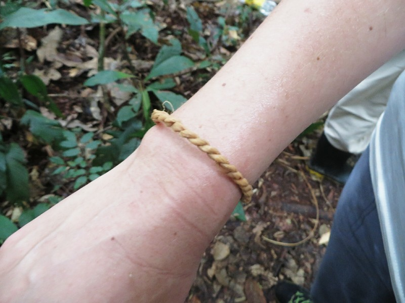

*Bracelet David Made Out Of Local Ferns For Kate- Unfortunately Leaked And Stained Her Shirt*

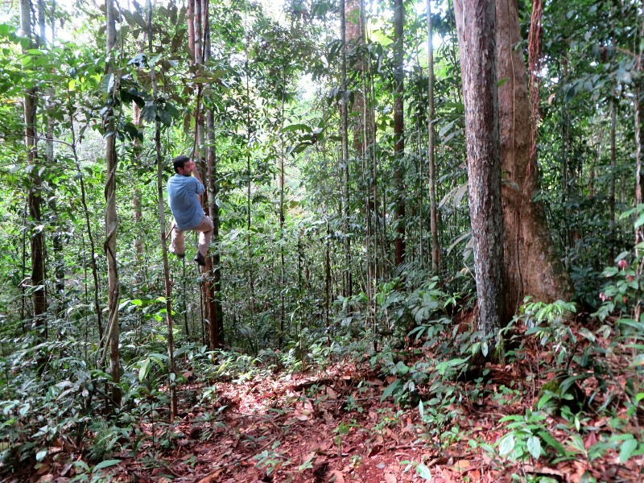

*Wheeee!!!*

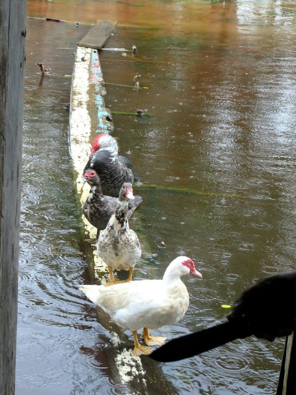

*Unintentionally Ominous Duck Photo...*
