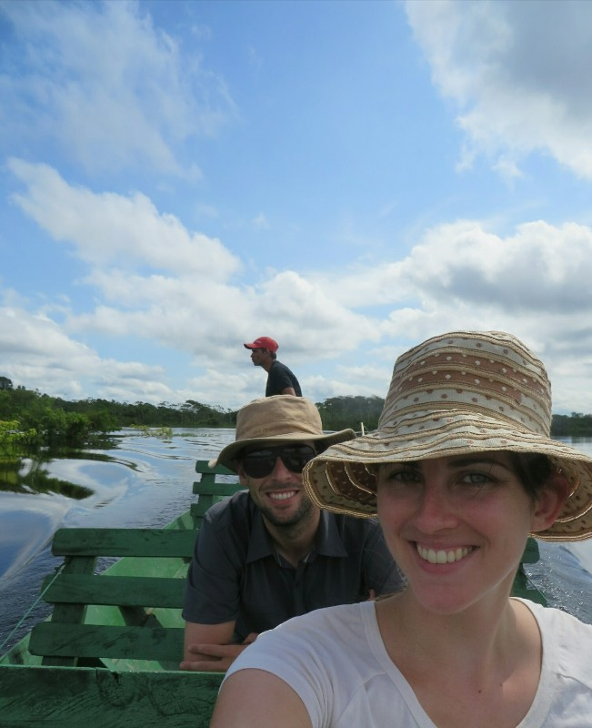
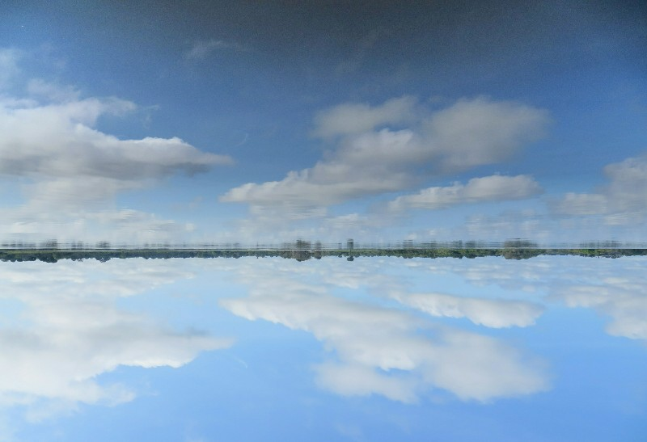
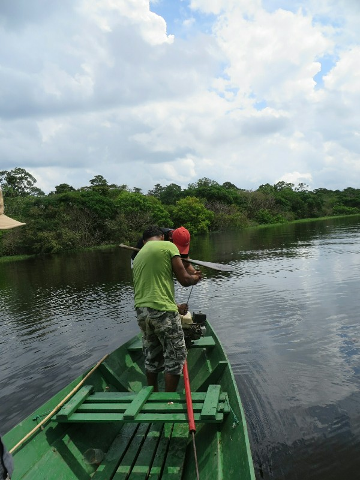
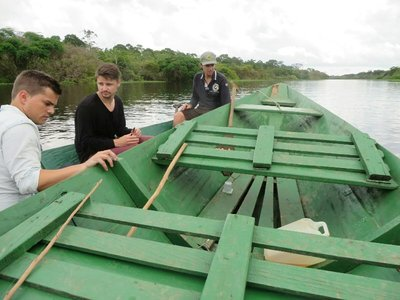
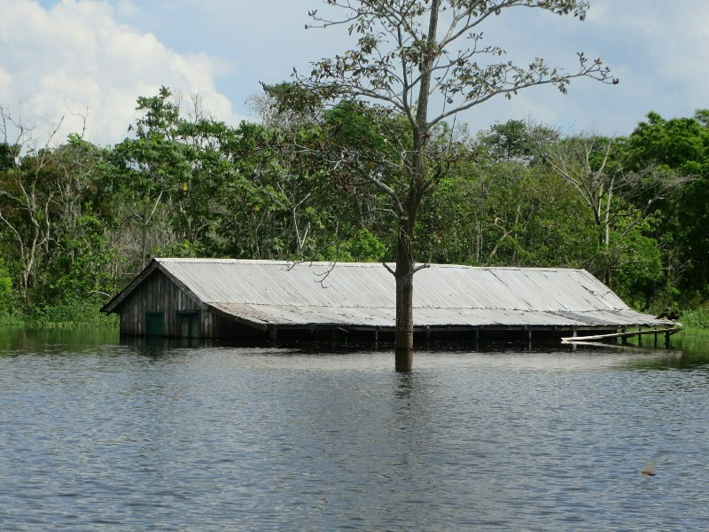
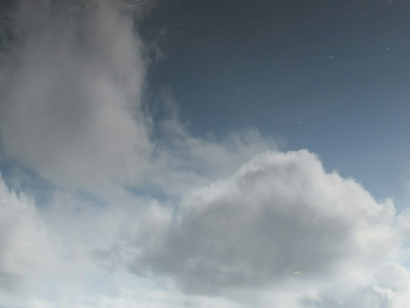
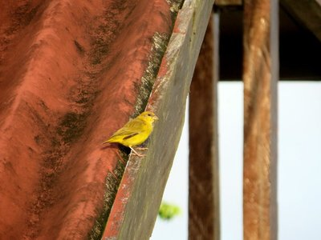

The sleep wasn't much better at this lodge than the other one, sadly.  We went from being too hot to sleep to too cold as the air con in this lodge actually worked! After a quick brekky in the common room (with cereal and eggs to order- love this lodge!) we picked up our bags from the other lodge and went out to meet David and Francisco for our morning boat ride. Plans are to head out and see what wildlife we can find and give piranha fishing another go - sounds like an ideal way to spend our last morning.

*Relaxing private boat ride*

Since we were supposed to be camping with them until midday we were their only charges this morning and we had the whole boat to ourselves. A welcome change from the past several days when there were 12 of us. After an hour cruising down the river we didn't have much luck on the wildlife front - best sighting was three bright red macaws flying overhead. We eventually came to a spot that looked suitable for fishing and set up shop for about 10 minutes. Unfortunately the Brazilians don't have much patience when it comes to fishing and they quickly decided this place was no good and we moved on to another. On the way we passed a caiman swimming across the river. We could only see his head, but that was almost a meter itself. David concluded he'd be about 5 meters long- much bigger than the ones we were playing with the other night!

*This Picture Is Inverted, River On The Top. Someone Replaced The Amazon With A Gigantic Mirror*

Getting to the next spot involved crossing some thick water plants by aiming the boat at the thinnest point, going as fast as we could, then lifting the motor out to keep it from getting tangled and coasting over the top. Great idea in theory and it did see us to the other side of the plants, but in doing so it broke something in our motor effectively stranding us a good two or three hours of paddling away from our guesthouse. Sad times.

*Motor Repair, Step 1: Use large machete and wooden oar to attempt to remove nuts and bolts*

We paddled our way back to the main fork of the river and flagged down another tourist boat packed with people and they helpfully gave us a tow to Francisco's brother's house which was luckily only 30 minute ride away. And of course what fun would any boat ride be without pouring rain? It didn't bother us so much as we had our quick drying travel clothes on so after a few minutes in the soon to be baking sun we would be dry again. However there were a few people on the other boat dressed in denim jeans and designer shirts, completely out of place in this hot, humid climate. I can't imagine how uncomfortable they were going to be, or even how uncomfortable they were before the rain had even started. But they looked damn good and I guess that's what matters.

*Helpful strangers give us a tow. Might as well relax, it's going to be a slow haul*

With a quick and ghetto repair job (they loosened and tightened nuts by placing a chisle on the edge of the nut then hitting it with a hammer-a good example of why you never lend anyone your chisels and only slightly better than their attempt to repair it while we were on the water using a machete and an oar to loosen the nuts) we were back on our way home. A few minutes into the ride Francisco slowed the boat down and we thought we might be stranded again but he quickly motioned to the trees and said "monkeys!" excitedly. We looked around seemingly in vain, but Pat finally caught a glimpse of one before they had all jumped deeper into the trees away from the bank of the river. Success! Another animal to tick off Pat's list.

*Honey, would you close the window? You're letting the Amazon in*

We arrived a bit late for lunch so they cooked us up a few fresh pieces of fish. Best lunch yet! After lunch we quickly packed up and boarded our speedboat to take us on our first leg back to Manaus. At the first stop where we were going to get in the vans to take us to the port for our next boat, we see another boat pull up with David, Francisco, Paula, a female staff member and 5 tourists (three Aussies and two Americans). Apparently David and Francisco have earned some well deserved time off, so David's heading to Manaus and Francisco is heading back to his house on the river.

*Menacing looking clouds about to pour rain (Another Reflection)*

The van we are meant to take only has 8 seats. Francisco is staying so we're 10 people for 8 seats. We squish in the three back seats with 2 others to make room but the Australian girls in the middle three seats won't move to let the female staff member in, so she and David go to the road to hitchhike. I know it's not nice squishing but it's a 30 minute drive- deal with it. As we drive away leaving them to fend for themselves it starts raining heavily. Poor David and random girl.

*goodbye Tiny, Bright Yellow Amazon Birds!*

At the port they arrive just behind us (must've been lucky with their thumbs!) and we all board a boat and make it to Manaus where a nice large van is waiting with plenty of seats for all of us. We get dropped off first (lucky us) so we pick up our bags from the hotel and grab a cab and suffer through some seriously bad traffic to our new hotel. By the time we check in and get to our room it's been 5 hours since we left (not counting the 3+ hours on a boat in the morning) and we are well and truly sick of traveling for one day. After an acceptable dinner at the hotel restaurant we turn in for the night.
