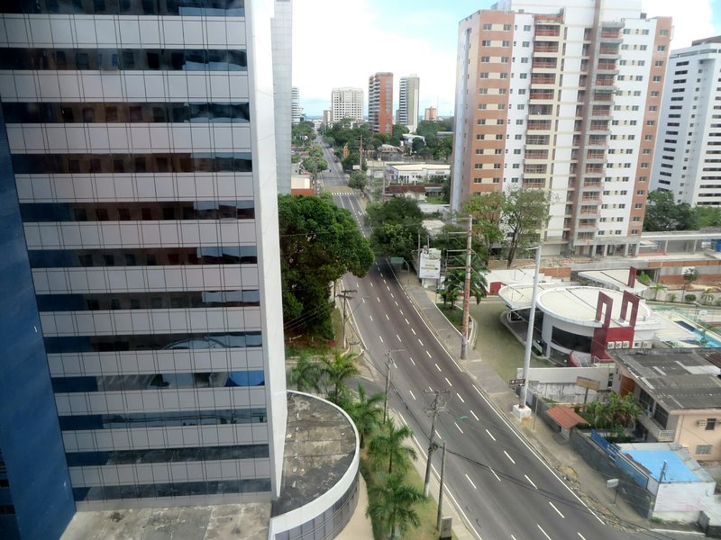

Ah, air-conditioning and mosquito proof room. Fabulous. We didn't do an awful lot our last two days in Manaus. The breakfast buffet at this place is amazing and we take our time trying the fried bananas, various breads and juices, cereals, eggs, quiches, meats, fruits and banana porridge. We gave the Asian breakfast (instant noodles in a paper cup) a miss.

The first day we watched the Brazil vs Chile game from the room. We were both kind of rooting for Chile. Quietly. It was a super close game! One all at full time and no goals in extra time so it went to a penalty shootout. Everyone in the city must have been watching, outside there was total silence- no cars on the usually very busy street out front. Despite there being no public viewing areas nearby when Brazil's keeper Júlio César blocked the first two penalty kicks we could hear huge cheers through the window! All 2 million residents yelling at once definitely made some noise! And of course the standard fireworks and horns. Then a Brazilian player aimed wide and missed the goal completely, and the Chilean keeper blocked a kick by the massive Brazilian player Hulk. By the time each team was taking their last shot the shootout was tied 2:2. We were both getting nervous, sweaty palmed thinking what would happen if that ruckus of cheering voices were displeased instead of happy and we started to shift loyalty- let Brazil keep winning til we leave the country! Brazil's golden boy Neymar took the last shot for their team... And it was in! Fireworks, cheering, horns erupted! Then the last Chilean player came up to kick... And missed! Yay! We won't die in a horrible country wide soccer riot today!!

We went to get lunch and found everything closed and the whole city out celebrating. People hanging out of cars to give strangers high fives, one guy almost ran over a motorcyclist because he was cheering out the window not watching the road, but it just ended with them both cheering and shouting "Brazil!!!". Can't accuse this country of being lackadaisical about football!

*Was Bumper To Bumper Until The Game Started*

For the rest of the day and the morning of the following (once things opened) we were lazy. We tried Bob's Burgers (the local Maccas), hung out in the mall, watched Xmen at the cinema and played air hockey in the local arcade. Took it easy! In the afternoon on our second day back we headed to the airport and caught our last domestic flight in Brazil to party capital, Rio. At the Rio airport we opted to just grab a taxi from the rank and pay the set price into the city rather than take our chances with the meter. We've read that taxi drivers in Rio will sometimes drive around in circles to run the meter up. At 10 pm all we wanted was to be at the hotel as quickly as possible, and we got our wish. Red lights, pedestrians, speed limits - they all meant nothing to this guy and he had is there in record time!

Driving through the city was interesting. It was much more developed than the other cities we've been to, which is no surprise, but everything here seemed to be bathed in green and gold light! Lots of bridges, buildings, and public areas all had flood lights installed (maybe just for the Cup?) making the city look very festive. The smell however... Shudder. Pat thinks there's some sulfur producing something bathing half the city in thick, stinky gas.

Once checked in to the hotel (which is much nicer than we were expecting!) we ventured out in search of a late night meal. As soon as we stepped outside we noticed why this neighborhood has the reputation it does. There were at least a half dozen very scantily clad women hanging around the footpath making eyes and suggestive gestures at passing cars. We took a wide berth not wanting to be mistaken for customers and eventually found the cafe we were looking for. Pat had a nice chicken sandwich and Kate unintentionally ordered a massive steak with all the fixings to make an amazing sandwich. Pat was jealous. Lucky for him Kate's a generous gal and she shared. Bellies full we went back to the hotel and passed or for the evening.
