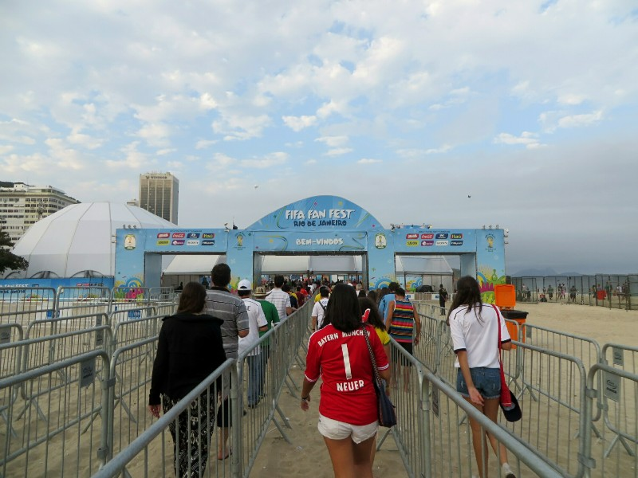
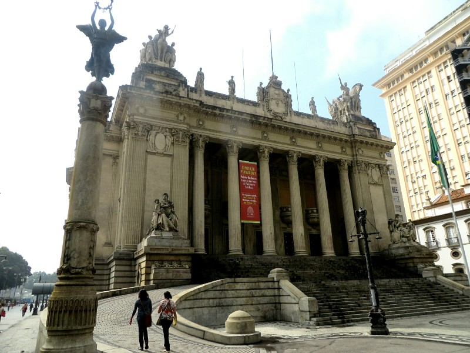
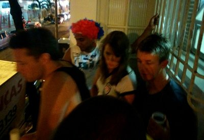

We had a bit of a slow few days in Rio, lots of watching soccer and not a lot of anything else. Brekky at the hotel was nice, standard scrambled eggs and bacon, cereal, fruit and cake. And of course the option of hot dogs if one were so inclined.

On our first day we decided to check out the Fan Fest. Being one of the biggest tourist destinations in Brazil, Rio was well outfitted with public transport. Reliable busses and a reasonably expansive and cheap metro made getting around the city painless. We took the metro to the beach and found what was arguably the best, if not just the biggest, Fan Fest in the country. It was set up directly on the beach and was simply massive. Walking from the entrance to the front where the big screen was would have taken several minutes passing all sorts of bars, food stalls, and activity booths along the way. At the front a DJ, an amazing sound system and a huge screen were set up, currently showing the crowd and people in it. As we were gawking at others on the screen we suddenly recognised the schmucks up there- oh no! It's us! Didn't last long luckily.

*Heading Into The Fan Fest*

After a half hour or so hanging around, the game started. And it was tense! Germany were all over possession and had many, many shots but just couldn't get past Algeria's defence (at the end we read Germany's possession was 63% to Algeria's 37%, and Germany had 16 shots on target to Algeria's 3). One distraction during the very tense game was a pair of very drunk Frenchmen who must be celebrating on from their win earlier today. Apparently we aren't the only ones finding the constant singing of French cheers annoying because a very polite German man basically tells him to shut it. "We said congratulations, it is very good you won. But your game is over, it is a new game now, it is time to be quiet". Unfortunately this friendly talking to was unsuccessful in making the Frenchman shoosh. In the end we were all celebrating though as Germany scored two goals in extra time (and Algeria to their credit got one in too).

On our second day we had a walk around the city centre. While not as impressive as Buenos Aires there are a lot of beautiful old buildings and interesting new architectural buildings. After some time admiring we attempted to go to a Dali exhibition we read about on the inflight magazine. Apparently it's not open on Tuesdays, a fact they didn't advertise on their website I guess because it's so obvious. I mean- who goes to museums on Tuesdays, right? I guess us and the line of schmucks behind and in front of us being turned away...

*Cool Buildings*

Our failure made us hungry and we met up with a friend from Adelaide, Ian for lunch. He was staying in Copacabana with a group of 5 other guys in a one bedroom place. Awesome location, but must be squeezy! They were set up at a restaurant/bar in the tourist area. We watched Switzerland vs Argentina over lunch- another tight game with Argentina scoring in extra time. We filled in the in between game time with a few beers and war stories from our travels (these guys had a much more eventful time than us!) then settled in for USA vs Belgium. Pat was encouraged to stand and sing the American national anthem at the beginning of the match, and a few beers in, he obliged (with Ian standing too for moral support). The US probably played their best so far in this game, but unfortunately lost out 2:1 in extra time to Belgium. USA and Australia out- our hopes for victory rest with Deutschland! Hearts low we went to Ian's flat to commiserate with him, his mates and a few more beers. Very nice group of people and a fairly late night!

*Many People Squished On The Balcony... Watching The Illegal Casino Below*

We had a good snooze in on our third morning. Missed breakfast, didn't have the energy to go out to find anything, but as luck would have it Roger Federer was playing at Wimbledon and there were amazing sandwiches available from room service. Mmm. And after Roger won (naturally) we watched an episode of Game of Thrones. Which turned into three... Damn catchy show and it's cliffhangers!

Eventually we decided we needed to stop being lazy and trotted out to Lapa. Grabbed some Brazilian pizza for dinner. Not the best interpretation in the world... Excessively dense dough, saturated with the oil from the three kilograms of Brazilian 'muzarela' cheese lumped all over it. We still managed to finish it, of course. Bellies excessively full, we turn in for the evening and hope for a more productive tomorrow.
