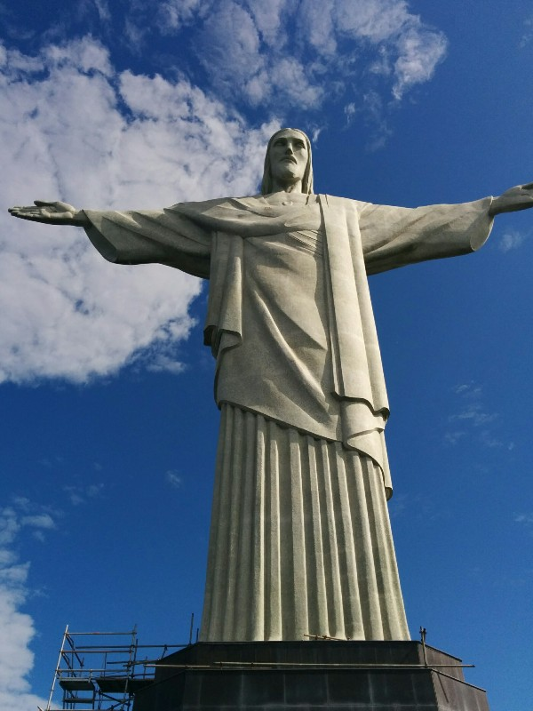
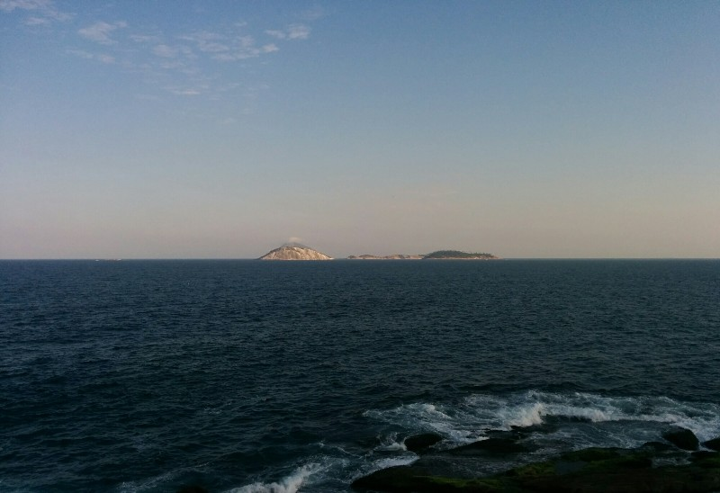
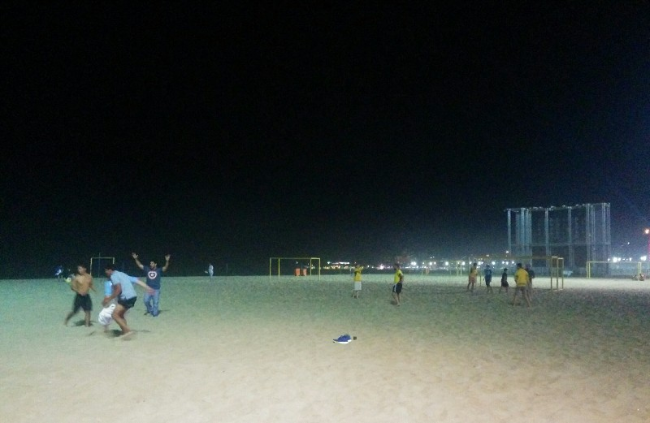
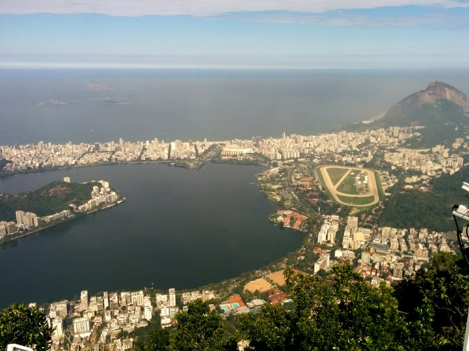

We then decided no more days being lazy and fat! We got up early and got the bus out to Christ the Redeemer. This excursion was thanks again to Mary, one of Kate's coworkers. There are a few ways to get up the hill to the statue. Our original plan was to hike up, but we since learned thieves have been setting up along the trail and robbing soccer enthusiasts when they're tired and in a place the local law enforcement are too lazy to police we gave up on that. The backup plan was to get the historic train up the hill. When we arrived at the station one hour after it opened we were informed there were no more tickets til 2.30pm. Ugh. So- option three was a minibus. We joined the queue for the bus, which took us 100 metres down the road to their office to buy a ticket for the bus up the hill. Then another queue for that bus. Eventually, after maybe an hour of fiddling around we reached what we thought was the top.

Nope.

Now we were able to join ANOTHER long line to buy a ticket for the van up to the statue itself. This was also where the train and hike terminated so the line multiplied quickly. Just ahead of us in the line were two American guys who (being American) decided to make friendly conversation. Riley and John are both from Texas working for oil companies in different capacities, and here for the cup on a whim, but only for a week. Enough money, but no time. Opposite of our current situation! They're staying in a favela (slum) I guess because they booked at such short notice? Sounds OK though, they partied with the locals after they beat Chile. While initially apprehensive about 'people' and 'making friends' it turned out these guys were great and we toughed out this line, and the line to actually get in a van following it, together. The lines, while painful, were made slightly more bearable by the vendors selling beer and snacks along the way. And the best characteristic of our Texan friends- first people we've met who didn't bolt when it was their round.

While waiting in line we also ran into Ian and co- small city apparently! They were perhaps an hour or so behind us in the queue so we vaguely discussed meeting up later in the day perhaps. Eventually we got onto the last minibus for the day and headed up to the peak. Once there we climbed the 200 stairs to the tippety top and got to see Christ the Redeemer, surrounded by a panoramic view of Rio below. Half of the city was up there with us (no soccer being played today) but even in the crush, the statue was pretty impressive. We took a few pics, tried to spot our hotel, laughed at all the people trying to take selfies, arms outstretched like Christ behind them.

*We Made It!!*

After we'd exhausted the statues entertainment potential we headed back to the van dropoff point- massive queue. Decided to hoof it down to the ticket office and get the bus down to the train station. Walk down the hill was pleasant enough- better than another queue! Once back at the ticket office we realised we hadn't been told where to get the bus back again... After a few minutes turning around in circles we decided stuff it, the four of us will just share a cab to Ipanema (another tourist beach) instead. Foiled again- all the cabs were waiting for the people they drove up to take them back down again. We did, however, find a Brazilian man who said he'd take us down for $40. Pat played hardball- $20 or bust! As we walked away he caved! Haha! We win! Although the triumphant feeling was short lived after getting into his beat up tin can with wheels (and no seatbelts) and got to enjoy the local style of driving.

I guess the fact we're posting this ruins the surprise a little- we survived. We all grabbed lunch then had a walk along the beach. The Texans took us out to a spot on Ipanema rock that was almost deserted and we watched the tide come in. Eventually we decided to make a move and we all headed over to Copacabana to meet Ian and co for dinner or a drink or both.

Half the boys were out to dinner already. We weren't quite ready for food again so we stuck around the flat for a while. At this point in the evening one of the boys made the misguided decision to start an argument about gun control with the Texans. So you can imagine how that went. Although I must note, despite not agreeing with anything they said, Riley and John remained very polite through the whole ordeal and probably felt as awkward as everyone else in the room! Eventually Ian decided going to the restaurant (and redirecting attention) was the way to go so we set off.

*Scenic View From Ipanema*

Still not all that hungry, we shared some fried chicken fingers, then said goodbye to our Texan friends who were off to meet some other people. With Ian's friends we headed to the beach where somehow the boys ended up challenged to a beach soccer match with a bunch of local Brazilians. Pat's last experience playing soccer was approximately 20 years ago and he wasn't very good back then, even as a wee lad. His primary strategy was to hang out in an offside position (serving as an early inspiration for Robin van Persie) and wait for someone to pass him the ball. From memory, this worked a total of one time. But it was a sweet goal.

Anyone who's ever tried to do anything on sand knows it's not the most forgiving terrain. Running, changing directions, and jumping are all exceedingly difficult for even the most seasoned athlete, so for a group of guys who have had a few beers already and were far from seasoned athletes this was a bit of a challenge. Pat stayed in the back lines providing much needed defensive assistance while the more capable guys were up front (surprisingly) giving the Brazilians a run for their money. A couple quick goals saw us leading and after about 30 minutes of playing we called a "half time" for some water and a breather. This was enough for Pat and a couple of the others so we bowed out for the second half and let the rest play on with a few randoms who took interest in the proceedings.

*Hot, sweaty and tired we all got another awful pizza (why do we keep subjecting ourselves to this??) then called it a night.*

The last box we wanted to tick in Rio was going up Sugar Loaf mountain so we got up bright and early on our last day and found the city was covered in thick fog. Typical. We headed to Copacabana instead to do a bit of shopping. Many pairs of Havis were purchased. It seemed slightly less foggy an hour or so later so in a taxi, off to Sugar Loaf! At the base we could see it was definitely too foggy. Foiled and foiled again. So we got a cab back to Ipanema to have a poke around there, then when we ran out of shops to look at headed to Lapa to watch France vs Germany. The game, another really tight match, was accompanied by a yum pasta and polenta chips. Polenta chips are amazing. Everyone go eat some now. We'll just wait.

...

Right? Delicious!

Anyway. After the game we went to the hotel to pack. Mile a minute. Then back out for the Brazil vs Columbia game. What a contrast to France vs Germany! The European game was focused on football, not on diving, not on trying to injure the other team. The South American game was nuts from the start; half the players intentionally kicking and pulling and pushing contrasted with the other half falling over when a slight gust blew past. Not a fun game to watch as the skills they were exhibiting were more suited to some ninja sneaky attack contest or falling dramatically class in clown school. Worst was the Brazilian fans we were watching with. Everyone was just awful to the few Columbians watching-yelling at them, heckling them, generally making them feel uneasy and unsafe. Despite thinking that was pretty poor sportsmanship we could forgive it, given the intensity of the competition. But then some poor French fellow tried to strike up conversation with the Brazilians next to him by saying that now France was out he'd be supporting Brazil. No 'Thanks!' or 'Go Brazil!' Instead- 'Fly home! You lose! Fly fly away!' Then a few minutes later when the Frenchman thought he was safe- photos of planes were brought up on a mobile phone and verbal attacks recommenced. So we were a bit fed up, and when Neymar apparently pulled his standard 'oh I'm so injured!' to waste the last minutes of the game and prevent an equalizer we left.

Then found out later he'd genuinely been injured and had a spinal fracture. Oops. Although that's what comes of crying wolf- even the medics taking him off on the stretcher tossed him around roughly like they thought he was putting it on. In any case- hopefully he's okay.

*Bye Rio!*

At disgusting o'clock in the early morning we were in a taxi. Back through the sulphur fumes, past the lit up buildings and back to the airport. The 'day' was pretty dreadful. We already knew we had 3 separate flight legs (Rio to Bogotá, Bogotá to San Jose Costa Rica, San Jose to LA) but on checking in we found out they'd added an extra stop in Guatemala. We had to go through security 5 separate times despite not leaving terminals the whole time, have our bags completely unpacked then repacked by rude people, and were unable to get any sleep. The only fun bit was being in Costa Rica for their game against the Netherlands. No screens in the airport showed departure or arrival info- just the game. The whole place was at a standstill- shop owners, flight crew, security all focused on their country's future. When it went to extra time and penalty shoot outs every flight in the airport was delayed- no one was missing this! Unfortunately the Costa Ricans lost, but they were great sports and all cheered and clapped at the end. Then ran to board their planes!

But the rest totally sucked. With a very sore back at the end of 24 hours + we arrived at LAX, got the shuttle bus to the hotel and sighed a big sigh of relief- no more international flights any time soon, back in an English speaking country for the first time in months and a week of doing nothing in Cayucos to look forward to. Ahhhhhh.
