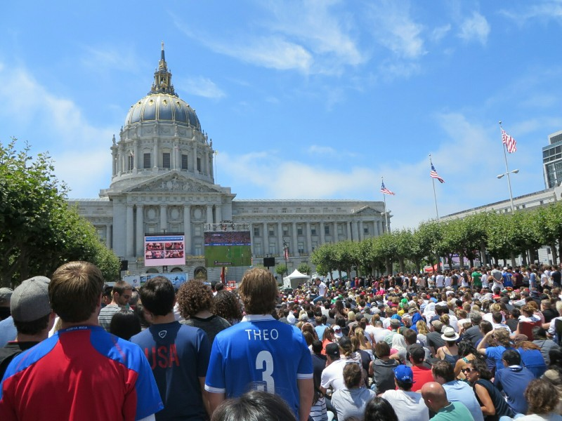
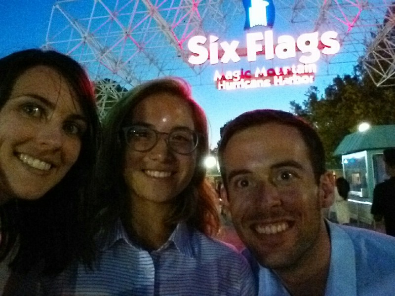
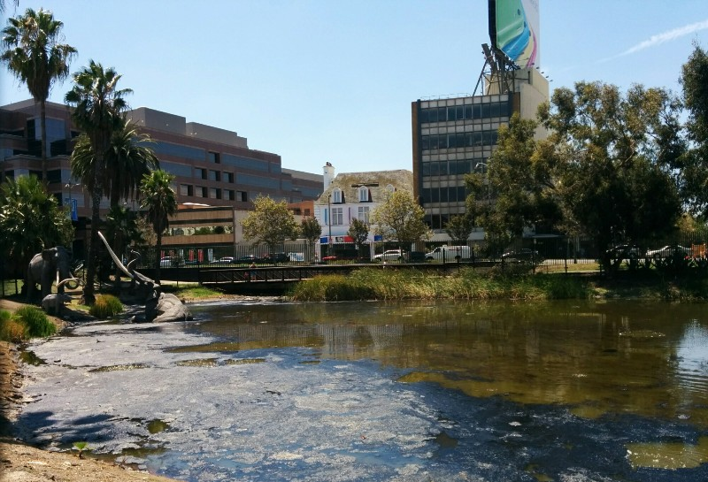
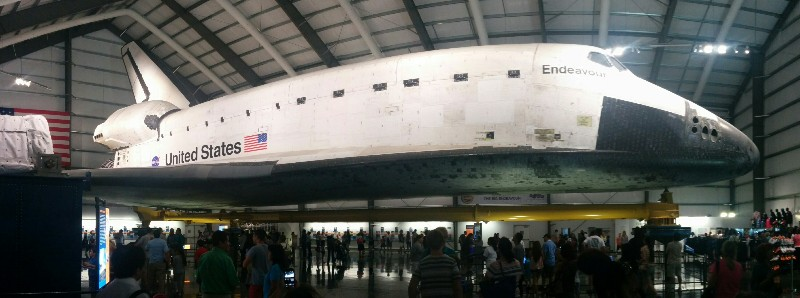
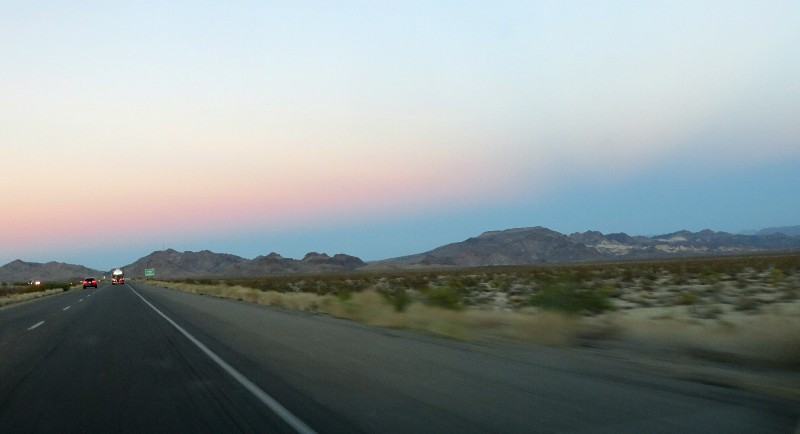
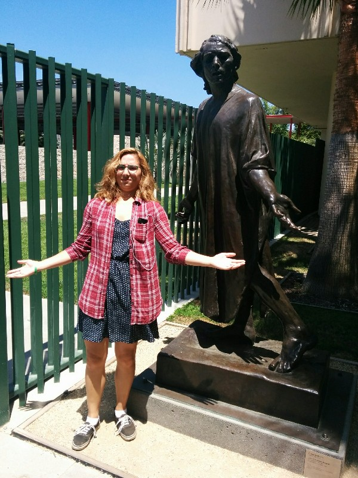

After a week relaxing at the beach with Pat's whole family (where we watched Germany destroy Brazil), a brief interlude in San Fran to watch the world cup final (go Deutschland! Nice to see the coach smile for once) and a week at Pat's parent's house starting to organise ourselves for the big move, we have started off again. We got a lift yesterday to Fresno with Terry (had a nice catch up with Aunt Cathy and Mary) then on to LA with Pat's brother Joey.

*Tense Moments at Civic Center During the WC Final*

Today we have decided to utilise some of our gift money from Stuart and Liang to go riding roller coasters! We failed to get out of the house early, but before 10 the two of us and Pat's niece Taylor were on the road for Six Flags- the thrill ride theme park! On the drive it became quite clear a weekend during school holidays in the middle of summer isn't an ideal time to visit a theme park... The queue to the parking lot alone was a half hour. Next a long queue to go through metal detectors, then another to enter the park (despite having prepaid tickets). Pat and Kate, both close to explosion, were put in their place for their impatience by a calm, endlessly relaxed Taylor.

Taylor had visited Six Flags a few times previously so she got to play tour guide and take us to the best rides. Sadly the queues didn't give up, averaging between one hour and 90 minutes per ride. Luckily the roller coasters were SO MUCH FUN it actually made up for the insane waits. They had all kinds of things we'd never seen before- roller coasters that run backwards with you facing down, seemingly nothing between you and the ground and an ever increasing distance below; one that went 160kph and was over in less than 20 seconds; one that had tracks running on both the inside and the outside of the loops (so you took it on the inside going forward, then the outside going backwards); roller coasters that blew fire at you as you flew past; one with a drop so long it ended in a tunnel underground; and one with a live band, dancers and game show set up to entertain the queue. Although to be honest we probably could have done without the sightly out of tune Beyonce covers... We made a point to ride the Colossus, a coaster from the 1970s featured in National Lampoon's Vacation, which is being decommissioned in a few weeks. We ended up staying till 8.30pm (with another long intermission waiting for lunch) and didn't get to half the rides. Very very fun day, good to know we can still manage a day upside down experiencing G force.

Tired, sunburnt and completely out of adrenaline we had some quick left over curry at Joey's house after the drive home, then crashed.

*Fun Times at Aag Mtrtain ($50pp entry apparently isn't enough to maintain their signage)*

Again failing to get up early we missed our morning jog in favour of getting a lift to LAX with Joey to pick up our rental car. LA traffic wasn't too bad this early and we got to the airport in good time. However our luck wasn't so good in the Alamo office. At the desk we were informed the car was uninsured and as a special deal she'd give us insurance for $25/day. This felt very reminiscent of Spain, and we'd made a point to check the car was insured before hiring it in the first place. It's hard to know what to believe at these places as the staff are paid a commission for all the extras they convince you to buy. Pat had a brainwave that his US credit card might include insurance in any case and went to call them while Kate waited at the desk. There she observed the moley lady ripping off some poor Belgian tourists. They were a family of four who'd just arrived in America and had booked a Jeep Grand Cherokee for their time here. She told them they'd booked a Grand Cherokee "OR SIMILAR" and the car wouldn't fit them all and they needed this bigger one for an additional $39/day. They clearly thought this sounded dodgy but were jet lagged, unfamiliar with the language and processes/cars here and didn't want to get stuck. Eventually after maybe 10 minutes of the lady pushing them they agreed and handed over another $600. Kate wanted to say something, but also wasn't 100℅ sure she knew what she was talking about and didn't want to talk them out of a big car if they really did need it.  But on our way out we saw the family packing their 4 small bags into a massive, unnecessary American style monster van. Sad face.

The traffic on the way back was more typical LA. After a lot of gridlock we got back to Santa Monica, had a little jog, then headed to the La Brea Tar Pits with Taylor. We met Pat's friend Jordan there. The La Brea Tar Pits are pretty much what they sound like- pits of tar in the middle of LA. They've been there for millions of years and are being excavated revealing fossils of a bunch of animals that have wandered in and got stuck over the years including mammoths, dire wolves and saber toothed cats. It wasn't quite as exciting as we expected (we assumed there'd be half submerged mammoth skeletons in massive bubbling pits of hot tar or something...), but it was interesting. There were a number of small pits, one of which was still being excavated so you could see bones in situ. They weren't whole skeletons, just random bones belonging to an assortment of extinct animals. And towards the back of the park there was a small pit with some bubbling tar and a half submerged traffic cone. So that was something! All in all it got a pass- not a bad way to spend an hour.

*Action Packed Excitement at the La Brea Tar Pits*

Next, Jordan played tour guide and we popped over to the Modern Art Museum to check out a few installations- a giant rock balanced over a walkway, a whole lot of not-quite-matching lamp posts, and a very cool Rodin sculpture garden.

Next stop had Pat very excited, the California Science Center to see the Endeavor Space Shuttle. We got our tickets and after the sneaky museum worker snakes made us go to the educational display first, we went to the building housing the shuttle. It was housed, unceremoniously, in a glorified Stratco Outback tin shed. However once inside Pat, Taylor and Jordan were all suitably impressed by the shuttle itself and quickly forgot about the inadequate building. They had all sorts of educational displays lining the walls that summarised every shuttle mission including small memorial plaques for the two shuttles that were lost in action- Challenger and Columbia. Most importantly, they had a FREAKING SPACE SHUTTLE! This thing actually flew in space with people on board, did sciency space type stuff, then flew back to earth. The whole thing was quite overwhelming and really made Pat feel like we need to get on with things and make Star Trek a reality.

*So Big It Necessitated a Panoramic Shot*

By now we were running a couple of hours late. Oops. We said bye to Jordan, went back to Santa Monica and got a late sushi lunch with Taylor, then left town at 4pm rather than the intended 2pm. This meant rush hour traffic. The estimated trip time was up to 7.5 hours from 6 if we'd left earlier. Such is life! We took a long drive through the desert enjoying a super scenic sunset. Kate had a go driving on the other side of the road and didn't kill us all. Yay! Finally, just before midnight we arrived in Williams. It was a very cute little town with lots of enthusiastic welcoming signs, but we left off exploring in favour of sleep.

*Twilight on Route 66*

*Taylor and Rodin- Same Wavelength*
