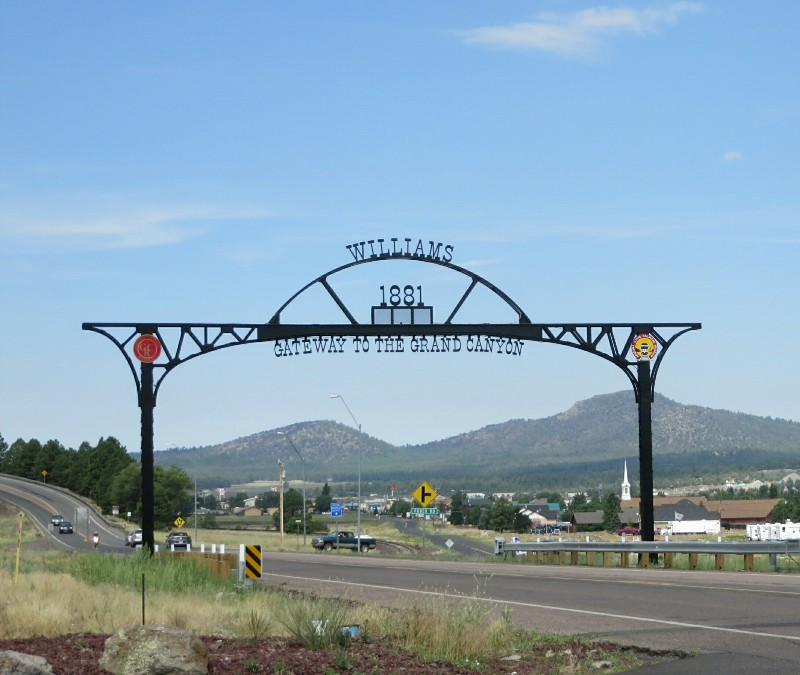
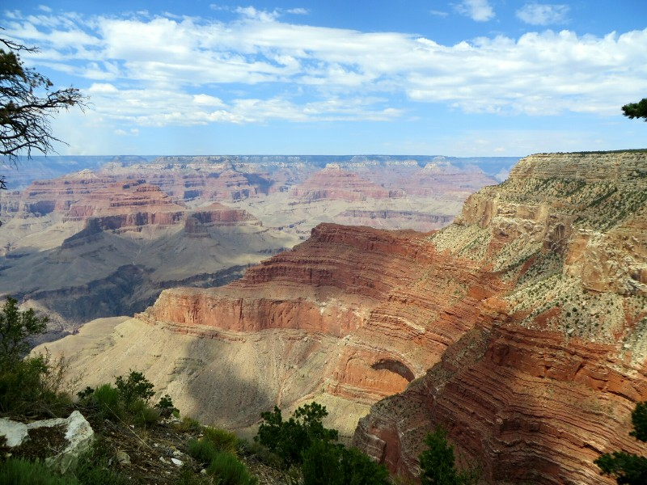
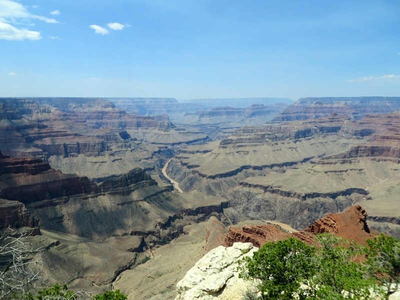
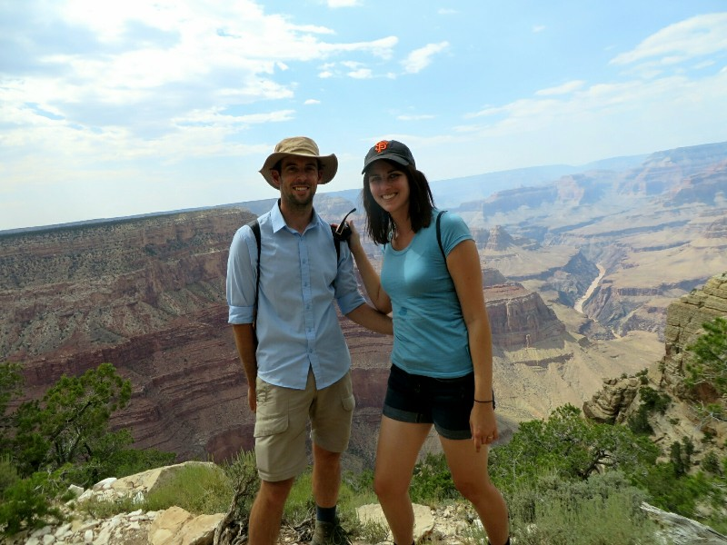

Having arrived so late last night we never had a hope of an early start. We went out to the local diner for breakfast. Kate enjoyed it very much, she had a three egg omelette and a never ending cup of coffee the waitress refilled every five seconds. After food we packed and got on the road. Passing through Williams on the way out was fun, it's a very kitschy town, revelling in their Route 66 history. Lots of historic buildings, a petrol station museum, Route 66 paraphernalia, diners and motels lining the road. We felt it was a shame we didn't have more time to explore!

*Williams- Cutest Town in Arizona*

Today's destination is The Grand Canyon, thanks to Jerry and Paula De Young. The hour and a bit drive to the Canyon was fairly scenic but uneventful. Almost completely flat but for the occasional hill off in the distance. We arrived in the park and promptly took a road heading the wrong way. We realised our mistake in a pretty ideal way- instead of coming up on some shops we ran straight along the rim of the Canyon. Not a bad reward for a wrong turn! After a few more circles we worked ourselves out and found a parking lot near the part of the rim trail we wanted to do. We originally had big plans to do a multi day hike into the canyon and back out again, but as it turns out you need to book the camp grounds ages in advance, not a few weeks prior. Damn those organised people stealing our sleeping spots!

By the time we got ourselves together it was approaching midday and it was H-O-T! We ignore the government warning signs everywhere telling us not to hike between 10am and 4pm and set off. The views are spectacular! While The Grand Canyon is neither the deepest nor widest canyon in the world it's still terribly impressive. It's an amazing demonstration of the power of natural forces over time; it's hard to believe this 2000 meter deep split in the earth was largely caused by erosion primarily from a river just flowing along doing its thing. You can clearly see the layers in the rock representing different time periods when this area has been a shallow sea, a marsh, a duney desert and an ocean floor. The deepest rock layers here date from nearly 2 billion years ago. 2 billion years! Dinosaurs were around 250 million years ago, this is eight times as old as that. Hard to comprehend. Not for the first time, we wish we had John Hickin handy to give us a run through of the local geology.

*Grand Canyon!!*

We made our way West along the rim (mostly walking with the occasional lift from the free bus) from Grand Canyon Village to Hermit's Rest, the last stop before the trail tips into the canyon. By just after 3pm we were pretty done with the heat! We got the bus back to the car and had a drive along the rim until it started to get late and we decided to head off. We have no hotel booked but have an idea of how far and what direction we want to go tonight so when we get back to internet access in Flagstaff we call ahead and sort a room out. Sorting it out as we go is a nice way to travel!

On the drive we passed signs to a meteor crater. Then after a few more miles we pass another sign urging us to pay attention, because if we didn't turn now we were going to miss the meteor crater! Soon after- "Seriously Last Chance for Crater Guys!!" We decided we'd give it a go. After we exited the freeway we came across another sign explaining they were closing in 2 minutes. Opening hours would have been helpful on the big signs inviting you to turn from the freeway. Pat decided to try to make the 6 miles in 2 minutes- a spaceship and a meteor in 2 days was too much to pass up! We shot down the road watching our progress on Google maps. Arrived at the rim just as they were closing the gates a few minutes late. Asked for special dispensation to enter and we are promptly denied. So much for a crater, it's back to the freeway for us.

After that adventure we didn't stop until we reached our bed for the night in Holbrook. Definitely not as cute as Williams- a wide 5 lane road passed through town with only old motels and a few chain restaurants lining the road. In the occasional empty blocks you can see the totally flat and barren desert stretching to the horizon. We know there must be cows grazing nearby though because it smells like a farm (which is a nice way of saying it smelled like cow poo). There's a photo of the town almost 100 years ago and it looks like the only change is there are now cars and a paved road. We go to a restaurant our hotel suggests ('a little Mom & Pop restaurant which isn't fancy but serves good clean American food') for a decent dinner then call it a day.

*There's The Colorado River, Looking Itty Bitty Down There!*

*Wonky With Lunch Evidence on Kate- But At The Grand Canyon!*
