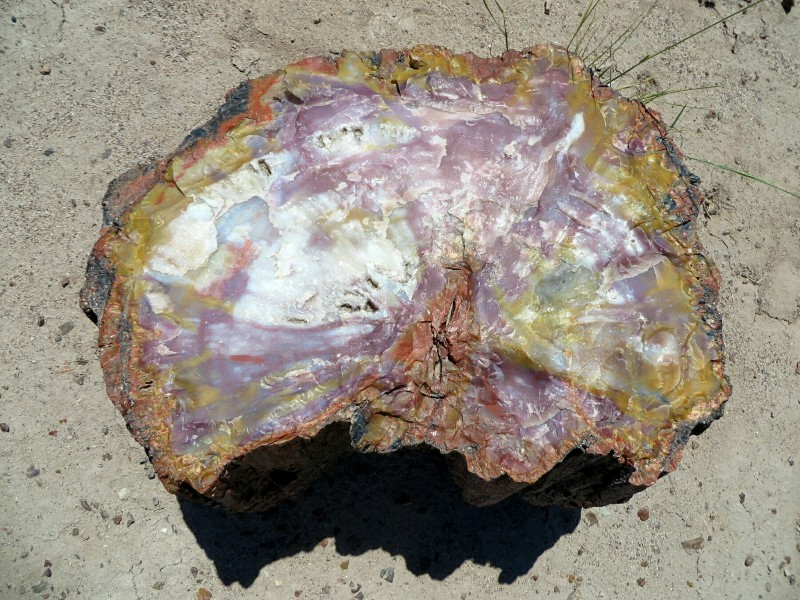
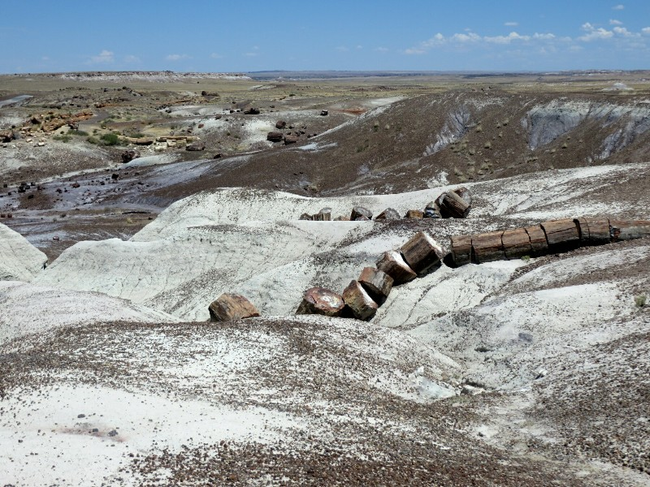
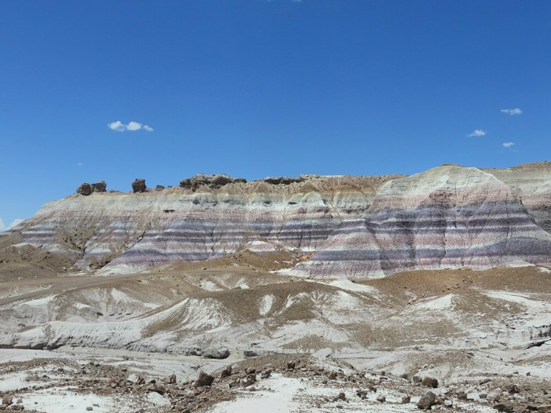
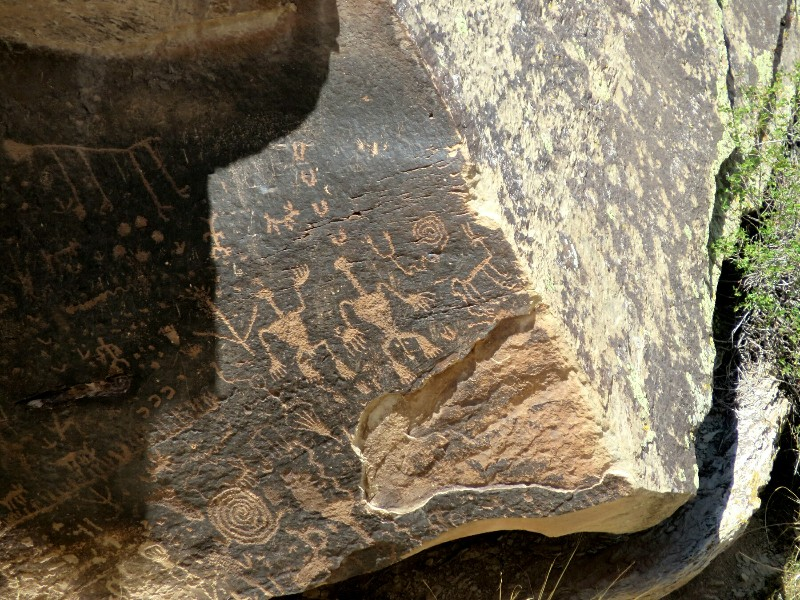
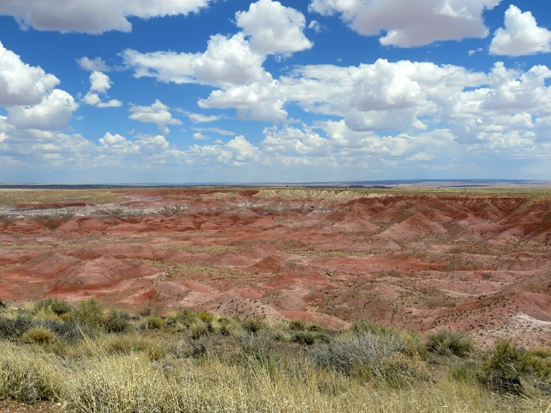
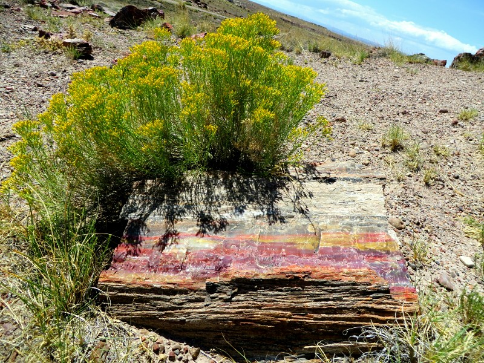
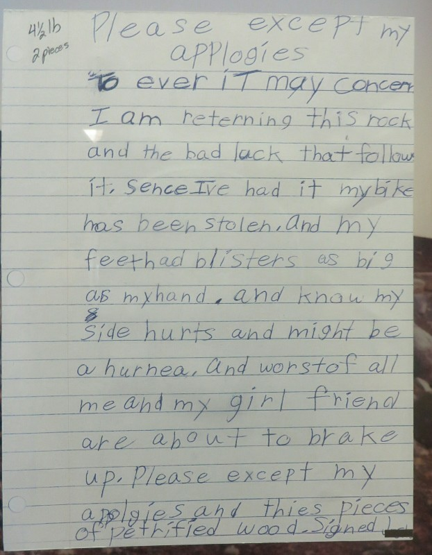
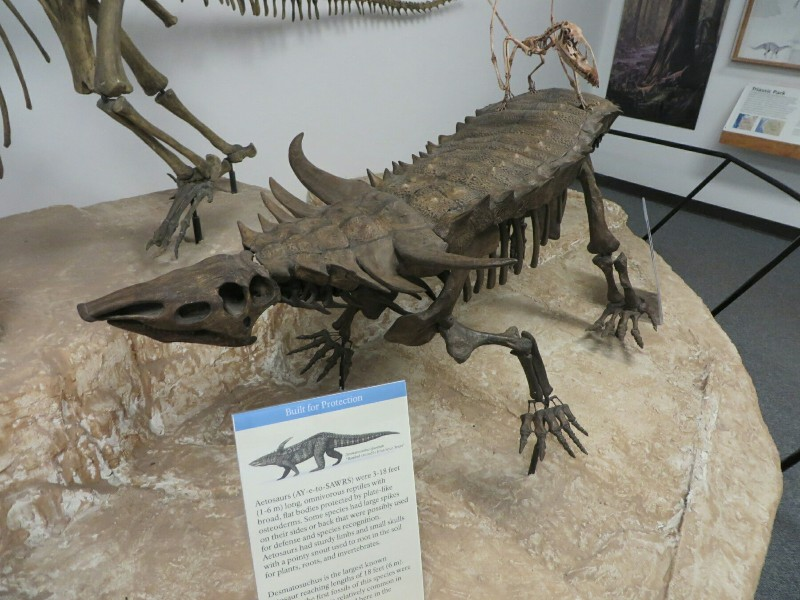
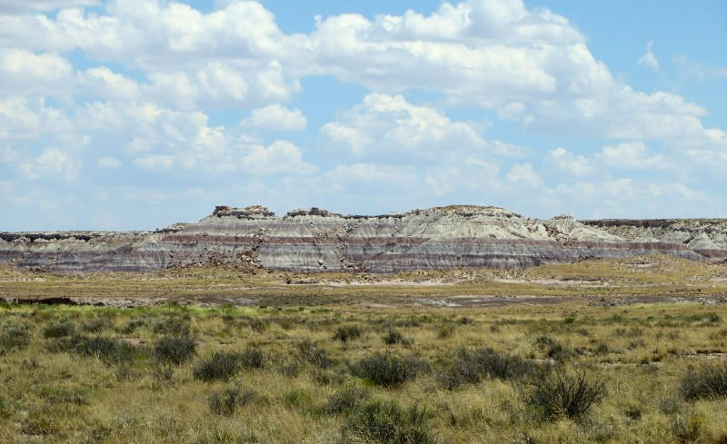
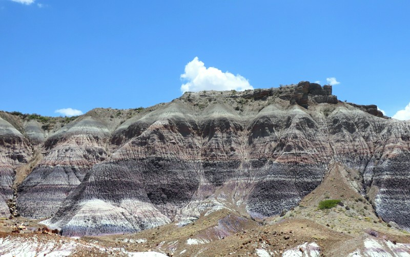

We're definitely in the desert! When we get up at 7am for a jog it's already 28C (that's 82 degrees for the Fahrenheit users in the audience). Phew! We're packed and in the car just after 9, heading towards the Petrified Forest National Park. We stop at the town information center on the way. There are big dinosaurs in the back yard of the historic courthouse hosting the information center to remind locals of the prehistoric history of the area when it used to be an equatorial marsh before tectonic plate movement brought it north. On the way out we gave a nice homeless man a quarter and a blueberry muffin. He asked for water- I don't blame him! Unfortunately we don't have any. But lucky for him, despite being hot and gross, tap water won't kill you here!

After an hour or so we reached the south entrance of the Park. There's one road that runs North/South through the park taking nearly 45 minutes without breaks. Along the way there are about 10 spots to stop and look including a few short walks and two small local museums. We start at 'Giant Logs' which delivers what it promises- a whole load of fallen over petrified trees of varying size and colour. There's also a handy museum to explain the process- a long long long time ago (before there was a desert here) the trees died, fell into a river, lost their branches, got buried in sand or silt or ash deep enough to greatly slow their decomposition. Gradually mineral dense water infiltrated the trees and replaced the wood, turning it to stone! Depending on the type of mineral in the water the resulting petrified trees can be a wide range of colours and type of stone. The preserved rings in the trunks are pretty cool.

*Psychedelic*

Next stops were the Crystal Forest (which used to have amethyst logs until tourists stole them all) and Jasper Forest (also pilfered but in the 1800s by men with dynamite and wagons sneaking away on rail cars).

*Petrified Tree Being Gradually Exposed From Its Position Buried In The Hill*

As we drove North we passed more and more striped mountain ranges; blue, purple, white, green and red in very distinct layers contrasting sharply with one another. Our fourth stop was Blue Mesa, a 45 minute walking loop down into the valley and back up. Doesn't sound bad except the 38 degree heat and complete lack of shade. The rock formations were beautiful and the area is unlike any other place we've visited in any other country. It felt very unearthly, like we were on an alien planet (or the set of a Michael Bay film after an area had been blown up but in a very aesthetic way).

*Blue Mesa*

By this time we were dying from hot. We had a quick stop at Newspaper Rock, which is covered in petroglyphs by the native people drawn 800-2000 years ago - very cool, then Puerco Pueblo, the partially excavated ruins of an 800 year old city. Through the North half of the park we gave up on exiting the car altogether and just looked out the windows. The rock's a lot more red up here, guess it's... younger...? John Hickin? Help?

*I Like Their Style Of Distinguishing Male From Female...*

After the park, back on the road at about 2pm. The road (Route 66!) runs parallel to the Santa Fe Railway Line. Since we started driving a few days ago we've been passing never ending trains with double decker shipping containers and hundreds military vehicles ranging from transport vehicles to tanks. They're all headed West- we hope this isn't the first sign of WWIII... We wanted to stop for lunch but most the towns we passed were creepy ghost towns and all boarded up. Eventually, after crossing the border into New Mexico, we settle on Gallup (The Most Patriotic Small Town in America the sign announces as you enter). More boarded up diners with dodgy looking men standing out the front looking around anxiously with their hands in their pockets. After a good bit of driving we find a little Mexican joint still serving lunch at 3pm (which we later find is 4pm- damn time zone change)! The place is pretty nice and serves decent food, and no drug addicts rob us so we're happy.

*And Until This, I Always Thought Red Dirt Was Exclusively Australian!*

Back on the road, Kate has a turn driving again and doesn't crash. Pat takes over driving duties again when his nerves and anxiety can't take any more. Suddenly from completely desolate and flat desert we come over a rise and we're in Albuquerque (challenging to spell)! It's got beautifully landscaped median strips and even the overpasses and freeway exits have been painted or decorated with art. There's a huge mountain range that's come out of nowhere towering over the city. We're just passing through (because of that cursed stolen hour) but this town doesn't look half bad from the road and we make a note to come back and explore some day when we have more time.

We continued up the road until we got to our bed for the night in Santa Fe. Apparently the hotel welcomes animals so there's a cute cat watching us from the window as we pull up and a dog barking down the hall. Again we're thrashed so we don't look around town at all tonight! Driving has certainly taken its toll on us but the American Southwest has really delivered so far. We've both been loving the scenery and the small towns that we've driven through and are also enjoying having more control over where we go and when. It's nice not being tied to a train or airline schedule!

*So Pretty!*

*Cute Note With A Returned Bit Of Petrified Tree*

*Pat's Favourite Dinosaur*

*Billion Years Of Earth's History In A Mountain- Quite Beautiful*

*Some Of These Really Look Like Cranky Old Man Faces...*
