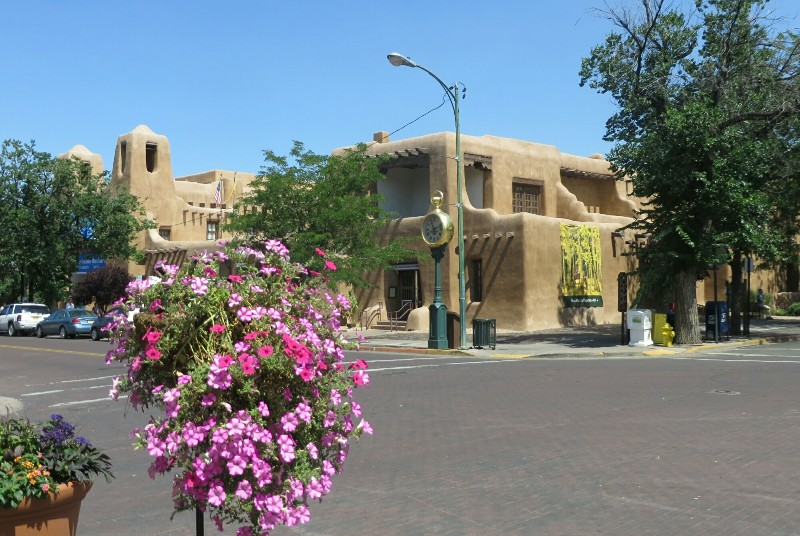
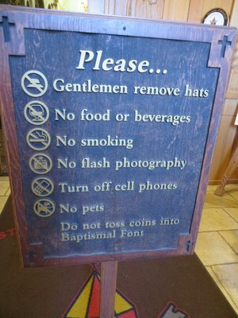
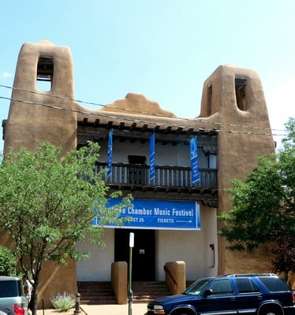
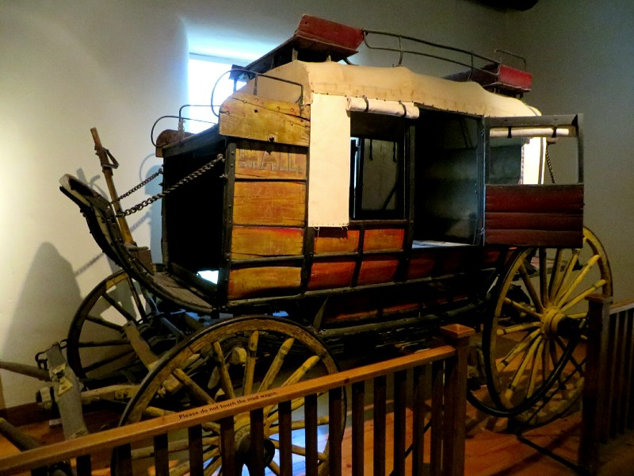
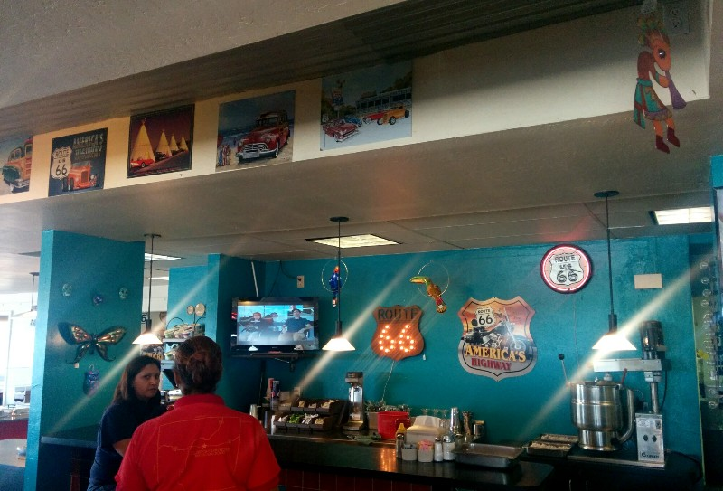
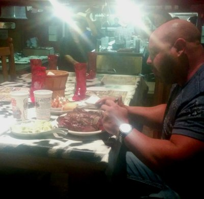
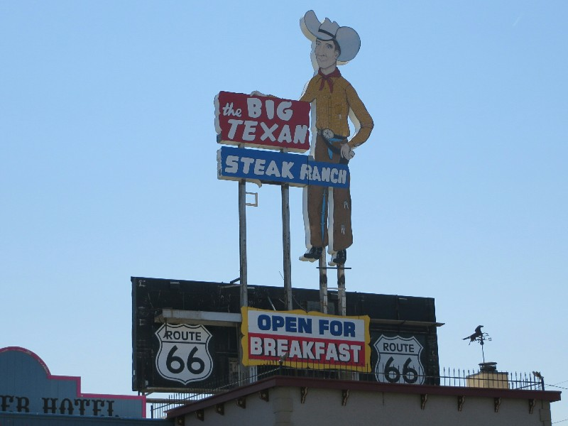
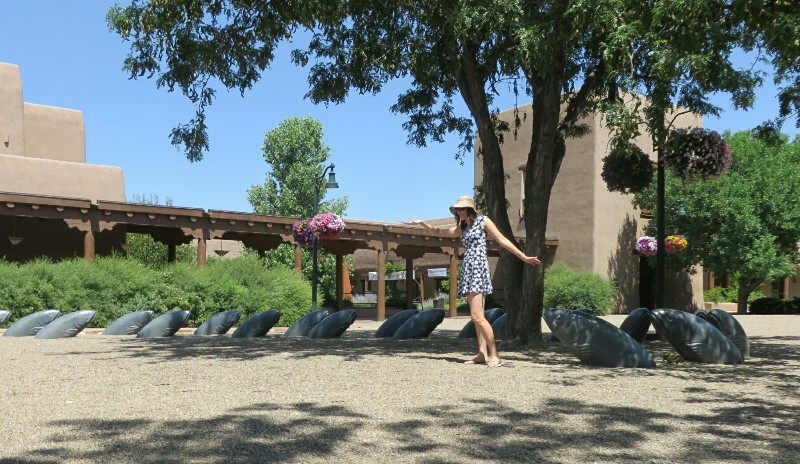
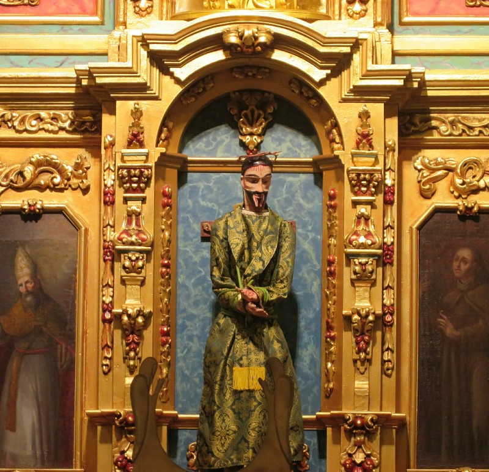

The breakfast offering at this hotel is the main reason Kate was keen to stay- free unlimited waffles. Mmmm. Alongside the waffles was the standard toast/cereal shebang, and a very very odd, apparently quintessentially Southern offering of a scone (aka: a biscuit) drenched in meaty gravy. Shudder.

After a bite and a shower we went to explore central Santa Fe. A little googling last night told us this is one of the most desirable tourist destinations for Americans, so we had high hopes. Driving into the city we passed a lot of adobe buildings that look like they belong in The Flintstones. Apparently they're typical for the Spanish colonial period. After parking we wandered towards the central square, passing the Chamber of Music on the way. There was a sign out front advertising the twice daily concerts. We decided to go to the noon one care of Lap and Em.

*Yabba Dabba Dooooooo!*

In the meantime we explored Santa Fe. Walking into the central square was like walking into a more developed Cusco (Peru)! There were local American Indians with a craft market selling jewellery, a few food vendors, little balcony restaurants and more stores/restaurants hidden through small arcades in green courtyards. After a lap around this square we wandered down the street and almost immediately came upon a second square! More and more Cusco like- we just need a bunch of locals dancing around the street in traditional dress to complete the picture! After having a poke around Basilica of St Francis of Assisi and City Hall we went back to the Chamber of Music for our concert.

*That Last One's An Interesting Addition*

Two pieces were being performed. The first 'Old Kings in Exile', is modern and by an Australian composer, Brett Dean. It was described as a sextet but 7 young musicians set up on stage- a pianist, a percussionist (with cymbals, a gong, a xylophone and a random assortment of instruments), a violinist, a cellist, a flutist, a clarinetist and a man sitting next to the piano staring at the audience with a bass clarinet on the floor behind him. The music started with the violin making the most bizarre noise- Pat decided she was trying to tune it but was failing to realise it was broken. No one told her, and in fact the other instruments started to join in. The piece was very different- a cacophony of discordant notes and sounds, sometimes a little uncomfortable to listen to. The classical instruments were played in new and inventive ways (playing a cymbal with a bow) to create unusual sounds that sounded almost unnatural. It sounded like the soundtrack to a horror or 1970s sci fi film. But somehow the random assortment of sounds came together well in a really engaging and emotive piece of music. The flautist was a busy bee switching from the flute to the alto flute to the piccolo at great speed throughout the performance. In the first movement the man at the back didn't move, just stared. However in the second he picked up the bass and played a few notes. In the third movement he was back to looking threatening. We later read the clarinetist was supposed to play both instruments (hence sextet) but I guess he decided not to for whatever reason.

*The Concert Hall- Closest Photo To The Actual Performance*

After the first piece was over the performers of the second piece came to the stage. These three were older (in their late 40s-early 60s) and dressed to the nines in nice suits. There was an Asian man on the piano who spent about two minutes awkwardly reducing the height of the stool bit by bit to meet his smaller stature. The violinist looked like an ex army officer- bald, standing straight with a dead pan expression. The cellist had unfortunate luck with hair- his receding hairline and the bald patch on the back of his head had recently met, but the hair on the sides of his head still came up 2/3 of the way and he kept it a little fluffy. They played a classical piece- Piano Trio No. 1 in D Minor by Mendelssohn. The contrast of the pieces was a great decision- the eclectic nature of the first emphasised the harmony of the second. And the performers were a show in and of themselves! The pianist was amazing, didn't miss a single note, his hands almost moving too fast to see. He kept excellent posture, rocking from one end of the piano to the other and back again, but whenever he finished a particularly tricky bit he did a little head pump 'yeah I nailed that'! However the real show was the two string players. The cellist had the most emotive face either of us have seen outside Jim Carey. His forehead was scrunched, his face red and on the verge of tears. Then his part got more bass-ey and he turned into big man with great posture and a serious expression telling off his small child. Then it got lighthearted, the cello conversing with the violin; his eyebrows danced around and his head bopped up and down towards our serious army colonel who remained a perfect deadpan contrast throughout. At the climax when it became very emotive and the cellist was almost crying with love at his instrument, the violinist started to have the most understated movements along with the drawing of the bow on the violin. At the end the trio received a long lasting and well deserved standing ovation. Truly the combination of the two pieces made one of the best musical performances either of us have ever seen. So glad we stumbled upon it. Unfortunately no photos or videos allowed.

We had a quick lunch stop at a enchilada and limeade truck (excellent quality) then headed to the History Museum of New Mexico. We happened to arrive as a guided tour started so we joined in. The tour guide was around 80 years old (in 4th grade in the 40s), but looking really good! She was a first generation New Mexican who was born in Santa Fe after her parents met on Route 66. She was very passionate about the history of New Mexico and was very proud (as are all New Mexicans) of their history with the native Pueblo people. She rightfully boasted of the fact that New Mexico has one of the oldest unbroken land agreement between the United Stated and the native inhabitants giving the natives sovereignty on their claimed reservations. The agreement has been passed down through several different nations as they had control over the region, starting with the Spanish, then Mexicans following their successful war for independence from Spain, and finally to the United States.

*Ye Olde Stagecoach-e*

Unfortunately her passion got the best of her and she frequently got caught up with her (admittedly interesting) stories and turned a 45 minute tour into nearly an hour and a half. We missed a lot of the topics that were meant to be included, but we got a good overview of the history of Santa Fe, including the fact that long before there was any rumblings of governance on the East Coast, Santa Fe was the first European administrative capital of North America back when it was a Spanish colony. Not a bad claim to fame!

On the drive from Santa Fe back to the highway we passed through green fields of very fertile land with grazing cattle, surprising for the middle of a desert. It looks like the desktop wallpaper for Windows XP. At the junction with Highway 40 we saw billboards advertising a diner selling homemade fudge since 1934! Definitely worth stopping for. Mmmm - fudge. We carried on down the road and eventually reached the border with Texas. It seems almost immediately when we crossed the border all traces of mountains, hills, anything, disappeared and was replaced with sprawling flat planes, dotted with wind farms in every direction. And we lost another hour. Sad face.

*Diner on 66*

*Sneaky Picture Of Our Gluttonous Entertainment*

We arrived at our roadside motel in Amarillo at about 9pm, and despite not being terribly hungry had to head for a traditional Amarill-ian dinner. Amarillo is locally famous for Big Texan Food- it's been featured in Man vs Food on five separate occasions, and the most prominent of these establishments is The Big Texan Steakhouse. It boasts a challenge from the Route 66 heyday when a trucker ate four one-pound steaks (just over 2kg total), three prawns, a baked potato, a bread roll and a salad in an hour. Anyone who manages that these days gets it free. The current record holder ate it in 8 minutes (ick), one professional wrestler ate two (!!!!) in the 60 minute time limit. The youngest person to complete the challenge was an 11 year old boy and the eldest a 69 year old Grandma! Anyway- we weren't going to break our stomachs on that ridiculous pile of food, but we did want to check it out and grab a reasonably sized steak. We arrived close to 10pm and the place was still packed, we had to wait 20 minutes for a table! The dining room was huge seating 300+ people, plus a balcony level with additional seating. Our steaks were both very nice, masses of sides and good dinnertime entertainment in the form of a man struggling through the challenge at a raised table at the front of the room while a huge digital clock counted down ominously behind him. We didn't end up seeing if he succeeded as we were too sleepy too stick around and watch, but it was a great dinner to start us off in Texas!

*Our Big Texan Friend*

*Kate Leading An Army Of Fish To Take Over The World*

*I Never Knew Jaffar Was A Key Figure In The Catholic Church*
