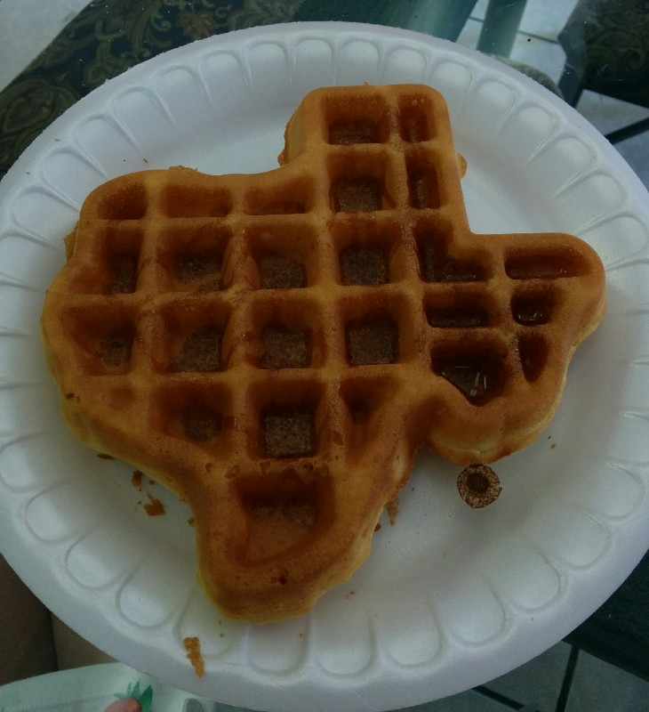
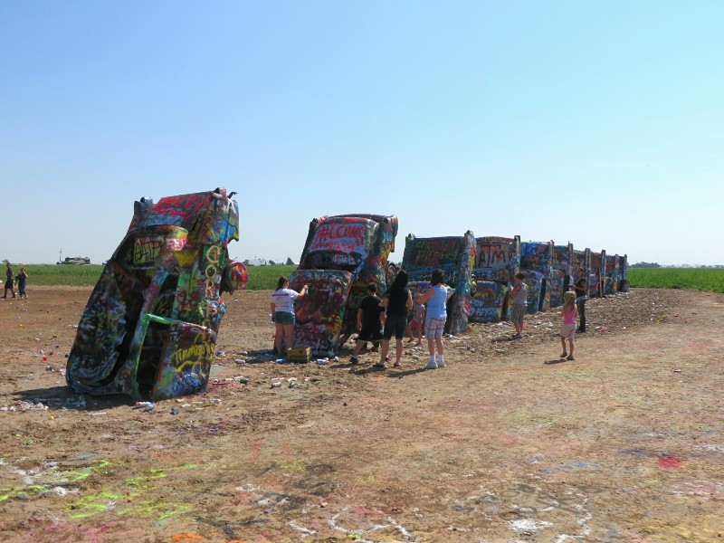
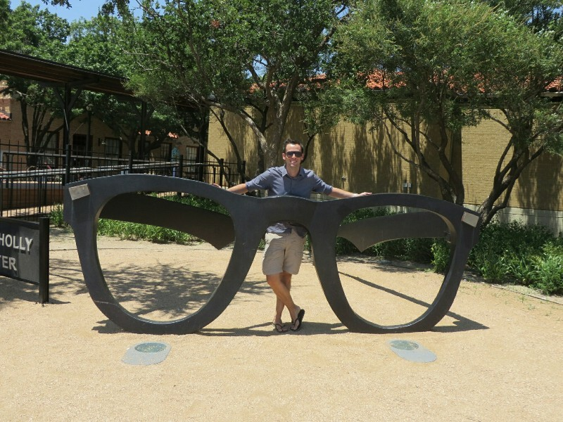
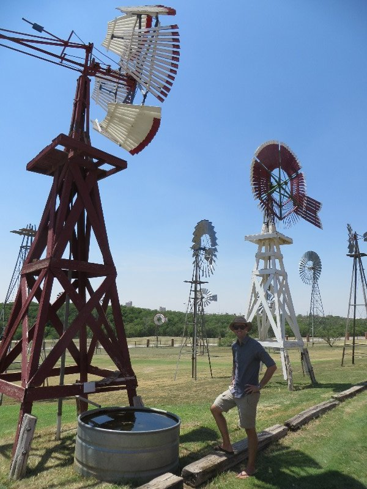
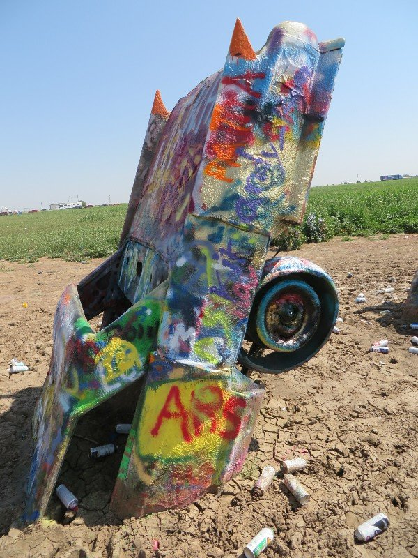
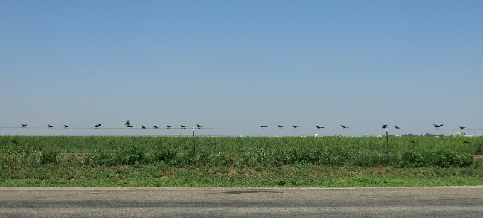
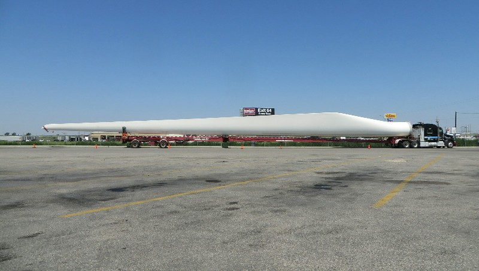
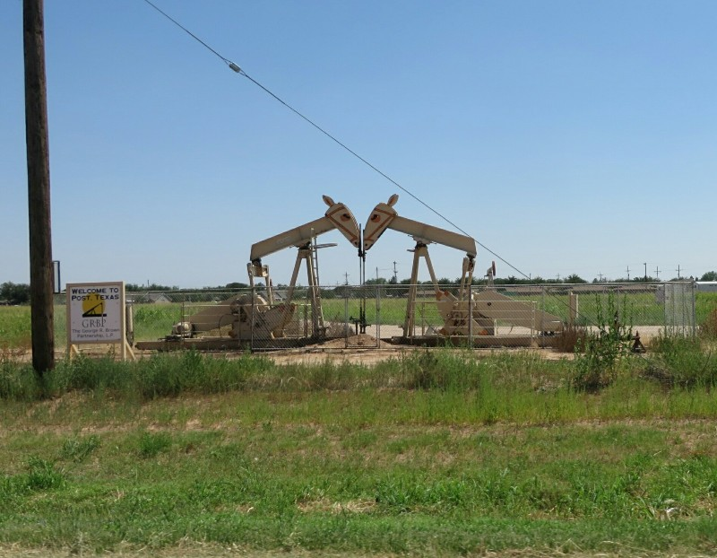
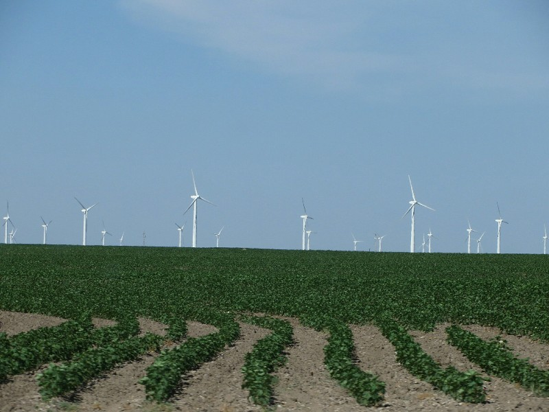

After failing to get out of bed early enough for a run, we grabbed a free hotel breakfast. The coffee was abysmal (they didn't refresh the grains over the 3 hour breakfast, just added more water resulting in sightly brown, caffeine free hot water in a cup), the eggs were powdered, they had run out of a lot of things and weren't replacing them, but on the big plus side they were serving Texas shaped waffles. Excellent.

*We Won't Make You Suffer Through Looking At The Texan Coffee*

On the road, the first stop was a local art installation from the golden days of Route 66- Cadillac Ranch. It's a bunch of rusty Cadillacs half buried in a random farmer's corn field that people visit and spray paint. It was actually pretty cool. Pat, apparently looking especially ethnic in his zip off shorts and fisherman hat was accosted by a large man with a thick Texan accent- "Hey Boss Man, you speak English?" After a moment trying to work out what was going on, he realised the man wanted a family photo and obliged. There were a lot of spray paint cans littering the ground around the decaying cars and kids barely old enough to walk picking them up and spraying them in any random direction while their parents looked on snapping photos with smartphones. Pat is very concerned about the carcinogenic chemicals these kids are spraying in their faces, but felt better when Kate explained that potentially cute photos for Instagram are much more important than your toddler's health.

*Expensive Cars Burried In The Desert = Art..?*

Next- on the road to Lubbock through many more large empty fields. In Lubbock we stopped for lunch at a 'home style southern diner', the Cast Iron Grill. We wandered in and were greeted first by an elderly black shoe shine man, apparently a preacher. Next we took note of the décor- your typical old license plates all over the walls, some boots hanging from the celling, some dead animal heads, a whole load of funny/inspirational quotes in every spare area, and photos of the staff and locals. Kate got a 'Chicken Fried Steak', which was basically a beef schnitzel with creamy gravy, and Pat got bacon cheeseburger. Both servings were massive and came with mac and cheese, fresh onion rings and green beans fried with bacon. All tasted terrible for you, but delicious. And the nicest staff, so warm and welcoming. Another nice Texan experience!

*Apparently Lubbock's Other Claim To Fame Is Being The Birthplace Of Buddy Holly!*

After lunch we went to a local museum, The American Wind Power Center. We could tell when we were there as we approached grounds covered with hundreds of windmills. They had a huge shed with over one hundred more indoors. It was really cool! They had one windmill from the 1600s right through to a modern wind turbine powering the museum. There was even a windmill from Australia! Lubbock is apparently famous for their annual Cowboy Convention and they had personal stories from some of the keynote cowboy speakers about their windmill experiences. They had working miniature model windmills that door to door salesmen used to bring to farms to try to convince farmers to buy one for their property. They had a few old mills in action, pumping water up to fill a ponds. The museum had a sad story behind it- it was the life passion of a local teacher, but after traveling for years to collect all the windmills she died from a stroke before it opened. The lady working at the desk saw we were from Australia when we signed in and came over to have a big chat about how wonderful it was that we visited and how some nice Australians helped her parents out when they visited a few years ago. Lubbock had a bunch of fun sounding museums, bars, restaurants and events- it's a shame we're just passing through.

*Windmill Museum!*

The remaining afternoon was spent driving through hundreds of miles of wind farms. Apparently Texas has so many they've had to stop building turbines because the power lines are all at full capacity. I had no idea Texas was so keen on renewable energy! We stopped in another few small towns and met nothing but lovely people calling us y'all, wearing spurs, blessing us and selling random Christian paraphernalia. As is our habit we arrived in Fredericksburg late, and skipping dinner after all our car snacks, went to bed.

*Does Look Kind Of Cool...*

*Crows Lookin' At A Cornfield- Feels Pretty Southern*

*Massive Blade For A Wind Turbine*

*Oil Derricks Sneakily Disguised as Horses*

*Windmills windmills windmills!*
