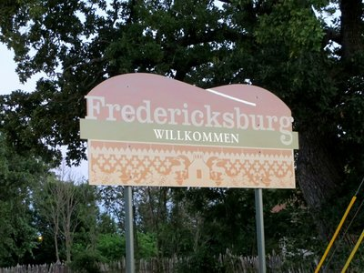
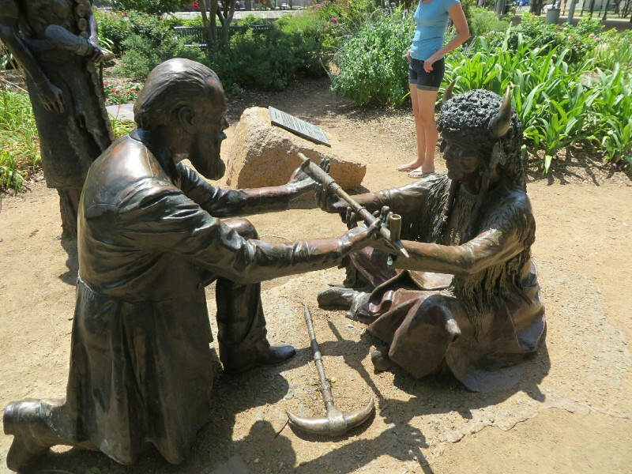
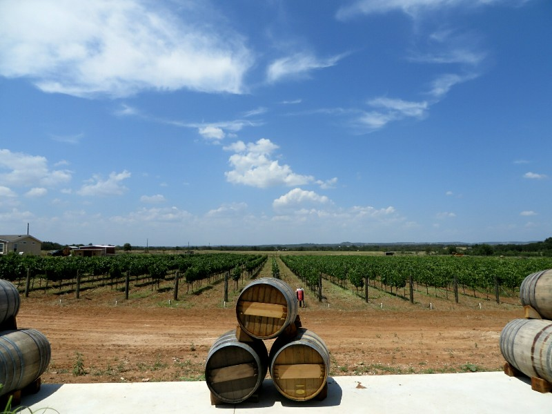
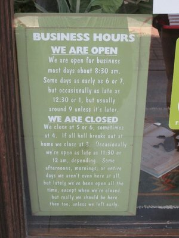
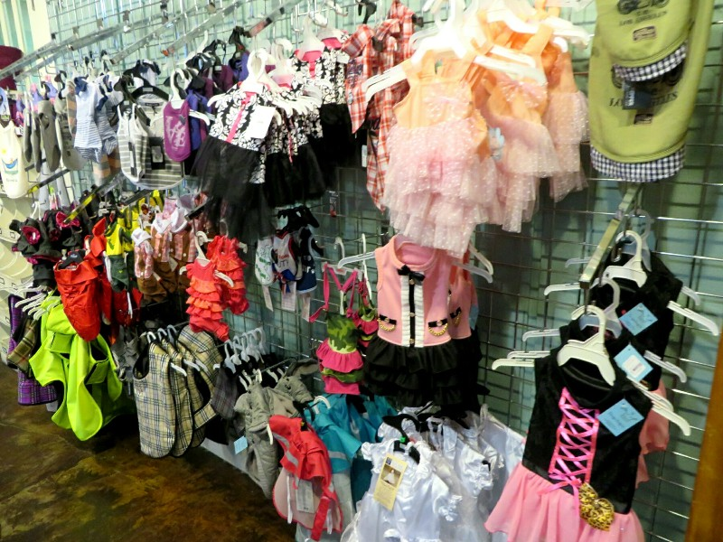
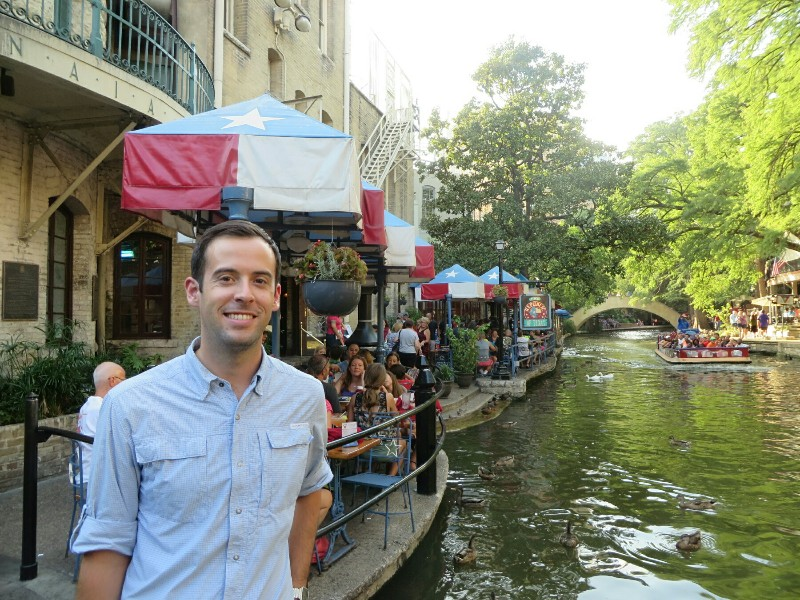
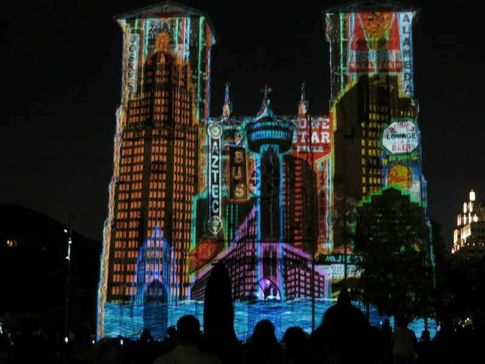

Bad night's sleep! Kate, still not asleep but also not awake at 2am saw a small girl walk the length of the room carrying a basket of something then go around the corner out of view. Even knowing she must have dreamed it, she was too freaked out to go look around the corner to confirm and couldn't sleep at all.

*Feels Like Fussen!*

We went to the local German Bakery and Restaurant for brunch. It was packed, as was the rest of town. I guess being an hour from both Austin and San Antonio makes you a desirable weekend getaway locale. We had a schnitzel with potatoes, and German sausages with sauerkraut. Not as good as Füssen, but not bad. And the bottomless American coffee is always nice! We had a wander around town, learnt a bit of history.

In 1836 Texas won independence from Mexico and became 'The Republic of Texas' (we should learn more about that tomorrow when we visit the Alamo in San Antonio). Unfortunately the war bankrupted them. There wasn't enough industry to make money fast, but there was a ton of land. So the Texan government started selling large blocks at half the price the same area would cost in the USA. When less Americans took advantage and emigrated than they expected, they started trying to get Europeans on board. A rich organisation in Germany was formed (The Association of Noblemen) which bought large blocks of land to start an offshore German colony, ideally to relieve pressure on the working class by giving excess labourers a place to emirate and work. The bonus to the society being they got to keep a share of all the profits of any industries developed or materials exported. They managed to set up a few towns, including Fredericksburg, and shuffle over 7000 people before going bankrupt.

*The German Founder of Fredericksburg, Meusebach, Taking A Puff Of Peace Pipe*

Despite the organisation's failure, the German immigrants did pretty well in the tough conditions. They signed a treaty with the local Indian tribe; the only treaty between Americans and natives that hasn't been broken/violated to date. They set up a bunch of public schools, freely available to anyone, even African American kids. They opened a public hall which was shared by all religious denominations as they organised and built their own churches. And all these community organisations were conducted in German. German was actually the second most spoken language in the USA until World War I when the schools and public institutions were forced to speak in English instead. So, that's how a German town ended up the middle of America.

Afters we felt sufficiently educated we headed to the local wine region. Naturally. Our first stop, Grape Creek Vineyard, is packed! There'd be 40 or 50 people hanging out the front and another 60 or more queued in the tasting room waiting for someone to be free to pour wine. The tastings were $15 per person and only refundable on purchase of three bottles AND joining their wine club. Gees! Kate was ready to leave, but Pat poked around and found a second (almost abandoned) tasting room. So we gave it a go with the most awkward person we've met at any winery serving us. It turns out the grapes are mostly grown in Lubbock! Should've checked the wineries out there! Luckily the high tasting fee wasn't for bad wine- it was all pretty fantastic and we even bought a bottle!

*Could Be Adelaide! Except They Don't Use These Grapes- All For Show!*

The second winery we visited, Hilmy, had three dogs, all adopted and all gorgeous. The wines were again, excellent. Grapes again from Lubbock. The story of the wine maker was quite unusual- his parents were an Egyptian man and a Dutch woman who met at a soccer match in India. They moved to America and their redheaded son opened a winery in a German settlement in Texas. Could almost be the premise for a movie!

*Pat Approves This Message*

Two wineries was enough for the day- still hot hot hot! So (after a goodbye cuddle with the dogs) we got on the road for San Antonio. We drove through the network of interstates and highways to the attractive centre of town, then bypassed it and headed to a very dodgy area to our hotel. On check in we were greeted by a very brisk woman behind a huge, thick pane of bullet proof glass. Anxiety producing.

We waited an hour for it to cool off a few degrees then headed into town to check out San Antonio. Kate's Mum was here recently and recommended we check out the riverwalk area. We parked then waited at the pedestrian crossing to get down to the riverside path. "WAIT! WAIT! YOU ARE AT THE INTERSECTION OF COMMERCE AND ST MARY'S STREET! 10 SECONDS! WAIT!" screamed the traffic light near the crossing. I have missed the little beep for blind people to cross the road you get in Australia, but this yelling robot was taking it a bit too far... The riverwalk area itself was very nice, if a bit too perfect and Disneyland seeming. Colourful ducks swam alongside picturesque manmade waterfalls, people smooched on the top of Venice style bridges crossing the river and Italian cafes nestled under seemingly hundred year old trees lining the water. And naturally, a million people and tour boats trying to push us into the river as we passed. We stopped at a 'Modern Mexican' place for a decent dinner, admired a cool light and music show decorating one of the historic buildings in the square, Kate felt like she might get shot every time she accidentally bumped someone or didn't give a homeless man a quarter, then we headed home to try to sleep in our ghetto hotel.

*Visited A Huge Shop In Fredericksburg Full Of Prams, Tiaras, Comfort Blankets, Gluten Free Cookies... No, Not For Children, For Dogs. Hmmm!*

*Could Be Italy, But Unlike Europe It's A Million Degrees And Humid At 8PM*

*Oh No! Texas Is Flooding! I'm Looking At You, Oklahoma*
