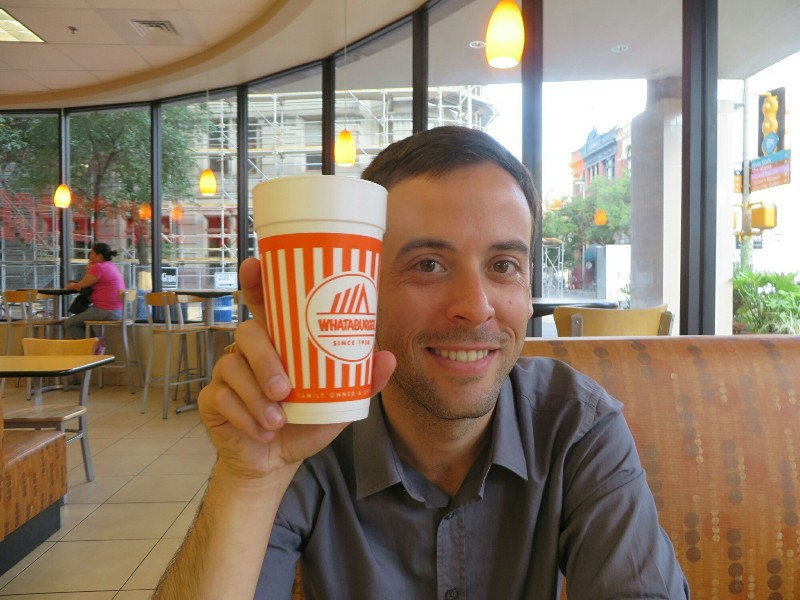
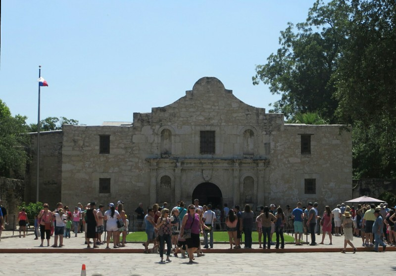
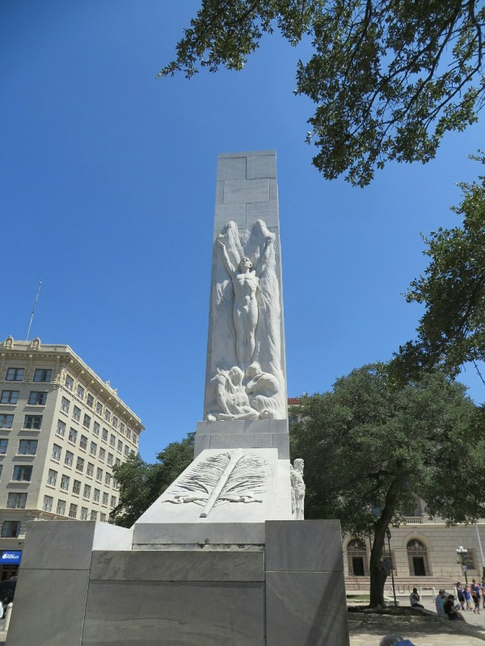
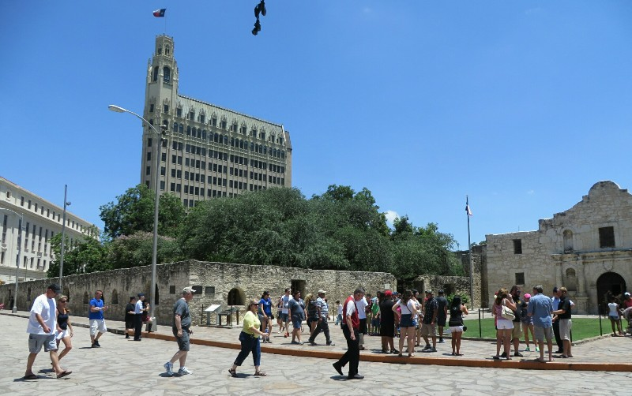

Another awful night's sleep with a very loud rattling air conditioner- it's impossible to sleep with it clicking and spattering turned on, but too hot to sleep with it off. Eventually dozed off in the heat with it off just before 1am only to be woken at 2am by some douchebag blasting R&B music in the parking lot. Pat was keen to tell them to shut it, but Kate (fearing the douchebag is drunk and armed and will just shoot him instead) gets him to call reception. Still takes a while to quiet down after that. All in all- not ideal!

In the proper morning we zombie out of bed, get ready, check out and head into town to go to the Alamo. It's already 30 degrees and 50% humidity. After grabbing a jalapeño sausage and egg biscuit (ie. scone) and some coffee from Whataburger, Texas's McDonald's, we find the Alamo. We sign up for the guided tour and grab an audio guide as we're both fairly rusty on our Texan history.

*A 'Small' Coffee...*

So... Like New Mexico, Texas was originally under Spanish control. In 1821 Mexico (which then included current day California, New Mexico, Arizona and Texas) decided they'd prefer to be self governing and won independence from the Spanish. However in their new independent constitution they decided Texas was no longer a state, it was a territory controlled by a capital 400 miles away. Texas was very sparsely populated and the idea was that it could be a state down the track when it had enough people. To get more people they opened up the borders for immigration and made land very cheap.

By 1830 the Mexican government realised immigrants from the United States outnumbered the Mexicans 10:1 so they closed the borders to Americans. The population of Texas didn't love that (as many had family members now stuck in the USA, unable to join them in Texas) and decided they wanted more self control. So they asked be a state. However by this point the Mexican government didn't want Texas (whose population was majority American) to have more power in case they used it to leave Mexico and join the USA. So the government refused and jailed the Texan who delivered the request, Stephen Austin, as a traitor. Meanwhile there was a civil war in the rest of Mexico regarding the system of government and when in 1835 the Mexican president, Santa Anna, tossed the constitution, Texas used the excuse and revolted. Some were initially fighting to remain part of Mexico and reinstate old constitution with the addendum Texas would be a state, but the non-Texan Mexicans fighting Santa Anna weren't interested in allying with Texas. Insane looking back- if they had helped out, maybe Texas would still be part of Mexico today!

*The Old Chapel From The Missionary Days*

So the Texans decided to fight for independence. The first battle was in a town called Gonzales. The Mexican government demanded the Texan town return a canon they'd been lent years ago to protect themselves from the Indians. When the Mexican army arrived the town had hung a big flag saying "Come And Take It", then shot the canon at the army. After a little battle the outnumbered Texans won, and Texan revolutionaries collected at Gonzales.

Next, in December 1835, the Texans went to San Antonio and in a bloody siege took control of the city from the Mexicans. The Texans set up their base in The Alamo, an old Spanish mission where missionaries used to convert the indigenous people to Christianity that was well suited for defence (brick, walled, etc). In February 1836 Santa Anna showed up with his army to quell the Texan rebellion. 200 people stayed to try and hold the Alamo including doctors, women, children and some now famous Texans Davy Crockett, Jim Bowie and William Travis. They were constantly expecting reinforcements to arrive and held out for 13 days. In the end, no significant reinforcements arrived and on March 6th 1836 before sunrise the Mexican army got over the walls, killed all the men and took back the Alamo.

*Memorial to Those Who Died at The Alamo*

There are famous stories of how the three leaders Crockett, Bowie and Travis died heroically. Crockett was meant to have died fighting, but there's a decent amount of evidence he was found alive at the end of the battle (throwing rocks at the enemy because he was out of bullets), surrendered and was executed regardless by Santa Anna. Bowie was severely ill and was meant to have died propped up in bed, gun in each hand, shooting Mexicans as they entered his bedroom. But the guide suggested he might have died before the battle and the troops weren't informed so as to keep morale up. Travis got shot between the eyes at the very start if the siege and that's agreed on by everyone. They know because his slave was spared (the Mexicans were antislavery), but he couldn't tell more about the battle because the Texans wanted to reenslave him and he escaped. What a waste of a great source of information!

*Alamo Gorunds- If You Can Prove A Relative Died At The Alamo You Get A Big Chunk Of Land In Rural Texas!*

Any who. Despite losing the battle the 'Victory or Death' attitude of the Texan combatants inspired the Texan people; they ended up capturing Santa Anna and trading their freedom for his only a few months later. Texas joined US ten years later.

After the guided and audio tours our brains were stuffed, but our bellies were empty. So on the way to the car we popped into Whataburger again for a burger... Yes, twice in one day. We're trying out the local cuisine, ok?? Then the drive on to Austin! We arrived late, checked in to our somewhat less dodgy motel and watched the movie The Alamo- hopefully we'll remember something we learnt for once now we've thrashed it in so many different ways? Then out for a delicious dinner at a local institution, Magnolia Cafe. Kate decided, after having fast food twice today, she'd go the healthy route for dinner and got ginger pancakes with maple syrup. Mmmm. Pat got some Tex Mex and a root beer float. Adequately diabetic for one day.
