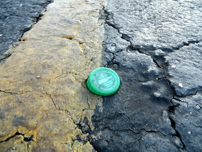
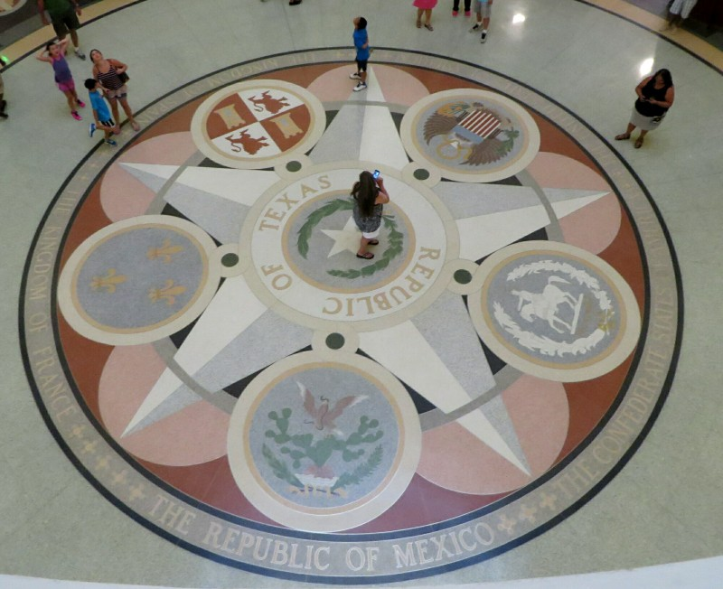
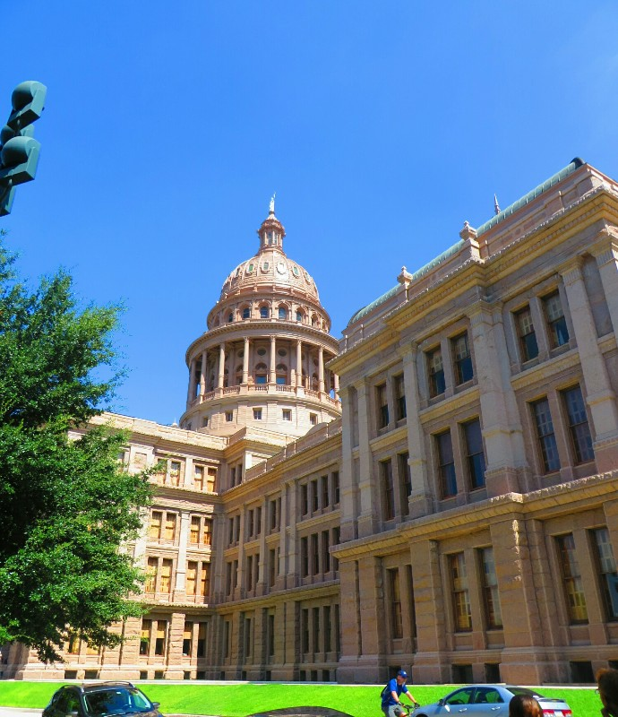
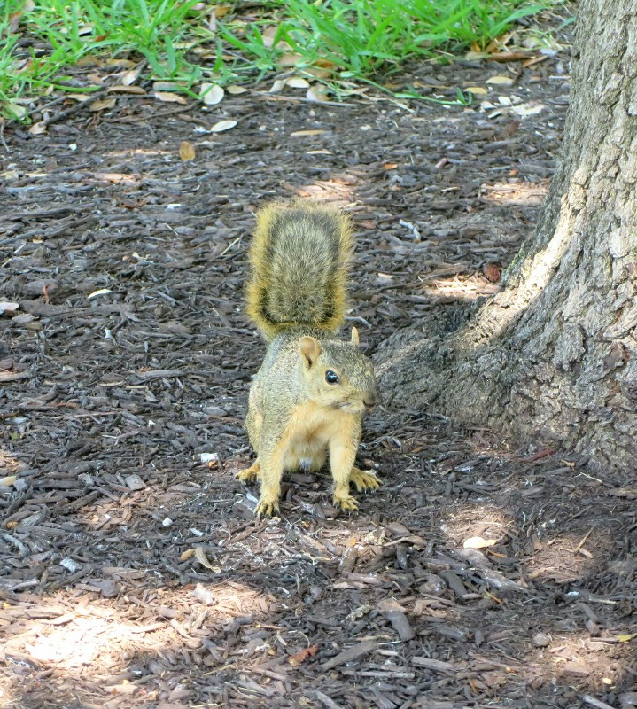
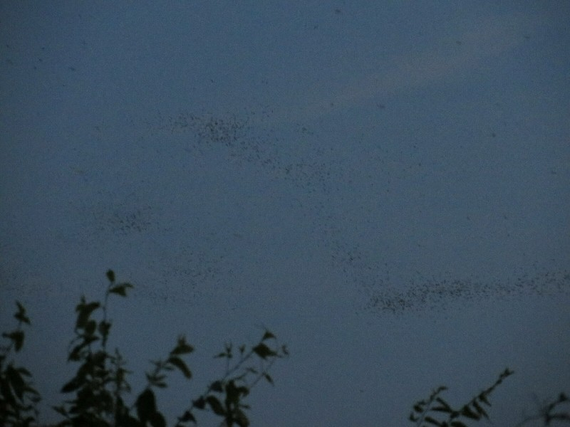
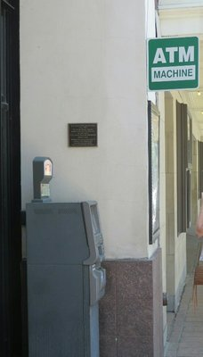
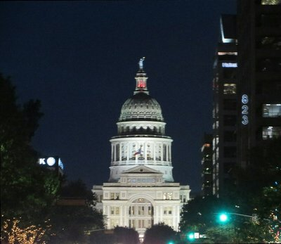
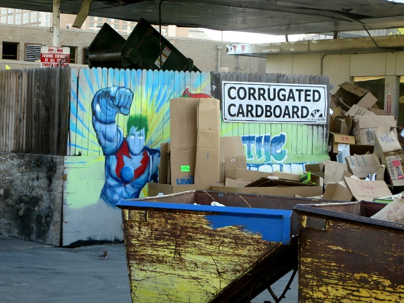
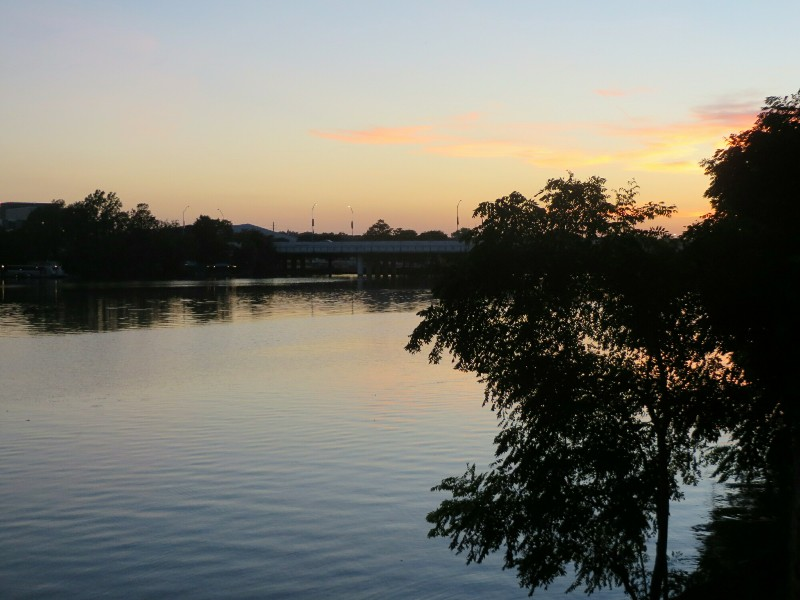
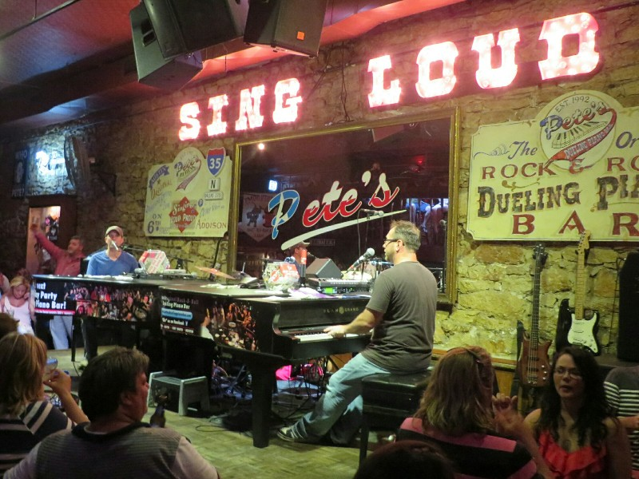

*So Hot This Melted Into The Carpark This Morning!*

We had our free breakie at the hotel and discovered they were serving Texas shaped waffles there too! Must be the done thing down here. While getting ready we flicked on the TV then somehow ended up spending 2 hours watching War of the Worlds by accident.

Once we were free from Tom Cruise's voodoo magic we walked to the Capitol building. Austin is quite frustrating to walk through; there aren't always footpaths, and where they do exist they often drop off suddenly and are buried in grass and undergrowth where apparently it was too much hassle to maintain them. The Capitol building is oddly pink today when it was definitely white when we drove past last night. Must have been the lighting, but disconcerting! We had a little wander then took the free guided tour. We started in the entry hall and admired paintings and statues of Davy Crockett, Sam Houston and Stephen Austin. And now we know they are! Yay! Next was the rotunda where they showed us the six flags of Texas- Spain, Mexico, France (apparently France owned a corner of Texas for a while til they all died of diseases), the Republic of Texas, the USA and the Confederate flag. (An aside: the theme park we visited, Six Flags, was started in Texas and named after their six historical flags). Now there was nothing for the Indians, but that didn't surprise either of us. Pat was, however, surprised by the inclusion of the Confederate flag, a flag they flew when fighting to enslave a whole race of people. An extreme comparison, but you'd never see the Nazi symbol in Germany; they even have a number to call if you see it graffitied anywhere and someone will come clean it off! Kate figured it was included for historical completeness rather than pride.

*Six Flags*

Next the senate chamber where they had photos on the wall of all the current senators alongside some photos of cute kids- the future of the state we're told! Not kids from local schools who are excelling or something, nope! All kids or grandkids of current senators. Interesting message they're sending about who the future of government will be... The supreme court was closed for renovation so we just looked through the window. The last stop was the massive underground extension they made to the building to hold the ever increasing staff of the representatives. It was built underground to maintain the integrity of the historic building. Quite cool.

*No Colour Adjustment- Unnaturally Fluoro Sky And Grass*

On the way out we had a little look at the grounds and passed a huge bronze statue to the Confederate army with a plaque saying how they were so brave and fought for their state rights promised by the Constitution (ie. owning slaves) and were outnumbered but fought as long as they could. A plaque that really emphasized their pride in the Confederacy and confederate army. So looks like Pat was right, they really seem to have a strange lack of shame about Confederacy. And we're not keen on the 'we have to fight for state rights' argument considering the "right" they were fighting for. Sometimes with a modern perspective you can see laws are outdated and based on values that don't hold up anymore. Laws have to change with the times or society is prevented from developing. Anyway- it was interesting!

!!!!!!!!!!!!

After a quick (and average) lunch at a pub in town we walked home, grabbed the car and drove to a kitschy little cinema to see Boyhood (a fiction movie filmed over 12 years chronicling the childhood of a boy and kind of the adulthood of his parents). It was really good, but neither Pat nor I identified too strongly with the main character- I think our upbringings were too cursedly stable.

Next up, we walked along the 'ladybird trail' by the river and found a place to watch the famous Austin bats. They have 1.5 million bats living under one of their bridges. Apparently some years ago bats went out of favour, so they cleared the bats out. Then cases of malaria in Austin started to quickly increase in frequency, someone made the connection that bats eat mosquitoes, and now they're protected. Apparently they eat 30,000 lbs of bugs every night! After a half hour or so waiting, just before sunset the bats started to stream out and set off. Looked like giant black swirling clouds.

*All Those Little Dots Are Bats*

Dark out now we walked to 6th street and went to a 'dueling piano bar', an activity recommended by our Texan friends from Rio. Basically there are two pianos set up, audience members give one or the other a song request and they take turns playing the music. The 'twist' is you can tip them- a bigger tip and they'll play your song first, and if you hate a song that's been requested you can make them stop by tipping more than the person who requested the song. It was so much fun! The guys on the piano were super charismatic and got the audience involved as much as possible. They were very talented, playing music ranging from your standard country music to Depeche Mode, to rapping Snoop Dogg, to Bohemian Rhapsody (we requested that one to be facetious- very surprised when they played it note perfect), and one even stood up and danced the whole Single Ladies dance from start to finish when the song was requested. But their hilarious commentary and audience involvement was really what made it, they got everyone on board and singing along, even the grumpy handlebar-mustached country and western man at the back of the bar was trilling ' Scaramouche, Scaramouche, will you do the fandango'. We ended up staying much later than planned and didn't get home til late late late.

*Automatic Teller Machine Machine?? Curse You Texas!*

*Night And It's Suddenly White! How??*

*The Power Is Yours!*

*Not The Worst Sunset*

*Much Safer Than Your Standard Texan Duel*
