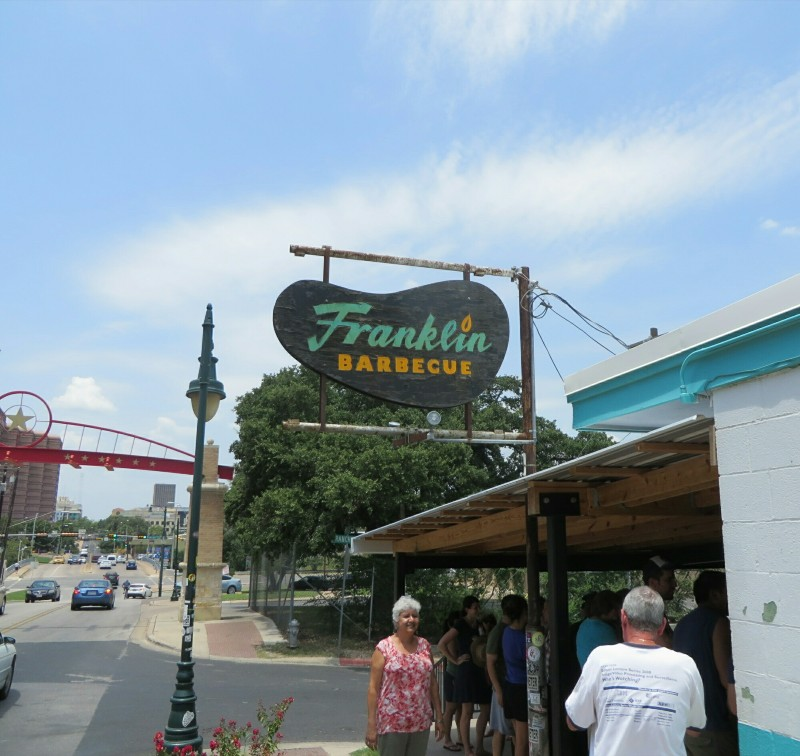
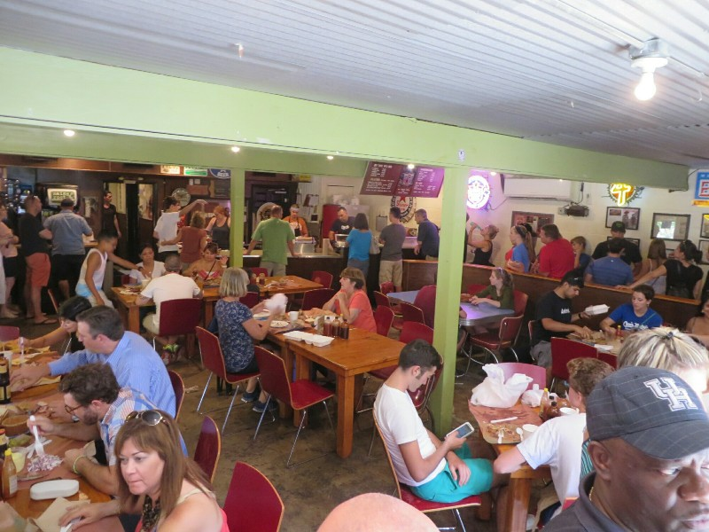
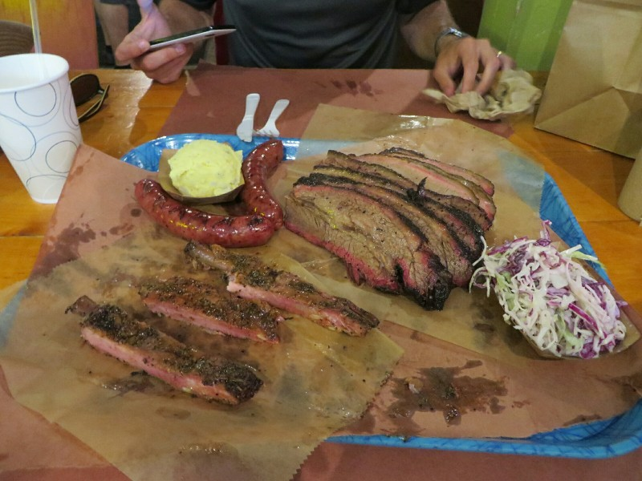
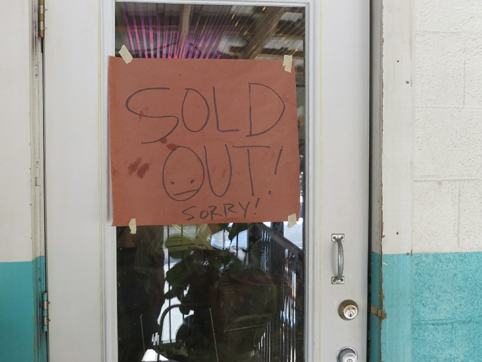

Today's our last day in Texas and Pat still has one item on the to do list- pig out on Texas BBQ. After packing and checking out, Kate finds what is apparently the best Texas BBQ joint in Austin, Franklin Barbecue- conveniently just around the corner! It opens in a half hour at 11am. Perfect! Off we trundle and 2 minutes later are faced with the tail end of a queue snaking across the carpark, around the side of the store under the verandah, back and forth and back and forth up the stairs, through the door and wrapping around the inside of the whole building until finally, it reaches the butcher dishing out delicious slow cooked meat by the pound. As we arrived a man from the restaurant comes down the line checking we know what we're in for- a 3.5 hour wait from where we are, and by the time we get to the front they'll probably be out of ribs and pulled pork.

Well! From all we've learnt over this trip the most important thing is definitively- the longer the wait, the better the food. We settle in. It's hot hot hot in the sun in this carpark, and while the store has kindly provided a free water cooler and are selling $2 beers along the line we're jealous of the pros ahead of us with deck chairs, books and shade umbrellas. They've clearly done this before. Before long we strike up conversation with the man in front of us in the queue. He's a flight attendant from California. Whenever there's a chance to fly to Austin, he takes it. Just to come to this BBQ place. He arrived an hour ago, got a cab straight here, will wait in this queue til he gets his grub, then fly out again tonight. That's an endorsement if ever I heard one! He regales us with hilarious stories of flight attendant frustrations (people refusing to sit while seatbelt sign on because they want to use the bathroom right now) and passenger mishaps (they go into the bathroom, then before there's time to flush the extreme turbulence warranting the seatbelt sign hits. Ew).

*If You're Ever In Austin With 4 Hours Up Your Sleeve- This Is The Place!*

After 40 minutes or so we make it to the shade under the verandah and the wait becomes infinitely more pleasant. We end up chatting with the couple behind us in line too- a local couple who love their Texas BBQ and have been keen to try this place out for a while. The man comes out again to make sure the people joining the line behind us all aware of the wait time and ends up chatting with us for a while too. He informs us they cook 1800 lbs of meat (of which 1100 lbs is brisket) each day! Phew! The place started in 2009 out of a guy's trailer and quickly grew from there. In fact, President Obama visited just a couple of weeks ago! (We were also impressed with the Texans surrounding us- we thought the mere mention of Obama in this state might incite a political argument or diatribe, but the only response was 'did he have to wait in line?')(He didn't, but he paid for the people behind him he cut in front of).

*We're In!*

The three hours to get in the front door actually went quite quickly! We were chatting away, sharing our stories and hearing those of other people in the queue. Quite a nice social experience! Finally after exactly 3.5 hours we hit the counter. Mm. And we were starving! A bunch of brisket, the last ribs of the day, a pulled pork sandwich, some sausages, some potatoes, a generally insane amount of food for two people. A girl a few people behind us in line was so sad she missed the ribs we gave her one of ours. We sat down with our new friends and ate. The ribs were definitely the best, back to Japan style melt-in-your-mouth tenderness. The brisket was delicious too, for what is a cheap cut of meat this tasted like it could be served in a Michelin star restaurant! Of course we over ordered so when we were too full to go on we popped the remainder in a take away container, said goodbye to our companions in the queue and walked out past the still massive line, just as the 'sold out' sign was stuck up in the window.

Not exactly what we planned for the last day, but a wonderful Texas experience nonetheless! The remaining afternoon was spent in the car driving to Dallas. Checked in at the airport hotel and prepared for an early early start the next morning.

*Forgot To Take A Pic Before Having A Little Nibble*

*Glad We Were On The Right Side Of The Door When This Went Up!*
