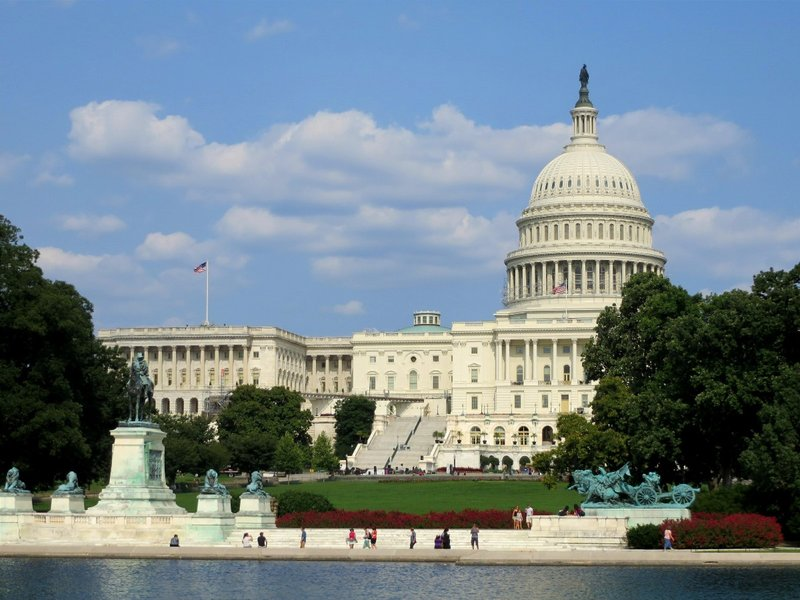
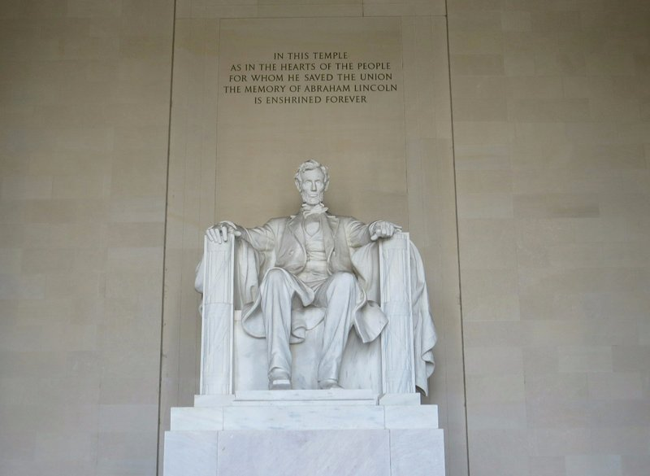
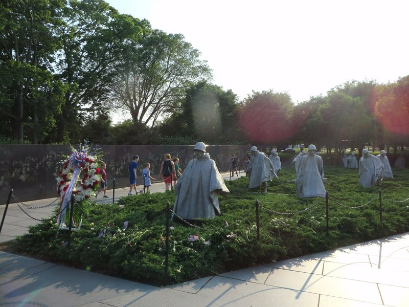
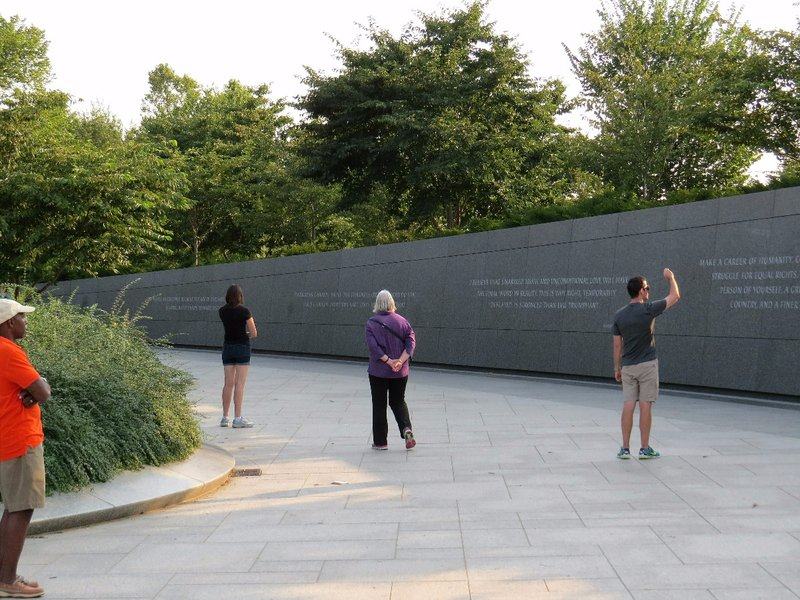
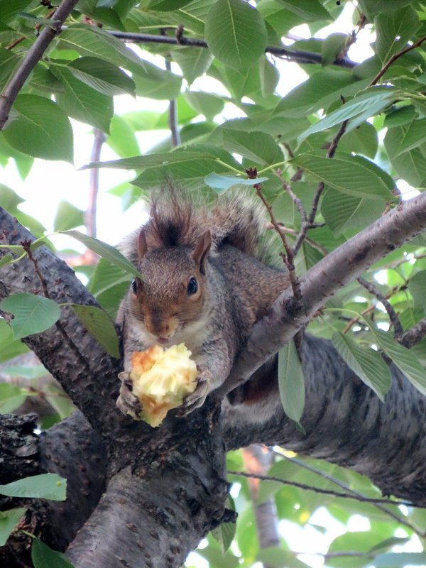

Any time before 6am is a particularly foul time to get up, but with a flight at 7.30 we had to. Ick. Although we were staying right next to the airport, it took a quarter of an hour to get to the rental returns. They don't open until 6am and by the time we'd got it all sorted it was 6.20. Then the wait for a bus back to the terminal. In the end we didn't get to the counter to check in til 6.40 and that was only because we can go in the express queue with all our frequent flyer points! The lady at the desk is very nice and gives us free baggage (but warns it might not get there because we're checking in so late), the man at security is very nice (albeit a bit strange) and tells us Kate can have a job there when she turns 18.

Flights were uneventful in tiny planes with ceilings less than 2 meters high, and no overhead space for carry on bigger than a handbag (they had a'luggage valet' service where they took and returned your luggage in the aerobridge during embarking and disembarking). In DC we grabbed our bags, subwayed into town, walked to the accommodation past beautiful, towering, old houses and met Kate's parents! Yay! Had a few hours catch up on the last 4 months, ate some delicious left over brisket (well we did; Jill and Peter weren't so keen), and eventually decided to do something with the afternoon.

*We'll pop by later to say 'Hi' to Frank and Claire*

We went for a walk towards the Capitol building. Washington feels a lot like Canberra- where McDonald's ads would normally be displayed there are ads about the proposed free trade agreement with Japan, the slogan on cars' license plates make political statements (Washington DC- Taxation Without Representation) and the green, clean city is filled with people in business attire walking around being serious. They even have a lake with people jogging around it! Our stroll takes us past most of the major monuments and memorials around the National Mall.

Washington Monument- While we were admiring this the President's Helicopter flew overhead to the White House! Cool.

WWII Memorial

*Lincoln Memorial*

*Vietnamese and Korean War Memorials (Korean Memorial in the picture)*

Martin Luther King Jr Memorial

Franklin D. Roosevelt Memorial

Thomas Jefferson Memorial

The memorials were often filled with poignant and inspirational quotes by the people that they were honouring. In particular, there was a quote on one of the walls in the Jefferson Memorial about needing to continuously reflect on the Constitution and the laws of the country as the country develops. Rather than trying to paraphrase a former President, I'll just quote him below:

"I am not an advocate for frequent changes in laws and constitutions, but laws and institutions must go hand in hand with the progress of the human mind. As that becomes more developed, more enlightened, as new discoveries are made, new truths discovered and manners and opinions change, with the change of circumstances, institutions must advance also to keep pace with the times. We might as well require a man to wear still the coat which fitted him when a boy as civilized society to remain ever under the regimen of their barbarous ancestors."

This resonated with both of us, especially after our time in Texas. It was nice to hear a former President felt the same as us about the stance that 'it's been this way for a long time/it's in the constitution, so it has to be this way forever'.

*Gaining inspiration from MLK quotes at the memorial*

All of the memorials were quite impressive, and despite all of them being very different in design, they all served their purpose well. The war memorials provided places for quiet contemplation and remembrance, and the presidential memorials served as reminders of the values that the US was founded on. Kate was very impressed by a lot of FDR and MLK's quotes- it would be nice to have a leader with that kind of vision and eloquence in Australia!

Quite a long walk for an impromptu afternoon! Eventually hunger overpowers us. We grab the metro back to Eastern Market and find a Thai restaurant on Pennsylvania Avenue. Pretty good, although (in our humble opinion) it's still not as good as the Thai food that we've learned to cook. We'll need to practice those skills soon so we hold up if someone reading this wants to test us!

*Washington Monument from Afar*

*Today's Feature Squirrel*
