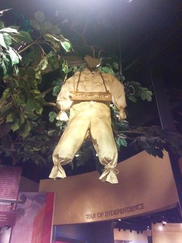
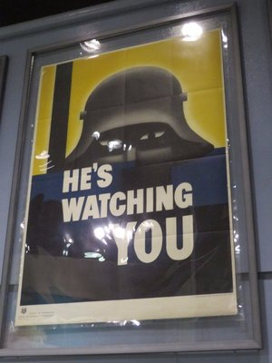
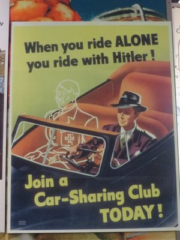
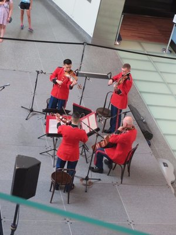
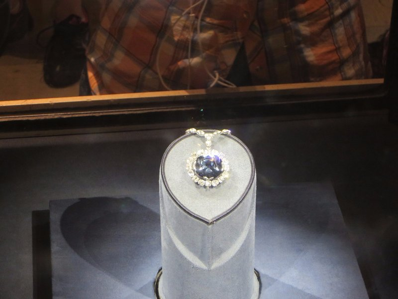
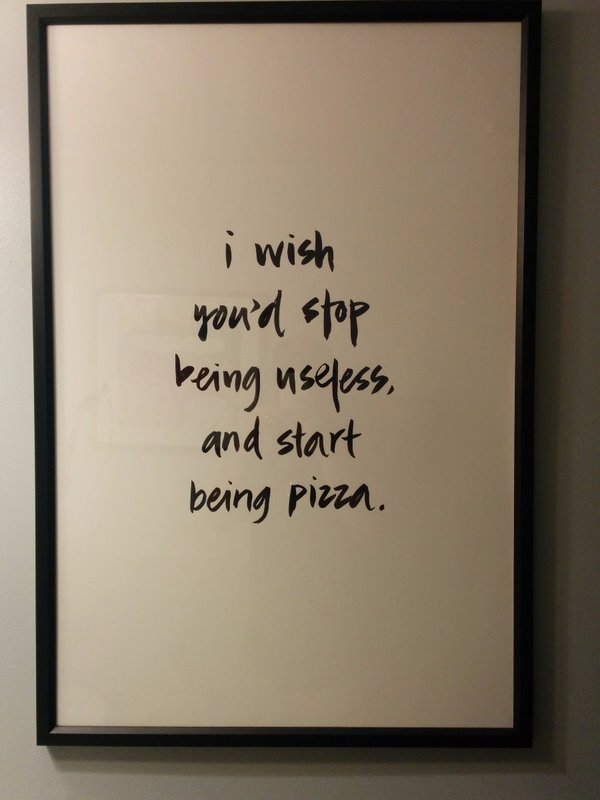

We opened our day with a little jog around the Capitol building. Sounded great to Kate in theory forgetting the capitol is built on Capitol Hill. Not ready for hills yet... Still, we managed to struggle through and made it back home in one piece for breakfast and coffee.

Today is museum day number one. Apparently 'The Smithsonian' isn't one museum as we had always thought, it's a whole bunch of different buildings each specialising in different topics. Now more spoiled for choice that we originally planned, we figured the Museum of American History was as good a place as any to start.

Once inside, we made our way through a number of exhibitions and ended up in a sprawling area on the top floor that covered all of the wars that the US was involved in dating back to the revolutionary war. It provided a great explanation of the colonial days when the British were in control of the region and outlined the many reasons (most of) the colonists were in favour of independence. To their credit, Britain was sending troops over to defend the colonies against the French, but the colonists still held a reasonably unfavourable view of them. For the most part, the colonists were looked down upon by the British, but the taxes that were being levied upon them were mainly to pay for the troops that were sent across to defend them from the French. Seemed reasonable enough! This taxation famously came without any representation in the British parliament which stirred a lot of controversy and eventually sparked the war of independence.

*Not the best time to be a tax collector. Some thing never change.*

It then went into the War of 1812 where the USA won independence from the UK, followed by the Mexican War and subsequent expansion. This portion was particularly interesting as we learned a lot more about this earlier during our time driving across the Southwest and Texas. Armed with a better understanding of what was happening in the region at the time, it put the whole conflict in better perspective and helped us understand each side's motives. Moving further through the exhibit we went through the sections for the Civil War, the Spanish War, WWI, and WWII. It glossed over the use of atomic weapons by the US against Japan in an effort to end WWII. While it did have a small display explaining their use, it really didn't provide much background for the rationale in using such extreme force and the dissenting opinions surrounding them. For such a world renowned museum we both honestly expected more of a balanced and impartial portrayal of the events. The more we read about world history from various museums across the world, the more we're disappointed about the things that are left out from displays like these.

*WWII Propaganda Posters*

From the tail end of the WWII displays on, the information started to get a bit vague. It went through the Cold War, Korea, Vietnam, and some of the more recent wars and conflicts but lacked any real explanation of some of the basic concepts like what communism is and why it was something worth waging a war against. We both supposed they were trying to avoid ruffling feathers, but why bother having an exhibit if the information is so scarce it doesn't explain anything? Kate, in particular, was very disappointed.

*A quartet playing  for museum patrons-tons of kids were dancing along just in front of them!*

And all that was just one gallery! After we were well and truly warred out, we moved on. One exhibition that was particularly fun was the Star Spangled Banner. Growing up in the States, you hear lots of things about that flag and how it inspired the poem that would eventually become the National Anthem. What you very rarely hear about is how bloody huge the thing is! Originally 30x42 ft (9x13m) , it's now around 30x34 ft (9x10 metres) as many pieces of the flag were given away as souvenirs following the battle. In an effort to protect the flag from degrading due  to exposure to light and other elements, it was tucked away in a dark room behind some serious museum glass. It made it a bit difficult to appreciate the scale of the thing, but it was certainly impressive nonetheless.

Once we were filled to the brim with American History, we made our way to the Natural History Museum, where some of the dinosaurs exhibits were disappointingly closed. We entertained ourselves by admiring some huge spiders (*shudder*), the Hope Diamond (honestly not as big as I was expecting it to be), deep sea monsters (creepy, alien-looking things), a myriad of skeletons, and stuffed animals. All in all a very enjoyable museum, but I think we were all suffering from museum fatigue by this point so our stamina was limited.

We agreed to call it a day and headed to Pennsylvania Avenue for some drinks and dinner sized nibbles, then decided we could probably still fit another 'real' dinner in and grabbed some pizzas. To our credit, we limited the gluttony a little and there was some left to take home for leftovers.

*The Hope Diamond- The diamond Thien said was stolen from a temple we visited in Myanmar!*

*New Age Propaganda Poster Working It's Magic*
